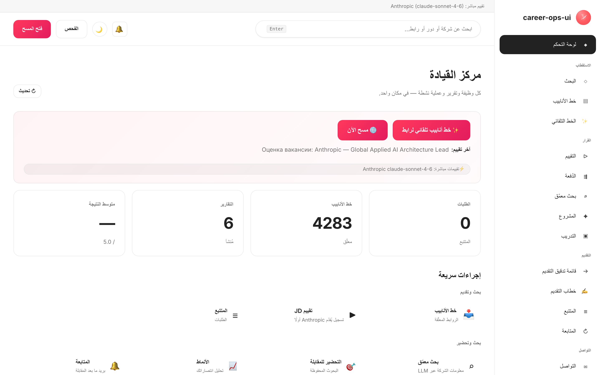

# career-ops-ui

> واجهة ويب أنيقة بأسلوب التوثيق التقني لخط أنابيب البحث عن عمل بالذكاء الاصطناعي — [career-ops](https://github.com/Fighter90/career-ops).
> ابحث عن الوظائف وقيّمها واستكشفها وقدّم طلباتك وتتبّع كل عرض من تبويب واحد في المتصفح — بدلاً من التنقل بين Claude Code والطرفية وملفات markdown.

[🇬🇧 English](README.md) | [🇪🇸 Español](README.es.md) | [🇧🇷 Português (Brasil)](README.pt-BR.md) | [🇰🇷 한국어](README.ko-KR.md) | [🇯🇵 日本語](README.ja.md) | [🇷🇺 Русский](README.ru.md) | [🇨🇳 简体中文](README.zh-CN.md) | [🇹🇼 繁體中文](README.zh-TW.md) | [🇫🇷 Français](README.fr.md) | [🇵🇱 Polski](README.pl.md) | [🇺🇦 Українська](README.uk.md) | [🇩🇰 Dansk](README.da.md) | **🇸🇦 العربية** | [🇩🇪 Deutsch](README.de.md) | [🇮🇹 Italiano](README.it.md) | [🇹🇷 Türkçe](README.tr.md) | [🇮🇳 हिन्दी](README.hi.md)

_واجهة غير رسمية — لا علاقة لها بـ career-ops / santifer ولا تحظى بموافقتهما._

[](#الاختبارات)
[](#الاختبارات)
[](#الاختبارات)
[](#المتطلبات)
[](LICENSE)
[](https://github.com/Fighter90/career-ops-ui/releases/tag/v1.213.0)

<a href="https://www.producthunt.com/products/career-ops-ui?embed=true&amp;utm_source=badge-featured&amp;utm_medium=badge&amp;utm_campaign=badge-career-ops-ui" target="_blank" rel="noopener noreferrer"></a>

> **🆕 أحدث إصدار — v1.213.0** — **MyCareersFuture (سنغافورة) + إصلاحات جودة المسح** — بنك الوظائف الوطني في سنغافورة صار قابلاً للمسح؛ ويمكن تصفية وظائف Greenhouse بالمحتوى؛ ولم تعد وظائف Ashby عن بُعد تختفي خلف موقع «المدينة فقط». **2724 اختبارًا.**
>
> 📜 سجل الإصدارات الكامل: **[CHANGELOG.ar.md](CHANGELOG.ar.md)**.

[](https://youtu.be/LcVPUg9IsDk?si=mrx3oOmOpSAwabOz)

**[▶ مشاهدة المعاينة](https://youtu.be/LcVPUg9IsDk?si=mrx3oOmOpSAwabOz)**

<div dir="rtl">

## نبذة عن career-ops

[career-ops](https://career-ops.org) نظام مفتوح المصدر للبحث عن عمل يعمل على شكل أوامر slash داخل أي واجهة سطر أوامر للذكاء الاصطناعي (Claude Code وCursor وCodex وOpenCode وAntigravity CLI وGrok Build CLI وQwen Code وKimi وGitHub Copilot CLI وGemini CLI (legacy) — وتعمل واجهات CLI الأخرى المتوافقة مع Claude أيضاً). يقيّم كل وظيفة مقارنةً بسيرتك الذاتية وفق مقياس سداسي الأبعاد من 0,0 إلى 5,0، ويُنشئ ملفات PDF لسيرة ذاتية مخصّصة، ويتتبّع كل طلب محلياً — دون حسابات سحابية أو إرسال تلقائي أو جمع بيانات.

**هذا المستودع (career-ops-ui)** واجهة ويب متكاملة فوق career-ops. تظل واجهة CLI مسؤولة عن ملء النماذج (عبر Playwright MCP) وأوامر slash؛ أما تطبيق الصفحة الواحدة (SPA) فيمنحك سطحاً يشبه نظام CRM في المتصفح فوق نفس الملفات `cv.md` و`data/applications.md` و`reports/`. كلاهما يشتركان في البيانات ذاتها.

**عتبات الإجراء حسب النتيجة** (من [career-ops.org/docs](https://career-ops.org/docs)):

| النتيجة | الخطوة التالية |
|---|---|
| **≥ 4.5** | `/career-ops apply` — تطابق عالٍ، قدّم طلبك فوراً |
| **4.0 – 4.4** | تقديم الطلب أو `/career-ops contacto` للحصول على تزكية |
| **3.5 – 3.9** | `/career-ops deep` — ابحث أولاً عن الشركة |
| **< 3.5** | تجاهل ما لم يكن ثمة سبب محدد |

**الأدلة الرسمية** على [career-ops.org/docs](https://career-ops.org/docs):

- [ما هو career-ops](https://career-ops.org/docs/introduction/what-is-career-ops)
- [مسح بوابات الوظائف](https://career-ops.org/docs/introduction/guides/scan-job-portals)
- [التقديم على وظيفة](https://career-ops.org/docs/introduction/guides/apply-for-a-job)
- [التقييم الجماعي للعروض](https://career-ops.org/docs/introduction/guides/batch-evaluate-offers)
- [إعداد Playwright](https://career-ops.org/docs/introduction/guides/set-up-playwright)
- [كيف يقيّم career-ops الوظائف المُدرجة — المنهجية](https://career-ops.org/methodology)

## بيان CareerOps

career-ops هو أول تطبيق مرجعي [لبيان CareerOps](https://career-ops.org/manifesto) — ممارسة إدارة البحث عن عمل بالأدلة والانضباط وبأدوات في صف المرشّح على طاولة المفاوضات. اقرأه. وإن كان يعبّر عمّا تؤمن به، وقّعه — يصبح توقيعك التزاماً (commit). يربط التطبيق إليه من تذييل الشريط الجانبي.

## الميزات الرئيسية

| الصفحة | الوصف |
|---|---|
| **لوحة التحكم** | عدادات إجمالية، متوسط النتائج، آخر الطلبات والتقارير |
| **المسح** | زر 🌐 Scan يُشغّل جميع المصادر المُهيّأة (Greenhouse / Ashby / Lever / Workable / SmartRecruiters / Workday + hh.ru / Habr Career) في مرور واحد؛ نتائج فورية عبر SSE |
| **خط الأنابيب (Pipeline)** | إدارة `data/pipeline.md`؛ معاينة آمنة للروابط (حماية SSRF) |
| **التقييم** | الصق وصف الوظيفة ← نتيجة 0–5 عبر Anthropic أو Gemini؛ أو نموذج جاهز للنسخ |
| **البحث المعمّق** | استكشاف الشركة عبر Anthropic SDK؛ تُحفَظ النتائج في `interview-prep/` |
| **المتتبّع** | جدول مصفّى للطلبات فوق `data/applications.md` |
| **السيرة الذاتية (CV)** | محرر markdown مباشر مع معاينة جانبية وحماية XSS من جهة الخادم |
| **صحة النظام** | شارات حالة الإعداد؛ تشغيل `doctor.mjs` بنقرة واحدة |
| **المساعدة** | توثيق مدمج بـ 12 لغة (بما فيها العربية) |

## البداية السريعة

> **مهم — career-ops-ui لوحة تحكم *فوق* [`Fighter90/career-ops`](https://github.com/Fighter90/career-ops).** يعمل **داخل** مشروع career-ops بوصفه `career-ops/web-ui/` ويقرأ ملفات `cv.md` و`config/` و`data/` من المجلد الأصلي عبر `../`. **لا يعمل بشكل مستقل** — تحتاج أيضاً إلى مستودع career-ops الأصلي.

### الخيار 1 — أمر curl واحد (موصى به)

</div>

```bash
curl -fsSL https://raw.githubusercontent.com/Fighter90/career-ops-ui/main/bin/setup.sh | bash
```

<div dir="rtl">

يستنسخ **كلا** المستودعين، يُرتّب بنية `career-ops/web-ui/`، يثبّت التبعيات، يُشغّل التشخيص، ويبدأ الخادم على http://127.0.0.1:4317.

### الخيار 2 — إضافة الواجهة إلى مشروع career-ops موجود

</div>

```bash
cd career-ops
git clone https://github.com/Fighter90/career-ops-ui.git web-ui
cd web-ui
npm install
npm start
```

<div dir="rtl">

افتح http://127.0.0.1:4317 في متصفحك.

### أوامر CLI

</div>

```bash
career-ops-ui setup    # bootstrap: تثبيت التبعيات ← تشخيص ← تشغيل
career-ops-ui init     # اختيار مزوّد LLM ولصق مفتاح API (تفاعلي)
career-ops-ui doctor   # التحقق من Node / المشروع / المفاتيح / Playwright
career-ops-ui run      # تشغيل الخادم على http://127.0.0.1:4317
career-ops-ui open     # فتح تبويب لوحة التحكم وإحضاره للأمام
career-ops-ui help     # عرض قائمة جميع الأوامر
```

<div dir="rtl">

### اختيار مزوّد LLM

`init` معالج اختيار المزوّد — اختر **Claude / Claude Code** (`ANTHROPIC_API_KEY`)، أو **Codex / OpenCode** (`OPENAI_API_KEY`)، أو **Qwen Code** (`QWEN_API_KEY`)، أو **Auto** (Anthropic ← Gemini احتياطياً). يمكن ضبط المفاتيح يدوياً:

</div>

```bash
echo "ANTHROPIC_API_KEY=sk-ant-..." >> career-ops/.env
```

<div dir="rtl">

أو من تبويب **إعدادات التطبيق** (`#/config`) في الواجهة — دون إعادة تشغيل الخادم.

## المتطلبات

| | |
|---|---|
| **Node.js** | ≥ 18 (نظام `fetch` الأصلي و`node:test`) |
| **career-ops** | مستنسَخ ومُهيَّأ (انظر أعلاه) |
| **اختياري** | `ANTHROPIC_API_KEY` أو `GEMINI_API_KEY` في `.env` للمشروع الأصلي، لتقييم الوظائف بنقرة واحدة |

## البنية المعمارية باختصار

</div>

```
career-ops/
├─ cv.md
├─ portals.yml
├─ config/
├─ data/
└─ web-ui/          ← هذا المستودع
   ├─ server/       # Express + 15 وحدة مسارات
   ├─ public/       # vanilla JS SPA — بدون bundler
   └─ tests/        # 1945 unit + 90 Playwright + 43 e2e
```

<div dir="rtl">

للخادم تبعيتان إنتاجيتان فقط: `express` و`js-yaml`. لا transpile، لا bundler — حجم الواجهة بالكامل أقل من 30 كيلوبايت.

## تشغيل المنظومة كاملةً في السحابة

يعمل career-ops على أفضل نحو حين يكون **دائم التشغيل** — يمسح بينما تنام، ويمكن الوصول إليه من أي متصفح. لوضع المنظومة كاملةً على خادم صغير — خط الأنابيب الأصل **career-ops**، وهذا العارض **career-ops-ui**، و**المحرّك** الذي يشغّل الذكاء الاصطناعي (**اشتراك Claude** عبر واجهة Claude Code، أو بوابة **Hermes** محلية، أو مفاتيح API) — جهّز خادمًا افتراضيًا (Node ≥ 18)، وثبّت الأصل + هذا المستودع، واختر محرّكك، واعرض العارض خلف **بروكسي عكسي HTTPS مع مصادقة** مع بقاء ثوابت الأمان (CSP، حارس SSRF، حدّ XSS، لا أسرار في السجلات) سليمة.

📖 تشرح **المساعدة §31** داخل التطبيق («تشغيل المنظومة كاملةً في السحابة») الخطوات بالتفصيل بجميع اللغات الـ17؛ قائمة المشغّل هي [`docs/integrations/HERMES.md`](docs/integrations/HERMES.md)، وتحتوي [صفحة ويكي النشر السحابي](https://github.com/Fighter90/career-ops-ui/wiki/Cloud-Deployment) على جداول مرجعية.

---

## التوثيق الكامل

التوثيق الشامل متاح باللغة الإنجليزية فقط: **[🇬🇧 README.md](README.md)**

يتضمن توصيفات تفصيلية لـ:
- REST API الكامل (جميع نقاط النهاية `/api/*`)
- إعداد ماسح بوابات الوظائف (Greenhouse وAshby وLever وWorkable وhh.ru وHabr Career وRSS)
- جميع متغيرات البيئة
- مبادئ الأمان (SSRF وXSS وتحديد معدل الطلبات)
- دليل البنية المعمارية (SDD والاتفاقيات)

الموقع الرسمي: [career-ops.org](https://career-ops.org) · التوثيق: [career-ops.org/docs](https://career-ops.org/docs)

## الاختبارات

</div>

```bash
npm test                    # 1856 اختبار وحدة وتكامل
npm run test:e2e            # 20 اختبار e2e دخاني
npm run test:e2e:full       # 23 اختبار e2e شامل
npm run test:e2e:browser    # 70 اختبار Playwright
npm run test:coverage       # مثل npm test + تغطية V8
```

<div dir="rtl">

## الرخصة

MIT. التفاصيل: [LICENSE](LICENSE).

مبني على [career-ops](https://github.com/Fighter90/career-ops) بقلم [santifer](https://santifer.io).

<p>
  <a href="https://github.com/Fighter90" title="Fighter90"></a>
  <a href="https://github.com/Alien10140" title="Alien10140"></a>
  <a href="https://github.com/vignyl" title="vignyl"></a>
  <a href="https://github.com/bracketouverte" title="bracketouverte"></a>
</p>

**[كل المساهمين ←](https://github.com/Fighter90/career-ops-ui/graphs/contributors)**

</div>

<div align="center">

<div style="font-family: -apple-system, BlinkMacSystemFont, &quot;Segoe UI&quot;, Roboto, &quot;Helvetica Neue&quot;, Arial, sans-serif; border: 1px solid rgb(224, 224, 224); border-radius: 12px; padding: 20px; max-width: 500px; background: rgb(255, 255, 255); box-shadow: rgba(0, 0, 0, 0.05) 0px 2px 8px;"><div style="display: flex; align-items: center; gap: 12px; margin-bottom: 12px;"><div style="flex: 1 1 0%; min-width: 0px;"><h3 style="margin: 0px; font-size: 18px; font-weight: 600; color: rgb(26, 26, 26); line-height: 1.3; overflow: hidden; text-overflow: ellipsis; white-space: nowrap;">career-ops-ui</h3><p style="margin: 4px 0px 0px; font-size: 14px; color: rgb(102, 102, 102); line-height: 1.4; overflow: hidden; text-overflow: ellipsis; display: -webkit-box; -webkit-line-clamp: 2; -webkit-box-orient: vertical;">The open-source job search command center</p></div></div><a href="https://www.producthunt.com/products/career-ops-ui?embed=true&amp;utm_source=embed&amp;utm_medium=post_embed" target="_blank" rel="noopener" style="display: inline-flex; align-items: center; gap: 4px; margin-top: 12px; padding: 8px 16px; background: rgb(255, 97, 84); color: rgb(255, 255, 255); text-decoration: none; border-radius: 8px; font-size: 14px; font-weight: 600;">Check it out on Product Hunt →</a></div>

</div>
