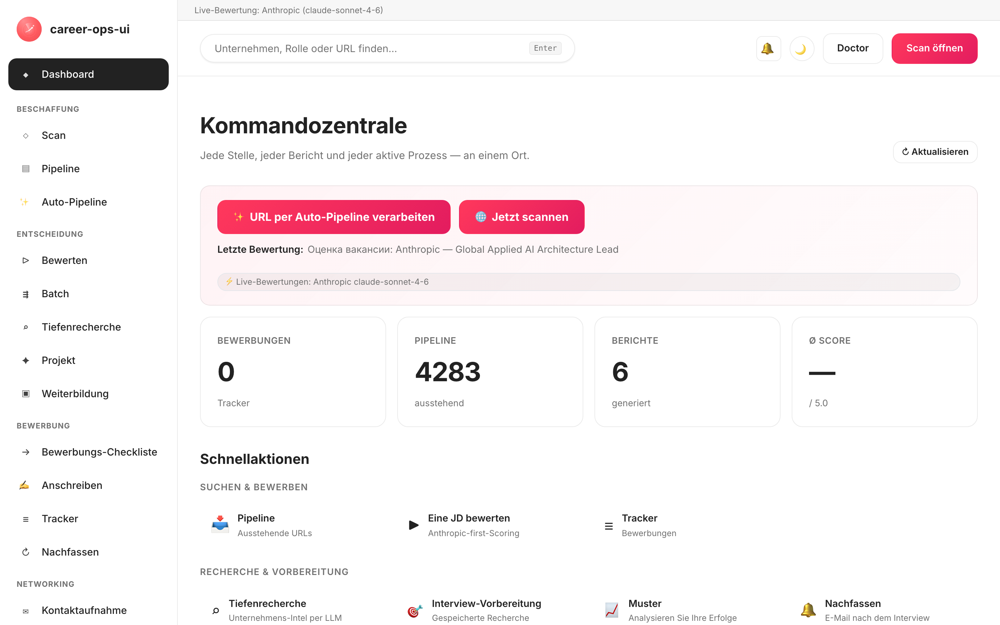

# career-ops-ui

> Eine schlanke, dokumentationsartige Weboberfläche für die KI-Jobsuche-Pipeline [career-ops](https://github.com/Fighter90/career-ops).
> Durchsuchen, bewerten, tiefgehend recherchieren, bewerben und jedes Angebot verfolgen — alles aus einem einzigen Browser-Tab, statt zwischen Claude Code, Terminals und Markdown-Dateien hin- und herzuspringen.

[🇬🇧 English](README.md) | [🇪🇸 Español](README.es.md) | [🇧🇷 Português (Brasil)](README.pt-BR.md) | [🇰🇷 한국어](README.ko-KR.md) | [🇯🇵 日本語](README.ja.md) | [🇷🇺 Русский](README.ru.md) | [🇨🇳 简体中文](README.zh-CN.md) | [🇹🇼 繁體中文](README.zh-TW.md) | [🇫🇷 Français](README.fr.md) | [🇵🇱 Polski](README.pl.md) | [🇺🇦 Українська](README.uk.md) | [🇩🇰 Dansk](README.da.md) | [🇸🇦 العربية](README.ar.md) | **🇩🇪 Deutsch** | [🇮🇹 Italiano](README.it.md) | [🇹🇷 Türkçe](README.tr.md) | [🇮🇳 हिन्दी](README.hi.md)

_Inoffizielle Oberfläche — nicht mit career-ops / santifer verbunden oder von diesen unterstützt._

[](#tests)
[](#tests)
[](#tests)
[](#requirements)
[](LICENSE)
[](https://github.com/Fighter90/career-ops-ui/releases/tag/v1.213.0)

<a href="https://www.producthunt.com/products/career-ops-ui?embed=true&amp;utm_source=badge-featured&amp;utm_medium=badge&amp;utm_campaign=badge-career-ops-ui" target="_blank" rel="noopener noreferrer"></a>

> **🆕 Neueste Version — v1.213.0** — **MyCareersFuture (Singapur) + Scan-Qualitäts-Fixes** — Singapurs nationale Jobbank ist nun scannbar; Greenhouse-Stellen sind inhaltsfilterbar; und Remote-Ashby-Stellen verschwinden nicht mehr hinter einem reinen Stadt-Standort. **2724 Tests.**
>
> 📜 Vollständige Versionshistorie: **[CHANGELOG.de.md](CHANGELOG.de.md)**.

<!-- DO NOT REVERT: locale-specific dashboard screenshot (dashboard-de.png). Each README uses its own ./images/dashboard-<locale>.png — never replace with dashboard-en.png. Generated by scripts/capture-dashboard-screenshots.mjs. -->
[](https://youtu.be/LcVPUg9IsDk?si=mrx3oOmOpSAwabOz)

**[▶ Vorschau ansehen](https://youtu.be/LcVPUg9IsDk?si=mrx3oOmOpSAwabOz)**

## Über career-ops

[career-ops](https://career-ops.org) ist ein quelloffenes Jobsuche-System, das als Slash-Befehle innerhalb jeder KI-Coding-CLI läuft (Claude Code, Cursor, Codex, OpenCode, Antigravity CLI, Grok Build CLI, Qwen Code, Kimi, GitHub Copilot CLI, Gemini CLI (legacy) — andere Claude-kompatible CLIs funktionieren über dieselbe Slash-Befehl-Oberfläche ebenfalls). Modellunabhängig. Es bewertet jede Ausschreibung anhand Ihres CV mit einem sechsdimensionalen Bewertungsraster von 0.0–5.0, generiert maßgeschneiderte PDF-Lebensläufe und verfolgt jede Bewerbung lokal — keine Cloud-Konten, keine Telemetrie, kein Auto-Absenden.

**Dieses Repository (career-ops-ui)** ist eine ausgefeilte Weboberfläche obendrauf. Die CLI behält das Ausfüllen von Formularen (über Playwright MCP) und die Slash-Befehl-Modi; die SPA gibt Ihnen eine CRM-artige Browser-Oberfläche über dieselben Dateien `cv.md` / `data/applications.md` / `reports/`. Beide teilen sich dieselben Daten.

**Handlungsschwellen nach Punktzahl** (aus [career-ops.org/docs](https://career-ops.org/docs)):

| Score | Nächster Schritt |
|---|---|
| **≥ 4.5** | `/career-ops apply` — hohe Passung, sofort loslegen |
| **4.0 – 4.4** | bewerben oder `/career-ops contacto` für eine warme Vorstellung |
| **3.5 – 3.9** | `/career-ops deep` — zuerst recherchieren |
| **< 3.5** | überspringen, sofern Sie keinen bestimmten Grund haben |

**Kanonische Anleitungen** unter [career-ops.org/docs](https://career-ops.org/docs):

- [What is career-ops](https://career-ops.org/docs/introduction/what-is-career-ops)
- [Scan job portals](https://career-ops.org/docs/introduction/guides/scan-job-portals)
- [Apply for a job](https://career-ops.org/docs/introduction/guides/apply-for-a-job)
- [Batch-evaluate offers](https://career-ops.org/docs/introduction/guides/batch-evaluate-offers)
- [Set up Playwright](https://career-ops.org/docs/introduction/guides/set-up-playwright)
- [Wie career-ops Stellenanzeigen bewertet — die Methodik](https://career-ops.org/methodology)

**Modus-Referenz** (die Slash-Befehle des übergeordneten Projekts, die die web-ui als Seiten/Schaltflächen darstellt) — [career-ops.org/docs/reference/modes](https://career-ops.org/docs/reference/modes):

| Modus | web-ui | Modus | web-ui |
|---|---|---|---|
| [auto-pipeline](https://career-ops.org/docs/reference/modes/auto-pipeline) | `#/auto` | [pipeline](https://career-ops.org/docs/reference/modes/pipeline) | `#/pipeline` |
| [oferta](https://career-ops.org/docs/reference/modes/oferta) | `#/evaluate` | [ofertas](https://career-ops.org/docs/reference/modes/ofertas) | `#/evaluate` |
| [deep](https://career-ops.org/docs/reference/modes/deep) | `#/deep` | [contacto](https://career-ops.org/docs/reference/modes/contacto) | `#/contacto` |
| [interview-prep](https://career-ops.org/docs/reference/modes/interview-prep) | `#/interview-prep` | [pdf](https://career-ops.org/docs/reference/modes/pdf) | Generate PDF |
| [training](https://career-ops.org/docs/reference/modes/training) | `#/training` | [project](https://career-ops.org/docs/reference/modes/project) | `#/project` |
| [tracker](https://career-ops.org/docs/reference/modes/tracker) | `#/tracker` | [patterns](https://career-ops.org/docs/reference/modes/patterns) | `#/patterns` |
| [followup](https://career-ops.org/docs/reference/modes/followup) | `#/followup` | [apply](https://career-ops.org/docs/reference/modes/apply) | `#/apply` |
| cover | `#/cover` | — | — |

**Portal-Adapter** — [career-ops.org/docs/reference/portals](https://career-ops.org/docs/reference/portals): [Greenhouse](https://career-ops.org/docs/reference/portals/greenhouse) · [Ashby](https://career-ops.org/docs/reference/portals/ashby) · [Lever](https://career-ops.org/docs/reference/portals/lever) (plus Workable / SmartRecruiters / Workday + RU-Quellen — siehe `#/scan`).

**KI-Assistenten**, in denen career-ops läuft (die web-ui ist die eigenständige Alternative): Claude Code, Cursor, Codex, OpenCode, Antigravity CLI, Grok Build CLI, Qwen Code, Kimi, GitHub Copilot CLI, Gemini CLI (legacy). Die ⚡ Live-Funktionen der web-ui ordnen diese in **`#/config`** API-Anbietern zu: Claude Code→Anthropic, Cursor→any/OpenRouter, Gemini CLI→Gemini, Codex→OpenAI, Qwen Code→Qwen, OpenCode→beliebig/OpenRouter, GitHub Copilot CLI→GitHub Models, Antigravity CLI→Gemini, Kimi CLI→any/OpenRouter, Grok Build CLI→any/OpenRouter.

## Das CareerOps-Manifest

career-ops ist die erste Referenzimplementierung von [dem CareerOps-Manifest](https://career-ops.org/manifesto) — der Praxis, eine Jobsuche mit Evidenz, Disziplin und Werkzeugen auf der Seite des Kandidaten am Tisch zu betreiben. Lies es. Wenn es das sagt, woran du glaubst, unterzeichne es — deine Signatur wird zu einem Commit. Die App verlinkt darauf im Footer der Seitenleiste.

## Einen KI-Coding-Assistenten installieren (für die übergeordnete career-ops-CLI)

career-ops läuft als Slash-Befehle **innerhalb** eines KI-Coding-Assistenten — installieren Sie **einen** und melden Sie sich an, bevor Sie fortfahren (der [Quick Start](https://career-ops.org/docs) des übergeordneten Projekts):

| Assistent | Installation | web-ui-`#/config`-Anbieter |
|---|---|---|
| **Claude Code** | [docs.anthropic.com → Claude Code](https://docs.anthropic.com/en/docs/claude-code) | Anthropic (`ANTHROPIC_API_KEY`) |
| **Gemini CLI** | [github.com/google-gemini/gemini-cli](https://github.com/google-gemini/gemini-cli) | Gemini (`GEMINI_API_KEY`) |
| **Codex** | [github.com/openai/codex](https://github.com/openai/codex) | OpenAI (`OPENAI_API_KEY`) |
| **Qwen Code** | [github.com/QwenLM/qwen-code](https://github.com/QwenLM/qwen-code) | Qwen (`QWEN_API_KEY`) |
| **OpenCode** | [opencode.ai](https://opencode.ai) | beliebig / OpenRouter (`OPENROUTER_API_KEY`) |
| **GitHub Copilot CLI** | [github.com/github/gh-copilot](https://github.com/github/gh-copilot) | GitHub Models (`GITHUB_MODELS_API_KEY`) |
| **Antigravity CLI** | [antigravity.google](https://antigravity.google) | Gemini (`GEMINI_API_KEY`) |

> **Die web-ui ist die eigenständige Alternative** — sie benötigt keine installierte CLI. Ihre ⚡ Run-live-Funktionen rufen die Anbieter-APIs direkt auf; setzen Sie **irgendeinen** Schlüssel in `#/config` (oder `career-ops-ui init`) und es funktioniert headless. Wenn Sie die CLI bevorzugen, führen Sie career-ops innerhalb des von Ihnen gewählten Assistenten aus und nutzen Sie die web-ui rein als Dashboard über dieselben Dateien.

## In einem Befehl starten und initialisieren

> **Wichtig — career-ops-ui ist ein Dashboard *auf* [`Fighter90/career-ops`](https://github.com/Fighter90/career-ops).** Es läuft **innerhalb** eines career-ops-Projekts als `career-ops/web-ui/` und liest Ihre `cv.md`, `config/`, `data/` aus dem übergeordneten Ordner über `../`. Es funktioniert **nicht** eigenständig — Sie benötigen auch das übergeordnete `career-ops`-Repo. Klonen Sie es nicht allein und führen Sie `init` aus; nutzen Sie eine der beiden Optionen unten.

### Option 1 — ein curl-Befehl (empfohlen: richtet alles ein)

```bash
curl -fsSL https://raw.githubusercontent.com/Fighter90/career-ops-ui/main/bin/setup.sh | bash
```

Klont **beide** Repos, richtet das Layout `career-ops/web-ui/` ein, installiert Abhängigkeiten, führt den Doctor aus und startet den Server unter http://127.0.0.1:4317 — dann öffnet es das Dashboard.

### Option 2 — die UI zu einem bestehenden career-ops-Projekt hinzufügen

Wenn Sie career-ops bereits konfiguriert haben und nur das Dashboard möchten, klonen Sie die UI **darin** als `web-ui`:

```bash
cd career-ops                                                   # ← your existing career-ops project
git clone https://github.com/Fighter90/career-ops-ui.git web-ui
cd web-ui
npm install
npx career-ops-ui init        # interactive: pick LLM provider + paste its key → parent career-ops/.env
```

Genau das verschachtelte `web-ui/`-Layout ermöglicht es der UI, Ihre `../cv.md`, `../config/`, `../data/` aufzulösen. Führen Sie `npm link` **einmal** aus, wenn Sie lieber das schlichte `career-ops-ui <verb>` statt `npx career-ops-ui <verb>` eingeben möchten.

### Die CLI-Verben

```bash
career-ops-ui setup    # bootstrap: install deps → doctor → run (SKIP_START=1 to stop before run)
career-ops-ui init     # pick LLM provider + paste its key (interactive)
career-ops-ui doctor   # verify Node / project / keys / Playwright (exit 0 ⇔ all required green)
career-ops-ui run      # launch the server at http://127.0.0.1:4317
career-ops-ui open     # open + RAISE the dashboard tab in your browser
career-ops-ui help     # list every verb
```

Stellen Sie `npx ` voran (z. B. `npx career-ops-ui run`), wenn Sie kein `npm link` ausgeführt haben. Nach `setup`/`run` öffnet sich der Tab **und wird automatisch in den Vordergrund geholt**; setzen Sie `NO_OPEN=1`, um das automatische Öffnen zu deaktivieren (headless / CI).

### Wählen Sie Ihren LLM-Anbieter

`init` ist der Anbieter-Assistent — wählen Sie **Claude / Claude Code** (`ANTHROPIC_API_KEY`), **Gemini / Gemini CLI** (`GEMINI_API_KEY`), **Codex / OpenCode CLI** (`OPENAI_API_KEY`) oder **Auto** (Anthropic → Gemini als Fallback). Schlüssel werden mit unterdrückter Anzeige eingegeben und über denselben validierten Pfad wie die API-Schlüssel-Registerkarte in `#/config` in die übergeordnete `career-ops/.env` geschrieben. Nicht-interaktive Form für CI:

```bash
career-ops-ui init --provider claude --anthropic-key sk-ant-… --yes
career-ops-ui init --provider gemini --gemini-key …          --yes
career-ops-ui init --provider auto   --openai-key sk-…       --yes
```

Oder setzen Sie ihn von Hand: `echo "ANTHROPIC_API_KEY=sk-ant-…" >> career-ops/.env`. Der Anbieter setzt `LLM_PROVIDER` (`auto` | `claude` | `gemini`); ändern Sie ihn jederzeit unter **`#/config` → API keys** ohne Neustart.

### Fehlerbehebung bei `init`

Wenn `career-ops-ui init` fehlschlägt oder der Befehl nicht gefunden wird (häufig direkt nach einem `git pull`):

```bash
cd career-ops/web-ui
npm install
npx career-ops-ui init        # npx runs the local bin even without `npm link`
```

Stellen Sie sicher:

- Sie führen es **innerhalb von `career-ops/web-ui/`** aus — nicht aus einem eigenständigen `career-ops-ui/`-Klon.
- Der **übergeordnete `career-ops/`-Ordner existiert** und enthält `cv.md` und `config/`. Wenn Sie career-ops-ui allein geklont haben, verschieben Sie es (oder klonen Sie es neu), sodass es sich unter `career-ops/web-ui/` befindet — oder führen Sie einfach den curl-Befehl aus Option 1 aus, der das Layout für Sie einrichtet.
- `career-ops-ui doctor` (oder `npx career-ops-ui doctor`) gibt genau aus, was fehlt.

---

## Warum?

[career-ops](https://github.com/Fighter90/career-ops) ist ein leistungsstarkes, von Claude Code gesteuertes Jobsuche-System: JD einfügen → eine Passungsbewertung von 0-5, ein ATS-optimiertes PDF und einen Tracker-Eintrag erhalten. Es funktioniert großartig innerhalb von Claude Code, aber die Daten liegen verteilt über `cv.md`, `data/applications.md`, `reports/*.md`, `data/pipeline.md`, `portals.yml`, `config/profile.yml` — leicht zu verlieren, schwer zu überblicken.

`career-ops-ui` setzt eine ausgefeilte UI obendrauf:

- **Auto-pipeline** — eine Job-URL auf `#/auto` einfügen, einmal klicken: validieren → abrufen → bewerten → Bericht speichern → zum Tracker hinzufügen, mit einem barrierefreien Live-Stepper und Deep-Links zu den Artefakten.
- **Durchsuchen** Sie Tracker, Berichte und Pipeline wie ein CRM.
- **Auslösen** von Scans (Greenhouse / Ashby / Lever / Workable / SmartRecruiters / Workday **und** hh.ru / Habr Career / Trudvsem / GetMatch / GeekJob) und live SSE-Logs verfolgen.
- **Bewerten** einer JD live über Anthropic (bevorzugt) oder Gemini, oder einen Copy-Paste-Prompt für Claude Code erhalten, wenn kein API-Schlüssel gesetzt ist.
- **Tiefenrecherche** zu Unternehmen live über das Anthropic SDK, wobei CV-/Profil-/Modus-Dateien automatisch eingebettet werden.
- **Bearbeiten** von `cv.md` mit Markdown-Vorschau nebeneinander und serverseitiger XSS-Bereinigung.
- **Warten** des Systems: doctor, verify, normalize, dedup, merge — jeweils mit einem Klick.
- **Multi-CLI:** wird identisch von Claude Code, Cursor, Codex, Cursor, Aider oder Gemini CLI gesteuert — `CLAUDE.md` / `AGENTS.md` / `GEMINI.md`-Shims verweisen auf eine einzige Quelle der Wahrheit.

Es sind reine Ergänzungen: Nichts innerhalb von `career-ops/` ändert sich. Alle Ihre Anpassungen bleiben Ihre.

---

## Schnellstart

### 1. Installieren Sie zuerst career-ops

```bash
git clone https://github.com/Fighter90/career-ops.git
cd career-ops
```

Folgen Sie dem [career-ops onboarding](https://github.com/Fighter90/career-ops#first-run--onboarding), damit `cv.md`, `config/profile.yml` und `portals.yml` existieren.

### 2. Legen Sie career-ops-ui darin ab

```bash
git clone https://github.com/Fighter90/career-ops-ui.git web-ui
```

Ihr Baum sieht jetzt so aus:

```
career-ops/
├─ cv.md
├─ portals.yml
├─ config/
├─ data/
├─ modes/
├─ reports/
├─ scan.mjs … doctor.mjs … (etc)
└─ web-ui/                 ← this repo
   ├─ bin/start.sh
   ├─ package.json
   ├─ server/
   ├─ public/
   └─ tests/
```

### 3. Starten

```bash
bash web-ui/bin/start.sh
```

Das Skript:

1. Prüft Node ≥ 18.
2. `npm install` (nur beim ersten Start, drei Abhängigkeiten — Express + js-yaml + multer).
3. Startet den Express-Server auf `127.0.0.1:4317`.
4. Öffnet http://127.0.0.1:4317/ in Ihrem Standardbrowser.

Benutzerdefinierter Port / Host:

```bash
PORT=8080 bash web-ui/bin/start.sh
HOST=0.0.0.0 PORT=4317 bash web-ui/bin/start.sh   # expose on LAN
```

Wenn Sie das Repo woanders geklont haben (nicht als `career-ops/web-ui`), verweisen Sie über eine Umgebungsvariable auf career-ops:

```bash
CAREER_OPS_ROOT=/path/to/career-ops bash bin/start.sh
```

---

## Erster Start — sauberer Zustand

`career-ops/data/pipeline.md` wird mit zwei QA-Fixture-URLs ausgeliefert (`example.com/qa-fixture-*`), damit die Testsuite hermetisch laufen kann. Bei einem frischen Klon sehen Sie die Pipeline mit `2 pending` — das sind keine echten Jobs. Entfernen Sie sie vor Ihrem ersten Scan:

```bash
make clean-test-fixtures        # removes pipeline.md fixture rows + qa-fixture-* applications.md rows
npm start
```

Öffnen Sie http://127.0.0.1:4317. Der Pipeline-Zähler sollte nun `0 pending` anzeigen. Das Makefile ist idempotent — es erneut auf einem sauberen Baum auszuführen ist ein No-op.

---

## Anforderungen

| | |
| --- | --- |
| **Node.js** | ≥ 18 (nutzt natives `fetch`, `node:test`) |
| **career-ops** | Geklont und eingerichtet — siehe oben |
| **Optional** | `GEMINI_API_KEY` in der `.env` des übergeordneten Projekts (kostenloses Modell `gemini-2.0-flash`) für die JD-Bewertung per Klick. Andernfalls gibt die UI einen Copy-Paste-Prompt für Claude zurück. |
| **Optional** | Von einer russischen IP / einem VPN aus ausführen, wenn hh.ru 403 zurückgibt. Habr Career funktioniert unabhängig davon von jeder IP. |
| **Optional** | Playwright (bereits eine transitive Abhängigkeit von career-ops) für die e2e-Testsuite. |

---

## Was Sie erhalten — nach Seite

| Seite             | Was sie tut                                                                                                       |
| ---------------- | ------------------------------------------------------------------------------------------------------------------ |
| **Dashboard**    | Aggregierte Zählungen (Bewerbungen / Pipeline / Berichte), Durchschnittsbewertung, Statusaufschlüsselung, letzte 5 Bewerbungen + letzter Bericht.         |
| **Scan**         | **🌐 Einzelne Scan-Schaltfläche** — führt jede aktivierte Quelle in einem Durchlauf aus (Greenhouse / Ashby / Lever / Workable / SmartRecruiters / Workday für EN, hh.ru + Habr Career + Trudvsem + GetMatch + GeekJob für RU). Live SSE-Log-Streaming + anklickbare Ergebnistabelle mit Standort- / Remote-Hybrid-Badge / Umzugsflag / Gehalt / Quellenfiltern und dynamischen Stack- / Level- / Schlagwort-Chips. Die Active-Companies-Karte listet jedes verfolgte Board mit seinem API-Zustand auf. |
| **Pipeline**     | CRUD auf `data/pipeline.md`. Serverseitiger Vorschau-Proxy (SSRF-sicher, Weiterleitungsvalidierung pro Hop, 8-KB-Body-Limit). Springen Sie direkt von einer URL zur Bewertung.       |
| **Evaluate**     | JD einfügen → **Anthropic-first** (bevorzugt, wenn beide Schlüssel vorhanden sind), dann Gemini, dann manueller Prompt-Fallback. Der Anthropic-Pfad bettet cv / profile / `_shared.md` / `oferta.md` automatisch ein (REVIEW-A1). JD-Speichern nach `jds/` optional. |
| **Deep research**| Dieselbe Fallback-Kette wie Evaluate. Live-Anthropic liefert ~10-30 KB fundiertes Markdown, gespeichert nach `interview-prep/<company>-<role>.md`. |
| **Modes**        | 7 generische Modus-Seiten (`/#/project`, `/#/training`, `/#/followup`, `/#/batch`, `/#/contacto`, `/#/interview-prep`, `/#/patterns`) mit demselben Anthropic / Gemini / manuellen Fallback. |
| **Apply helper** | Generiert eine Einreichungs-Checkliste; das eigentliche Ausfüllen des Formulars per Playwright bleibt in `/career-ops apply` innerhalb von Claude Code. |
| **Tracker**      | Filterbare Tabelle über `data/applications.md` (Status, Score, Freitext). `normalize-statuses.mjs` / `dedup-tracker.mjs` / `merge-tracker.mjs` mit einem Klick. Pipe- + Zeilenumbruch-Escapes sind GFM-konform — Namen wie `"Acme \| Co"` durchlaufen verlustfrei. |
| **Reports**      | Durchsuchen und Lesen jedes Berichts unter `reports/` mit geparstem Header (Score / Legitimacy / URL).                       |
| **CV**           | Live-Markdown-Editor für `cv.md` mit Vorschau nebeneinander + `cv-sync-check.mjs` mit einem Klick + 📁 Upload CV. Serverseitige XSS-Bereinigung beim Speichern (`<script>`, `javascript:`, `on*=`-Handler). |
| **Profile**      | Schreibgeschützte Ansicht von `config/profile.yml` + Archetypen — UI-freundliche Zusammenfassung.                                         |
| **App settings** | UI-interner Editor für Schlüssel der übergeordneten `.env`: `ANTHROPIC_API_KEY`, `GEMINI_API_KEY`, Modell-Overrides, Port / Host. Geheimnisse beim Lesen maskiert. |
| **Health**       | Alle Setup-Prüfungen in OK / OPTIONAL / FAIL-Badges + Schaltflächen zum Ausführen von `doctor.mjs` und `verify-pipeline.mjs`.           |
| **Help**         | In-App-Markdown-Benutzerhandbuch (`/#/help`), lokalisiert für alle 17 unterstützten Sprachen (en / es / fr / pt-BR / ko-KR / ja / ru / zh-CN / zh-TW / pl / uk / da / ar / de / it / tr / hi). |
| **Activity log** | Prüfpfad jeder zustandsverändernden Anfrage (Schreibvorgänge, Ausführungen, Scans). Geheimnisse geschwärzt. |
| **Notifications** 🔔 *(v1.58.34 / v1.58.35)* | Glocke in der oberen Leiste mit rotem Ungelesen-Badge. Klicken Sie, um eine einschiebbare Schublade mit den letzten 50 Toasts (pro Tab, pro Sitzung) einzublenden — Success / Error / Info-progress, jeweils mit einem lokalisierten Zeitstempel, der menschlichen Nachricht und jedem in ein `<details>` eingebetteten `(METHOD /path · HTTP NNN)`-Postfix. Help **§18** dokumentiert jede Kategorie. Die Schublade öffnet sich **nur** beim Klick auf die Glocke (oder per Tastatur Enter / Space); schließt über ×, Esc oder erneutes Klicken auf die Glocke. |

Globale Tastenkürzel:

- `Ctrl+K` / `Cmd+K` — die globale Suche fokussieren. Der Hinweis in der Fußzeile passt sich je Plattform an (⌘K auf macOS/iOS, Ctrl+K anderswo) mit dem lokalisierten Verb (v1.58.20).
- Das Einfügen einer URL in die globale Suche fügt sie automatisch zur Pipeline hinzu.
- `Esc` — schließt jedes geöffnete Modal **oder** die Benachrichtigungs-Schublade (v1.58.34).

---

## Scan

Token-freies Portal-Scannen, das tatsächlich Stellen zurückliefert. **Eine 🌐 Scan-Schaltfläche** in der UI führt jede konfigurierte Quelle in einem einzigen Durchlauf aus:

- **Greenhouse / Ashby / Lever / Workable / SmartRecruiters / Workday** — öffentliche boards-api für jedes Unternehmen in `portals.yml::tracked_companies` mit einem erkennbaren ATS-Muster. Die mitgelieferte Liste umfasst Stripe, GitLab, Vercel, Cloudflare, Datadog, Discord, Elastic, Grafana Labs, CockroachDB, Fastly, Twilio, Coinbase, Reddit, Robinhood, Affirm, Lyft, Linear, Supabase, PostHog, Ramp, Modal Labs, Railway, Browserbase, JetBrains — beliebig erweitern oder kürzen.
- **RSS-Boards** — jedes Job-Board, das einen RSS/Atom-Feed bereitstellt (LaraJobs, WeWorkRemotely, RemoteOK, golangprojects, …). Fügen Sie `provider: rss` + die Feed-URL zu `portals.yml` hinzu — keine Codeänderungen erforderlich.
- **Aggregator-Boards (v1.75.0)** — sieben board-weite / konfigurationsgesteuerte Quellen jenseits der ATS-Systeme pro Unternehmen: **RemoteOK / Remotive / Working Nomads** (board-weite Remote-Feeds, mit `provider: remoteok|remotive|workingnomads` auswählen) und **IBM / Arbeitsagentur / Glints / Jobstreet · SEEK** (konfigurationsgesteuert, jeweils mit einem `<provider>:`-Block pro Eintrag). Siehe `docs/portals-examples.md` für Copy-Paste-`tracked_companies`-Einträge. Sie durchlaufen denselben `title_filter` / `location_filter` / `content_filter` + Dedup + Pipeline-Append-Fluss wie jede andere Quelle.
- **hh.ru** — HTML-Scrape von `hh.ru/search/vacancy`. Funktioniert von jeder IP, kein Schlüssel, kein Proxy. (Die JSON-API `api.hh.ru` wird nicht verwendet — sie gibt nun jedem programmatischen Client ungeachtet der IP/User-Agent ein 403 zurück; die Website liefert vollständige Ergebnisse an jeden browserähnlichen Client, also scrapen wir diese, genauso wie Habr Career gescrapt wird.)
- **Habr Career** — HTML-Scrape von `career.habr.com/vacancies`. Funktioniert von jeder IP, keine Authentifizierung.

### RSS-Adapter

Richten Sie den Scanner auf jedes RSS-basierte Job-Board aus, indem Sie einen Eintrag mit `provider: rss` und einem `rss:`- (oder `feed_url:`-)Schlüssel zu `portals.yml` hinzufügen:

```yaml
tracked_companies:
  - name: LaraJobs
    provider: rss
    rss: https://larajobs.com/feed
    enabled: true
  - name: WeWorkRemotely
    provider: rss
    rss: https://weworkremotely.com/remote-jobs.rss
    enabled: true
```

Der Adapter parst `<item>`-Blöcke mit einem winzigen regex-basierten Parser (keine XML-Bibliothek erforderlich). Er extrahiert `title`, `link` (→ `url`), `pubDate` (→ `date`) und `description` (→ `snippet`, HTML entfernt). Der Remote-Status wird aus `/remote|anywhere/i` im Titel oder in der Beschreibung abgeleitet; der Firmenname wird aus `dc:creator`, einem Titelmuster „Company — Role“ oder dem Feed-Hostnamen als Fallback gezogen. Es gilt derselbe Normalize → Filter → Dedup → Pipeline-Append-Fluss wie bei ATS-Adaptern.

Alle Quellen durchlaufen dieselbe Pipeline: Normalize → Filter (`title_filter.positive` / `title_filter.negative`) → Dedup gegen `data/scan-history.tsv` + `data/pipeline.md` + `data/applications.md` → Anhängen an `data/pipeline.md` → vollständige Ergebnismenge nach `data/last-scan.json` für die filterbare Tabelle der UI speichern.

Konfigurieren über `portals.yml`:

```yaml
title_filter:
  positive: [backend, engineer, senior, tech lead, golang, php]
  negative: [junior, intern, frontend, ios, android]
tracked_companies:
  - { name: Stripe, enabled: true, careers_url: https://job-boards.greenhouse.io/stripe }
  - { name: Linear, enabled: true, careers_url: https://jobs.ashbyhq.com/linear }
  # ...
russian_portals:
  sources: ["hh", "habr"]   # one or both
  area: 113                  # 1=Moscow, 2=SPb, 113=Russia, 1001=remote
  per_page: 50
  only_remote: false
  queries: ["Senior PHP", "Senior Go", "Tech Lead"]
```

Alle Quellen fließen durch einen einzigen SSE-Endpunkt: `/api/stream/scan?source=ats|regional|both`. Die **🌐 Scan**-UI-Schaltfläche ruft `source=both` auf, sodass jeder Adapter (Greenhouse / Ashby / Lever / Workable / SmartRecruiters / Workday + hh.ru + Habr Career + Trudvsem + GetMatch + GeekJob) in einer Verbindung läuft. Beachtet `AbortSignal` bei Client-Trennung — keine verwaisten Fetches.

---

## Architektur

```
career-ops-ui/
├─ CLAUDE.md                 # project-level agent instructions (canonical)
├─ AGENTS.md                 # Codex / Aider / generic CLI shim → CLAUDE.md
├─ GEMINI.md                 # Gemini CLI shim → CLAUDE.md
├─ .aiignore                 # exclusion list for AI tools
├─ .claude/                  # Claude Code agent config
│  ├─ agents/                # 3 project-specific subagents (route, view, test isolation)
│  └─ commands/               # slash-command stubs
├─ bin/start.sh              # one-shot launcher (Node check → npm install → server → open browser)
├─ package.json              # 2 runtime deps: express, js-yaml
├─ server/
│  ├─ index.mjs              # ~130 LOC orchestrator: middleware + 12 register<Topic>Routes(app) calls + SPA catch-all
│  └─ lib/
│     ├─ paths.mjs           # absolute paths to career-ops files (CAREER_OPS_ROOT aware)
│     ├─ parsers.mjs         # markdown / pipeline / report parsers (GFM-compliant pipe escapes)
│     ├─ runner.mjs          # runNodeScript() + streamNodeScript() with SIGTERM→SIGKILL escalation + 30 min cap
│     ├─ security.mjs        # isValidJobUrl, stripDangerousMarkdown, sanitizeJobDescription, isPubliclyExposed
│     ├─ prompts.mjs         # bundleProjectContext, buildEvaluationPrompt, buildDeepPrompt, buildModePrompt
│     ├─ store.mjs           # safeReadApps/Pipeline/Reports, checkProfileCustomized, ensureRussianPortalsDefaults
│     ├─ anthropic.mjs       # minimal Anthropic SDK adapter (runAnthropic, hasAnthropicKey, hasGeminiKey)
│     ├─ env-config.mjs      # .env round-trip with secret masking + validation
│     ├─ activity-log.mjs    # JSONL audit trail middleware (secrets redacted)
│     ├─ dotenv.mjs          # tiny dotenv loader
│     ├─ en-scanner.mjs      # in-process Greenhouse/Ashby/Lever orchestrator (AbortSignal aware)
│     ├─ ru-scanner.mjs      # in-process hh.ru + Habr orchestrator (AbortSignal aware)
│     ├─ sources/
│     │  ├─ greenhouse.mjs   # boards-api.greenhouse.io client
│     │  ├─ ashby.mjs        # api.ashbyhq.com client
│     │  ├─ lever.mjs        # api.lever.co client
│     │  ├─ hh.mjs           # hh.ru/search/vacancy HTML scraper (paginated, UA-aware)
│     │  └─ habr.mjs         # career.habr.com HTML parser (no cheerio, regex only)
│     └─ routes/             # 24 route modules — one per topic (P-2)
│        ├─ activity.mjs     # /api/activity
│        ├─ config.mjs       # /api/config (parent .env round-trip)
│        ├─ content.mjs      # /api/cv, /api/profile, /api/portals, /api/modes
│        ├─ health.mjs       # /api/health, /api/dashboard
│        ├─ help.mjs         # /api/help/:lang
│        ├─ jds.mjs          # /api/jds CRUD
│        ├─ llm.mjs          # /api/evaluate, /api/deep, /api/mode/:slug, /api/apply-helper, /api/interview-prep*
│        ├─ pipeline.mjs     # /api/pipeline + SSRF-safe preview proxy
│        ├─ reports.mjs      # /api/reports
│        ├─ runners.mjs      # /api/run/* + /api/stream/{scan,liveness,pdf} + /api/output/pdfs
│        ├─ scan.mjs         # /api/stream/scan-{ru,en} + /api/scan-results
│        └─ tracker.mjs      # /api/tracker
├─ public/                   # static SPA — no build step
│  ├─ index.html
│  ├─ css/app.css            # design tokens (docs-style palette)
│  └─ js/
│     ├─ api.js              # fetch wrapper + connection-banner state + UI helpers + safe markdown renderer
│     ├─ router.js           # hash-based router with 404 fallback + alias support
│     ├─ app.js              # boot + global keyboard handlers + mobile sidebar drawer
│     ├─ lib/{i18n,skills}.js
│     └─ views/              # one file per page (dashboard, scan, pipeline, evaluate, deep, apply, tracker, reports, cv, settings, health, config, help, activity, mode-page)
├─ docs/                     # public reference: architecture, API, data-flows, SDD, conventions, reviews
│  ├─ PROJECT.md             # what / why / for-whom
│  ├─ ROADMAP.md             # current milestone + completed history
│  ├─ PRODUCTION-READINESS.md # honest deployment-gate assessment
│  ├─ sdd/{SDD-GUIDE,CONVENTIONS}.md
│  ├─ architecture/{OVERVIEW,SERVER,FRONTEND,API,DATA-FLOWS}.md
│  └─ reviews/REVIEW-*.md
└─ tests/                    # 1945 unit + 90 Playwright + 23/23 e2e:full + 20 e2e:smoke (baseline @ v1.121.0)
   ├─ parsers.test.mjs       # markdown / pipeline / report parsers (pure functions)
   ├─ api.test.mjs           # every endpoint, ephemeral server, no network
   ├─ {ru,en}-scanner.test.mjs   # mocked fetch
   ├─ pipeline-preview.test.mjs   # per-hop redirect validation (REVIEW-B1)
   ├─ anthropic.test.mjs     # SDK adapter + log-guard test (REVIEW-B4)
   ├─ url-validation.test.mjs    # SSRF reject sweep (FIX-M3 + M6 + M7)
   ├─ cv-xss.test.mjs        # stripDangerousMarkdown round-trip
   ├─ jd-sanitize.test.mjs   # sanitizeJobDescription
   ├─ help.test.mjs / help-ui.test.mjs    # i18n parity across all 17 locales
   ├─ playwright-smoke.mjs   # 12 browser flows (CV save, tracker, pipeline, evaluate, config, etc.)
   └─ e2e{,-comprehensive}.mjs   # full Playwright walkthrough
```

### Warum kein Build-Schritt?

Reines HTML/CSS/JS hält die Angriffsfläche winzig: ein `npm install` von zwei Abhängigkeiten und schon läuft es. Kein Webpack, kein Vite, kein „node_modules of doom“. Die gesamte UI ist < 30 KB minifiziert. Wenn Sie während der Entwicklung Hot-Reload möchten, nutzt `npm run dev` das eingebaute `--watch` von Node.

### Spec-Driven Development

Nicht-triviale Änderungen durchlaufen die GSD-Pipeline (`gsd-*`-Skills aus `superpowers@claude-plugins-official`):

```
discuss → spec → plan → execute → verify → review
```

Öffentliche Referenz: [`docs/sdd/SDD-GUIDE.md`](docs/sdd/SDD-GUIDE.md). Alle Planungsartefakte liegen unter `.planning/` (gitignored). Der `docs/`-Baum ist der langlebige öffentliche Vertrag.

---

## API-Referenz

Alle Endpunkte unter `/api/*`. JSON rein / JSON raus, sofern nicht anders angegeben.

### Health & Dashboard

| Methode | Pfad                     | Antwort                                                                    |
| ------ | ------------------------ | --------------------------------------------------------------------------- |
| GET    | `/api/health`            | `{ ok, warnings, version, parentVersion, checks: [{name, ok, required, value?}] }` |
| GET    | `/api/dashboard`         | `{ counts, avgScore, byStatus, recent, pipeline, lastReport }`              |
| GET    | `/api/status/providers`  | `{ activeProvider, activeModel, keysConfigured }` — LLM-Bereitschaft für das Onboarding-Banner + ⚡ Kostenhinweis (v1.55.3); enthält `openrouter` (v1.57.0) |
| GET    | `/api/openrouter/models` | `{ models:[{id,name,context_length}], fallback, cached }` — OpenRouter-Katalog-Proxy für das Modell-Dropdown in `#/config` (v1.57.0) |
| GET    | `/api/activity?limit&type` | Ende des Prüfpfads `data/activity.jsonl`                                 |
| GET    | `/api/help/:lang`        | lokalisiertes In-App-Benutzerhandbuch (Fallback: `en.md`)                             |

### App settings (Round-Trip der übergeordneten .env)

| Methode | Pfad             | Zweck                                                                |
| ------ | ---------------- | ---------------------------------------------------------------------- |
| GET    | `/api/config`    | bekannte Env-Schlüssel mit maskierten Geheimnissen                                     |
| POST   | `/api/config`    | validieren + übergeordnete `.env` schreiben; wird direkt auf `process.env` angewendet      |

### Datendateien

| Methode | Pfad                                | Zweck                                                                |
| ------ | ----------------------------------- | ---------------------------------------------------------------------- |
| GET    | `/api/tracker`                      | `{ rows: [parsed applications.md] }`                                   |
| POST   | `/api/tracker`                      | Body `{ company, role, score?, status?, url?, notes?, date? }` — dedup-fähig (Groß-/Kleinschreibung ignorierend bei Company + Role) |
| GET    | `/api/pipeline`                     | `{ urls: [...] }`                                                      |
| POST   | `/api/pipeline`                     | Body `{ url }` → fügt zu `data/pipeline.md` hinzu mit Dedup + `isValidJobUrl` |
| GET    | `/api/pipeline/preview?url=…`       | serverseitiger Fetch-Proxy (SSRF-Prüfung pro Hop, ≤3 Weiterleitungen, 8-KB-Limit) |
| DELETE | `/api/pipeline?url=…`               | entfernt eine URL                                                          |
| GET    | `/api/reports`                      | geparste Liste von `reports/*.md`                                          |
| GET    | `/api/reports/:slug`                | vollständiges Markdown + geparster Header                                          |
| GET    | `/api/jds`                          | Liste der gespeicherten JD-Dateien                                                 |
| GET    | `/api/jds/:name`                    | text/plain — rohe JD                                                    |
| POST   | `/api/jds`                          | Body `{ text, slug? }` → speichert nach `jds/`                               |
| DELETE | `/api/jds/:name`                    | unlink (`.txt`-Endung erforderlich)                                        |
| GET    | `/api/cv`                           | `{ markdown }`                                                         |
| PUT    | `/api/cv`                           | Body `{ markdown }` → schreibt `cv.md` (XSS-bereinigt, ≤1 MB)             |
| GET    | `/api/profile`                      | `{ profile: yaml-parsed, raw: text }`                                  |
| GET    | `/api/portals`                      | `{ portals: yaml-parsed, raw: text }`                                  |
| GET    | `/api/modes`                        | Liste der Modus-Dateien                                                     |
| GET    | `/api/modes/:name`                  | text/plain — roher Modus-Prompt                                           |
| GET    | `/api/output/pdfs`                  | Liste der generierten PDFs                                                 |
| GET    | `/api/output/pdfs/:name`            | Download (`Content-Disposition: attachment`)                          |
| GET    | `/api/interview-prep`               | Liste der gespeicherten Tiefenrecherche-Dateien                                      |
| GET    | `/api/interview-prep/:name`         | `{ name, markdown }`                                                   |
| DELETE | `/api/interview-prep/:name`         | unlink (`.md`-Endung erforderlich)                                         |

### Skript-Runner (gepuffert, einmalig)

| Methode | Pfad                    | Kapselt                       |
| ------ | ----------------------- | --------------------------- |
| POST   | `/api/run/doctor`       | `node doctor.mjs`           |
| POST   | `/api/run/verify`       | `node verify-pipeline.mjs`  |
| POST   | `/api/run/normalize`    | `node normalize-statuses.mjs` |
| POST   | `/api/run/dedup`        | `node dedup-tracker.mjs`    |
| POST   | `/api/run/merge`        | `node merge-tracker.mjs`    |
| POST   | `/api/run/sync-check`   | `node cv-sync-check.mjs`    |

Alle gepufferten Läufe sind bei 60 s gedeckelt; SIGTERM → SIGKILL-Eskalation nach einer 5-s-Karenzzeit.

### Streams (SSE)

| Methode | Pfad                          | Streamt                            |
| ------ | ----------------------------- | ---------------------------------- |
| GET    | `/api/stream/scan`            | Legacy `node scan.mjs` (Subprozess)|
| GET    | `/api/stream/scan?source=ats\|regional\|both` | konsolidierter In-Process-Scanner-SSE — Query: `dryRun=1`, `company=…` (nur ATS). |
| GET    | `/api/stream/liveness`        | `node check-liveness.mjs`          |
| GET    | `/api/stream/pdf`             | `node generate-pdf.mjs`            |

SSE-Ereignistypen:

```
event: start    data: { script, args?, writeFiles? }
event: log      data: { stream: "stdout"|"stderr", line: string }
event: done     data: { code, counts?, errors? }
event: error    data: { message }
```

### LLM-Endpunkte (Anthropic-first → Gemini → manueller Fallback)

| Methode | Pfad                                | Zweck                                                                          |
| ------ | ----------------------------------- | -------------------------------------------------------------------------------- |
| POST   | `/api/evaluate`                     | Body `{ jd, save? }` → JD-Bewertung (Abschnitte A–G gemäß `oferta.md`)              |
| POST   | `/api/evaluate/test-gemini`         | Smoke-Test `GEMINI_API_KEY`                                                     |
| POST   | `/api/evaluate/test-anthropic`      | Smoke-Test `ANTHROPIC_API_KEY`                                                  |
| POST   | `/api/deep`                         | Body `{ company, role?, run? }` → Tiefenrecherche-Prompt oder fundiertes Live-Markdown |
| POST   | `/api/mode/:slug`                   | generischer Modus-Runner; Allowlist: `batch`, `contacto`, `followup`, `interview-prep`, `patterns`, `project`, `training` |
| POST   | `/api/apply-helper`                 | Body `{ url, jd? }` → Bewerbungs-Checkliste                                      |
| GET    | `/api/scan-results`                 | `{ en: {when, fresh[], filtered[], errors[]}, ru: { ... } }` — letzter Scan         |
| GET    | `/api/scan/regional/config`         | effektive Konfiguration des Regional-Scanners (Queries, Negatives, Quellen). |

Wenn `run: true` bei `/api/deep` oder `/api/mode/:slug` gesetzt ist, bevorzugt der Server Anthropic (wenn beide Schlüssel vorhanden sind), bettet `cv.md` + `config/profile.yml` + `modes/_shared.md` + die relevante Modus-Vorlage in einen `<project_context>`-Block ein und gibt das fundierte Markdown des Modells direkt zurück. Soft-Cap: 200 KB auf dem zusammengesetzten Prompt — Überlauf gibt 413 zurück.

---

## Tests

```bash
npm test                       # 1945 unit/integration tests
npm run test:e2e               # 20 smoke e2e (boots own server)
npm run test:e2e:full          # 23 comprehensive e2e
npm run test:e2e:browser       # 90 Playwright browser (smoke + full-cycle + forms + locale-sweep ×17 + theme)
npm run test:coverage          # same as `npm test` plus V8 coverage
```

| Suite                       | Tests | Was                                                                                                       |
| --------------------------- | ----- | ---------------------------------------------------------------------------------------------------------- |
| `node --test tests/*.test.mjs` (unit + integration) | **1856** | Jeder Endpunkt, ephemerer Server, kein Netzwerk. 218 Dateien: Parser, Scanner (gemockt), Runner, anthropic/openai, Security-Header, XSS, JD-Sanitize, URL-Validierung, i18n-Parität, + die UX-Fix-Suites v1.55→v1.56. |
| `tests/e2e.mjs` (smoke)      | 20    | Playwright headless: jede Route rendert, grundlegende Flows.                                                     |
| `tests/e2e-comprehensive.mjs` | 23    | Vollständiger Playwright-Durchlauf: 11 Routen + 12 funktionale Flows.                                              |
| `npm run test:e2e:browser` (`playwright-smoke` + `playwright-full-cycle` + `playwright-forms` + `playwright-locale-sweep`) | **90** | Browsergesteuert: Dashboard-Rendering, Navigation, Sprachwechsel, 404, Health, Tracker-Round-Trip, Pipeline-Add + Invalid-URL-Sweep, Reports, Evaluate-Manual-Fallback, Config-Keys maskiert, CV-PUT-XSS-Strip, Pipeline-Preview 400, Auto-Pipeline-SSE. |
| **Gesamt**                   | **1955** | **0 Fehler, 0 Flakes**                                                                                    |

Abdeckung: ~93 % Zeilen / ~83 % Zweige über `--experimental-test-coverage`.

Parser sind reine Funktionen (kein I/O) — getestet gegen echte Datenfragmente aus `applications.md`, `pipeline.md` und `reports/*.md`. Die API-Tests booten die Express-App auf einem ephemeren Port und üben jeden Endpunkt end-to-end. Scanner-Tests mocken `fetch`, sodass sie auch dann bestehen, wenn hh.ru Ihre IP blockiert. Der Playwright-Browser-Smoke läuft gegen den In-Process-Server und löst Playwright über die `node_modules` des übergeordneten Projekts auf — keine neue Abhängigkeit in `web-ui/`.

CI führt die Unit- + e2e- + Playwright-Matrix bei jedem Push nach `main` gegen Node 18 / 20 / 22 aus.

---

## Konfiguration

Umgebungsvariablen (beim Serverstart gelesen, alle optional außer wo angegeben):

| Var                  | Standard            | Zweck                                                                            |
| -------------------- | ------------------ | ---------------------------------------------------------------------------------- |
| `PORT`               | `4317`             | Express-Bind-Port                                                                  |
| `HOST`               | `127.0.0.1`        | Express-Bind-Host. CSP wird angehängt, wenn nicht-loopback; Auth-Gate für v2.0.0 geplant.   |
| `CAREER_OPS_ROOT`    | `..` from script   | Wo `cv.md`, `data/`, `portals.yml`, `modes/` usw. zu finden sind.                      |
| `ANTHROPIC_API_KEY`  | unset              | Aktiviert den Live-Modus von `/api/evaluate`, `/api/deep`, `/api/mode/:slug` (bevorzugt, wenn beide Schlüssel gesetzt sind). |
| `ANTHROPIC_MODEL`    | `claude-sonnet-4-6` | Anthropic-Modell überschreiben.                                                         |
| `GEMINI_API_KEY`     | unset              | An `gemini-eval.mjs` weitergereicht und als Fallback für `/api/evaluate` genutzt.           |
| `GEMINI_MODEL`       | `gemini-2.0-flash` | Gemini-Modell überschreiben.                                                             |
| `OPENAI_API_KEY`     | unset              | Headless-Live-Eval (3. in der `auto`-Reihenfolge) + übergeordneter Codex/OpenAI-CLI-Fluss.       |
| `OPENAI_MODEL`       | `gpt-5-codex`      | OpenAI-Modell überschreiben.                                                             |
| `QWEN_API_KEY`       | unset              | Headless-Live-Eval über DashScope OpenAI-kompatibel (4. in der `auto`-Reihenfolge).      |
| `QWEN_MODEL`         | `qwen-max`         | Qwen-Modell überschreiben.                                                               |
| `OPENROUTER_API_KEY` | unset              | Headless-Live-Eval über OpenRouter — ein Schlüssel, 300+ Modelle (5./letzter in `auto`).   |
| `OPENROUTER_MODEL`   | `openrouter/auto`  | `vendor/model`-ID. Katalog live geladen aus `GET /api/openrouter/models`.        |

`portals.yml`-Erweiterung, die von dieser UI erkannt wird (zu Ihrer bestehenden Datei im übergeordneten Projekt hinzufügen):

```yaml
russian_portals:
  sources: ["hh", "habr"]
  area: 113          # hh.ru area id
  per_page: 50
  only_remote: false
  queries: ["Senior PHP", "Тимлид Go", ...]
```

Sie können auch jeden Unternehmenseintrag mit einer expliziten `api:`-URL erweitern. Siehe [`docs/portals-examples.md`](docs/portals-examples.md) (in diesem Repo) für einsatzbereite Blöcke für 24 verifizierte Unternehmen.

---

## Sicherheitshinweise

- Der Server bindet standardmäßig an `127.0.0.1` — niemals ohne explizites `HOST=0.0.0.0` ins Internet exponiert.
- **Pfad-Bereinigung (v1.21.0)**: Jeder Routen-Parameter `:name` / `:slug` durchläuft `sanitizePathName()` in `server/lib/security.mjs` — entfernt Nicht-`[\w-.]`, verwirft führende Punkt-Folgen, kollabiert interne Punkt-Folgen, deckelt bei 200 Zeichen, leer → 400. Ersetzt 10 duplizierte Regex-Kopien, die zuvor `..pdf` / `....md` durchgelassen haben.
- **DNS-Rebind-Abwehr (v1.21.0)**: `/api/pipeline/preview` und `/api/auto-pipeline` leiten über `server/lib/safe-fetch.mjs::safeGet` — ein DNS-Lookup, gepinnte TCP-Verbindung, SNI/Host auf den ursprünglichen Hostnamen ausgerichtet. Kein zweiter Lookup, kein TOCTOU-Fenster.
- **Concurrent-Write-Mutex (v1.21.0)**: `tracker.mjs`, `pipeline.mjs` (POST + DELETE) und der Tracker-Schritt von `auto-pipeline.mjs` kapseln Read-Modify-Write in `withFileLock(path, fn)` aus `server/lib/file-lock.mjs`. Nebenläufige POSTs verlieren keine Zeilen mehr.
- **LLM-Rate-Limit (v1.21.0)**: `/api/evaluate`, `/api/deep`, `/api/mode/:slug`, `/api/auto-pipeline` tragen `llmRateLimit` aus `server/lib/rate-limit.mjs`. **No-op auf Loopback**; 10 Anfragen/Min/IP bei `HOST=0.0.0.0`. Konfigurierbar über `LLM_RATE_LIMIT="N/Ws"`. 429 + `Retry-After`.
- **CV-XSS-Strip (Härtung v1.22.0)**: `stripDangerousMarkdown` ist nun entity-aware — dekodiert `&lt;`, `&gt;`, `&#NN;`, `&#xHH;` vor dem Regex-Strip, sodass `&lt;script&gt;`- und `java&#115;cript:`-Payloads nicht umgangen werden können.
- Subprozess-Aufrufe nutzen `spawn` mit Arg-Arrays — **niemals Shell-Interpolation**. Der `bash`-Runner nutzt `--noprofile --norc`, um `~/.bashrc` zu ignorieren.
- Streaming-Endpunkte beenden den Kindprozess bei Client-Trennung (keine verwaisten Scanner).
- Schreib-Endpunkte berühren nur bekannte career-ops-Pfade: `data/`, `jds/`, `cv.md`, `config/`, `portals.yml`, `output/`, `reports/`, `interview-prep/`, `modes/_profile.md`. Niemals irgendwo sonst.
- Das Verbindungsbanner pingt `/api/health` mit exponentiellem Backoff (3 s → 6 s → 12 s → 24 s → 60 s), solange getrennt, und löscht sich bei Wiederherstellung automatisch (v1.22.0 M-6).

---

## Einschränkungen

Die vollständig LLM-gesteuerten Modi (`oferta`, `deep`, `contacto`, `apply`, `batch`, `patterns`, `followup`) benötigen ein LLM, um tatsächlich zu laufen. Die Web-UI löst einen Anbieter aus der `auto`-Reihenfolge **Anthropic → Gemini → OpenAI → Qwen → OpenRouter → GitHub Models → Hermes** auf (oder was auch immer `LLM_PROVIDER` festlegt):

1. **Anthropic (bevorzugt)** — setzen Sie `ANTHROPIC_API_KEY` in der `.env` des übergeordneten Projekts. Leitet über `runAnthropic` mit automatisch eingebettetem `cv.md` / `config/profile.yml` / `modes/_shared.md` / Modus-Vorlage (REVIEW-A1). Live verifiziert in v1.8.0+ mit `claude-sonnet-4-6`, das 26 KB fundiertes Markdown für einen Tiefenrecherche-Aufruf zurückgibt.
2. **`gemini-eval.mjs`** als Fallback — funktioniert out of the box, wenn nur `GEMINI_API_KEY` gesetzt ist.
3. **OpenAI / Qwen / OpenRouter** — abhängigkeitsfreie OpenAI-kompatible Clients (der `_tailProvider()`-Pfad). **OpenRouter** (v1.57.0) ist am flexibelsten: ein `OPENROUTER_API_KEY` steht vor 300+ Modellen jedes großen Labors, und das Modell-Dropdown in `#/config` wird live aus `GET /api/openrouter/models` befüllt (serverseitiger Proxy, CSP-sicher, kuratierter Offline-Fallback).
4. **Copy-Paste-Prompt** — wenn kein Schlüssel gesetzt ist, generiert die UI einen fertigen Prompt, formatiert für Claude Code / ChatGPT / Gemini Web.

Der bestehende `/career-ops apply`-Playwright-Formular-Ausfüllfluss innerhalb von Claude Code bleibt die einzige Möglichkeit, Bewerbungsformulare wirklich automatisch auszufüllen — der *Apply helper* der UI generiert stattdessen eine Checkliste.

Für die Bewertung der Produktionsreife (Deployment-Gates, Risikoregister, aufgeschobene Arbeit) siehe [`docs/PRODUCTION-READINESS.md`](docs/PRODUCTION-READINESS.md). Kurzfassung: bereit für Single-Tenant-Loopback; die LAN-Exposition wartet auf das v2.0-P-12-Auth-Gate.

---

## Den ganzen Stack in der Cloud betreiben

career-ops ist am besten **immer an** — scannt, während du schläfst, aus jedem Browser erreichbar. Um den ganzen Stack auf einen kleinen Server zu legen — die übergeordnete **career-ops**-Pipeline, diesen **career-ops-ui**-Viewer und die **Engine**, die die KI ausführt (dein **Claude-Abo** über die Claude-Code-CLI, ein lokales **Hermes**-Gateway oder Provider-API-Schlüssel) — richte einen VPS ein (Node ≥ 18), installiere das Parent + dieses Repo, wähle deine Engine und stelle den Viewer hinter einen **HTTPS-Reverse-Proxy mit Authentifizierung**, während die Sicherheits-Invarianten (CSP, SSRF-Guard, XSS-Grenze, keine Secrets in Logs) intakt bleiben.

📖 Die integrierte **Hilfe §31** („Den ganzen Stack in der Cloud betreiben“) führt Schritt für Schritt in allen 17 Sprachen; die Betreiber-Checkliste ist [`docs/integrations/HERMES.md`](docs/integrations/HERMES.md), und die [Cloud-Deployment-Wiki-Seite](https://github.com/Fighter90/career-ops-ui/wiki/Cloud-Deployment) enthält die Referenztabellen.

---

## Hermes-Agent + Telegram

**Der [Hermes](https://hermes-agent.nousresearch.com/docs)-Agent von Nous Research** ist ein offener, autonomer Agent (Tool-Calling, Skills, über 20 Messaging-Kanäle). Sie können career-ops-ui auf einem **Cloud-Server** betreiben und seine Ereignisse — ein abgeschlossener Scan, ein neuer Report, ein dringendes Follow-up — per **Telegram über einen Hermes-Agenten** weiterleiten, sodass die Pipeline Sie dort erreicht, wo Sie ohnehin schon sind.

> **Jetzt angebunden (v1.151.0).** Hermes als *LLM-Provider* ist live: Betreiben Sie seinen OpenAI-kompatiblen API Server (`hermes gateway`) und setzen Sie `HERMES_API_KEY` in den **App-Einstellungen** — career-ops-ui führt seine Live-Auswertungen dann über Ihr lokales Hermes aus (zuletzt in der auto-Reihenfolge). Das **Cloud-Server-Deployment** und die **Telegram-Brücke** unten bleiben Betreiber-Anleitung; eine **`hermes-bridge`-Skill** führt hindurch (Secrets berühren nie Festplatte oder Logs; die SSRF-/CSP-/No-Secrets-Invarianten überstehen den Umzug von `127.0.0.1`).

📖 **Vollständige Anleitung:** [`docs/integrations/HERMES.md`](docs/integrations/HERMES.md) — die beiden Integrationsformen, Cloud-Server-Deployment (Reverse Proxy + HTTPS + systemd), Telegram-via-Hermes und die Threat-Model-Liste „was NICHT offengelegt werden darf".

---


## Lokalisierung

Die UI wird mit **17 Sprachen** ausgeliefert — `en`, `es`, `fr`, `pt-BR`, `ko`, `ja`, `ru`, `zh-CN`, `zh-TW`, `pl`, `uk`, `da`, `ar`, `de`, `it`, `tr`, `hi`. Seit **v1.60.0 (I18N-SPLIT)** liegen die Übersetzungen **eine Datei pro Sprache** unter [`public/js/lib/locales/`](public/js/lib/locales/) — `i18n-dict.<lang>.js`, jede eine flache `key → string`-Tabelle — plus eine gemeinsame `i18n-dict.aliases.js`. [`i18n-dict.js`](public/js/lib/i18n-dict.js) fügt sie zu `window.__I18N_DICT` zusammen; [`i18n.js`](public/js/lib/i18n.js) löst `t('key', 'fallback')` auf. Kein Build-Schritt, kein Laufzeit-Fetch — ein Übersetzer bearbeitet eine einzelne Sprachdatei isoliert.

**Eine Zeichenkette hinzufügen oder ändern:**

```js
// public/js/lib/locales/i18n-dict.en.js   →   'scan.newButton': 'Run scan',
// public/js/lib/locales/i18n-dict.es.js   →   'scan.newButton': 'Ejecutar búsqueda',
// …add the same key to all 17 locale files (parity is gated)
```

Verwenden Sie sie dann über `data-i18n="scan.newButton"` im Markup oder `t('scan.newButton')` im JS und führen Sie `npm test` aus. Um eine brandneue Sprache hinzuzufügen, registrieren Sie sie in `i18n.js` (`LANGS` + `detect()`), im Assembler, in `index.html` und im Locale-aufzählenden Tooling.

📖 **Vollständige Anleitung:** [`docs/LOCALIZATION.md`](docs/LOCALIZATION.md) — das Layout pro Sprache, der `@alias`-Mechanismus, das schrittweise Hinzufügen einer neuen Sprache und jedes i18n-CI-Gate.

---

## Mitwirken

Issues und PRs willkommen. Hausregeln:

- Führen Sie `npm test` vor dem Pushen aus — **284 checks green** ist die Messlatte (plus 12 Playwright, wenn Sie die UI berühren).
- Nicht-triviale Änderungen durchlaufen die GSD-Pipeline. Siehe [`docs/sdd/SDD-GUIDE.md`](docs/sdd/SDD-GUIDE.md).
- Ändern Sie nichts im übergeordneten `career-ops/`-Projekt von innerhalb dieses Repos. Der ganze Sinn ist, dass dies ein nicht-invasives Overlay ist. Harte Regeln in [`CLAUDE.md`](CLAUDE.md).
- Conventional Commits: `feat`, `fix`, `refactor`, `docs`, `test`, `chore`, `perf`, `ci`. Optionaler Scope: `feat(scan):`. Breaking Change: `feat!:`.
- Tests müssen CI-isoliert sein — Fixtures über `mkdtempSync` oder `CAREER_OPS_ROOT=$(mktemp -d)` bootstrappen.

Steuern Sie das Repo von einer Nicht-Claude-CLI (Codex, Aider, Cursor, Gemini)? Lesen Sie [`AGENTS.md`](AGENTS.md) oder [`GEMINI.md`](GEMINI.md) — beide leiten auf das kanonische `CLAUDE.md` weiter.

---

---

## 🌍 Erste Schritte — nach der Installation

Nach der Ein-Befehl-Installation haben Sie zwei leere git-Klone, mit Starter-Dateien `cv.md`, `config/profile.yml`, `portals.yml`, `data/applications.md` und `data/pipeline.md` gerüstet, die **EDIT ME**-Markierungen enthalten. Die Health-Seite sollte beim ersten Start bereits komplett grün sein. Ersetzen Sie die Platzhalter durch Ihre echten Daten:

### 1. Erstellen Sie Ihren CV (`cv.md`)

Sie haben drei Optionen:

- **Option A — einen bestehenden Lebenslauf einfügen:** öffnen Sie `career-ops/cv.md`, ersetzen Sie die EDIT-ME-Platzhalter durch Ihren echten Lebenslauf in sauberem Markdown (Abschnitte: Summary, Experience, Projects, Education, Skills). Je einfacher, desto besser — `career-ops` liest ihn als reinen Text.
- **Option B — aus der UI hochladen:** klicken Sie **CV** in der Seitenleiste → **📁 Upload CV** → wählen Sie Ihre `.md`- / `.txt`-Datei → prüfen Sie die Vorschau → klicken Sie **💾 Save**.
- **Option C — geben Sie Claude Code Ihre LinkedIn-URL:** öffnen Sie Claude Code in `career-ops/`, führen Sie `/career-ops` aus, fügen Sie Ihre LinkedIn-URL ein und bitten Sie *"extract my CV from this and write it to cv.md"*.

Machen Sie jede Kennzahl konkret (z. B. *"reduced p99 latency by 38%"* statt *"improved performance"*). Die Bewertungspipeline liest die Kennzahlen direkt aus dieser Datei.

### 2. Bearbeiten Sie Ihr Profil (`config/profile.yml`)

```bash
$EDITOR career-ops/config/profile.yml
```

Ersetzen Sie die Platzhalter für vollständigen Namen, E-Mail, Standort, LinkedIn, Zielrollen, Archetypen, Gehaltsziel. Die **Archetypen** sind das wichtigste Feld — sie bestimmen, wie jede JD gegen Sie abgeglichen wird.

### 3. Stimmen Sie den Scanner ab (`portals.yml`)

```bash
$EDITOR career-ops/portals.yml
```

Setzen Sie `title_filter.positive` (z. B. `"PHP"`, `"Go"`, `"Backend"`, `"Senior"`) und `title_filter.negative` (z. B. `"Junior"`, `"Java"`, `"iOS"`) passend zu Ihrem Stack und Ihrer Seniorität. Die mitgelieferte `tracked_companies`-Liste enthält bereits 3 verifizierte Greenhouse / Ashby-Boards (GitLab, Vercel, Linear). Für 24+ weitere einsatzbereite Blöcke siehe [`docs/portals-examples.md`](docs/portals-examples.md).

Wenn Sie hh.ru / Habr Career scannen möchten, bearbeiten Sie den `russian_portals:`-Block, den das Setup-Skript erstellt hat — fügen Sie Ihre Suchanfragen hinzu (z. B. `"Senior PHP"`, `"Тимлид Go"`).

### 4. (Optional) LLM-API-Schlüssel

Die UI bevorzugt Anthropic vor Gemini, wenn beide vorhanden sind. Einer oder keiner funktioniert — ohne Schlüssel gibt **Evaluate** stattdessen einen Copy-Paste-Prompt für Claude Code zurück.

```bash
# Anthropic (preferred)
echo "ANTHROPIC_API_KEY=sk-ant-..." >> career-ops/.env
# Gemini (fallback)
echo "GEMINI_API_KEY=AIza..." >> career-ops/.env
```

Oder setzen Sie sie über die **App settings**-Seite in der UI (`/#/config`) — dieselbe Datei, maskiert beim Lesen, sofort auf `process.env` angewendet.

### 5. Prüfen und mit der Arbeit beginnen

Aktualisieren Sie die Health-Seite — jede erforderliche Prüfung sollte grün sein. Dann:

1. Klicken Sie **🌐 Scan** → warten Sie ~5 Sekunden → Greenhouse / Ashby / Lever / Workable / SmartRecruiters / Workday +
   hh.ru / Habr Career werden gescannt, Stellen erscheinen in der Tabelle darunter.
2. Klicken Sie auf einen beliebigen Titel → die ursprüngliche Ausschreibung öffnet sich in einem neuen Tab.
3. Filtern Sie nach Stack-Chips (PHP / Go / Backend / Senior), bis Sie etwas Vielversprechendes sehen.
4. Kopieren Sie die URL → fügen Sie sie in die **Pipeline** ein → klicken Sie **Evaluate**, um sie live 0-5 zu bewerten (Anthropic / Gemini) oder einen manuellen Prompt zu erhalten.
5. Berichte landen in `reports/`, der Tracker in `data/applications.md`, die Live-Tiefenrecherche in `interview-prep/`. Alles in der UI sichtbar.

> Übersetzungen dieser Anleitung liegen in jeder sprachspezifischen README:
> [🇪🇸 Español](README.es.md) · [🇧🇷 Português (Brasil)](README.pt-BR.md) · [🇰🇷 한국어](README.ko-KR.md) · [🇯🇵 日本語](README.ja.md) · [🇷🇺 Русский](README.ru.md) · [🇨🇳 简体中文](README.zh-CN.md) · [🇹🇼 繁體中文](README.zh-TW.md) · [🇫🇷 Français](README.fr.md) · [🇵🇱 Polski](README.pl.md) · [🇺🇦 Українська](README.uk.md) · [🇩🇰 Dansk](README.da.md) · [🇸🇦 العربية](README.ar.md)

---

## Lizenz

MIT. Siehe [LICENSE](LICENSE).

Aufbauend auf [career-ops](https://github.com/Fighter90/career-ops) von [santifer](https://santifer.io). Danke für die brillante Pipeline.

## Mitwirkende

Dank an alle, die beim Aufbau von career-ops-ui helfen. Das Projekt wird von [Fighter90](https://github.com/Fighter90) betreut und durch Community-Beiträge verbessert — siehe die vollständige Liste im [Contributors-Graph](https://github.com/Fighter90/career-ops-ui/graphs/contributors).

<p>
  <a href="https://github.com/Fighter90" title="Fighter90"></a>
  <a href="https://github.com/Alien10140" title="Alien10140"></a>
  <a href="https://github.com/vignyl" title="vignyl"></a>
  <a href="https://github.com/bracketouverte" title="bracketouverte"></a>
</p>

**[Alle Mitwirkenden →](https://github.com/Fighter90/career-ops-ui/graphs/contributors)**

<div align="center">

<div style="font-family: -apple-system, BlinkMacSystemFont, &quot;Segoe UI&quot;, Roboto, &quot;Helvetica Neue&quot;, Arial, sans-serif; border: 1px solid rgb(224, 224, 224); border-radius: 12px; padding: 20px; max-width: 500px; background: rgb(255, 255, 255); box-shadow: rgba(0, 0, 0, 0.05) 0px 2px 8px;"><div style="display: flex; align-items: center; gap: 12px; margin-bottom: 12px;"><div style="flex: 1 1 0%; min-width: 0px;"><h3 style="margin: 0px; font-size: 18px; font-weight: 600; color: rgb(26, 26, 26); line-height: 1.3; overflow: hidden; text-overflow: ellipsis; white-space: nowrap;">career-ops-ui</h3><p style="margin: 4px 0px 0px; font-size: 14px; color: rgb(102, 102, 102); line-height: 1.4; overflow: hidden; text-overflow: ellipsis; display: -webkit-box; -webkit-line-clamp: 2; -webkit-box-orient: vertical;">The open-source job search command center</p></div></div><a href="https://www.producthunt.com/products/career-ops-ui?embed=true&amp;utm_source=embed&amp;utm_medium=post_embed" target="_blank" rel="noopener" style="display: inline-flex; align-items: center; gap: 4px; margin-top: 12px; padding: 8px 16px; background: rgb(255, 97, 84); color: rgb(255, 255, 255); text-decoration: none; border-radius: 8px; font-size: 14px; font-weight: 600;">Check it out on Product Hunt →</a></div>

</div>
