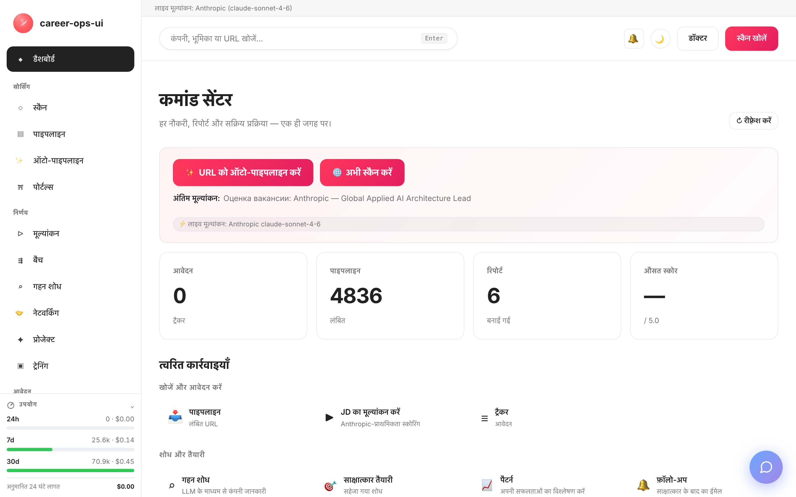

# career-ops-ui

> [career-ops](https://github.com/Fighter90/career-ops) AI जॉब-सर्च पाइपलाइन के लिए एक साफ़-सुथरा, docs-स्टाइल वेब इंटरफ़ेस।
> Claude Code, टर्मिनल और मार्कडाउन फ़ाइलों के बीच उछलने के बजाय — एक ही ब्राउज़र टैब से हर ऑफ़र को खोजें, आँकें, गहराई से जाँचें, आवेदन करें और ट्रैक करें।

[🇬🇧 English](README.md) | [🇪🇸 Español](README.es.md) | [🇧🇷 Português (Brasil)](README.pt-BR.md) | [🇰🇷 한국어](README.ko-KR.md) | [🇯🇵 日本語](README.ja.md) | [🇷🇺 Русский](README.ru.md) | [🇨🇳 简体中文](README.zh-CN.md) | [🇹🇼 繁體中文](README.zh-TW.md) | [🇫🇷 Français](README.fr.md) | [🇵🇱 Polski](README.pl.md) | [🇺🇦 Українська](README.uk.md) | [🇩🇰 Dansk](README.da.md) | [🇸🇦 العربية](README.ar.md) | [🇩🇪 Deutsch](README.de.md) | [🇮🇹 Italiano](README.it.md) | [🇹🇷 Türkçe](README.tr.md) | **🇮🇳 हिन्दी**

_ग़ैर-आधिकारिक UI — career-ops / santifer से न तो संबद्ध है और न ही उसका समर्थन प्राप्त है।_

🌐 **वेबसाइट: [cvstart.org](https://cvstart.org)** — बहुभाषी लैंडिंग + यूज़र गाइड (स्रोत [`site/`](site/) में)।

[](#tests)
[](#tests)
[](#tests)
[](#requirements)
[](LICENSE)
[](https://github.com/Fighter90/career-ops-ui/releases/tag/v1.213.0)

<a href="https://www.producthunt.com/products/career-ops-ui?embed=true&amp;utm_source=badge-featured&amp;utm_medium=badge&amp;utm_campaign=badge-career-ops-ui" target="_blank" rel="noopener noreferrer"></a>

> **🆕 नवीनतम रिलीज़ — v1.213.0** — **MyCareersFuture (सिंगापुर) + स्कैन-गुणवत्ता फिक्स** — सिंगापुर का राष्ट्रीय जॉब बैंक अब स्कैन-योग्य है; Greenhouse पोस्टिंग कंटेंट से फ़िल्टर हो सकती हैं; और रिमोट Ashby भूमिकाएँ अब केवल-शहर वाले स्थान के पीछे गायब नहीं होतीं। **2724 परीक्षण.**
>
> 📜 पूरा रिलीज़ इतिहास: **[CHANGELOG.hi.md](CHANGELOG.hi.md)**.

<!-- DO NOT REVERT: this is the EN README; localized clones MUST switch to their own ./images/dashboard-<locale>.png (es / pt-BR / ko-KR / ja / ru / zh-CN / zh-TW). Generated by scripts/capture-dashboard-screenshots.mjs. -->
[](https://youtu.be/LcVPUg9IsDk?si=mrx3oOmOpSAwabOz)

**[▶ पूर्वावलोकन देखें](https://youtu.be/LcVPUg9IsDk?si=mrx3oOmOpSAwabOz)**

## career-ops के बारे में

[career-ops](https://career-ops.org) एक ओपन-सोर्स जॉब-सर्च सिस्टम है जो किसी भी AI कोडिंग CLI (Claude Code, Cursor, Codex, OpenCode, Antigravity CLI, Grok Build CLI, Qwen Code, Kimi, GitHub Copilot CLI, Gemini CLI (legacy) — अन्य Claude-संगत CLI भी उसी slash-command सतह के ज़रिए काम करते हैं) के भीतर slash-commands के रूप में चलता है। मॉडल-अज्ञेयवादी (model-agnostic)। यह हर पोस्टिंग को आपके CV के मुक़ाबले छह-आयामी 0.0–5.0 रूब्रिक पर आँकता है, टेलर की गई PDF रिज़्यूमे बनाता है, और हर आवेदन को स्थानीय रूप से ट्रैक करता है — कोई क्लाउड अकाउंट नहीं, कोई टेलीमेट्री नहीं, कोई ऑटो-सबमिट नहीं।

**यह रिपॉज़िटरी (career-ops-ui)** उसके ऊपर एक पॉलिश्ड वेब इंटरफ़ेस है। CLI फ़ॉर्म-फ़िल (Playwright MCP के ज़रिए) और slash-command मोड्स को संभालता रहता है; SPA आपको उन्हीं `cv.md` / `data/applications.md` / `reports/` फ़ाइलों पर एक CRM-स्टाइल ब्राउज़र सतह देता है। दोनों एक ही डेटा साझा करते हैं।

**स्कोर के अनुसार एक्शन थ्रेशोल्ड** ([career-ops.org/docs](https://career-ops.org/docs) से):

| स्कोर | अगला क़दम |
|---|---|
| **≥ 4.5** | `/career-ops apply` — उच्च फ़िट, तुरंत आगे बढ़ें |
| **4.0 – 4.4** | आवेदन करें, या गर्मजोशी भरे परिचय के लिए `/career-ops contacto` |
| **3.5 – 3.9** | `/career-ops deep` — पहले शोध करें |
| **< 3.5** | जब तक कोई ख़ास वजह न हो, छोड़ दें |

**प्रामाणिक गाइड** [career-ops.org/docs](https://career-ops.org/docs) पर:

- [career-ops क्या है](https://career-ops.org/docs/introduction/what-is-career-ops)
- [जॉब पोर्टल्स स्कैन करें](https://career-ops.org/docs/introduction/guides/scan-job-portals)
- [किसी जॉब के लिए आवेदन करें](https://career-ops.org/docs/introduction/guides/apply-for-a-job)
- [ऑफ़र्स का बैच-मूल्यांकन करें](https://career-ops.org/docs/introduction/guides/batch-evaluate-offers)
- [Playwright सेट अप करें](https://career-ops.org/docs/introduction/guides/set-up-playwright)
- [career-ops जॉब लिस्टिंग्स को कैसे स्कोर करता है — कार्यप्रणाली](https://career-ops.org/methodology)
- [FAQ](https://career-ops.org/docs/faq) · [ग्लॉसरी](https://career-ops.org/docs/reference/glossary)

**मोड संदर्भ** (पैरेंट के slash-commands, जिन्हें web-ui पेज/बटन के रूप में सामने लाता है) — [career-ops.org/docs/reference/modes](https://career-ops.org/docs/reference/modes):

| मोड | web-ui | मोड | web-ui |
|---|---|---|---|
| [auto-pipeline](https://career-ops.org/docs/reference/modes/auto-pipeline) | `#/auto` | [pipeline](https://career-ops.org/docs/reference/modes/pipeline) | `#/pipeline` |
| [oferta](https://career-ops.org/docs/reference/modes/oferta) | `#/evaluate` | [ofertas](https://career-ops.org/docs/reference/modes/ofertas) | `#/evaluate` |
| [deep](https://career-ops.org/docs/reference/modes/deep) | `#/deep` | [contacto](https://career-ops.org/docs/reference/modes/contacto) | `#/contacto` |
| [interview-prep](https://career-ops.org/docs/reference/modes/interview-prep) | `#/interview-prep` | [pdf](https://career-ops.org/docs/reference/modes/pdf) | PDF जनरेट करें |
| [training](https://career-ops.org/docs/reference/modes/training) | `#/training` | [project](https://career-ops.org/docs/reference/modes/project) | `#/project` |
| [tracker](https://career-ops.org/docs/reference/modes/tracker) | `#/tracker` | [patterns](https://career-ops.org/docs/reference/modes/patterns) | `#/patterns` |
| [followup](https://career-ops.org/docs/reference/modes/followup) | `#/followup` | [apply](https://career-ops.org/docs/reference/modes/apply) | `#/apply` |
| cover | `#/cover` | — | — |

**पोर्टल एडैप्टर** — [career-ops.org/docs/reference/portals](https://career-ops.org/docs/reference/portals): [Greenhouse](https://career-ops.org/docs/reference/portals/greenhouse) · [Ashby](https://career-ops.org/docs/reference/portals/ashby) · [Lever](https://career-ops.org/docs/reference/portals/lever) (साथ ही Workable / SmartRecruiters / Workday + RU स्रोत — देखें `#/scan`)।

**AI असिस्टेंट्स** जिनके भीतर career-ops चलता है (web-ui स्टैंडअलोन विकल्प है): Claude Code, Cursor, Codex, OpenCode, Antigravity CLI, Grok Build CLI, Qwen Code, Kimi, GitHub Copilot CLI, Gemini CLI (legacy)। web-ui की ⚡ लाइव फ़ीचर्स इन्हें **`#/config`** में API प्रोवाइडर्स से मैप करती हैं: Claude Code→Anthropic, Cursor→any/OpenRouter, Gemini CLI→Gemini, Codex→OpenAI, Qwen Code→Qwen, OpenCode→any/OpenRouter, GitHub Copilot CLI→GitHub Models, Antigravity CLI→Gemini, Kimi CLI→any/OpenRouter, Grok Build CLI→any/OpenRouter।

## The CareerOps Manifesto

career-ops [the CareerOps Manifesto](https://career-ops.org/manifesto) का पहला संदर्भ कार्यान्वयन (reference implementation) है — यह अभ्यास कि जॉब-सर्च को प्रमाण, अनुशासन, और उम्मीदवार के पक्ष के औज़ारों के साथ चलाया जाए। इसे पढ़ें। अगर यह वही कहता है जिस पर आप विश्वास करते हैं, तो इस पर हस्ताक्षर करें — आपका हस्ताक्षर एक कमिट बन जाता है। ऐप साइडबार फ़ुटर से इससे लिंक करता है।

## एक AI कोडिंग असिस्टेंट इंस्टॉल करें (पैरेंट career-ops CLI के लिए)

career-ops एक AI कोडिंग असिस्टेंट के **भीतर** slash-commands के रूप में चलता है — जारी रखने से पहले **एक** इंस्टॉल करें और लॉग इन करें (पैरेंट की [Quick Start](https://career-ops.org/docs)):

| असिस्टेंट | इंस्टॉल | web-ui `#/config` प्रोवाइडर |
|---|---|---|
| **Claude Code** | [docs.anthropic.com → Claude Code](https://docs.anthropic.com/en/docs/claude-code) | Anthropic (`ANTHROPIC_API_KEY`) |
| **Gemini CLI** | [github.com/google-gemini/gemini-cli](https://github.com/google-gemini/gemini-cli) | Gemini (`GEMINI_API_KEY`) |
| **Codex** | [github.com/openai/codex](https://github.com/openai/codex) | OpenAI (`OPENAI_API_KEY`) |
| **Qwen Code** | [github.com/QwenLM/qwen-code](https://github.com/QwenLM/qwen-code) | Qwen (`QWEN_API_KEY`) |
| **OpenCode** | [opencode.ai](https://opencode.ai) | any / OpenRouter (`OPENROUTER_API_KEY`) |
| **GitHub Copilot CLI** | [github.com/github/gh-copilot](https://github.com/github/gh-copilot) | GitHub Models (`GITHUB_MODELS_API_KEY`) |
| **Antigravity CLI** | [antigravity.google](https://antigravity.google) | Gemini (`GEMINI_API_KEY`) |

> **web-ui स्टैंडअलोन विकल्प है** — इसे किसी भी CLI की ज़रूरत नहीं। इसके ⚡ Run-live फ़ीचर्स सीधे प्रोवाइडर API को कॉल करते हैं; `#/config` में (या `career-ops-ui init` से) **कोई भी एक** key सेट करें और यह हेडलेस काम करता है। अगर आप CLI को प्राथमिकता देते हैं, तो अपने चुने हुए असिस्टेंट के भीतर career-ops चलाएँ और web-ui को उन्हीं फ़ाइलों पर सिर्फ़ डैशबोर्ड के रूप में इस्तेमाल करें।

## एक ही कमांड में लॉन्च और इनिशियलाइज़ करें

> **महत्वपूर्ण — career-ops-ui [`Fighter90/career-ops`](https://github.com/Fighter90/career-ops) के ऊपर एक डैशबोर्ड है।** यह एक career-ops प्रोजेक्ट के **भीतर** `career-ops/web-ui/` के रूप में चलता है और `../` के ज़रिए पैरेंट फ़ोल्डर से आपकी `cv.md`, `config/`, `data/` पढ़ता है। यह स्टैंडअलोन काम **नहीं** करता — आपको पैरेंट `career-ops` रिपॉज़िटरी भी चाहिए। इसे अकेले क्लोन करके `init` न चलाएँ; नीचे दिए दो विकल्पों में से एक इस्तेमाल करें।

### विकल्प 1 — एक curl (अनुशंसित: सब कुछ सेट कर देता है)

```bash
curl -fsSL https://raw.githubusercontent.com/Fighter90/career-ops-ui/main/bin/setup.sh | bash
```

**दोनों** रिपॉज़िटरी क्लोन करता है, `career-ops/web-ui/` लेआउट व्यवस्थित करता है, dependencies इंस्टॉल करता है, doctor चलाता है, और http://127.0.0.1:4317 पर सर्वर शुरू करता है — फिर डैशबोर्ड खोलता है।

### विकल्प 2 — किसी मौजूदा career-ops प्रोजेक्ट में UI जोड़ें

अगर आपके पास पहले से career-ops कॉन्फ़िगर्ड है और सिर्फ़ डैशबोर्ड चाहिए, तो UI को उसके **भीतर** `web-ui` के रूप में क्लोन करें:

```bash
cd career-ops                                                   # ← आपका मौजूदा career-ops प्रोजेक्ट
git clone https://github.com/Fighter90/career-ops-ui.git web-ui
cd web-ui
npm install
npx career-ops-ui init        # इंटरैक्टिव: LLM प्रोवाइडर चुनें + उसकी key पेस्ट करें → parent career-ops/.env
```

नेस्टेड `web-ui/` लेआउट ही वह चीज़ है जो UI को आपकी `../cv.md`, `../config/`, `../data/` रिज़ॉल्व करने देती है। अगर आप `npx career-ops-ui <verb>` की जगह सीधे `career-ops-ui <verb>` टाइप करना चाहते हैं तो एक बार `npm link` चलाएँ।

### CLI verbs

```bash
career-ops-ui setup    # बूटस्ट्रैप: dependencies इंस्टॉल करें → doctor → run (रन से पहले रुकने के लिए SKIP_START=1)
career-ops-ui init     # LLM प्रोवाइडर चुनें + उसकी key पेस्ट करें (इंटरैक्टिव)
career-ops-ui doctor   # Node / प्रोजेक्ट / keys / Playwright जाँचें (exit 0 ⇔ सभी ज़रूरी हरे)
career-ops-ui run      # http://127.0.0.1:4317 पर सर्वर लॉन्च करें
career-ops-ui open     # अपने ब्राउज़र में डैशबोर्ड टैब खोलें + सामने लाएँ
career-ops-ui help     # हर verb की सूची
```

अगर आपने `npm link` नहीं किया है तो आगे `npx ` लगाएँ (जैसे `npx career-ops-ui run`)। `setup`/`run` के बाद टैब अपने आप खुलता है **और सामने लाया जाता है**; इसे बंद करने के लिए `NO_OPEN=1` सेट करें (हेडलेस / CI)।

### अपना LLM प्रोवाइडर चुनें

`init` प्रोवाइडर विज़ार्ड है — **Claude / Claude Code** (`ANTHROPIC_API_KEY`), **Gemini / Gemini CLI** (`GEMINI_API_KEY`), **Codex / OpenCode CLI** (`OPENAI_API_KEY`), या **Auto** (Anthropic → Gemini फ़ॉलबैक) चुनें। Keys echo दबाकर टाइप की जाती हैं और उसी validated path से parent `career-ops/.env` में लिखी जाती हैं जो `#/config` API-keys टैब इस्तेमाल करता है। CI के लिए नॉन-इंटरैक्टिव फ़ॉर्म:

```bash
career-ops-ui init --provider claude --anthropic-key sk-ant-… --yes
career-ops-ui init --provider gemini --gemini-key …          --yes
career-ops-ui init --provider auto   --openai-key sk-…       --yes
```

या हाथ से सेट करें: `echo "ANTHROPIC_API_KEY=sk-ant-…" >> career-ops/.env`। प्रोवाइडर `LLM_PROVIDER` (`auto` | `claude` | `gemini`) सेट करता है; इसे बिना रीस्टार्ट किए **`#/config` → API keys** से कभी भी बदलें।

### `init` का समस्या-निवारण

अगर `career-ops-ui init` फ़ेल हो जाए या कमांड न मिले (आमतौर पर `git pull` के तुरंत बाद):

```bash
cd career-ops/web-ui
npm install
npx career-ops-ui init        # npx बिना `npm link` के भी लोकल bin चलाता है
```

सुनिश्चित करें कि:

- आप इसे **`career-ops/web-ui/` के भीतर से** चला रहे हैं — किसी स्टैंडअलोन `career-ops-ui/` क्लोन से नहीं।
- **पैरेंट `career-ops/` फ़ोल्डर मौजूद है** और उसमें `cv.md` और `config/` हैं। अगर आपने career-ops-ui अकेले क्लोन किया है, तो उसे (या फिर से क्लोन करके) `career-ops/web-ui/` पर ले जाएँ — या बस विकल्प 1 का curl चलाएँ, जो लेआउट अपने आप व्यवस्थित कर देता है।
- `career-ops-ui doctor` (या `npx career-ops-ui doctor`) बताता है कि ठीक-ठीक क्या कमी है।

---

## क्यों?

[career-ops](https://github.com/Fighter90/career-ops) एक शक्तिशाली Claude-Code-संचालित जॉब-सर्च सिस्टम है: एक JD पेस्ट करें → 0-5 फ़िट स्कोर, एक ATS-ऑप्टिमाइज़्ड PDF, और एक ट्रैकर एंट्री पाएँ। यह Claude Code के भीतर शानदार काम करता है, लेकिन डेटा `cv.md`, `data/applications.md`, `reports/*.md`, `data/pipeline.md`, `portals.yml`, `config/profile.yml` में बिखरा रहता है — खोना आसान, नज़र दौड़ाना मुश्किल।

`career-ops-ui` इसके ऊपर एक पॉलिश्ड UI रखता है:

- **Auto-pipeline** — `#/auto` पर एक जॉब URL पेस्ट करें, एक बार क्लिक करें: validate → fetch → evaluate → रिपोर्ट सेव करें → ट्रैकर में जोड़ें, लाइव a11y स्टेपर और आर्टिफ़ैक्ट डीप-लिंक्स के साथ।
- ट्रैकर, रिपोर्ट्स, और पाइपलाइन को किसी CRM की तरह **ब्राउज़** करें।
- स्कैन (Greenhouse / Ashby / Lever / Workable / SmartRecruiters / Workday **और** hh.ru / Habr Career / Trudvsem / GetMatch / GeekJob) **ट्रिगर** करें और लाइव SSE लॉग्स देखें।
- Anthropic (प्राथमिकता) या Gemini के ज़रिए किसी JD का लाइव **मूल्यांकन** करें, या अगर कोई API key सेट नहीं है तो Claude Code के लिए कॉपी-पेस्ट प्रॉम्प्ट पाएँ।
- cv / profile / mode फ़ाइलों को अपने आप शामिल करते हुए Anthropic SDK के ज़रिए कंपनियों पर **गहन शोध** करें।
- साइड-बाय-साइड मार्कडाउन प्रीव्यू और सर्वर-साइड XSS सैनिटाइज़ेशन के साथ `cv.md` **संपादित** करें।
- सिस्टम को **बनाए रखें**: doctor, verify, normalize, dedup, merge — हर एक बस एक क्लिक।
- **मल्टी-CLI:** Claude Code, Cursor, Codex, Cursor, Aider, या Gemini CLI से समान रूप से चलता है — `CLAUDE.md` / `AGENTS.md` / `GEMINI.md` शिम्स एक ही स्रोत-सत्य (single source of truth) की ओर इशारा करते हैं।

यह विशुद्ध रूप से अतिरिक्त है: `career-ops/` के भीतर कुछ भी नहीं बदलता। आपके सभी कस्टमाइज़ेशन आपके ही रहते हैं।

---

## शुरुआत करें

### 1. पहले career-ops इंस्टॉल करें

```bash
git clone https://github.com/Fighter90/career-ops.git
cd career-ops
```

[career-ops ऑनबोर्डिंग](https://github.com/Fighter90/career-ops#first-run--onboarding) का पालन करें ताकि `cv.md`, `config/profile.yml`, और `portals.yml` मौजूद हों।

### 2. career-ops-ui को उसके भीतर रखें

```bash
git clone https://github.com/Fighter90/career-ops-ui.git web-ui
```

अब आपका ट्री ऐसा दिखता है:

```
career-ops/
├─ cv.md
├─ portals.yml
├─ config/
├─ data/
├─ modes/
├─ reports/
├─ scan.mjs … doctor.mjs … (आदि)
└─ web-ui/                 ← यह रिपॉज़िटरी
   ├─ bin/start.sh
   ├─ package.json
   ├─ server/
   ├─ public/
   └─ tests/
```

### 3. लॉन्च करें

```bash
bash web-ui/bin/start.sh
```

स्क्रिप्ट:

1. Node ≥ 18 की जाँच करती है।
2. `npm install` (सिर्फ़ पहली बार, तीन dependencies — Express + js-yaml + multer)।
3. `127.0.0.1:4317` पर Express सर्वर शुरू करती है।
4. आपके डिफ़ॉल्ट ब्राउज़र में http://127.0.0.1:4317/ खोलती है।

कस्टम पोर्ट / होस्ट:

```bash
PORT=8080 bash web-ui/bin/start.sh
HOST=0.0.0.0 PORT=4317 bash web-ui/bin/start.sh   # LAN पर एक्सपोज़ करें
```

अगर आपने रिपॉज़िटरी कहीं और क्लोन की है (`career-ops/web-ui` के रूप में नहीं), तो env के ज़रिए career-ops की ओर इशारा करें:

```bash
CAREER_OPS_ROOT=/path/to/career-ops bash bin/start.sh
```

---

## पहला रन — साफ़ स्टेट

`career-ops/data/pipeline.md` दो QA फ़िक्स्चर URL (`example.com/qa-fixture-*`) के साथ आता है ताकि टेस्ट सूट hermetically चल सके। एक ताज़े क्लोन पर आपको Pipeline में `2 pending` दिखेगा — ये असली जॉब नहीं हैं। अपने पहले स्कैन से पहले इन्हें हटा दें:

```bash
make clean-test-fixtures        # pipeline.md fixture पंक्तियाँ + qa-fixture-* applications.md पंक्तियाँ हटाता है
npm start
```

http://127.0.0.1:4317 खोलें। Pipeline काउंटर को अब `0 pending` दिखाना चाहिए। Makefile आइडमपोटेंट है — इसे एक साफ़ ट्री पर फिर से चलाना कोई-प्रभाव-नहीं (no-op) होता है।

---

## आवश्यकताएँ

| | |
| --- | --- |
| **Node.js** | ≥ 18 (नेटिव `fetch`, `node:test` इस्तेमाल करता है) |
| **career-ops** | क्लोन और ऑनबोर्ड किया हुआ — ऊपर देखें |
| **वैकल्पिक** | एक-क्लिक JD मूल्यांकन के लिए पैरेंट प्रोजेक्ट के `.env` में `GEMINI_API_KEY` (फ़्री-टियर मॉडल `gemini-2.0-flash`)। वरना UI Claude के लिए एक कॉपी-पेस्ट प्रॉम्प्ट लौटाता है। |
| **वैकल्पिक** | अगर hh.ru 403 लौटाए तो किसी रूसी IP / VPN से चलाएँ। Habr Career किसी भी IP से काम करता है। |
| **वैकल्पिक** | e2e टेस्ट सूट के लिए Playwright (पहले से career-ops की एक transitive dependency है)। |

---

## आपको क्या मिलता है — पेज के अनुसार

| पेज             | यह क्या करता है                                                                                                       |
| ---------------- | ------------------------------------------------------------------------------------------------------------------ |
| **Dashboard**    | कुल आँकड़े (apps / pipeline / reports), औसत स्कोर, स्टेटस ब्रेकडाउन, नवीनतम 5 आवेदन + नवीनतम रिपोर्ट।         |
| **Scan**         | **🌐 Single Scan बटन** — एक ही बार में हर सक्षम स्रोत चलाता है (Greenhouse / Ashby / Lever / Workable / SmartRecruiters / Workday अंग्रेज़ी के लिए, hh.ru + Habr Career + Trudvsem + GetMatch + GeekJob रूसी के लिए)। लाइव SSE लॉग स्ट्रीमिंग + लोकेशन / Remote-Hybrid बैज / रिलोकेशन फ़्लैग / सैलरी / स्रोत फ़िल्टर और डायनामिक स्टैक / लेवल / कीवर्ड चिप्स के साथ क्लिक करने योग्य रिज़ल्ट्स टेबल। Active-Companies कार्ड हर ट्रैक किए गए बोर्ड को उसकी API हेल्थ के साथ सूचीबद्ध करता है। |
| **Pipeline**     | `data/pipeline.md` पर CRUD। सर्वर-साइड प्रीव्यू प्रॉक्सी (SSRF-सेफ़, प्रति-हॉप रीडायरेक्ट वैलिडेशन, 8 KB बॉडी कैप)। किसी URL से सीधे मूल्यांकन पर जाएँ।       |
| **Evaluate**     | JD पेस्ट करें → **पहले Anthropic** (जब दोनों keys मौजूद हों तो प्राथमिकता), फिर Gemini, फिर मैनुअल प्रॉम्प्ट फ़ॉलबैक। Anthropic पथ cv / profile / `_shared.md` / `oferta.md` को अपने आप शामिल करता है (REVIEW-A1)। JD को `jds/` में सेव करना वैकल्पिक है। |
| **Deep research**| Evaluate जैसी ही फ़ॉलबैक श्रृंखला। लाइव Anthropic लगभग 10-30 KB का ग्राउंडेड मार्कडाउन लौटाता है, जो `interview-prep/<company>-<role>.md` में सेव होता है। |
| **Modes**        | समान Anthropic / Gemini / मैनुअल फ़ॉलबैक के साथ 7 सामान्य मोड पेज (`/#/project`, `/#/training`, `/#/followup`, `/#/batch`, `/#/contacto`, `/#/interview-prep`, `/#/patterns`)। |
| **Apply helper** | एक सबमिशन चेकलिस्ट जनरेट करता है; असली Playwright फ़ॉर्म-फ़िल Claude Code के भीतर `/career-ops apply` में ही रहती है। |
| **Tracker**      | `data/applications.md` पर फ़िल्टर करने योग्य टेबल (स्टेटस, स्कोर, फ़्री-टेक्स्ट)। एक-क्लिक `normalize-statuses.mjs` / `dedup-tracker.mjs` / `merge-tracker.mjs`। Pipe + newline एस्केप्स GFM-कंप्लायंट हैं — `"Acme \| Co"` जैसे नाम बिना नुक़सान के राउंड-ट्रिप होते हैं। |
| **Reports**      | `reports/` के अंतर्गत हर रिपोर्ट को पार्स किए गए हेडर (Score / Legitimacy / URL) के साथ ब्राउज़ और पढ़ें।                       |
| **CV**           | साइड-बाय-साइड प्रीव्यू + एक-क्लिक `cv-sync-check.mjs` + 📁 Upload CV के साथ `cv.md` का लाइव मार्कडाउन एडिटर। सेव पर सर्वर-साइड XSS स्ट्रिप (`<script>`, `javascript:`, `on*=` हैंडलर्स)। |
| **Profile**      | `config/profile.yml` + archetypes का रीड-ओनली दृश्य — UI-फ़्रेंडली सारांश।                                         |
| **App settings** | पैरेंट `.env` keys के लिए इन-UI एडिटर: `ANTHROPIC_API_KEY`, `GEMINI_API_KEY`, मॉडल ओवरराइड, पोर्ट / होस्ट। सीक्रेट्स पढ़ने पर मास्क्ड। |
| **Health**       | OK / OPTIONAL / FAIL बैज में सभी सेटअप जाँचें + `doctor.mjs` और `verify-pipeline.mjs` चलाने के लिए बटन।           |
| **Help**         | इन-ऐप मार्कडाउन यूज़र गाइड (`/#/help`), सभी 16 समर्थित भाषाओं के लिए लोकलाइज़्ड (en / es / fr / pt-BR / ko-KR / ja / ru / zh-CN / zh-TW / pl / uk / da / ar / de / it / tr)। |
| **Activity log** | हर स्टेट-बदलने वाले अनुरोध (writes, runs, scans) का ऑडिट ट्रेल। सीक्रेट्स रीडैक्टेड। |
| **Notifications** 🔔 *(v1.58.34 / v1.58.35)* | लाल unread बैज के साथ टॉप-बार बेल। क्लिक करने पर पिछले 50 टोस्ट (प्रति टैब, प्रति सेशन) की सूची वाला ड्रॉअर स्लाइड-इन होता है — Success / Error / Info-progress, हर एक के साथ एक लोकलाइज़्ड टाइमस्टैंप, मानवीय संदेश, और किसी भी `(METHOD /path · HTTP NNN)` पोस्टफ़िक्स के साथ जो एक `<details>` में समेट दिया गया है। Help **§18** हर श्रेणी का दस्तावेज़ीकरण करता है। ड्रॉअर **केवल** बेल क्लिक (या कीबोर्ड Enter / Space) पर खुलता है; ×, Esc, या बेल पर फिर क्लिक करने से बंद होता है। |

ग्लोबल कीबोर्ड शॉर्टकट्स:

- `Ctrl+K` / `Cmd+K` — ग्लोबल सर्च पर फ़ोकस करें। फ़ुटर हिंट प्लेटफ़ॉर्म के अनुसार ढलता है (macOS/iOS पर ⌘K, बाक़ी जगह Ctrl+K) लोकलाइज़्ड क्रिया-शब्द के साथ (v1.58.20)।
- ग्लोबल सर्च में URL पेस्ट करना उसे अपने आप पाइपलाइन में जोड़ देता है।
- `Esc` — कोई भी खुला मोडल **या** notifications ड्रॉअर बंद करे (v1.58.34)।

---

## Scan

ज़ीरो-टोकन पोर्टल स्कैनिंग जो वाक़ई में vacancies लौटाती है। UI में **एक 🌐 Scan बटन** हर कॉन्फ़िगर किए गए स्रोत को एक ही झटके में चलाता है:

- **Greenhouse / Ashby / Lever / Workable / SmartRecruiters / Workday** — `portals.yml::tracked_companies` में पहचानने योग्य ATS पैटर्न वाली हर कंपनी के लिए पब्लिक boards-api। बंडल की गई सूची में Stripe, GitLab, Vercel, Cloudflare, Datadog, Discord, Elastic, Grafana Labs, CockroachDB, Fastly, Twilio, Coinbase, Reddit, Robinhood, Affirm, Lyft, Linear, Supabase, PostHog, Ramp, Modal Labs, Railway, Browserbase, JetBrains शामिल हैं — इसे स्वतंत्र रूप से बढ़ाएँ या घटाएँ।
- **RSS बोर्ड** — कोई भी जॉब बोर्ड जो RSS/Atom फ़ीड देता हो (LaraJobs, WeWorkRemotely, RemoteOK, golangprojects, …)। `portals.yml` में `provider: rss` + फ़ीड URL जोड़ें — किसी कोड बदलाव की ज़रूरत नहीं।
- **Aggregator बोर्ड (v1.75.0)** — प्रति-कंपनी ATS से परे सात बोर्ड-वाइड / कॉन्फ़िग-ड्रिवन स्रोत: **RemoteOK / Remotive / Working Nomads** (बोर्ड-वाइड रिमोट फ़ीड्स, `provider: remoteok|remotive|workingnomads` से चुनें) और **IBM / Arbeitsagentur / Glints / Jobstreet · SEEK** (कॉन्फ़िग-ड्रिवन, हर एंट्री एक प्रति-एंट्री `<provider>:` ब्लॉक पढ़ती है)। कॉपी-पेस्ट `tracked_companies` एंट्रीज़ के लिए `docs/portals-examples.md` देखें। ये हर दूसरे स्रोत जैसे ही `title_filter` / `location_filter` / `content_filter` + dedup + pipeline-append फ़्लो चलाते हैं।
- **hh.ru** — `hh.ru/search/vacancy` का HTML स्क्रेप। किसी भी IP से काम करता है, कोई key नहीं, कोई प्रॉक्सी नहीं। (JSON API `api.hh.ru` इस्तेमाल नहीं होता — अब यह IP/User-Agent से बेपरवाह हर प्रोग्रामैटिक क्लाइंट को 403 देता है; वेबसाइट किसी भी ब्राउज़र-जैसे क्लाइंट को पूरे नतीजे परोसती है, इसलिए हम उसे स्क्रेप करते हैं, ठीक उसी तरह जैसे Habr Career को स्क्रेप किया जाता है।)
- **Habr Career** — `career.habr.com/vacancies` का HTML स्क्रेप। किसी भी IP से काम करता है, कोई auth नहीं।

### RSS एडैप्टर

`portals.yml` में `provider: rss` और एक `rss:` (या `feed_url:`) key वाली एंट्री जोड़कर स्कैनर को किसी भी RSS-आधारित जॉब बोर्ड की ओर इशारा करें:

```yaml
tracked_companies:
  - name: LaraJobs
    provider: rss
    rss: https://larajobs.com/feed
    enabled: true
  - name: WeWorkRemotely
    provider: rss
    rss: https://weworkremotely.com/remote-jobs.rss
    enabled: true
```

एडैप्टर `<item>` ब्लॉक्स को एक छोटे रेगेक्स-आधारित पार्सर (किसी XML लाइब्रेरी की ज़रूरत नहीं) से पार्स करता है। यह `title`, `link` (→ `url`), `pubDate` (→ `date`), और `description` (→ `snippet`, HTML स्ट्रिप्ड) निकालता है। रिमोट स्टेटस को title या description में `/remote|anywhere/i` से अनुमानित किया जाता है; कंपनी का नाम `dc:creator` से, "Company — Role" टाइटल पैटर्न से, या फ़ॉलबैक के तौर पर फ़ीड होस्टनेम से लिया जाता है। ATS एडैप्टर जैसा ही normalize → filter → dedup → pipeline-append फ़्लो लागू होता है।

सभी स्रोत एक ही पाइपलाइन से गुज़रते हैं: normalize → filter (`title_filter.positive` / `title_filter.negative`) → `data/scan-history.tsv` + `data/pipeline.md` + `data/applications.md` के मुक़ाबले dedup → `data/pipeline.md` में जोड़ें → UI की फ़िल्टर करने योग्य टेबल के लिए पूरा रिज़ल्ट सेट `data/last-scan.json` में सेव करें।

`portals.yml` के ज़रिए कॉन्फ़िगर करें:

```yaml
title_filter:
  positive: [backend, engineer, senior, tech lead, golang, php]
  negative: [junior, intern, frontend, ios, android]
tracked_companies:
  - { name: Stripe, enabled: true, careers_url: https://job-boards.greenhouse.io/stripe }
  - { name: Linear, enabled: true, careers_url: https://jobs.ashbyhq.com/linear }
  # ...
russian_portals:
  sources: ["hh", "habr"]   # एक या दोनों
  area: 113                  # 1=मॉस्को, 2=SPb, 113=रूस, 1001=रिमोट
  per_page: 50
  only_remote: false
  queries: ["Senior PHP", "Senior Go", "Tech Lead"]
```

सभी स्रोत एक ही SSE एंडपॉइंट से बहते हैं: `/api/stream/scan?source=ats|regional|both`। **🌐 Scan** UI बटन `source=both` कॉल करता है ताकि हर एडैप्टर (Greenhouse / Ashby / Lever / Workable / SmartRecruiters / Workday + hh.ru + Habr Career + Trudvsem + GetMatch + GeekJob) एक ही कनेक्शन में चले। क्लाइंट डिस्कनेक्ट पर `AbortSignal` का सम्मान करता है — कोई अनाथ (orphan) fetch नहीं।

---

## आर्किटेक्चर

```
career-ops-ui/
├─ CLAUDE.md                 # प्रोजेक्ट-स्तरीय एजेंट निर्देश (कैनोनिकल)
├─ AGENTS.md                 # Codex / Aider / जेनेरिक CLI शिम → CLAUDE.md
├─ GEMINI.md                 # Gemini CLI शिम → CLAUDE.md
├─ .aiignore                 # AI टूल्स के लिए एक्सक्लूज़न लिस्ट
├─ .claude/                  # Claude Code एजेंट कॉन्फ़िग
│  ├─ agents/                # 3 प्रोजेक्ट-विशिष्ट सबएजेंट्स (route, view, test isolation)
│  └─ commands/               # स्लैश-कमांड स्टब्स
├─ bin/start.sh              # वन-शॉट लॉन्चर (Node जाँच → npm install → server → ब्राउज़र खोलें)
├─ package.json              # 2 रनटाइम डिपेंडेंसी: express, js-yaml
├─ server/
│  ├─ index.mjs              # ~130 LOC ऑर्केस्ट्रेटर: middleware + 12 register<Topic>Routes(app) कॉल + SPA कैच-ऑल
│  └─ lib/
│     ├─ paths.mjs           # career-ops फ़ाइलों के एब्सोल्यूट पाथ (CAREER_OPS_ROOT-जागरूक)
│     ├─ parsers.mjs         # markdown / pipeline / report पार्सर (GFM-अनुरूप पाइप एस्केप)
│     ├─ runner.mjs          # SIGTERM→SIGKILL एस्कलेशन + 30 मिनट कैप के साथ runNodeScript() + streamNodeScript()
│     ├─ security.mjs        # isValidJobUrl, stripDangerousMarkdown, sanitizeJobDescription, isPubliclyExposed
│     ├─ prompts.mjs         # bundleProjectContext, buildEvaluationPrompt, buildDeepPrompt, buildModePrompt
│     ├─ store.mjs           # safeReadApps/Pipeline/Reports, checkProfileCustomized, ensureRussianPortalsDefaults
│     ├─ anthropic.mjs       # न्यूनतम Anthropic SDK एडैप्टर (runAnthropic, hasAnthropicKey, hasGeminiKey)
│     ├─ env-config.mjs      # सीक्रेट मास्किंग + वैलिडेशन के साथ .env राउंड-ट्रिप
│     ├─ activity-log.mjs    # JSONL ऑडिट ट्रेल मिडलवेयर (सीक्रेट्स रिडैक्टेड)
│     ├─ dotenv.mjs          # छोटा dotenv लोडर
│     ├─ en-scanner.mjs      # इन-प्रोसेस Greenhouse/Ashby/Lever ऑर्केस्ट्रेटर (AbortSignal-जागरूक)
│     ├─ ru-scanner.mjs      # इन-प्रोसेस hh.ru + Habr ऑर्केस्ट्रेटर (AbortSignal-जागरूक)
│     ├─ sources/
│     │  ├─ greenhouse.mjs   # boards-api.greenhouse.io क्लाइंट
│     │  ├─ ashby.mjs        # api.ashbyhq.com क्लाइंट
│     │  ├─ lever.mjs        # api.lever.co क्लाइंट
│     │  ├─ hh.mjs           # hh.ru/search/vacancy HTML स्क्रैपर (पेजिनेटेड, UA-जागरूक)
│     │  └─ habr.mjs         # career.habr.com HTML पार्सर (कोई cheerio नहीं, केवल regex)
│     └─ routes/             # 24 राउट मॉड्यूल — प्रति टॉपिक एक (P-2)
│        ├─ activity.mjs     # /api/activity
│        ├─ config.mjs       # /api/config (पैरेंट .env राउंड-ट्रिप)
│        ├─ content.mjs      # /api/cv, /api/profile, /api/portals, /api/modes
│        ├─ health.mjs       # /api/health, /api/dashboard
│        ├─ help.mjs         # /api/help/:lang
│        ├─ jds.mjs          # /api/jds CRUD
│        ├─ llm.mjs          # /api/evaluate, /api/deep, /api/mode/:slug, /api/apply-helper, /api/interview-prep*
│        ├─ pipeline.mjs     # /api/pipeline + SSRF-सुरक्षित प्रीव्यू प्रॉक्सी
│        ├─ reports.mjs      # /api/reports
│        ├─ runners.mjs      # /api/run/* + /api/stream/{scan,liveness,pdf} + /api/output/pdfs
│        ├─ scan.mjs         # /api/stream/scan-{ru,en} + /api/scan-results
│        └─ tracker.mjs      # /api/tracker
├─ public/                   # स्टैटिक SPA — कोई बिल्ड स्टेप नहीं
│  ├─ index.html
│  ├─ css/app.css            # डिज़ाइन टोकन (docs-स्टाइल पैलेट)
│  └─ js/
│     ├─ api.js              # fetch रैपर + कनेक्शन-बैनर स्टेट + UI हेल्पर्स + सेफ markdown रेंडरर
│     ├─ router.js           # 404 फ़ॉलबैक + alias सपोर्ट के साथ hash-आधारित राउटर
│     ├─ app.js              # बूट + ग्लोबल कीबोर्ड हैंडलर्स + मोबाइल साइडबार ड्रॉअर
│     ├─ lib/{i18n,skills}.js
│     └─ views/              # प्रति पेज एक फ़ाइल (dashboard, scan, pipeline, evaluate, deep, apply, tracker, reports, cv, settings, health, config, help, activity, mode-page)
├─ docs/                     # सार्वजनिक रेफ़रेंस: architecture, API, data-flows, SDD, conventions, reviews
│  ├─ PROJECT.md             # क्या / क्यों / किसके लिए
│  ├─ ROADMAP.md             # मौजूदा माइलस्टोन + पूर्ण इतिहास
│  ├─ PRODUCTION-READINESS.md # ईमानदार डिप्लॉयमेंट-गेट आकलन
│  ├─ sdd/{SDD-GUIDE,CONVENTIONS}.md
│  ├─ architecture/{OVERVIEW,SERVER,FRONTEND,API,DATA-FLOWS}.md
│  └─ reviews/REVIEW-*.md
└─ tests/                    # 1856 यूनिट + 90 Playwright + 23/23 e2e:full + 20 e2e:smoke (बेसलाइन @ v1.121.0)
   ├─ parsers.test.mjs       # markdown / pipeline / report पार्सर (प्योर फ़ंक्शन)
   ├─ api.test.mjs           # हर एंडपॉइंट, एफ़ेमरल सर्वर, कोई नेटवर्क नहीं
   ├─ {ru,en}-scanner.test.mjs   # मॉक्ड fetch
   ├─ pipeline-preview.test.mjs   # प्रति-हॉप रीडायरेक्ट वैलिडेशन (REVIEW-B1)
   ├─ anthropic.test.mjs     # SDK एडैप्टर + log-guard टेस्ट (REVIEW-B4)
   ├─ url-validation.test.mjs    # SSRF रिजेक्ट स्वीप (FIX-M3 + M6 + M7)
   ├─ cv-xss.test.mjs        # stripDangerousMarkdown राउंड-ट्रिप
   ├─ jd-sanitize.test.mjs   # sanitizeJobDescription
   ├─ help.test.mjs / help-ui.test.mjs    # सभी 16 लोकेल में i18n पैरिटी
   ├─ playwright-smoke.mjs   # 12 ब्राउज़र फ़्लो (CV सेव, tracker, pipeline, evaluate, config, आदि)
   └─ e2e{,-comprehensive}.mjs   # पूर्ण Playwright वॉकथ्रू
```

### बिल्ड स्टेप क्यों नहीं?

वैनिला HTML/CSS/JS सरफ़ेस एरिया को बेहद छोटा रखता है: दो डिपेंडेंसी का एक `npm install` और आप चल पड़े। न Webpack, न Vite, न `node_modules` का ढेर। पूरा UI मिनिफ़ाइड होने पर < 30 KB का है। अगर आपको डेवलपमेंट के दौरान हॉट-रीलोड चाहिए, तो `npm run dev` Node के बिल्ट-इन `--watch` का उपयोग करता है।

### स्पेक-ड्रिवन डेवलपमेंट

गैर-तुच्छ बदलाव GSD पाइपलाइन (`superpowers@claude-plugins-official` की `gsd-*` स्किल्स) से होकर गुज़रते हैं:

```
discuss → spec → plan → execute → verify → review
```

सार्वजनिक रेफ़रेंस: [`docs/sdd/SDD-GUIDE.md`](docs/sdd/SDD-GUIDE.md)। सभी प्लानिंग आर्टिफ़ैक्ट `.planning/` (gitignored) के अंतर्गत रहते हैं। `docs/` ट्री दीर्घकालिक सार्वजनिक कॉन्ट्रैक्ट है।

---

## API रेफ़रेंस

सभी एंडपॉइंट `/api/*` के अंतर्गत। जब तक अन्यथा न कहा जाए, JSON इन / JSON आउट।

### स्वास्थ्य व डैशबोर्ड

| मेथड   | पाथ                      | रिस्पॉन्स                                                                    |
| ------ | ------------------------ | --------------------------------------------------------------------------- |
| GET    | `/api/health`            | `{ ok, warnings, version, parentVersion, checks: [{name, ok, required, value?}] }` |
| GET    | `/api/dashboard`         | `{ counts, avgScore, byStatus, recent, pipeline, lastReport }`              |
| GET    | `/api/status/providers`  | `{ activeProvider, activeModel, keysConfigured }` — ऑनबोर्डिंग बैनर + ⚡ कॉस्ट हिंट (v1.55.3) के लिए LLM रेडीनेस; इसमें `openrouter` (v1.57.0) शामिल है |
| GET    | `/api/openrouter/models` | `{ models:[{id,name,context_length}], fallback, cached }` — `#/config` मॉडल ड्रॉपडाउन के लिए OpenRouter कैटलॉग प्रॉक्सी (v1.57.0) |
| GET    | `/api/activity?limit&type` | `data/activity.jsonl` ऑडिट ट्रेल की टेल                                 |
| GET    | `/api/help/:lang`        | स्थानीयकृत इन-ऐप यूज़र गाइड (फ़ॉलबैक: `en.md`)                             |

### ऐप सेटिंग्स (पैरेंट .env राउंड-ट्रिप)

| मेथड   | पाथ              | उद्देश्य                                                                |
| ------ | ---------------- | ---------------------------------------------------------------------- |
| GET    | `/api/config`    | ज्ञात env कीज़ जिनमें सीक्रेट्स मास्क्ड हैं                                     |
| POST   | `/api/config`    | पैरेंट `.env` को वैलिडेट + लिखता है; `process.env` पर तुरंत लागू होता है      |

### डेटा फ़ाइलें

| मेथड   | पाथ                                | उद्देश्य                                                                |
| ------ | ----------------------------------- | ---------------------------------------------------------------------- |
| GET    | `/api/tracker`                      | `{ rows: [parsed applications.md] }`                                   |
| POST   | `/api/tracker`                      | बॉडी `{ company, role, score?, status?, url?, notes?, date? }` — डिडुप-अवेयर (company + role पर केस-इनसेंसिटिव) |
| GET    | `/api/pipeline`                     | `{ urls: [...] }`                                                      |
| POST   | `/api/pipeline`                     | बॉडी `{ url }` → डिडुप + `isValidJobUrl` के साथ `data/pipeline.md` में जोड़ता है |
| GET    | `/api/pipeline/preview?url=…`       | सर्वर-साइड fetch प्रॉक्सी (प्रति-हॉप SSRF जाँच, ≤3 रीडायरेक्ट, 8 KB कैप) |
| DELETE | `/api/pipeline?url=…`               | एक URL हटाता है                                                          |
| GET    | `/api/reports`                      | `reports/*.md` की पार्स की गई सूची                                          |
| GET    | `/api/reports/:slug`                | पूर्ण markdown + पार्स किया गया हेडर                                          |
| GET    | `/api/jds`                          | सेव की गई JD फ़ाइलों की सूची                                          |
| GET    | `/api/jds/:name`                    | text/plain — रॉ JD                                                     |
| POST   | `/api/jds`                          | बॉडी `{ text, slug? }` → `jds/` में सेव करता है                               |
| DELETE | `/api/jds/:name`                    | अनलिंक (`.txt` सफ़िक्स आवश्यक)                                                |
| GET    | `/api/cv`                           | `{ markdown }`                                                         |
| PUT    | `/api/cv`                           | बॉडी `{ markdown }` → `cv.md` लिखता है (XSS-स्ट्रिप्ड, ≤1 MB)             |
| GET    | `/api/profile`                      | `{ profile: yaml-parsed, raw: text }`                                  |
| GET    | `/api/portals`                      | `{ portals: yaml-parsed, raw: text }`                                  |
| GET    | `/api/modes`                        | मोड फ़ाइलों की सूची                                                        |
| GET    | `/api/modes/:name`                  | text/plain — रॉ मोड प्रॉम्प्ट                                                |
| GET    | `/api/output/pdfs`                  | जनरेट की गई PDFs की सूची                                                  |
| GET    | `/api/output/pdfs/:name`            | डाउनलोड (`Content-Disposition: attachment`)                          |
| GET    | `/api/interview-prep`               | सेव की गई डीप-रिसर्च फ़ाइलों की सूची                                          |
| GET    | `/api/interview-prep/:name`         | `{ name, markdown }`                                                   |
| DELETE | `/api/interview-prep/:name`         | अनलिंक (`.md` सफ़िक्स आवश्यक)                                                 |

### स्क्रिप्ट रनर्स (बफ़र्ड, वन-शॉट)

| मेथड   | पाथ                    | रैप करता है                       |
| ------ | ----------------------- | --------------------------- |
| POST   | `/api/run/doctor`       | `node doctor.mjs`           |
| POST   | `/api/run/verify`       | `node verify-pipeline.mjs`  |
| POST   | `/api/run/normalize`    | `node normalize-statuses.mjs` |
| POST   | `/api/run/dedup`        | `node dedup-tracker.mjs`    |
| POST   | `/api/run/merge`        | `node merge-tracker.mjs`    |
| POST   | `/api/run/sync-check`   | `node cv-sync-check.mjs`    |

सभी बफ़र्ड रन 60 सेकंड पर कैप होते हैं; 5 सेकंड की ग्रेस अवधि के बाद SIGTERM → SIGKILL एस्कलेशन।

### स्ट्रीम्स (SSE)

| मेथड   | पाथ                          | स्ट्रीम करता है                            |
| ------ | ----------------------------- | ----------------------------------- |
| GET    | `/api/stream/scan`            | लीगेसी `node scan.mjs` (सबप्रोसेस)|
| GET    | `/api/stream/scan?source=ats\|regional\|both` | समेकित इन-प्रोसेस स्कैनर SSE — क्वेरी: `dryRun=1`, `company=…` (केवल ATS)। |
| GET    | `/api/stream/liveness`        | `node check-liveness.mjs`          |
| GET    | `/api/stream/pdf`             | `node generate-pdf.mjs`            |

SSE इवेंट प्रकार:

```
event: start    data: { script, args?, writeFiles? }
event: log      data: { stream: "stdout"|"stderr", line: string }
event: done     data: { code, counts?, errors? }
event: error    data: { message }
```

### LLM एंडपॉइंट (Anthropic-पहले → Gemini → मैनुअल फ़ॉलबैक)

| मेथड   | पाथ                                | उद्देश्य                                                                          |
| ------ | ----------------------------------- | ---------------------------------------------------------------------------------- |
| POST   | `/api/evaluate`                     | बॉडी `{ jd, save? }` → JD मूल्यांकन (`oferta.md` के अनुसार A–G सेक्शन)              |
| POST   | `/api/evaluate/test-gemini`         | `GEMINI_API_KEY` की स्मोक जाँच                                                     |
| POST   | `/api/evaluate/test-anthropic`      | `ANTHROPIC_API_KEY` की स्मोक जाँच                                                  |
| POST   | `/api/deep`                         | बॉडी `{ company, role?, run? }` → डीप-रिसर्च प्रॉम्प्ट या लाइव ग्राउंडेड markdown |
| POST   | `/api/mode/:slug`                   | जेनेरिक मोड रनर; अनुमति-सूची: `batch`, `contacto`, `followup`, `interview-prep`, `patterns`, `project`, `training` |
| POST   | `/api/apply-helper`                 | बॉडी `{ url, jd? }` → आवेदन चेकलिस्ट                                       |
| GET    | `/api/scan-results`                 | `{ en: {when, fresh[], filtered[], errors[]}, ru: { ... } }` — अंतिम स्कैन        |
| GET    | `/api/scan/regional/config`         | प्रभावी क्षेत्रीय-स्कैनर कॉन्फ़िग (queries, negatives, sources)। |

जब `/api/deep` या `/api/mode/:slug` पर `run: true` सेट होता है, तो सर्वर Anthropic को प्राथमिकता देता है (जब दोनों कीज़ मौजूद हों), `cv.md` + `config/profile.yml` + `modes/_shared.md` + संबंधित मोड टेम्पलेट को एक `<project_context>` ब्लॉक में इनलाइन करता है, और मॉडल का ग्राउंडेड markdown सीधे लौटाता है। सॉफ़्ट कैप: असेंबल किए गए प्रॉम्प्ट पर 200 KB — ओवरफ़्लो होने पर 413 लौटता है।

---

## टेस्ट

```bash
npm test                       # 1856 यूनिट/इंटीग्रेशन टेस्ट
npm run test:e2e               # 20 स्मोक e2e (अपना सर्वर खुद बूट करता है)
npm run test:e2e:full          # 23 व्यापक e2e
npm run test:e2e:browser       # 90 Playwright ब्राउज़र (smoke + full-cycle + forms + locale-sweep ×17 + theme)
npm run test:coverage          # `npm test` जैसा ही, साथ में V8 कवरेज
```

| सूट                       | टेस्ट | क्या                                                                                                       |
| --------------------------- | ----- | ---------------------------------------------------------------------------------------------------------- |
| `node --test tests/*.test.mjs` (यूनिट + इंटीग्रेशन) | **1856** | हर एंडपॉइंट, एफ़ेमरल सर्वर, कोई नेटवर्क नहीं। 218 फ़ाइलें: parsers, scanners (मॉक्ड), runners, anthropic/openai, सुरक्षा हेडर, XSS, JD सैनिटाइज़, URL वैलिडेशन, i18n पैरिटी, + v1.55→v1.56 UX-फ़िक्स सूट। |
| `tests/e2e.mjs` (स्मोक)      | 20    | Playwright हेडलेस: हर राउट रेंडर होता है, बुनियादी फ़्लो।                                                     |
| `tests/e2e-comprehensive.mjs` | 23    | पूर्ण Playwright वॉकथ्रू: 11 राउट + 12 फ़ंक्शनल फ़्लो।                                              |
| `npm run test:e2e:browser` (`playwright-smoke` + `playwright-full-cycle` + `playwright-forms` + `playwright-locale-sweep`) | **90** | ब्राउज़र-ड्रिवन: डैशबोर्ड रेंडर, नेविगेशन, भाषा स्विच, 404, health, tracker राउंड-ट्रिप, pipeline जोड़ना + अमान्य-URL स्वीप, reports, evaluate मैनुअल फ़ॉलबैक, config कीज़ मास्क्ड, CV PUT XSS स्ट्रिप, pipeline preview 400, auto-pipeline SSE। |
| **कुल**                   | **1955** | **0 विफलताएँ, 0 फ़्लेक**                                                                                    |

कवरेज: `--experimental-test-coverage` के माध्यम से ~93% लाइन / ~83% ब्रांच।

पार्सर प्योर फ़ंक्शन हैं (कोई I/O नहीं) — इनका परीक्षण `applications.md`, `pipeline.md`, और `reports/*.md` के वास्तविक डेटा टुकड़ों के विरुद्ध किया जाता है। API टेस्ट एक एफ़ेमरल पोर्ट पर Express ऐप को बूट करते हैं और हर एंडपॉइंट को एंड-टू-एंड चलाते हैं। स्कैनर टेस्ट `fetch` को मॉक करते हैं ताकि वे तब भी पास हों जब hh.ru आपका IP ब्लॉक कर दे। Playwright ब्राउज़र स्मोक इन-प्रोसेस सर्वर के विरुद्ध चलता है और पैरेंट प्रोजेक्ट के `node_modules` के ज़रिए Playwright को रिज़ॉल्व करता है — `web-ui/` में कोई नई डिपेंडेंसी नहीं।

CI हर `main` पर पुश पर Node 18 / 20 / 22 के विरुद्ध यूनिट + e2e + Playwright मैट्रिक्स चलाता है।

---

## कॉन्फ़िगरेशन

एनवायरनमेंट वैरिएबल (सर्वर स्टार्ट पर पढ़े जाते हैं, जहाँ नोट न हो वहाँ सभी वैकल्पिक हैं):

| वेरिएबल              | डिफ़ॉल्ट            | उद्देश्य                                                                            |
| -------------------- | ------------------ | ---------------------------------------------------------------------------------- |
| `PORT`               | `4317`             | Express बाइंड पोर्ट                                                                  |
| `HOST`               | `127.0.0.1`        | Express बाइंड होस्ट। नॉन-लूपबैक होने पर CSP जुड़ता है; v2.0.0 के लिए ऑथ गेट योजनाबद्ध।   |
| `CAREER_OPS_ROOT`    | स्क्रिप्ट से `..`   | `cv.md`, `data/`, `portals.yml`, `modes/`, आदि कहाँ खोजें।                      |
| `ANTHROPIC_API_KEY`  | अनसेट              | `/api/evaluate`, `/api/deep`, `/api/mode/:slug` लाइव मोड सक्षम करता है (जब दोनों कीज़ सेट हों तो प्राथमिकता)। |
| `ANTHROPIC_MODEL`    | `claude-sonnet-4-6` | Anthropic मॉडल ओवरराइड करें।                                                         |
| `GEMINI_API_KEY`     | अनसेट              | `gemini-eval.mjs` को फ़ॉरवर्ड किया जाता है और `/api/evaluate` के लिए फ़ॉलबैक के रूप में उपयोग होता है। |
| `GEMINI_MODEL`       | `gemini-2.0-flash` | Gemini मॉडल ओवरराइड करें।                                                             |
| `OPENAI_API_KEY`     | अनसेट              | हेडलेस लाइव-इवैल्यूएशन (`auto` क्रम में तीसरा) + पैरेंट Codex/OpenAI CLI फ़्लो।       |
| `OPENAI_MODEL`       | `gpt-5-codex`      | OpenAI मॉडल ओवरराइड करें।                                                             |
| `QWEN_API_KEY`       | अनसेट              | DashScope OpenAI-संगत के ज़रिए हेडलेस लाइव-इवैल्यूएशन (`auto` क्रम में चौथा)।      |
| `QWEN_MODEL`         | `qwen-max`         | Qwen मॉडल ओवरराइड करें।                                                             |
| `OPENROUTER_API_KEY` | अनसेट              | OpenRouter के ज़रिए हेडलेस लाइव-इवैल्यूएशन — एक की, 300+ मॉडल (`auto` में पाँचवाँ / अंतिम)।   |
| `OPENROUTER_MODEL`   | `openrouter/auto`  | `vendor/model` आईडी। कैटलॉग `GET /api/openrouter/models` से लाइव लोड होता है।        |

इस UI द्वारा पहचाना जाने वाला `portals.yml` एक्सटेंशन (इसे पैरेंट प्रोजेक्ट में अपनी मौजूदा फ़ाइल में जोड़ें):

```yaml
russian_portals:
  sources: ["hh", "habr"]
  area: 113          # hh.ru area id
  per_page: 50
  only_remote: false
  queries: ["Senior PHP", "Тимлид Go", ...]
```

आप किसी भी कंपनी एंट्री को एक स्पष्ट `api:` URL से भी विस्तारित कर सकते हैं। 24 सत्यापित कंपनियों के लिए तैयार-टू-पेस्ट ब्लॉक हेतु [`docs/portals-examples.md`](docs/portals-examples.md) (इसी रेपो में) देखें।

---

## सुरक्षा नोट्स

- सर्वर डिफ़ॉल्ट रूप से `127.0.0.1` से बाइंड होता है — बिना स्पष्ट `HOST=0.0.0.0` के इंटरनेट पर कभी एक्सपोज़ नहीं होता।
- **पाथ सैनिटाइज़ेशन (v1.21.0)**: हर `:name` / `:slug` राउट पैरामीटर `server/lib/security.mjs` में `sanitizePathName()` से होकर गुज़रता है — गैर-`[\w-.]` को हटाता है, अगुआ dot-runs हटाता है, आंतरिक dot-runs को समेटता है, 200 अक्षरों पर कैप करता है, खाली होने पर 400। यह 10 डुप्लिकेट regex कॉपियों की जगह लेता है जो पहले `..pdf` / `....md` को निकल जाने देती थीं।
- **DNS-रीबाइंड डिफ़ेंस (v1.21.0)**: `/api/pipeline/preview` और `/api/auto-pipeline` `server/lib/safe-fetch.mjs::safeGet` से होकर रूट होते हैं — एक DNS लुकअप, पिन किया गया TCP कनेक्शन, SNI/Host मूल होस्टनेम पर लक्षित। कोई दूसरा लुकअप नहीं, कोई TOCTOU विंडो नहीं।
- **कंकरेंट-राइट म्यूटेक्स (v1.21.0)**: `tracker.mjs`, `pipeline.mjs` (POST + DELETE), और `auto-pipeline.mjs` का tracker चरण read-modify-write को `server/lib/file-lock.mjs` से `withFileLock(path, fn)` में लपेटते हैं। कंकरेंट POST अब पंक्तियाँ नहीं गिराते।
- **LLM रेट-लिमिट (v1.21.0)**: `/api/evaluate`, `/api/deep`, `/api/mode/:slug`, `/api/auto-pipeline` `server/lib/rate-limit.mjs` से `llmRateLimit` का उपयोग करते हैं। **लूपबैक पर नो-ऑप**; `HOST=0.0.0.0` पर 10 req/min/IP। `LLM_RATE_LIMIT="N/Ws"` से कॉन्फ़िगर करने योग्य। 429 + `Retry-After`.
- **CV XSS स्ट्रिप (v1.22.0 हार्डनिंग)**: `stripDangerousMarkdown` अब एंटिटी-जागरूक है — regex स्ट्रिप से पहले `&lt;`, `&gt;`, `&#NN;`, `&#xHH;` को डीकोड करता है ताकि `&lt;script&gt;` और `java&#115;cript:` पेलोड बायपास न कर सकें।
- सबप्रोसेस इनवोकेशन आर्ग एरे के साथ `spawn` का उपयोग करते हैं — **कभी भी शेल इंटरपोलेशन नहीं**। `bash` रनर `~/.bashrc` को नज़रअंदाज़ करने के लिए `--noprofile --norc` का उपयोग करता है।
- स्ट्रीमिंग एंडपॉइंट क्लाइंट डिस्कनेक्ट होने पर चाइल्ड प्रोसेस को किल कर देते हैं (कोई अनाथ स्कैनर नहीं)।
- राइट एंडपॉइंट केवल ज्ञात career-ops पाथ को छूते हैं: `data/`, `jds/`, `cv.md`, `config/`, `portals.yml`, `output/`, `reports/`, `interview-prep/`, `modes/_profile.md`। कहीं और कभी नहीं।
- कनेक्शन बैनर डिस्कनेक्ट रहते हुए एक्सपोनेंशियल बैकऑफ़ (3 सेकंड → 6 सेकंड → 12 सेकंड → 24 सेकंड → 60 सेकंड) के साथ `/api/health` को पिंग करता है और रिकवरी पर ऑटो-क्लियर हो जाता है (v1.22.0 M-6)।

---

## सीमाएँ

पूर्णतः LLM-संचालित मोड (`oferta`, `deep`, `contacto`, `apply`, `batch`, `patterns`, `followup`) को वास्तव में चलने के लिए एक LLM की आवश्यकता होती है। वेब UI `auto` क्रम **Anthropic → Gemini → OpenAI → Qwen → OpenRouter → GitHub Models → Hermes** (या जो भी `LLM_PROVIDER` पिन करता है) से एक प्रोवाइडर रिज़ॉल्व करता है:

1. **Anthropic (प्राथमिकता)** — पैरेंट प्रोजेक्ट के `.env` में `ANTHROPIC_API_KEY` सेट करें। `runAnthropic` से रूट होता है जिसमें `cv.md` / `config/profile.yml` / `modes/_shared.md` / मोड टेम्पलेट स्वचालित रूप से इनलाइन होते हैं (REVIEW-A1)। v1.8.0+ में लाइव सत्यापित, जहाँ `claude-sonnet-4-6` एक डीप-रिसर्च कॉल के लिए 26 KB का ग्राउंडेड markdown लौटाता है।
2. **`gemini-eval.mjs`** फ़ॉलबैक के रूप में — जब केवल `GEMINI_API_KEY` सेट हो तो यह बॉक्स से बाहर काम करता है।
3. **OpenAI / Qwen / OpenRouter** — ज़ीरो-डिप OpenAI-संगत क्लाइंट (`_tailProvider()` पथ)। **OpenRouter** (v1.57.0) सबसे लचीला है: एक `OPENROUTER_API_KEY` हर प्रमुख लैब के 300+ मॉडल के सामने खड़ा होता है, और `#/config` मॉडल ड्रॉपडाउन `GET /api/openrouter/models` (सर्वर-साइड प्रॉक्सी, CSP-सुरक्षित, क्यूरेटेड ऑफ़लाइन फ़ॉलबैक) से लाइव भरा जाता है।
4. **कॉपी-पेस्ट प्रॉम्प्ट** — जब कोई की सेट नहीं है, तो UI Claude Code / ChatGPT / Gemini Web के लिए फ़ॉर्मैटेड एक तैयार प्रॉम्प्ट जनरेट करता है।

Claude Code के अंदर मौजूदा `/career-ops apply` Playwright फ़ॉर्म-फ़िल फ़्लो ही आवेदन फ़ॉर्म को सही मायनों में ऑटो-फ़िल करने का एकमात्र तरीका बना हुआ है — UI का *Apply helper* इसके बजाय एक चेकलिस्ट जनरेट करता है।

प्रोडक्शन-रेडीनेस आकलन (डिप्लॉयमेंट गेट्स, रिस्क रजिस्टर, टाला गया कार्य) के लिए [`docs/PRODUCTION-READINESS.md`](docs/PRODUCTION-READINESS.md) देखें। संक्षेप में: सिंगल-टेनेंट लूपबैक के लिए तैयार; LAN एक्सपोज़र v2.0 P-12 ऑथ गेट का इंतज़ार कर रहा है।

---

## पूरे स्टैक को क्लाउड में चलाएँ

career-ops **हमेशा चालू** रहने पर सर्वोत्तम है — जब आप सोते हैं तब स्कैन करता है, किसी भी ब्राउज़र से पहुँच योग्य। पूरे स्टैक को एक छोटे सर्वर पर रखने के लिए — पैरेंट **career-ops** पाइपलाइन, यह **career-ops-ui** व्यूअर, और AI चलाने वाला **इंजन** (Claude Code CLI के माध्यम से आपकी **Claude सदस्यता**, एक स्थानीय **Hermes** गेटवे, या प्रदाता API कुंजियाँ) — एक VPS (Node ≥ 18) तैयार करें, पैरेंट + यह रिपॉज़िटरी इंस्टॉल करें, अपना इंजन चुनें, और सुरक्षा अपरिवर्तनीयताओं (CSP, SSRF गार्ड, XSS सीमा, लॉग में कोई रहस्य नहीं) को बरकरार रखते हुए व्यूअर को **प्रमाणीकरण सहित HTTPS रिवर्स प्रॉक्सी** के पीछे प्रकट करें।

📖 इन-ऐप **सहायता §31** ("पूरे स्टैक को क्लाउड में चलाएँ") सभी 17 भाषाओं में चरण-दर-चरण मार्गदर्शन देती है; ऑपरेटर चेकलिस्ट [`docs/integrations/HERMES.md`](docs/integrations/HERMES.md) है, और [क्लाउड परिनियोजन wiki पृष्ठ](https://github.com/Fighter90/career-ops-ui/wiki/Cloud-Deployment) में संदर्भ तालिकाएँ हैं।

---

## Hermes एजेंट + Telegram

**Nous Research के [Hermes](https://hermes-agent.nousresearch.com/docs)** एक ओपन, स्वायत्त एजेंट है (टूल-कॉलिंग, स्किल्स, 20+ मैसेजिंग चैनल)। आप career-ops-ui को किसी **क्लाउड सर्वर** पर चला सकते हैं और उसके इवेंट्स — एक पूरा हुआ स्कैन, एक नई रिपोर्ट, एक अर्जेंट फ़ॉलो-अप — को **Hermes एजेंट के ज़रिए Telegram** से जोड़ सकते हैं, ताकि पाइपलाइन आप तक वहीं पहुँचे जहाँ आप पहले से मौजूद हैं।

> **अब जुड़ा हुआ (v1.151.0).** *LLM प्रोवाइडर* के रूप में Hermes लाइव है: इसका OpenAI-संगत API Server (`hermes gateway`) चलाएँ और **App settings** में `HERMES_API_KEY` सेट करें — फिर career-ops-ui आपके स्थानीय Hermes के माध्यम से लाइव मूल्यांकन चलाता है (auto क्रम में अंतिम)। नीचे दिया **क्लाउड-सर्वर डिप्लॉयमेंट** और **Telegram ब्रिज** अब भी ऑपरेटर मार्गदर्शन है; एक **`hermes-bridge` स्किल** इनसे गुज़ारती है (सीक्रेट्स कभी डिस्क या लॉग्स को नहीं छूते; SSRF / CSP / नो-सीक्रेट्स इनवेरिएंट्स `127.0.0.1` से हटने के बाद भी बरकरार रहते हैं)।

📖 **पूरी गाइड:** [`docs/integrations/HERMES.md`](docs/integrations/HERMES.md) — दो इंटीग्रेशन प्रकार, क्लाउड-सर्वर डिप्लॉयमेंट (रिवर्स प्रॉक्सी + HTTPS + systemd), Telegram-via-Hermes, और थ्रेट-मॉडल की “क्या EXPOSE न करें” सूची।

---


## स्थानीयकरण

यह UI **16 लोकेल** शिप करता है — `en`, `es`, `pt-BR`, `ko`, `ja`, `ru`, `zh-CN`, `zh-TW`, `fr`, `pl`, `uk`, `da`, `ar`, `de`, `it`, `tr`। **v1.60.0 (I18N-SPLIT)** से अनुवाद [`public/js/lib/locales/`](public/js/lib/locales/) के अंतर्गत **प्रति लोकेल एक फ़ाइल** में रहते हैं — `i18n-dict.<lang>.js`, प्रत्येक एक फ़्लैट `key → string` टेबल है — साथ ही एक साझा `i18n-dict.aliases.js`। [`i18n-dict.js`](public/js/lib/i18n-dict.js) इन्हें `window.__I18N_DICT` में असेंबल करता है; [`i18n.js`](public/js/lib/i18n.js) `t('key', 'fallback')` को रिज़ॉल्व करता है। कोई बिल्ड स्टेप नहीं, कोई रनटाइम fetch नहीं — एक अनुवादक अलगाव में एक ही भाषा फ़ाइल को संपादित करता है।

**एक स्ट्रिंग जोड़ें या बदलें:**

```js
// public/js/lib/locales/i18n-dict.en.js   →   'scan.newButton': 'Run scan',
// public/js/lib/locales/i18n-dict.es.js   →   'scan.newButton': 'Ejecutar búsqueda',
// …वही की सभी 16 लोकेल फ़ाइलों में जोड़ें (पैरिटी गेटेड है)
```

फिर इसे मार्कअप में `data-i18n="scan.newButton"` के ज़रिए या JS में `t('scan.newButton')` के ज़रिए उपयोग करें, और `npm test` चलाएँ। बिल्कुल नई भाषा जोड़ने के लिए, इसे `i18n.js` (`LANGS` + `detect()`), असेंबलर, `index.html`, और लोकेल-सूचीबद्ध करने वाले टूलिंग में रजिस्टर करें।

📖 **पूर्ण गाइड:** [`docs/LOCALIZATION.md`](docs/LOCALIZATION.md) — प्रति-लोकेल लेआउट, `@alias` तंत्र, चरण-दर-चरण नई लोकेल जोड़ना, और हर i18n CI गेट।

---

## योगदान

Issues और PRs का स्वागत है। घर के नियम:

- पुश करने से पहले `npm test` चलाएँ — **284 चेक ग्रीन** बार है (यदि आप UI छूते हैं तो साथ में 12 Playwright भी)।
- गैर-तुच्छ बदलाव GSD पाइपलाइन से होकर गुज़रते हैं। [`docs/sdd/SDD-GUIDE.md`](docs/sdd/SDD-GUIDE.md) देखें।
- इस रेपो के अंदर से पैरेंट `career-ops/` प्रोजेक्ट में कुछ भी संशोधित न करें। पूरा उद्देश्य यही है कि यह एक गैर-आक्रामक ओवरले है। कठोर नियम [`CLAUDE.md`](CLAUDE.md) में हैं।
- कन्वेंशनल कमिट्स: `feat`, `fix`, `refactor`, `docs`, `test`, `chore`, `perf`, `ci`। वैकल्पिक स्कोप: `feat(scan):`। ब्रेकिंग चेंज: `feat!:`।
- टेस्ट CI-आइसोलेटेड होने चाहिए — `mkdtempSync` या `CAREER_OPS_ROOT=$(mktemp -d)` के ज़रिए फ़िक्स्चर बूटस्ट्रैप करें।

क्या आप किसी गैर-Claude CLI (Codex, Aider, Cursor, Gemini) से रेपो चला रहे हैं? [`AGENTS.md`](AGENTS.md) या [`GEMINI.md`](GEMINI.md) पढ़ें — दोनों कैनोनिकल `CLAUDE.md` तक शिम करते हैं।

---

---

## 🌍 शुरुआत करना — इंस्टॉल के बाद के पहले कदम

एक-कमांड इंस्टॉल के बाद आपके पास दो खाली git क्लोन हैं, जिनमें स्टार्टर `cv.md`,
`config/profile.yml`, `portals.yml`, `data/applications.md`,
और `data/pipeline.md` फ़ाइलें हैं जिनमें **EDIT ME** मार्कर हैं। Health पेज
पहली लॉन्च पर पहले से ही ऑल-ग्रीन होना चाहिए। प्लेसहोल्डर को
अपने वास्तविक डेटा से बदलें:

### 1. अपना CV बनाएँ (`cv.md`)

आपके पास तीन विकल्प हैं:

- **विकल्प A — मौजूदा रिज़्यूमे पेस्ट करें:** `career-ops/cv.md` खोलें,
  EDIT-ME प्लेसहोल्डर को अपने वास्तविक रिज़्यूमे से साफ़ markdown में बदलें
  (सेक्शन: Summary, Experience, Projects, Education, Skills)। जितना सरल
  उतना बेहतर — `career-ops` इसे सादे टेक्स्ट के रूप में पढ़ता है।
- **विकल्प B — UI से अपलोड करें:** साइडबार में **CV** पर क्लिक करें →
  **📁 Upload CV** → अपनी `.md` / `.txt` फ़ाइल चुनें → प्रीव्यू देखें →
  **💾 Save** पर क्लिक करें।
- **विकल्प C — Claude Code को अपना LinkedIn URL दें:** `career-ops/` में
  Claude Code खोलें, `/career-ops` चलाएँ, अपना LinkedIn URL पेस्ट करें, और पूछें
  *"extract my CV from this and write it to cv.md"*।

हर मीट्रिक को विशिष्ट बनाएँ (जैसे *"reduced p99 latency by 38%"*, न कि
*"improved performance"*)। मूल्यांकन पाइपलाइन इसी फ़ाइल से सीधे
मीट्रिक पढ़ती है।

### 2. अपनी प्रोफ़ाइल संपादित करें (`config/profile.yml`)

```bash
$EDITOR career-ops/config/profile.yml
```

पूरा नाम, ईमेल, लोकेशन, LinkedIn, टारगेट
रोल, आर्किटाइप, सैलरी टारगेट के लिए प्लेसहोल्डर बदलें। **आर्किटाइप** सबसे
महत्वपूर्ण फ़ील्ड हैं — इन्हीं से हर JD का आपसे मिलान होता है।

### 3. स्कैनर ट्यून करें (`portals.yml`)

```bash
$EDITOR career-ops/portals.yml
```

अपने स्टैक और सीनियरिटी के अनुसार `title_filter.positive` (जैसे `"PHP"`, `"Go"`,
`"Backend"`, `"Senior"`) और `title_filter.negative` (जैसे `"Junior"`, `"Java"`,
`"iOS"`) सेट करें। बंडल की गई `tracked_companies` सूची में पहले से
3 सत्यापित Greenhouse / Ashby बोर्ड (GitLab, Vercel, Linear) शामिल हैं। 24+ और
तैयार-टू-पेस्ट ब्लॉक के लिए, [`docs/portals-examples.md`](docs/portals-examples.md) देखें।

अगर आपको hh.ru / Habr Career स्कैनिंग चाहिए, तो सेटअप स्क्रिप्ट द्वारा बनाए गए
`russian_portals:` ब्लॉक को संपादित करें — अपनी खोज क्वेरी जोड़ें (जैसे `"Senior PHP"`,
`"Тимлид Go"`)।

### 4. (वैकल्पिक) LLM API कीज़

जब दोनों मौजूद हों तो UI Anthropic को Gemini पर प्राथमिकता देता है। दोनों में से
कोई भी या कोई नहीं काम करता है — बिना की के, **Evaluate** Claude Code के लिए
एक कॉपी-पेस्ट प्रॉम्प्ट लौटाता है।

```bash
# Anthropic (प्राथमिकता)
echo "ANTHROPIC_API_KEY=sk-ant-..." >> career-ops/.env
# Gemini (फ़ॉलबैक)
echo "GEMINI_API_KEY=AIza..." >> career-ops/.env
```

या इन्हें UI के **App settings** पेज (`/#/config`) के ज़रिए सेट करें — वही
फ़ाइल, पढ़ते समय मास्क्ड, तुरंत `process.env` पर लागू।

### 5. सत्यापित करें और काम शुरू करें

Health पेज रीफ़्रेश करें — हर आवश्यक जाँच ग्रीन होनी चाहिए। फिर:

1. **🌐 Scan** पर क्लिक करें → ~5 सेकंड प्रतीक्षा करें → Greenhouse / Ashby / Lever / Workable / SmartRecruiters / Workday +
   hh.ru / Habr Career स्कैन होते हैं, नीचे टेबल में वैकेंसियाँ दिखाई देती हैं।
2. किसी भी टाइटल पर क्लिक करें → मूल पोस्टिंग एक नए टैब में खुलती है।
3. जब तक कोई आशाजनक विकल्प न दिखे, स्टैक चिप्स (PHP / Go / Backend / Senior)
   से फ़िल्टर करें।
4. URL कॉपी करें → उसे **Pipeline** में पेस्ट करें → लाइव रूप से 0-5 स्कोर करने के लिए
   (Anthropic / Gemini) **Evaluate** पर क्लिक करें या मैनुअल प्रॉम्प्ट पाएँ।
5. रिपोर्ट `reports/` में, ट्रैकर `data/applications.md` में,
   लाइव डीप-रिसर्च `interview-prep/` में उतरती है। सब कुछ UI में दिखाई देता है।

> इस गाइड के अनुवाद प्रत्येक भाषा-विशिष्ट README में उपलब्ध हैं:
> [🇪🇸 Español](README.es.md) · [🇧🇷 Português (Brasil)](README.pt-BR.md) · [🇰🇷 한국어](README.ko-KR.md) · [🇯🇵 日本語](README.ja.md) · [🇷🇺 Русский](README.ru.md) · [🇨🇳 简体中文](README.zh-CN.md) · [🇹🇼 繁體中文](README.zh-TW.md) · [🇫🇷 Français](README.fr.md) · [🇵🇱 Polski](README.pl.md) · [🇺🇦 Українська](README.uk.md) · [🇩🇰 Dansk](README.da.md) · [🇸🇦 العربية](README.ar.md) · [🇩🇪 Deutsch](README.de.md) · [🇮🇹 Italiano](README.it.md) · [🇹🇷 Türkçe](README.tr.md) | [🇮🇳 हिन्दी](README.hi.md)

---

## लाइसेंस

MIT। [LICENSE](LICENSE) देखें।

[santifer](https://santifer.io) द्वारा [career-ops](https://github.com/Fighter90/career-ops) के ऊपर निर्मित। शानदार पाइपलाइन के लिए धन्यवाद।

## योगदानकर्ता

career-ops-ui बनाने में मदद करने वाले सभी का धन्यवाद। यह प्रोजेक्ट [Fighter90](https://github.com/Fighter90) द्वारा मेंटेन किया जाता है और सामुदायिक योगदान से बेहतर होता है — पूरी सूची [contributors graph](https://github.com/Fighter90/career-ops-ui/graphs/contributors) पर देखें।

<p>
  <a href="https://github.com/Fighter90" title="Fighter90"></a>
  <a href="https://github.com/Alien10140" title="Alien10140"></a>
  <a href="https://github.com/vignyl" title="vignyl"></a>
  <a href="https://github.com/bracketouverte" title="bracketouverte"></a>
</p>

**[सभी योगदानकर्ता →](https://github.com/Fighter90/career-ops-ui/graphs/contributors)**

<div align="center">

<div style="font-family: -apple-system, BlinkMacSystemFont, &quot;Segoe UI&quot;, Roboto, &quot;Helvetica Neue&quot;, Arial, sans-serif; border: 1px solid rgb(224, 224, 224); border-radius: 12px; padding: 20px; max-width: 500px; background: rgb(255, 255, 255); box-shadow: rgba(0, 0, 0, 0.05) 0px 2px 8px;"><div style="display: flex; align-items: center; gap: 12px; margin-bottom: 12px;"><div style="flex: 1 1 0%; min-width: 0px;"><h3 style="margin: 0px; font-size: 18px; font-weight: 600; color: rgb(26, 26, 26); line-height: 1.3; overflow: hidden; text-overflow: ellipsis; white-space: nowrap;">career-ops-ui</h3><p style="margin: 4px 0px 0px; font-size: 14px; color: rgb(102, 102, 102); line-height: 1.4; overflow: hidden; text-overflow: ellipsis; display: -webkit-box; -webkit-line-clamp: 2; -webkit-box-orient: vertical;">The open-source job search command center</p></div></div><a href="https://www.producthunt.com/products/career-ops-ui?embed=true&amp;utm_source=embed&amp;utm_medium=post_embed" target="_blank" rel="noopener" style="display: inline-flex; align-items: center; gap: 4px; margin-top: 12px; padding: 8px 16px; background: rgb(255, 97, 84); color: rgb(255, 255, 255); text-decoration: none; border-radius: 8px; font-size: 14px; font-weight: 600;">Check it out on Product Hunt →</a></div>

</div>
