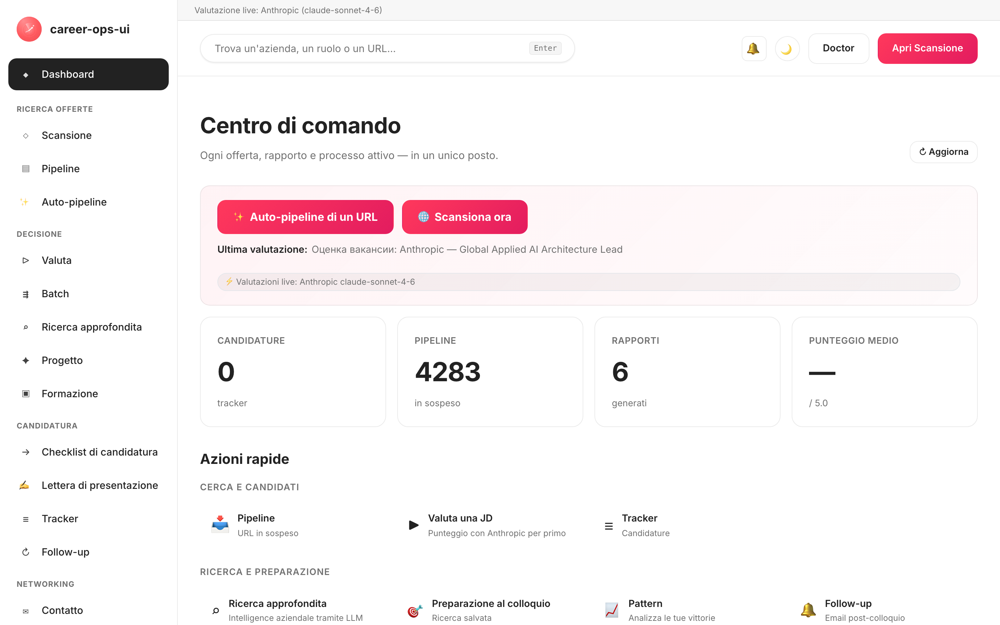

# career-ops-ui

> Un'interfaccia web pulita, in stile documentazione, per la pipeline di ricerca di lavoro con IA [career-ops](https://github.com/Fighter90/career-ops).
> Cerca, valuta, approfondisci, candidati e tieni traccia di ogni offerta da un'unica scheda del browser — invece di rimbalzare tra Claude Code, terminali e file markdown.

[🇬🇧 English](README.md) | [🇪🇸 Español](README.es.md) | [🇧🇷 Português (Brasil)](README.pt-BR.md) | [🇰🇷 한국어](README.ko-KR.md) | [🇯🇵 日本語](README.ja.md) | [🇷🇺 Русский](README.ru.md) | [🇨🇳 简体中文](README.zh-CN.md) | [🇹🇼 繁體中文](README.zh-TW.md) | [🇫🇷 Français](README.fr.md) | [🇵🇱 Polski](README.pl.md) | [🇺🇦 Українська](README.uk.md) | [🇩🇰 Dansk](README.da.md) | [🇸🇦 العربية](README.ar.md) | [🇩🇪 Deutsch](README.de.md) | **🇮🇹 Italiano** | [🇹🇷 Türkçe](README.tr.md) | [🇮🇳 हिन्दी](README.hi.md)

_Interfaccia non ufficiale — non affiliata né approvata da career-ops / santifer._

[](#tests)
[](#tests)
[](#tests)
[](#requirements)
[](LICENSE)
[](https://github.com/Fighter90/career-ops-ui/releases/tag/v1.213.0)

<a href="https://www.producthunt.com/products/career-ops-ui?embed=true&amp;utm_source=badge-featured&amp;utm_medium=badge&amp;utm_campaign=badge-career-ops-ui" target="_blank" rel="noopener noreferrer"></a>

> **🆕 Ultima release — v1.213.0** — **MyCareersFuture (Singapore) + fix di qualità della scansione** — la banca del lavoro nazionale di Singapore ora è scansionabile; le offerte Greenhouse sono filtrabili per contenuto; e le offerte Ashby da remoto non spariscono più dietro una sede solo-città. **2724 test.**
>
> 📜 Cronologia completa delle versioni: **[CHANGELOG.it.md](CHANGELOG.it.md)**.

<!-- DO NOT REVERT: locale-specific dashboard screenshot (dashboard-it.png). Each README uses its own ./images/dashboard-<locale>.png — never replace with dashboard-en.png. Generated by scripts/capture-dashboard-screenshots.mjs. -->
[](https://youtu.be/LcVPUg9IsDk?si=mrx3oOmOpSAwabOz)

**[▶ Guarda l'anteprima](https://youtu.be/LcVPUg9IsDk?si=mrx3oOmOpSAwabOz)**

## Informazioni su career-ops

[career-ops](https://career-ops.org) è un sistema open-source per la ricerca di lavoro che gira come slash command dentro qualsiasi CLI di coding con IA (Claude Code, Cursor, Codex, OpenCode, Antigravity CLI, Grok Build CLI, Qwen Code, Kimi, GitHub Copilot CLI, Gemini CLI (legacy) — funzionano anche altre CLI compatibili con Claude tramite la stessa superficie di slash command). Indipendente dal modello. Valuta ogni annuncio rispetto al tuo CV con una griglia a cinque dimensioni più un punteggio globale olistico da 0.0 a 5.0, genera CV in PDF su misura e tiene traccia di ogni candidatura localmente — nessun account cloud, nessuna telemetria, nessun invio automatico.

**Questo repository (career-ops-ui)** è un'interfaccia web curata che ci sta sopra. La CLI continua a gestire la compilazione dei moduli (tramite Playwright MCP) e le modalità slash command; la SPA ti offre una superficie browser in stile CRM sugli stessi file `cv.md` / `data/applications.md` / `reports/`. Entrambe condividono gli stessi dati.

**Soglie d'azione per punteggio** (da [career-ops.org/docs](https://career-ops.org/docs)):

| Punteggio | Passo successivo |
|---|---|
| **≥ 4.5** | `/career-ops apply` — alta compatibilità, procedi subito |
| **4.0 – 4.4** | candidati, oppure `/career-ops contacto` per un'introduzione a caldo |
| **3.5 – 3.9** | `/career-ops deep` — ricerca prima |
| **< 3.5** | salta, a meno che tu non abbia un motivo specifico |

**Guide canoniche** su [career-ops.org/docs](https://career-ops.org/docs):

- [Cos'è career-ops](https://career-ops.org/docs/introduction/what-is-career-ops)
- [Scansiona i portali di lavoro](https://career-ops.org/docs/introduction/guides/scan-job-portals)
- [Candidati per un lavoro](https://career-ops.org/docs/introduction/guides/apply-for-a-job)
- [Valuta offerte in batch](https://career-ops.org/docs/introduction/guides/batch-evaluate-offers)
- [Configura Playwright](https://career-ops.org/docs/introduction/guides/set-up-playwright)
- [Come career-ops valuta gli annunci di lavoro — la metodologia](https://career-ops.org/methodology)

**Riferimento delle modalità** (le slash command del progetto principale che la web-ui espone come pagine/pulsanti) — [career-ops.org/docs/reference/modes](https://career-ops.org/docs/reference/modes):

| Modalità | web-ui | Modalità | web-ui |
|---|---|---|---|
| [auto-pipeline](https://career-ops.org/docs/reference/modes/auto-pipeline) | `#/auto` | [pipeline](https://career-ops.org/docs/reference/modes/pipeline) | `#/pipeline` |
| [oferta](https://career-ops.org/docs/reference/modes/oferta) | `#/evaluate` | [ofertas](https://career-ops.org/docs/reference/modes/ofertas) | `#/evaluate` |
| [deep](https://career-ops.org/docs/reference/modes/deep) | `#/deep` | [contacto](https://career-ops.org/docs/reference/modes/contacto) | `#/contacto` |
| [interview-prep](https://career-ops.org/docs/reference/modes/interview-prep) | `#/interview-prep` | [pdf](https://career-ops.org/docs/reference/modes/pdf) | Genera PDF |
| [training](https://career-ops.org/docs/reference/modes/training) | `#/training` | [project](https://career-ops.org/docs/reference/modes/project) | `#/project` |
| [tracker](https://career-ops.org/docs/reference/modes/tracker) | `#/tracker` | [patterns](https://career-ops.org/docs/reference/modes/patterns) | `#/patterns` |
| [followup](https://career-ops.org/docs/reference/modes/followup) | `#/followup` | [apply](https://career-ops.org/docs/reference/modes/apply) | `#/apply` |
| cover | `#/cover` | — | — |

**Adattatori dei portali** — [career-ops.org/docs/reference/portals](https://career-ops.org/docs/reference/portals): [Greenhouse](https://career-ops.org/docs/reference/portals/greenhouse) · [Ashby](https://career-ops.org/docs/reference/portals/ashby) · [Lever](https://career-ops.org/docs/reference/portals/lever) (più Workable / SmartRecruiters / Workday + fonti RU — vedi `#/scan`).

**Assistenti IA** dentro cui gira career-ops (la web-ui è l'alternativa autonoma): Claude Code, Cursor, Codex, OpenCode, Antigravity CLI, Grok Build CLI, Qwen Code, Kimi, GitHub Copilot CLI, Gemini CLI (legacy). Le funzioni ⚡ in tempo reale della web-ui mappano questi ai provider API in **`#/config`**: Claude Code→Anthropic, Cursor→any/OpenRouter, Gemini CLI→Gemini, Codex→OpenAI, Qwen Code→Qwen, OpenCode→qualsiasi/OpenRouter, GitHub Copilot CLI→GitHub Models, Antigravity CLI→Gemini, Kimi CLI→any/OpenRouter, Grok Build CLI→any/OpenRouter.

## Il Manifesto CareerOps

career-ops è la prima implementazione di riferimento del [Manifesto CareerOps](https://career-ops.org/manifesto) — la pratica di condurre una ricerca di lavoro con evidenze, disciplina e strumenti dalla parte del candidato. Leggilo. Se dice ciò in cui credi, firmalo — la tua firma diventa un commit. L'app vi rimanda tramite il link nel footer della barra laterale.

## Installa un assistente di coding IA (per la CLI career-ops principale)

career-ops gira come slash command **dentro** un assistente di coding IA — installane **uno** e accedi prima di continuare (la [Guida rapida](https://career-ops.org/docs) del progetto principale):

| Assistente | Installazione | Provider `#/config` della web-ui |
|---|---|---|
| **Claude Code** | [docs.anthropic.com → Claude Code](https://docs.anthropic.com/en/docs/claude-code) | Anthropic (`ANTHROPIC_API_KEY`) |
| **Gemini CLI** | [github.com/google-gemini/gemini-cli](https://github.com/google-gemini/gemini-cli) | Gemini (`GEMINI_API_KEY`) |
| **Codex** | [github.com/openai/codex](https://github.com/openai/codex) | OpenAI (`OPENAI_API_KEY`) |
| **Qwen Code** | [github.com/QwenLM/qwen-code](https://github.com/QwenLM/qwen-code) | Qwen (`QWEN_API_KEY`) |
| **OpenCode** | [opencode.ai](https://opencode.ai) | qualsiasi / OpenRouter (`OPENROUTER_API_KEY`) |
| **GitHub Copilot CLI** | [github.com/github/gh-copilot](https://github.com/github/gh-copilot) | GitHub Models (`GITHUB_MODELS_API_KEY`) |
| **Antigravity CLI** | [antigravity.google](https://antigravity.google) | Gemini (`GEMINI_API_KEY`) |

> **La web-ui è l'alternativa autonoma** — non ha bisogno di alcuna CLI installata. Le sue funzioni ⚡ Run-live chiamano direttamente le API dei provider; imposta **una qualsiasi** chiave in `#/config` (o `career-ops-ui init`) e funziona headless. Se preferisci la CLI, esegui career-ops dentro l'assistente scelto e usa la web-ui puramente come dashboard sugli stessi file.

## Avvia e inizializza con un unico comando

> **Importante — career-ops-ui è una dashboard *sopra* [`Fighter90/career-ops`](https://github.com/Fighter90/career-ops).** Gira **dentro** un progetto career-ops come `career-ops/web-ui/` e legge il tuo `cv.md`, `config/`, `data/` dalla cartella principale tramite `../`. Non funziona in modo autonomo — hai bisogno anche del repository principale `career-ops`. Non clonarlo da solo ed eseguire `init`; usa una delle due opzioni qui sotto.

### Opzione 1 — un solo curl (consigliato: configura tutto)

```bash
curl -fsSL https://raw.githubusercontent.com/Fighter90/career-ops-ui/main/bin/setup.sh | bash
```

Clona **entrambi** i repository, dispone il layout `career-ops/web-ui/`, installa le dipendenze, esegue il doctor e avvia il server su http://127.0.0.1:4317 — poi apre la dashboard.

### Opzione 2 — aggiungi la UI a un progetto career-ops esistente

Se hai già configurato career-ops e vuoi solo la dashboard, clona la UI **dentro** di esso come `web-ui`:

```bash
cd career-ops                                                   # ← your existing career-ops project
git clone https://github.com/Fighter90/career-ops-ui.git web-ui
cd web-ui
npm install
npx career-ops-ui init        # interactive: pick LLM provider + paste its key → parent career-ops/.env
```

Il layout annidato `web-ui/` è esattamente ciò che consente alla UI di risolvere il tuo `../cv.md`, `../config/`, `../data/`. Esegui `npm link` **una volta** se preferisci digitare il semplice `career-ops-ui <verb>` invece di `npx career-ops-ui <verb>`.

### I verbi della CLI

```bash
career-ops-ui setup    # bootstrap: install deps → doctor → run (SKIP_START=1 to stop before run)
career-ops-ui init     # pick LLM provider + paste its key (interactive)
career-ops-ui doctor   # verify Node / project / keys / Playwright (exit 0 ⇔ all required green)
career-ops-ui run      # launch the server at http://127.0.0.1:4317
career-ops-ui open     # open + RAISE the dashboard tab in your browser
career-ops-ui help     # list every verb
```

Anteponi `npx ` (es. `npx career-ops-ui run`) se non hai fatto `npm link`. Dopo `setup`/`run` la scheda si apre **e viene portata in primo piano** automaticamente; imposta `NO_OPEN=1` per disattivare l'apertura automatica (headless / CI).

### Scegli il tuo provider LLM

`init` è la procedura guidata per il provider — scegli **Claude / Claude Code** (`ANTHROPIC_API_KEY`), **Gemini / Gemini CLI** (`GEMINI_API_KEY`), **Codex / OpenCode CLI** (`OPENAI_API_KEY`), oppure **Auto** (fallback Anthropic → Gemini). Le chiavi vengono digitate con l'eco soppresso e scritte nel file `career-ops/.env` principale attraverso lo stesso percorso validato della scheda delle chiavi API `#/config`. Forma non interattiva per CI:

```bash
career-ops-ui init --provider claude --anthropic-key sk-ant-… --yes
career-ops-ui init --provider gemini --gemini-key …          --yes
career-ops-ui init --provider auto   --openai-key sk-…       --yes
```

Oppure impostalo a mano: `echo "ANTHROPIC_API_KEY=sk-ant-…" >> career-ops/.env`. Il provider imposta `LLM_PROVIDER` (`auto` | `claude` | `gemini`); cambialo in qualsiasi momento da **`#/config` → API keys** senza riavviare.

### Risoluzione dei problemi con `init`

Se `career-ops-ui init` fallisce o il comando non viene trovato (comune subito dopo un `git pull`):

```bash
cd career-ops/web-ui
npm install
npx career-ops-ui init        # npx runs the local bin even without `npm link`
```

Assicurati che:

- Lo stai eseguendo **da dentro `career-ops/web-ui/`** — non da un clone autonomo `career-ops-ui/`.
- La **cartella principale `career-ops/` esista** e contenga `cv.md` e `config/`. Se hai clonato career-ops-ui da solo, spostalo (o riclonalo) in modo che si trovi in `career-ops/web-ui/` — oppure esegui semplicemente il curl dell'Opzione 1, che dispone il layout per te.
- `career-ops-ui doctor` (o `npx career-ops-ui doctor`) stampa esattamente cosa manca.

---

## Perché?

[career-ops](https://github.com/Fighter90/career-ops) è un potente sistema di ricerca di lavoro guidato da Claude Code: incolla una JD → ottieni un punteggio di compatibilità 0-5, un PDF ottimizzato per ATS e una voce nel tracker. Funziona benissimo dentro Claude Code, ma i dati vivono sparsi tra `cv.md`, `data/applications.md`, `reports/*.md`, `data/pipeline.md`, `portals.yml`, `config/profile.yml` — facili da perdere, difficili da scorrere.

`career-ops-ui` mette una UI curata sopra tutto questo:

- **Auto-pipeline** — incolla un unico URL di lavoro su `#/auto`, clicca una volta: valida → recupera → valuta → salva il report → aggiungi al tracker, con uno stepper accessibile in tempo reale e deep-link agli artefatti.
- **Sfoglia** il tracker, i report e la pipeline come un CRM.
- **Attiva** le scansioni (Greenhouse / Ashby / Lever / Workable / SmartRecruiters / Workday **e** hh.ru / Habr Career / Trudvsem / GetMatch / GeekJob) e osserva i log SSE in tempo reale.
- **Valuta** una JD in tempo reale tramite Anthropic (preferito) o Gemini, oppure ottieni un prompt copia-incolla per Claude Code se non è impostata alcuna chiave API.
- **Ricerca approfondita** sulle aziende in tempo reale tramite l'SDK Anthropic con i file cv / profile / mode inseriti automaticamente inline.
- **Modifica** `cv.md` con anteprima markdown affiancata e sanitizzazione XSS lato server.
- **Mantieni** il sistema: doctor, verify, normalize, dedup, merge — un clic ciascuno.
- **Multi-CLI:** si guida in modo identico da Claude Code, Cursor, Codex, Cursor, Aider o Gemini CLI — gli shim `CLAUDE.md` / `AGENTS.md` / `GEMINI.md` puntano a un'unica fonte di verità.

Sono aggiunte pure: nulla dentro `career-ops/` cambia. Tutte le tue personalizzazioni restano tue.

---

## Avvio rapido

### 1. Installa prima career-ops

```bash
git clone https://github.com/Fighter90/career-ops.git
cd career-ops
```

Segui l'[onboarding di career-ops](https://github.com/Fighter90/career-ops#first-run--onboarding) così che `cv.md`, `config/profile.yml` e `portals.yml` esistano.

### 2. Inserisci career-ops-ui al suo interno

```bash
git clone https://github.com/Fighter90/career-ops-ui.git web-ui
```

Il tuo albero ora appare così:

```
career-ops/
├─ cv.md
├─ portals.yml
├─ config/
├─ data/
├─ modes/
├─ reports/
├─ scan.mjs … doctor.mjs … (etc)
└─ web-ui/                 ← this repo
   ├─ bin/start.sh
   ├─ package.json
   ├─ server/
   ├─ public/
   └─ tests/
```

### 3. Avvia

```bash
bash web-ui/bin/start.sh
```

Lo script:

1. Verifica Node ≥ 18.
2. `npm install` (solo al primo avvio, tre dipendenze — Express + js-yaml + multer).
3. Avvia il server Express su `127.0.0.1:4317`.
4. Apre http://127.0.0.1:4317/ nel tuo browser predefinito.

Porta / host personalizzati:

```bash
PORT=8080 bash web-ui/bin/start.sh
HOST=0.0.0.0 PORT=4317 bash web-ui/bin/start.sh   # expose on LAN
```

Se hai clonato il repository altrove (non come `career-ops/web-ui`), punta a career-ops tramite variabile d'ambiente:

```bash
CAREER_OPS_ROOT=/path/to/career-ops bash bin/start.sh
```

---

## Primo avvio — stato pulito

`career-ops/data/pipeline.md` viene fornito con due URL di fixture QA (`example.com/qa-fixture-*`) così la suite di test può girare in modo ermetico. Su un clone appena fatto vedrai la Pipeline mostrare `2 pending` — quelli non sono lavori reali. Eliminali prima della tua prima scansione:

```bash
make clean-test-fixtures        # removes pipeline.md fixture rows + qa-fixture-* applications.md rows
npm start
```

Apri http://127.0.0.1:4317. Il contatore della Pipeline dovrebbe ora indicare `0 pending`. Il Makefile è idempotente — rieseguirlo su un albero pulito non ha effetto.

---

## Requisiti

| | |
| --- | --- |
| **Node.js** | ≥ 18 (usa `fetch` nativo, `node:test`) |
| **career-ops** | Clonato e configurato — vedi sopra |
| **Opzionale** | `GEMINI_API_KEY` nel `.env` del progetto principale (modello free-tier `gemini-2.0-flash`) per la valutazione delle JD con un clic. Altrimenti la UI restituisce un prompt copia-incolla per Claude. |
| **Opzionale** | Esegui da un IP / VPN russo se hh.ru restituisce 403. Habr Career funziona da qualsiasi IP indipendentemente. |
| **Opzionale** | Playwright (già una dipendenza transitiva di career-ops) per la suite di test e2e. |

---

## Cosa ottieni — pagina per pagina

| Pagina             | Cosa fa                                                                                                       |
| ---------------- | ------------------------------------------------------------------------------------------------------------------ |
| **Dashboard**    | Conteggi aggregati (candidature / pipeline / report), punteggio medio, ripartizione per stato, ultime 5 candidature + ultimo report.         |
| **Scan**         | **🌐 Pulsante di scansione unico** — esegue in una sola volta ogni fonte abilitata (Greenhouse / Ashby / Lever / Workable / SmartRecruiters / Workday per EN, hh.ru + Habr Career + Trudvsem + GetMatch + GeekJob per RU). Streaming dei log SSE in tempo reale + tabella dei risultati cliccabile con badge località / Remote-Ibrido / flag di trasferimento / retribuzione / filtri per fonte e chip dinamici per stack / livello / parole chiave. La scheda Aziende-Attive elenca ogni board tracciata con lo stato di salute della sua API. |
| **Pipeline**     | CRUD su `data/pipeline.md`. Proxy di anteprima lato server (sicuro da SSRF, validazione dei redirect per singolo hop, limite corpo di 8 KB). Salta direttamente da un URL alla valutazione.       |
| **Evaluate**     | Incolla la JD → **Anthropic-first** (preferito quando sono presenti entrambe le chiavi), poi Gemini, poi fallback con prompt manuale. Il percorso Anthropic inserisce automaticamente inline cv / profile / `_shared.md` / `oferta.md` (REVIEW-A1). Salvataggio della JD in `jds/` opzionale. |
| **Deep research**| Stessa catena di fallback di Evaluate. Anthropic in tempo reale restituisce ~10-30 KB di markdown documentato salvato in `interview-prep/<company>-<role>.md`. |
| **Modes**        | 7 pagine di modalità generiche (`/#/project`, `/#/training`, `/#/followup`, `/#/batch`, `/#/contacto`, `/#/interview-prep`, `/#/patterns`) con lo stesso fallback Anthropic / Gemini / manuale. |
| **Apply helper** | Genera una checklist di invio; la vera compilazione dei moduli con Playwright resta in `/career-ops apply` dentro Claude Code. |
| **Tracker**      | Tabella filtrabile su `data/applications.md` (stato, punteggio, testo libero). Con un clic `normalize-statuses.mjs` / `dedup-tracker.mjs` / `merge-tracker.mjs`. Gli escape di pipe + a capo sono conformi a GFM — nomi come `"Acme \| Co"` fanno round-trip senza perdite. |
| **Reports**      | Sfoglia e leggi ogni report sotto `reports/` con intestazione analizzata (Score / Legitimacy / URL).                       |
| **CV**           | Editor markdown in tempo reale per `cv.md` con anteprima affiancata + `cv-sync-check.mjs` con un clic + 📁 Carica CV. Rimozione XSS lato server al salvataggio (`<script>`, `javascript:`, gestori `on*=`). |
| **Profile**      | Vista in sola lettura di `config/profile.yml` + archetipi — riepilogo adatto alla UI.                                         |
| **App settings** | Editor nella UI per le chiavi del `.env` principale: `ANTHROPIC_API_KEY`, `GEMINI_API_KEY`, override dei modelli, porta / host. Segreti mascherati in lettura. |
| **Health**       | Tutti i controlli di configurazione in badge OK / OPTIONAL / FAIL + pulsanti per eseguire `doctor.mjs` e `verify-pipeline.mjs`.           |
| **Help**         | Guida utente Markdown in-app (`/#/help`), localizzata per tutte le 17 lingue supportate (en / es / fr / pt-BR / ko-KR / ja / ru / zh-CN / zh-TW / pl / uk / da / ar / de / it / tr / hi). |
| **Activity log** | Traccia di audit di ogni richiesta che modifica lo stato (scritture, esecuzioni, scansioni). Segreti oscurati. |
| **Notifications** 🔔 *(v1.58.34 / v1.58.35)* | Campanella nella barra superiore con badge rosso per i non letti. Cliccala per far scorrere un pannello che elenca gli ultimi 50 toast (per scheda, per sessione) — Successo / Errore / Info-progresso, ciascuno con un timestamp localizzato, il messaggio leggibile e qualsiasi postfisso `(METHOD /path · HTTP NNN)` racchiuso in un `<details>`. La sezione Help **§18** documenta ogni categoria. Il pannello si apre **solo** al clic sulla campanella (o da tastiera Invio / Spazio); si chiude tramite ×, Esc, o ricliccando la campanella. |

Scorciatoie da tastiera globali:

- `Ctrl+K` / `Cmd+K` — focalizza la ricerca globale. Il suggerimento nel footer si adatta per piattaforma (⌘K su macOS/iOS, Ctrl+K altrove) con il verbo localizzato (v1.58.20).
- Incollare un URL nella ricerca globale lo aggiunge automaticamente alla pipeline.
- `Esc` — chiude qualsiasi modale aperta **oppure** il pannello delle notifiche (v1.58.34).

---

## Scan

Scansione dei portali a zero token che restituisce davvero offerte. **Un pulsante 🌐 Scan** nella UI esegue ogni fonte configurata in un unico passaggio:

- **Greenhouse / Ashby / Lever / Workable / SmartRecruiters / Workday** — boards-api pubblica per ogni azienda in `portals.yml::tracked_companies` con un pattern ATS riconoscibile. L'elenco fornito copre Stripe, GitLab, Vercel, Cloudflare, Datadog, Discord, Elastic, Grafana Labs, CockroachDB, Fastly, Twilio, Coinbase, Reddit, Robinhood, Affirm, Lyft, Linear, Supabase, PostHog, Ramp, Modal Labs, Railway, Browserbase, JetBrains — estendilo o accorcialo liberamente.
- **Board RSS** — qualsiasi job board che espone un feed RSS/Atom (LaraJobs, WeWorkRemotely, RemoteOK, golangprojects, …). Aggiungi `provider: rss` + l'URL del feed a `portals.yml` — nessuna modifica al codice richiesta.
- **Board aggregatori (v1.75.0)** — sette fonti a livello di board / guidate da configurazione oltre agli ATS per singola azienda: **RemoteOK / Remotive / Working Nomads** (feed remoti a livello di board, selezionali con `provider: remoteok|remotive|workingnomads`) e **IBM / Arbeitsagentur / Glints / Jobstreet · SEEK** (guidati da configurazione, ciascuno legge un blocco `<provider>:` per voce). Vedi `docs/portals-examples.md` per le voci `tracked_companies` da copiare e incollare. Eseguono lo stesso flusso `title_filter` / `location_filter` / `content_filter` + dedup + aggiunta alla pipeline di ogni altra fonte.
- **hh.ru** — scraping HTML di `hh.ru/search/vacancy`. Funziona da qualsiasi IP, senza chiave, senza proxy. (L'API JSON `api.hh.ru` non viene usata — ora restituisce 403 a ogni client programmatico indipendentemente da IP/User-Agent; il sito web serve risultati completi a qualsiasi client simile a un browser, quindi facciamo scraping di quello, allo stesso modo in cui viene fatto lo scraping di Habr Career.)
- **Habr Career** — scraping HTML di `career.habr.com/vacancies`. Funziona da qualsiasi IP, senza autenticazione.

### Adattatore RSS

Punta lo scanner a qualsiasi job board basato su RSS aggiungendo una voce con `provider: rss` e una chiave `rss:` (o `feed_url:`) a `portals.yml`:

```yaml
tracked_companies:
  - name: LaraJobs
    provider: rss
    rss: https://larajobs.com/feed
    enabled: true
  - name: WeWorkRemotely
    provider: rss
    rss: https://weworkremotely.com/remote-jobs.rss
    enabled: true
```

L'adattatore analizza i blocchi `<item>` usando un minuscolo parser basato su regex (nessuna libreria XML necessaria). Estrae `title`, `link` (→ `url`), `pubDate` (→ `date`) e `description` (→ `snippet`, HTML rimosso). Lo stato remoto è dedotto da `/remote|anywhere/i` nel titolo o nella descrizione; il nome dell'azienda è ricavato da `dc:creator`, da un pattern di titolo "Company — Role", oppure dall'hostname del feed come fallback. Si applica lo stesso flusso normalizza → filtra → dedup → aggiungi alla pipeline degli adattatori ATS.

Tutte le fonti passano attraverso la stessa pipeline: normalizza → filtra (`title_filter.positive` / `title_filter.negative`) → dedup rispetto a `data/scan-history.tsv` + `data/pipeline.md` + `data/applications.md` → aggiungi a `data/pipeline.md` → salva l'intero set di risultati in `data/last-scan.json` per la tabella filtrabile della UI.

Configura tramite `portals.yml`:

```yaml
title_filter:
  positive: [backend, engineer, senior, tech lead, golang, php]
  negative: [junior, intern, frontend, ios, android]
tracked_companies:
  - { name: Stripe, enabled: true, careers_url: https://job-boards.greenhouse.io/stripe }
  - { name: Linear, enabled: true, careers_url: https://jobs.ashbyhq.com/linear }
  # ...
russian_portals:
  sources: ["hh", "habr"]   # one or both
  area: 113                  # 1=Moscow, 2=SPb, 113=Russia, 1001=remote
  per_page: 50
  only_remote: false
  queries: ["Senior PHP", "Senior Go", "Tech Lead"]
```

Tutte le fonti confluiscono in un unico endpoint SSE: `/api/stream/scan?source=ats|regional|both`. Il pulsante UI **🌐 Scan** chiama `source=both` così ogni adattatore (Greenhouse / Ashby / Lever / Workable / SmartRecruiters / Workday + hh.ru + Habr Career + Trudvsem + GetMatch + GeekJob) gira in un'unica connessione. Rispetta `AbortSignal` alla disconnessione del client — nessun fetch orfano.

---

## Architettura

```
career-ops-ui/
├─ CLAUDE.md                 # project-level agent instructions (canonical)
├─ AGENTS.md                 # Codex / Aider / generic CLI shim → CLAUDE.md
├─ GEMINI.md                 # Gemini CLI shim → CLAUDE.md
├─ .aiignore                 # exclusion list for AI tools
├─ .claude/                  # Claude Code agent config
│  ├─ agents/                # 3 project-specific subagents (route, view, test isolation)
│  └─ commands/               # slash-command stubs
├─ bin/start.sh              # one-shot launcher (Node check → npm install → server → open browser)
├─ package.json              # 2 runtime deps: express, js-yaml
├─ server/
│  ├─ index.mjs              # ~130 LOC orchestrator: middleware + 12 register<Topic>Routes(app) calls + SPA catch-all
│  └─ lib/
│     ├─ paths.mjs           # absolute paths to career-ops files (CAREER_OPS_ROOT aware)
│     ├─ parsers.mjs         # markdown / pipeline / report parsers (GFM-compliant pipe escapes)
│     ├─ runner.mjs          # runNodeScript() + streamNodeScript() with SIGTERM→SIGKILL escalation + 30 min cap
│     ├─ security.mjs        # isValidJobUrl, stripDangerousMarkdown, sanitizeJobDescription, isPubliclyExposed
│     ├─ prompts.mjs         # bundleProjectContext, buildEvaluationPrompt, buildDeepPrompt, buildModePrompt
│     ├─ store.mjs           # safeReadApps/Pipeline/Reports, checkProfileCustomized, ensureRussianPortalsDefaults
│     ├─ anthropic.mjs       # minimal Anthropic SDK adapter (runAnthropic, hasAnthropicKey, hasGeminiKey)
│     ├─ env-config.mjs      # .env round-trip with secret masking + validation
│     ├─ activity-log.mjs    # JSONL audit trail middleware (secrets redacted)
│     ├─ dotenv.mjs          # tiny dotenv loader
│     ├─ en-scanner.mjs      # in-process Greenhouse/Ashby/Lever orchestrator (AbortSignal aware)
│     ├─ ru-scanner.mjs      # in-process hh.ru + Habr orchestrator (AbortSignal aware)
│     ├─ sources/
│     │  ├─ greenhouse.mjs   # boards-api.greenhouse.io client
│     │  ├─ ashby.mjs        # api.ashbyhq.com client
│     │  ├─ lever.mjs        # api.lever.co client
│     │  ├─ hh.mjs           # hh.ru/search/vacancy HTML scraper (paginated, UA-aware)
│     │  └─ habr.mjs         # career.habr.com HTML parser (no cheerio, regex only)
│     └─ routes/             # 24 route modules — one per topic (P-2)
│        ├─ activity.mjs     # /api/activity
│        ├─ config.mjs       # /api/config (parent .env round-trip)
│        ├─ content.mjs      # /api/cv, /api/profile, /api/portals, /api/modes
│        ├─ health.mjs       # /api/health, /api/dashboard
│        ├─ help.mjs         # /api/help/:lang
│        ├─ jds.mjs          # /api/jds CRUD
│        ├─ llm.mjs          # /api/evaluate, /api/deep, /api/mode/:slug, /api/apply-helper, /api/interview-prep*
│        ├─ pipeline.mjs     # /api/pipeline + SSRF-safe preview proxy
│        ├─ reports.mjs      # /api/reports
│        ├─ runners.mjs      # /api/run/* + /api/stream/{scan,liveness,pdf} + /api/output/pdfs
│        ├─ scan.mjs         # /api/stream/scan-{ru,en} + /api/scan-results
│        └─ tracker.mjs      # /api/tracker
├─ public/                   # static SPA — no build step
│  ├─ index.html
│  ├─ css/app.css            # design tokens (docs-style palette)
│  └─ js/
│     ├─ api.js              # fetch wrapper + connection-banner state + UI helpers + safe markdown renderer
│     ├─ router.js           # hash-based router with 404 fallback + alias support
│     ├─ app.js              # boot + global keyboard handlers + mobile sidebar drawer
│     ├─ lib/{i18n,skills}.js
│     └─ views/              # one file per page (dashboard, scan, pipeline, evaluate, deep, apply, tracker, reports, cv, settings, health, config, help, activity, mode-page)
├─ docs/                     # public reference: architecture, API, data-flows, SDD, conventions, reviews
│  ├─ PROJECT.md             # what / why / for-whom
│  ├─ ROADMAP.md             # current milestone + completed history
│  ├─ PRODUCTION-READINESS.md # honest deployment-gate assessment
│  ├─ sdd/{SDD-GUIDE,CONVENTIONS}.md
│  ├─ architecture/{OVERVIEW,SERVER,FRONTEND,API,DATA-FLOWS}.md
│  └─ reviews/REVIEW-*.md
└─ tests/                    # 1945 unit + 90 Playwright + 23/23 e2e:full + 20 e2e:smoke (baseline @ v1.121.0)
   ├─ parsers.test.mjs       # markdown / pipeline / report parsers (pure functions)
   ├─ api.test.mjs           # every endpoint, ephemeral server, no network
   ├─ {ru,en}-scanner.test.mjs   # mocked fetch
   ├─ pipeline-preview.test.mjs   # per-hop redirect validation (REVIEW-B1)
   ├─ anthropic.test.mjs     # SDK adapter + log-guard test (REVIEW-B4)
   ├─ url-validation.test.mjs    # SSRF reject sweep (FIX-M3 + M6 + M7)
   ├─ cv-xss.test.mjs        # stripDangerousMarkdown round-trip
   ├─ jd-sanitize.test.mjs   # sanitizeJobDescription
   ├─ help.test.mjs / help-ui.test.mjs    # i18n parity across all 16 locales
   ├─ playwright-smoke.mjs   # 12 browser flows (CV save, tracker, pipeline, evaluate, config, etc.)
   └─ e2e{,-comprehensive}.mjs   # full Playwright walkthrough
```

### Perché nessuno step di build?

HTML/CSS/JS vanilla mantiene la superficie minuscola: un solo `npm install` di due dipendenze e sei operativo. Niente Webpack, niente Vite, nessun `node_modules` da incubo. L'intera UI è < 30 KB minimizzata. Se vuoi l'hot-reload durante lo sviluppo, `npm run dev` usa il `--watch` integrato di Node.

### Sviluppo guidato dalle specifiche

Le modifiche non banali passano attraverso la pipeline GSD (skill `gsd-*` da `superpowers@claude-plugins-official`):

```
discuss → spec → plan → execute → verify → review
```

Riferimento pubblico: [`docs/sdd/SDD-GUIDE.md`](docs/sdd/SDD-GUIDE.md). Tutti gli artefatti di pianificazione vivono sotto `.planning/` (gitignored). L'albero `docs/` è il contratto pubblico di lunga durata.

---

## Riferimento API

Tutti gli endpoint sotto `/api/*`. JSON in ingresso / JSON in uscita salvo diversa indicazione.

### Health & dashboard

| Metodo | Percorso                     | Risposta                                                                    |
| ------ | ------------------------ | --------------------------------------------------------------------------- |
| GET    | `/api/health`            | `{ ok, warnings, version, parentVersion, checks: [{name, ok, required, value?}] }` |
| GET    | `/api/dashboard`         | `{ counts, avgScore, byStatus, recent, pipeline, lastReport }`              |
| GET    | `/api/status/providers`  | `{ activeProvider, activeModel, keysConfigured }` — prontezza LLM per il banner di onboarding + suggerimento sui costi ⚡ (v1.55.3); include `openrouter` (v1.57.0) |
| GET    | `/api/openrouter/models` | `{ models:[{id,name,context_length}], fallback, cached }` — proxy del catalogo OpenRouter per il menu a tendina dei modelli `#/config` (v1.57.0) |
| GET    | `/api/activity?limit&type` | coda della traccia di audit `data/activity.jsonl`                                 |
| GET    | `/api/help/:lang`        | guida utente in-app localizzata (fallback: `en.md`)                             |

### App settings (round-trip del .env principale)

| Metodo | Percorso             | Scopo                                                                |
| ------ | ---------------- | ---------------------------------------------------------------------- |
| GET    | `/api/config`    | chiavi env note con i segreti mascherati                                     |
| POST   | `/api/config`    | valida + scrive il `.env` principale; si applica a `process.env` in-place      |

### File di dati

| Metodo | Percorso                                | Scopo                                                                |
| ------ | ----------------------------------- | ---------------------------------------------------------------------- |
| GET    | `/api/tracker`                      | `{ rows: [parsed applications.md] }`                                   |
| POST   | `/api/tracker`                      | corpo `{ company, role, score?, status?, url?, notes?, date? }` — consapevole del dedup (case-insensitive su company + role) |
| GET    | `/api/pipeline`                     | `{ urls: [...] }`                                                      |
| POST   | `/api/pipeline`                     | corpo `{ url }` → aggiunge a `data/pipeline.md` con dedup + `isValidJobUrl` |
| GET    | `/api/pipeline/preview?url=…`       | proxy fetch lato server (controllo SSRF per singolo hop, ≤3 redirect, limite 8 KB) |
| DELETE | `/api/pipeline?url=…`               | rimuove un URL                                                          |
| GET    | `/api/reports`                      | elenco analizzato di `reports/*.md`                                          |
| GET    | `/api/reports/:slug`                | markdown completo + intestazione analizzata                                          |
| GET    | `/api/jds`                          | elenco dei file JD salvati                                                 |
| GET    | `/api/jds/:name`                    | text/plain — JD grezza                                                    |
| POST   | `/api/jds`                          | corpo `{ text, slug? }` → salva in `jds/`                               |
| DELETE | `/api/jds/:name`                    | unlink (suffisso `.txt` richiesto)                                          |
| GET    | `/api/cv`                           | `{ markdown }`                                                         |
| PUT    | `/api/cv`                           | corpo `{ markdown }` → scrive `cv.md` (XSS rimosso, ≤1 MB)             |
| GET    | `/api/profile`                      | `{ profile: yaml-parsed, raw: text }`                                  |
| GET    | `/api/portals`                      | `{ portals: yaml-parsed, raw: text }`                                  |
| GET    | `/api/modes`                        | elenco dei file di modalità                                                     |
| GET    | `/api/modes/:name`                  | text/plain — prompt di modalità grezzo                                           |
| GET    | `/api/output/pdfs`                  | elenco dei PDF generati                                                 |
| GET    | `/api/output/pdfs/:name`            | download (`Content-Disposition: attachment`)                          |
| GET    | `/api/interview-prep`               | elenco dei file di ricerca approfondita salvati                                      |
| GET    | `/api/interview-prep/:name`         | `{ name, markdown }`                                                   |
| DELETE | `/api/interview-prep/:name`         | unlink (suffisso `.md` richiesto)                                         |

### Runner di script (bufferizzati, one-shot)

| Metodo | Percorso                    | Avvolge                       |
| ------ | ----------------------- | --------------------------- |
| POST   | `/api/run/doctor`       | `node doctor.mjs`           |
| POST   | `/api/run/verify`       | `node verify-pipeline.mjs`  |
| POST   | `/api/run/normalize`    | `node normalize-statuses.mjs` |
| POST   | `/api/run/dedup`        | `node dedup-tracker.mjs`    |
| POST   | `/api/run/merge`        | `node merge-tracker.mjs`    |
| POST   | `/api/run/sync-check`   | `node cv-sync-check.mjs`    |

Tutte le esecuzioni bufferizzate hanno un limite di 60 s; escalation SIGTERM → SIGKILL dopo un periodo di grazia di 5 s.

### Stream (SSE)

| Metodo | Percorso                          | Trasmette in streaming                            |
| ------ | ----------------------------- | ---------------------------------- |
| GET    | `/api/stream/scan`            | `node scan.mjs` legacy (sottoprocesso)|
| GET    | `/api/stream/scan?source=ats\|regional\|both` | SSE dello scanner in-process consolidato — query: `dryRun=1`, `company=…` (solo ATS). |
| GET    | `/api/stream/liveness`        | `node check-liveness.mjs`          |
| GET    | `/api/stream/pdf`             | `node generate-pdf.mjs`            |

Tipi di evento SSE:

```
event: start    data: { script, args?, writeFiles? }
event: log      data: { stream: "stdout"|"stderr", line: string }
event: done     data: { code, counts?, errors? }
event: error    data: { message }
```

### Endpoint LLM (Anthropic-first → Gemini → fallback manuale)

| Metodo | Percorso                                | Scopo                                                                          |
| ------ | ----------------------------------- | -------------------------------------------------------------------------------- |
| POST   | `/api/evaluate`                     | corpo `{ jd, save? }` → valutazione della JD (sezioni A–G secondo `oferta.md`)              |
| POST   | `/api/evaluate/test-gemini`         | controllo smoke di `GEMINI_API_KEY`                                                     |
| POST   | `/api/evaluate/test-anthropic`      | controllo smoke di `ANTHROPIC_API_KEY`                                                  |
| POST   | `/api/deep`                         | corpo `{ company, role?, run? }` → prompt di ricerca approfondita o markdown documentato in tempo reale |
| POST   | `/api/mode/:slug`                   | runner di modalità generico; allowlist: `batch`, `contacto`, `followup`, `interview-prep`, `patterns`, `project`, `training` |
| POST   | `/api/apply-helper`                 | corpo `{ url, jd? }` → checklist di candidatura                                      |
| GET    | `/api/scan-results`                 | `{ en: {when, fresh[], filtered[], errors[]}, ru: { ... } }` — ultima scansione         |
| GET    | `/api/scan/regional/config`         | configurazione effettiva dello scanner regionale (queries, negatives, sources). |

Quando `run: true` è impostato su `/api/deep` o `/api/mode/:slug`, il server preferisce Anthropic (quando entrambe le chiavi sono presenti), inserisce inline `cv.md` + `config/profile.yml` + `modes/_shared.md` + il relativo template di modalità in un blocco `<project_context>`, e restituisce direttamente il markdown documentato del modello. Limite morbido: 200 KB sul prompt assemblato — l'eccedenza restituisce 413.

---

## Test

```bash
npm test                       # 1945 unit/integration tests
npm run test:e2e               # 20 smoke e2e (boots own server)
npm run test:e2e:full          # 23 comprehensive e2e
npm run test:e2e:browser       # 90 Playwright browser (smoke + full-cycle + forms + locale-sweep ×17 + theme)
npm run test:coverage          # same as `npm test` plus V8 coverage
```

| Suite                       | Test | Cosa                                                                                                       |
| --------------------------- | ----- | ---------------------------------------------------------------------------------------------------------- |
| `node --test tests/*.test.mjs` (unit + integration) | **1856** | Ogni endpoint, server effimero, nessuna rete. 218 file: parser, scanner (mockati), runner, anthropic/openai, header di sicurezza, XSS, sanitizzazione JD, validazione URL, parità i18n, + le suite di correzioni UX v1.55→v1.56. |
| `tests/e2e.mjs` (smoke)      | 20    | Playwright headless: ogni rotta viene renderizzata, flussi di base.                                                     |
| `tests/e2e-comprehensive.mjs` | 23    | Walkthrough Playwright completo: 11 rotte + 12 flussi funzionali.                                              |
| `npm run test:e2e:browser` (`playwright-smoke` + `playwright-full-cycle` + `playwright-forms` + `playwright-locale-sweep`) | **90** | Guidati da browser: render della dashboard, navigazione, cambio lingua, 404, health, round-trip del tracker, aggiunta alla pipeline + sweep di URL non validi, report, fallback manuale di evaluate, chiavi di config mascherate, rimozione XSS su CV PUT, anteprima pipeline 400, SSE auto-pipeline. |
| **Totale**                   | **1955** | **0 fallimenti, 0 flake**                                                                                    |

Copertura: ~93% righe / ~83% branch tramite `--experimental-test-coverage`.

I parser sono funzioni pure (nessun I/O) — testati contro frammenti di dati reali da `applications.md`, `pipeline.md` e `reports/*.md`. I test API avviano l'app Express su una porta effimera ed esercitano ogni endpoint end-to-end. I test dello scanner mockano `fetch` così passano anche se hh.ru blocca il tuo IP. Lo smoke browser Playwright gira contro il server in-process e risolve Playwright tramite i `node_modules` del progetto principale — nessuna nuova dipendenza in `web-ui/`.

La CI esegue la matrice unit + e2e + Playwright a ogni push su `main` contro Node 18 / 20 / 22.

---

## Configurazione

Variabili d'ambiente (lette all'avvio del server, tutte opzionali salvo dove indicato):

| Var                  | Default            | Scopo                                                                            |
| -------------------- | ------------------ | ---------------------------------------------------------------------------------- |
| `PORT`               | `4317`             | Porta di bind di Express                                                                  |
| `HOST`               | `127.0.0.1`        | Host di bind di Express. La CSP si applica quando non-loopback; gate di autenticazione previsto per v2.0.0.   |
| `CAREER_OPS_ROOT`    | `..` from script   | Dove trovare `cv.md`, `data/`, `portals.yml`, `modes/`, ecc.                      |
| `ANTHROPIC_API_KEY`  | non impostata              | Abilita la modalità in tempo reale di `/api/evaluate`, `/api/deep`, `/api/mode/:slug` (preferita quando entrambe le chiavi sono impostate). |
| `ANTHROPIC_MODEL`    | `claude-sonnet-4-6` | Sovrascrivi il modello Anthropic.                                                         |
| `GEMINI_API_KEY`     | non impostata              | Inoltrata a `gemini-eval.mjs` e usata come fallback per `/api/evaluate`.           |
| `GEMINI_MODEL`       | `gemini-2.0-flash` | Sovrascrivi il modello Gemini.                                                             |
| `OPENAI_API_KEY`     | non impostata              | Valutazione live headless (3ª nell'ordine `auto`) + flusso Codex/OpenAI CLI principale.       |
| `OPENAI_MODEL`       | `gpt-5-codex`      | Sovrascrivi il modello OpenAI.                                                             |
| `QWEN_API_KEY`       | non impostata              | Valutazione live headless via DashScope compatibile OpenAI (4ª nell'ordine `auto`).      |
| `QWEN_MODEL`         | `qwen-max`         | Sovrascrivi il modello Qwen.                                                               |
| `OPENROUTER_API_KEY` | non impostata              | Valutazione live headless via OpenRouter — una chiave, 300+ modelli (5ª / ultima in `auto`).   |
| `OPENROUTER_MODEL`   | `openrouter/auto`  | id `vendor/model`. Catalogo caricato in tempo reale da `GET /api/openrouter/models`.        |

Estensione di `portals.yml` riconosciuta da questa UI (aggiungila al tuo file esistente nel progetto principale):

```yaml
russian_portals:
  sources: ["hh", "habr"]
  area: 113          # hh.ru area id
  per_page: 50
  only_remote: false
  queries: ["Senior PHP", "Тимлид Go", ...]
```

Puoi anche estendere qualsiasi voce di azienda con un URL `api:` esplicito. Vedi [`docs/portals-examples.md`](docs/portals-examples.md) (in questo repository) per blocchi pronti da incollare per 24 aziende verificate.

---

## Note di sicurezza

- Il server fa il bind su `127.0.0.1` di default — mai esposto a internet senza un esplicito `HOST=0.0.0.0`.
- **Sanitizzazione dei percorsi (v1.21.0)**: ogni parametro di rotta `:name` / `:slug` passa attraverso `sanitizePathName()` in `server/lib/security.mjs` — rimuove i caratteri non-`[\w-.]`, elimina le sequenze di punti iniziali, comprime le sequenze di punti interne, limita a 200 caratteri, vuoto → 400. Sostituisce 10 copie duplicate di regex che in precedenza lasciavano passare `..pdf` / `....md`.
- **Difesa da DNS-rebind (v1.21.0)**: `/api/pipeline/preview` e `/api/auto-pipeline` passano attraverso `server/lib/safe-fetch.mjs::safeGet` — una sola risoluzione DNS, connessione TCP fissata, SNI/Host puntati all'hostname originale. Nessuna seconda risoluzione, nessuna finestra TOCTOU.
- **Mutex di scrittura concorrente (v1.21.0)**: `tracker.mjs`, `pipeline.mjs` (POST + DELETE) e lo step del tracker di `auto-pipeline.mjs` avvolgono il read-modify-write in `withFileLock(path, fn)` da `server/lib/file-lock.mjs`. I POST concorrenti non perdono più righe.
- **Rate-limit LLM (v1.21.0)**: `/api/evaluate`, `/api/deep`, `/api/mode/:slug`, `/api/auto-pipeline` indossano `llmRateLimit` da `server/lib/rate-limit.mjs`. **No-op su loopback**; 10 req/min/IP su `HOST=0.0.0.0`. Configurabile via `LLM_RATE_LIMIT="N/Ws"`. 429 + `Retry-After`.
- **Rimozione XSS del CV (hardening v1.22.0)**: `stripDangerousMarkdown` ora è consapevole delle entità — decodifica `&lt;`, `&gt;`, `&#NN;`, `&#xHH;` prima della rimozione via regex così che payload `&lt;script&gt;` e `java&#115;cript:` non possano aggirarlo.
- Le invocazioni di sottoprocessi usano `spawn` con array di argomenti — **nessuna interpolazione di shell, mai**. Il runner `bash` usa `--noprofile --norc` per ignorare `~/.bashrc`.
- Gli endpoint di streaming terminano il processo figlio alla disconnessione del client (nessuno scanner orfano).
- Gli endpoint di scrittura toccano solo percorsi career-ops noti: `data/`, `jds/`, `cv.md`, `config/`, `portals.yml`, `output/`, `reports/`, `interview-prep/`, `modes/_profile.md`. Mai altrove.
- Il banner di connessione fa il ping di `/api/health` con backoff esponenziale (3 s → 6 s → 12 s → 24 s → 60 s) mentre è disconnesso e si azzera automaticamente al ripristino (v1.22.0 M-6).

---

## Limitazioni

Le modalità completamente guidate da LLM (`oferta`, `deep`, `contacto`, `apply`, `batch`, `patterns`, `followup`) hanno bisogno di un LLM per girare davvero. La web UI risolve un provider dall'ordine `auto` **Anthropic → Gemini → OpenAI → Qwen → OpenRouter → GitHub Models → Hermes** (o qualunque cosa fissi `LLM_PROVIDER`):

1. **Anthropic (preferito)** — imposta `ANTHROPIC_API_KEY` nel `.env` del progetto principale. Passa attraverso `runAnthropic` con `cv.md` / `config/profile.yml` / `modes/_shared.md` / template di modalità inseriti inline automaticamente (REVIEW-A1). Verificato in tempo reale in v1.8.0+ con `claude-sonnet-4-6` che restituisce 26 KB di markdown documentato per una chiamata di ricerca approfondita.
2. **`gemini-eval.mjs`** come fallback — funziona out of the box quando è impostata solo `GEMINI_API_KEY`.
3. **OpenAI / Qwen / OpenRouter** — client compatibili OpenAI a zero dipendenze (il percorso `_tailProvider()`). **OpenRouter** (v1.57.0) è il più flessibile: una `OPENROUTER_API_KEY` fa da facciata a 300+ modelli di ogni laboratorio principale, e il menu a tendina dei modelli `#/config` viene popolato in tempo reale da `GET /api/openrouter/models` (proxy lato server, sicuro rispetto alla CSP, fallback offline curato).
4. **Prompt copia-incolla** — quando nessuna chiave è impostata, la UI genera un prompt pronto formattato per Claude Code / ChatGPT / Gemini Web.

L'esistente flusso di compilazione moduli con Playwright `/career-ops apply` dentro Claude Code resta l'unico modo per compilare davvero in automatico i moduli di candidatura — l'*Apply helper* della UI genera invece una checklist.

Per la valutazione della prontezza per la produzione (gate di deployment, registro dei rischi, lavoro rimandato), vedi [`docs/PRODUCTION-READINESS.md`](docs/PRODUCTION-READINESS.md). In sintesi: pronto per single-tenant su loopback; l'esposizione LAN attende il gate di autenticazione P-12 di v2.0.

---

## Esegui l’intero stack nel cloud

career-ops dà il meglio **sempre attivo** — scansiona mentre dormi, raggiungibile da qualsiasi browser. Per mettere l’intero stack su un piccolo server — la pipeline padre **career-ops**, questo visualizzatore **career-ops-ui**, e il **motore** che esegue l’IA (il tuo **abbonamento Claude** via CLI di Claude Code, un gateway **Hermes** locale, o chiavi API) — allestisci un VPS (Node ≥ 18), installa il padre + questo repo, scegli il motore, ed esponi il visualizzatore dietro un **reverse proxy HTTPS con autenticazione** mantenendo intatte le invarianti di sicurezza (CSP, guard SSRF, confine XSS, nessun segreto nei log).

📖 L’**Aiuto §31** in-app ("Esegui l’intero stack nel cloud") lo illustra passo passo in tutte le 17 lingue; la checklist operatore è [`docs/integrations/HERMES.md`](docs/integrations/HERMES.md), e la [pagina wiki di deploy nel cloud](https://github.com/Fighter90/career-ops-ui/wiki/Cloud-Deployment) ha le tabelle di riferimento.

---

## Agente Hermes + Telegram

**[Hermes](https://hermes-agent.nousresearch.com/docs) di Nous Research** è un agente autonomo aperto (tool-calling, skill, oltre 20 canali di messaggistica). Puoi eseguire career-ops-ui su un **server cloud** e collegare i suoi eventi — una scansione completata, un nuovo report, un follow-up urgente — a **Telegram tramite un agente Hermes**, così la pipeline ti raggiunge dove ti trovi già.

> **Ora collegato (v1.151.0).** Hermes come *provider LLM* è attivo: avvia il suo API Server compatibile con OpenAI (`hermes gateway`) e imposta `HERMES_API_KEY` in **Impostazioni app** — career-ops-ui esegue le sue valutazioni live tramite il tuo Hermes locale (ultimo nell’ordine auto). Il **deployment su server cloud** e il **ponte Telegram** qui sotto restano guida per operatori; una **skill `hermes-bridge`** li accompagna (i secret non toccano mai il disco o i log; gli invarianti SSRF / CSP / no-secrets sopravvivono al trasferimento da `127.0.0.1`).

📖 **Guida completa:** [`docs/integrations/HERMES.md`](docs/integrations/HERMES.md) — le due forme di integrazione, il deployment su server cloud (reverse proxy + HTTPS + systemd), Telegram-via-Hermes e l'elenco del threat model su «cosa NON esporre».

---


## Localizzazione

La UI viene fornita con **17 lingue** — `en`, `es`, `fr`, `pt-BR`, `ko`, `ja`, `ru`, `zh-CN`, `zh-TW`, `pl`, `uk`, `da`, `ar`, `de`, `it`, `tr`, `hi`. Dalla **v1.60.0 (I18N-SPLIT)** le traduzioni vivono **un file per lingua** sotto [`public/js/lib/locales/`](public/js/lib/locales/) — `i18n-dict.<lang>.js`, ciascuno una tabella piatta `key → string` — più un `i18n-dict.aliases.js` condiviso. [`i18n-dict.js`](public/js/lib/i18n-dict.js) le assembla in `window.__I18N_DICT`; [`i18n.js`](public/js/lib/i18n.js) risolve `t('key', 'fallback')`. Nessuno step di build, nessun fetch a runtime — un traduttore modifica un singolo file di lingua in isolamento.

**Aggiungere o cambiare una stringa:**

```js
// public/js/lib/locales/i18n-dict.en.js   →   'scan.newButton': 'Run scan',
// public/js/lib/locales/i18n-dict.es.js   →   'scan.newButton': 'Ejecutar búsqueda',
// …add the same key to all 16 locale files (parity is gated)
```

Poi usala tramite `data-i18n="scan.newButton"` nel markup o `t('scan.newButton')` in JS, ed esegui `npm test`. Per aggiungere una lingua nuova di zecca, registrala in `i18n.js` (`LANGS` + `detect()`), nell'assembler, in `index.html` e nella toolchain che enumera le lingue.

📖 **Guida completa:** [`docs/LOCALIZATION.md`](docs/LOCALIZATION.md) — il layout per lingua, il meccanismo `@alias`, l'aggiunta di una nuova lingua passo dopo passo e ogni gate CI dell'i18n.

---

## Contribuire

Issue e PR benvenuti. Regole della casa:

- Esegui `npm test` prima del push — **284 checks green** è il minimo (più 12 Playwright se tocchi la UI).
- Le modifiche non banali passano attraverso la pipeline GSD. Vedi [`docs/sdd/SDD-GUIDE.md`](docs/sdd/SDD-GUIDE.md).
- Non modificare nulla nel progetto principale `career-ops/` da dentro questo repository. Il punto è proprio che questo è un overlay non invasivo. Regole ferree in [`CLAUDE.md`](CLAUDE.md).
- Conventional commits: `feat`, `fix`, `refactor`, `docs`, `test`, `chore`, `perf`, `ci`. Scope opzionale: `feat(scan):`. Breaking change: `feat!:`.
- I test devono essere isolati dalla CI — bootstrap delle fixture tramite `mkdtempSync` o `CAREER_OPS_ROOT=$(mktemp -d)`.

Guidi il repository da una CLI non-Claude (Codex, Aider, Cursor, Gemini)? Leggi [`AGENTS.md`](AGENTS.md) o [`GEMINI.md`](GEMINI.md) — entrambi fanno da shim al canonico `CLAUDE.md`.

---

---

## 🌍 Per iniziare — primi passi dopo l'installazione

Dopo l'installazione con un comando hai due cloni git vuoti, con scaffolding di
file iniziali `cv.md`, `config/profile.yml`, `portals.yml`, `data/applications.md`
e `data/pipeline.md` contenenti marcatori **EDIT ME**. La pagina Health
dovrebbe già essere tutta verde al primo avvio. Sostituisci i segnaposto con
i tuoi dati reali:

### 1. Crea il tuo CV (`cv.md`)

Hai tre opzioni:

- **Opzione A — incolla un curriculum esistente:** apri `career-ops/cv.md`, sostituisci
  i segnaposto EDIT-ME con il tuo curriculum reale in markdown pulito
  (sezioni: Summary, Experience, Projects, Education, Skills). Più è semplice
  meglio è — `career-ops` lo legge come testo semplice.
- **Opzione B — carica dalla UI:** clicca **CV** nella barra laterale →
  **📁 Carica CV** → scegli il tuo file `.md` / `.txt` → controlla l'anteprima →
  clicca **💾 Salva**.
- **Opzione C — dai il tuo URL LinkedIn a Claude Code:** apri Claude Code in
  `career-ops/`, esegui `/career-ops`, incolla il tuo URL LinkedIn e chiedi
  *"extract my CV from this and write it to cv.md"*.

Rendi ogni metrica specifica (es. *"reduced p99 latency by 38%"* non
*"improved performance"*). La pipeline di valutazione legge le metriche
direttamente da questo file.

### 2. Modifica il tuo profilo (`config/profile.yml`)

```bash
$EDITOR career-ops/config/profile.yml
```

Sostituisci i segnaposto per nome completo, email, località, LinkedIn, ruoli
target, archetipi, retribuzione target. Gli **archetipi** sono il campo più
importante — sono il modo in cui ogni JD viene confrontata con te.

### 3. Regola lo scanner (`portals.yml`)

```bash
$EDITOR career-ops/portals.yml
```

Imposta `title_filter.positive` (es. `"PHP"`, `"Go"`, `"Backend"`, `"Senior"`)
e `title_filter.negative` (es. `"Junior"`, `"Java"`, `"iOS"`) in base al tuo
stack e alla tua seniority. L'elenco `tracked_companies` fornito include già
3 board verificati Greenhouse / Ashby (GitLab, Vercel, Linear). Per 24+ altri
blocchi pronti da incollare, vedi [`docs/portals-examples.md`](docs/portals-examples.md).

Se vuoi la scansione di hh.ru / Habr Career, modifica il blocco `russian_portals:`
creato dallo script di setup — aggiungi le tue query di ricerca (es. `"Senior PHP"`,
`"Тимлид Go"`).

### 4. (Opzionale) Chiavi API LLM

La UI preferisce Anthropic a Gemini quando entrambe sono presenti. Una, l'altra
o nessuna funziona — senza una chiave, **Evaluate** restituisce un prompt
copia-incolla per Claude Code.

```bash
# Anthropic (preferred)
echo "ANTHROPIC_API_KEY=sk-ant-..." >> career-ops/.env
# Gemini (fallback)
echo "GEMINI_API_KEY=AIza..." >> career-ops/.env
```

Oppure impostale tramite la pagina **App settings** nella UI (`/#/config`) — stesso
file, mascherato in lettura, applicato a `process.env` immediatamente.

### 5. Verifica e inizia a lavorare

Aggiorna la pagina Health — ogni controllo richiesto dovrebbe essere verde. Poi:

1. Clicca **🌐 Scan** → attendi ~5 secondi → Greenhouse / Ashby / Lever / Workable / SmartRecruiters / Workday +
   hh.ru / Habr Career vengono scansionati, le offerte appaiono nella tabella sottostante.
2. Clicca su un titolo qualsiasi → l'annuncio originale si apre in una nuova scheda.
3. Filtra per chip di stack (PHP / Go / Backend / Senior) finché non vedi
   qualcosa di promettente.
4. Copia l'URL → incollalo in **Pipeline** → clicca **Evaluate** per
   valutarlo 0-5 in tempo reale (Anthropic / Gemini) o ottenere un prompt manuale.
5. I report finiscono in `reports/`, il tracker in `data/applications.md`,
   la ricerca approfondita in tempo reale in `interview-prep/`. Tutto visibile nella UI.

> Le traduzioni di questa guida vivono in ciascun README specifico per lingua:
> [🇪🇸 Español](README.es.md) · [🇧🇷 Português (Brasil)](README.pt-BR.md) · [🇰🇷 한국어](README.ko-KR.md) · [🇯🇵 日本語](README.ja.md) · [🇷🇺 Русский](README.ru.md) · [🇨🇳 简体中文](README.zh-CN.md) · [🇹🇼 繁體中文](README.zh-TW.md) · [🇫🇷 Français](README.fr.md) · [🇵🇱 Polski](README.pl.md) · [🇺🇦 Українська](README.uk.md) · [🇩🇰 Dansk](README.da.md) · [🇸🇦 العربية](README.ar.md)

---

## Licenza

MIT. Vedi [LICENSE](LICENSE).

Costruito sopra [career-ops](https://github.com/Fighter90/career-ops) di [santifer](https://santifer.io). Grazie per la pipeline brillante.

## Contributori

Grazie a tutti coloro che aiutano a costruire career-ops-ui. Il progetto è mantenuto da [Fighter90](https://github.com/Fighter90) e migliorato dai contributi della community — vedi l'elenco completo nel [grafico dei contributori](https://github.com/Fighter90/career-ops-ui/graphs/contributors).

<p>
  <a href="https://github.com/Fighter90" title="Fighter90"></a>
  <a href="https://github.com/Alien10140" title="Alien10140"></a>
  <a href="https://github.com/vignyl" title="vignyl"></a>
  <a href="https://github.com/bracketouverte" title="bracketouverte"></a>
</p>

**[Tutti i contributori →](https://github.com/Fighter90/career-ops-ui/graphs/contributors)**

<div align="center">

<div style="font-family: -apple-system, BlinkMacSystemFont, &quot;Segoe UI&quot;, Roboto, &quot;Helvetica Neue&quot;, Arial, sans-serif; border: 1px solid rgb(224, 224, 224); border-radius: 12px; padding: 20px; max-width: 500px; background: rgb(255, 255, 255); box-shadow: rgba(0, 0, 0, 0.05) 0px 2px 8px;"><div style="display: flex; align-items: center; gap: 12px; margin-bottom: 12px;"><div style="flex: 1 1 0%; min-width: 0px;"><h3 style="margin: 0px; font-size: 18px; font-weight: 600; color: rgb(26, 26, 26); line-height: 1.3; overflow: hidden; text-overflow: ellipsis; white-space: nowrap;">career-ops-ui</h3><p style="margin: 4px 0px 0px; font-size: 14px; color: rgb(102, 102, 102); line-height: 1.4; overflow: hidden; text-overflow: ellipsis; display: -webkit-box; -webkit-line-clamp: 2; -webkit-box-orient: vertical;">The open-source job search command center</p></div></div><a href="https://www.producthunt.com/products/career-ops-ui?embed=true&amp;utm_source=embed&amp;utm_medium=post_embed" target="_blank" rel="noopener" style="display: inline-flex; align-items: center; gap: 4px; margin-top: 12px; padding: 8px 16px; background: rgb(255, 97, 84); color: rgb(255, 255, 255); text-decoration: none; border-radius: 8px; font-size: 14px; font-weight: 600;">Check it out on Product Hunt →</a></div>

</div>
