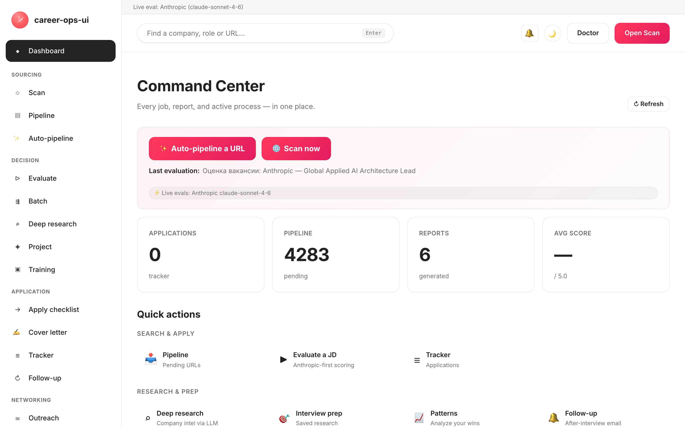

# career-ops-ui

> A clean, docs-style web interface for the [career-ops](https://github.com/Fighter90/career-ops) AI job-search pipeline.
> Search, evaluate, deep-dive, apply, and track every offer from a single browser tab — instead of bouncing between Claude Code, terminals, and markdown files.

**🇬🇧 English** | [🇪🇸 Español](README.es.md) | [🇧🇷 Português (Brasil)](README.pt-BR.md) | [🇰🇷 한국어](README.ko-KR.md) | [🇯🇵 日本語](README.ja.md) | [🇷🇺 Русский](README.ru.md) | [🇨🇳 简体中文](README.zh-CN.md) | [🇹🇼 繁體中文](README.zh-TW.md) | [🇫🇷 Français](README.fr.md) | [🇵🇱 Polski](README.pl.md) | [🇺🇦 Українська](README.uk.md) | [🇩🇰 Dansk](README.da.md) | [🇸🇦 العربية](README.ar.md) | [🇩🇪 Deutsch](README.de.md) | [🇮🇹 Italiano](README.it.md) | [🇹🇷 Türkçe](README.tr.md) | [🇮🇳 हिन्दी](README.hi.md)

_Unofficial UI — not affiliated with or endorsed by career-ops / santifer._

🌐 **Website: [cvstart.org](https://cvstart.org)** — multilingual landing + user guide (source in [`site/`](site/)).

[](#tests)
[](#tests)
[](#tests)
[](#requirements)
[](LICENSE)
[](https://github.com/Fighter90/career-ops-ui/releases/tag/v1.213.0)

<a href="https://www.producthunt.com/products/career-ops-ui?embed=true&amp;utm_source=badge-featured&amp;utm_medium=badge&amp;utm_campaign=badge-career-ops-ui" target="_blank" rel="noopener noreferrer"></a>

> **🆕 Latest release — v1.213.0** — **MyCareersFuture (Singapore) + scan-quality fixes** — Singapore's national job bank is now scannable; Greenhouse postings can be content-filtered; and remote Ashby roles no longer vanish behind a city-only location. **2724 tests.**
>
> 📜 Full release history: **[CHANGELOG.md](CHANGELOG.md)**.

<!-- DO NOT REVERT: this is the EN README; localized clones MUST switch to their own ./images/dashboard-<locale>.png (es / pt-BR / ko-KR / ja / ru / zh-CN / zh-TW). Generated by scripts/capture-dashboard-screenshots.mjs. -->
[](https://youtu.be/LcVPUg9IsDk?si=mrx3oOmOpSAwabOz)

**[▶ Watch the preview](https://youtu.be/LcVPUg9IsDk?si=mrx3oOmOpSAwabOz)**

## About career-ops

[career-ops](https://career-ops.org) is an open-source job-search system that runs as slash commands inside any AI coding CLI (Claude Code, Cursor, Codex, OpenCode, Antigravity CLI, Grok Build CLI, Qwen Code, Kimi, GitHub Copilot CLI, Gemini CLI (legacy) — other Claude-compatible CLIs work too via the same slash-command surface). Model-agnostic. It evaluates each posting against your CV with a 0.0–5.0 rubric of five dimensions plus a holistic global score, generates tailored PDF résumés, and tracks every application locally — no cloud accounts, no telemetry, no auto-submit.

**This repository (career-ops-ui)** is a polished web interface on top. The CLI keeps owning form-fill (via Playwright MCP) and slash-command modes; the SPA gives you a CRM-style browser surface over the same `cv.md` / `data/applications.md` / `reports/` files. Both share the same data.

**Action thresholds by score** (from [career-ops.org/docs](https://career-ops.org/docs)):

| Score | Next step |
|---|---|
| **≥ 4.5** | `/career-ops apply` — high fit, push immediately |
| **4.0 – 4.4** | apply, or `/career-ops contacto` for warm intro |
| **3.5 – 3.9** | `/career-ops deep` — research first |
| **< 3.5** | skip unless you have a specific reason |

**Canonical guides** at [career-ops.org/docs](https://career-ops.org/docs):

- [What is career-ops](https://career-ops.org/docs/introduction/what-is-career-ops)
- [Scan job portals](https://career-ops.org/docs/introduction/guides/scan-job-portals)
- [Apply for a job](https://career-ops.org/docs/introduction/guides/apply-for-a-job)
- [Batch-evaluate offers](https://career-ops.org/docs/introduction/guides/batch-evaluate-offers)
- [Set up Playwright](https://career-ops.org/docs/introduction/guides/set-up-playwright)
- [How career-ops scores job listings — the methodology](https://career-ops.org/methodology)
- [FAQ](https://career-ops.org/docs/faq) · [Glossary](https://career-ops.org/docs/reference/glossary)

**Mode reference** (the parent's slash-commands the web-ui surfaces as pages/buttons) — [career-ops.org/docs/reference/modes](https://career-ops.org/docs/reference/modes):

| Mode | web-ui | Mode | web-ui |
|---|---|---|---|
| [auto-pipeline](https://career-ops.org/docs/reference/modes/auto-pipeline) | `#/auto` | [pipeline](https://career-ops.org/docs/reference/modes/pipeline) | `#/pipeline` |
| [oferta](https://career-ops.org/docs/reference/modes/oferta) | `#/evaluate` | [ofertas](https://career-ops.org/docs/reference/modes/ofertas) | `#/evaluate` |
| [deep](https://career-ops.org/docs/reference/modes/deep) | `#/deep` | [contacto](https://career-ops.org/docs/reference/modes/contacto) | `#/contacto` |
| [interview-prep](https://career-ops.org/docs/reference/modes/interview-prep) | `#/interview-prep` | [pdf](https://career-ops.org/docs/reference/modes/pdf) | Generate PDF |
| [training](https://career-ops.org/docs/reference/modes/training) | `#/training` | [project](https://career-ops.org/docs/reference/modes/project) | `#/project` |
| [tracker](https://career-ops.org/docs/reference/modes/tracker) | `#/tracker` | [patterns](https://career-ops.org/docs/reference/modes/patterns) | `#/patterns` |
| [followup](https://career-ops.org/docs/reference/modes/followup) | `#/followup` | [apply](https://career-ops.org/docs/reference/modes/apply) | `#/apply` |
| cover | `#/cover` | — | — |

**Portal adapters** — [career-ops.org/docs/reference/portals](https://career-ops.org/docs/reference/portals): [Greenhouse](https://career-ops.org/docs/reference/portals/greenhouse) · [Ashby](https://career-ops.org/docs/reference/portals/ashby) · [Lever](https://career-ops.org/docs/reference/portals/lever) (plus Workable / SmartRecruiters / Workday + RU sources — see `#/scan`).

**AI assistants** career-ops runs inside (the web-ui is the standalone alternative): Claude Code, Cursor, Codex, OpenCode, Antigravity CLI, Grok Build CLI, Qwen Code, Kimi, GitHub Copilot CLI, Gemini CLI (legacy). The web-ui's ⚡ live features map these to API providers in **`#/config`**: Claude Code→Anthropic, Cursor→any/OpenRouter, Gemini CLI→Gemini, Codex→OpenAI, Qwen Code→Qwen, OpenCode→any/OpenRouter, GitHub Copilot CLI→GitHub Models, Antigravity CLI→Gemini, Kimi CLI→any/OpenRouter, Grok Build CLI→any/OpenRouter.

## The CareerOps Manifesto

career-ops is the first reference implementation of [the CareerOps Manifesto](https://career-ops.org/manifesto) — the practice of running a job search with evidence, discipline, and tools on the candidate's side of the table. Read it. If it says what you believe, sign it — your signature becomes a commit. The app links to it from the sidebar footer.

## Install an AI coding assistant (for the parent career-ops CLI)

career-ops runs as slash-commands **inside** an AI coding assistant — install **one** and log in before continuing (the parent's [Quick Start](https://career-ops.org/docs)):

| Assistant | Install | web-ui `#/config` provider |
|---|---|---|
| **Claude Code** | [docs.anthropic.com → Claude Code](https://docs.anthropic.com/en/docs/claude-code) | Anthropic (`ANTHROPIC_API_KEY`) |
| **Gemini CLI** | [github.com/google-gemini/gemini-cli](https://github.com/google-gemini/gemini-cli) | Gemini (`GEMINI_API_KEY`) |
| **Codex** | [github.com/openai/codex](https://github.com/openai/codex) | OpenAI (`OPENAI_API_KEY`) |
| **Qwen Code** | [github.com/QwenLM/qwen-code](https://github.com/QwenLM/qwen-code) | Qwen (`QWEN_API_KEY`) |
| **OpenCode** | [opencode.ai](https://opencode.ai) | any / OpenRouter (`OPENROUTER_API_KEY`) |
| **GitHub Copilot CLI** | [github.com/github/gh-copilot](https://github.com/github/gh-copilot) | GitHub Models (`GITHUB_MODELS_API_KEY`) |
| **Antigravity CLI** | [antigravity.google](https://antigravity.google) | Gemini (`GEMINI_API_KEY`) |

> **The web-ui is the standalone alternative** — it doesn't need any CLI installed. Its ⚡ Run-live features call the provider APIs directly; set **any one** key in `#/config` (or `career-ops-ui init`) and it works headless. If you prefer the CLI, run career-ops inside your chosen assistant and use the web-ui purely as the dashboard over the same files.

## Launch & initialize in one command

> **Important — career-ops-ui is a dashboard *on top of* [`Fighter90/career-ops`](https://github.com/Fighter90/career-ops).** It runs **inside** a career-ops project as `career-ops/web-ui/` and reads your `cv.md`, `config/`, `data/` from the parent folder via `../`. It does **not** work standalone — you need the parent `career-ops` repo too. Don't clone it on its own and run `init`; use one of the two options below.

### Option 1 — one curl (recommended: sets up everything)

```bash
curl -fsSL https://raw.githubusercontent.com/Fighter90/career-ops-ui/main/bin/setup.sh | bash
```

Clones **both** repos, arranges the `career-ops/web-ui/` layout, installs deps, runs the doctor, and starts the server at http://127.0.0.1:4317 — then opens the dashboard.

### Option 2 — add the UI to an existing career-ops project

If you already have career-ops configured and just want the dashboard, clone the UI **inside** it as `web-ui`:

```bash
cd career-ops                                                   # ← your existing career-ops project
git clone https://github.com/Fighter90/career-ops-ui.git web-ui
cd web-ui
npm install
npx career-ops-ui init        # interactive: pick LLM provider + paste its key → parent career-ops/.env
```

The nested `web-ui/` layout is exactly what lets the UI resolve your `../cv.md`, `../config/`, `../data/`. Run `npm link` **once** if you'd rather type the bare `career-ops-ui <verb>` instead of `npx career-ops-ui <verb>`.

### The CLI verbs

```bash
career-ops-ui setup    # bootstrap: install deps → doctor → run (SKIP_START=1 to stop before run)
career-ops-ui init     # pick LLM provider + paste its key (interactive)
career-ops-ui doctor   # verify Node / project / keys / Playwright (exit 0 ⇔ all required green)
career-ops-ui run      # launch the server at http://127.0.0.1:4317
career-ops-ui open     # open + RAISE the dashboard tab in your browser
career-ops-ui help     # list every verb
```

Prefix with `npx ` (e.g. `npx career-ops-ui run`) if you didn't `npm link`. After `setup`/`run` the tab opens **and is brought to the front** automatically; set `NO_OPEN=1` to disable auto-open (headless / CI).

### Pick your LLM provider

`init` is the provider wizard — choose **Claude / Claude Code** (`ANTHROPIC_API_KEY`), **Gemini / Gemini CLI** (`GEMINI_API_KEY`), **Codex / OpenCode CLI** (`OPENAI_API_KEY`), or **Auto** (Anthropic → Gemini fallback). Keys are typed with echo suppressed and written to the parent `career-ops/.env` via the same validated path as the `#/config` API-keys tab. Non-interactive form for CI:

```bash
career-ops-ui init --provider claude --anthropic-key sk-ant-… --yes
career-ops-ui init --provider gemini --gemini-key …          --yes
career-ops-ui init --provider auto   --openai-key sk-…       --yes
```

Or set it by hand: `echo "ANTHROPIC_API_KEY=sk-ant-…" >> career-ops/.env`. The provider sets `LLM_PROVIDER` (`auto` | `claude` | `gemini`); change it any time from **`#/config` → API keys** without restarting.

### Troubleshooting `init`

If `career-ops-ui init` fails or the command isn't found (common right after a `git pull`):

```bash
cd career-ops/web-ui
npm install
npx career-ops-ui init        # npx runs the local bin even without `npm link`
```

Make sure:

- You're running it from **inside `career-ops/web-ui/`** — not from a standalone `career-ops-ui/` clone.
- The **parent `career-ops/` folder exists** and contains `cv.md` and `config/`. If you cloned career-ops-ui on its own, move it (or re-clone) so it sits at `career-ops/web-ui/` — or just run Option 1's curl, which arranges the layout for you.
- `career-ops-ui doctor` (or `npx career-ops-ui doctor`) prints exactly what's missing.

---

## Why?

[career-ops](https://github.com/Fighter90/career-ops) is a powerful Claude-Code-driven job-search system: paste a JD → get a 0-5 fit score, an ATS-optimized PDF, and a tracker entry. It works great inside Claude Code, but the data lives across `cv.md`, `data/applications.md`, `reports/*.md`, `data/pipeline.md`, `portals.yml`, `config/profile.yml` — easy to lose, hard to skim.

`career-ops-ui` puts a polished UI on top:

- **Auto-pipeline** — paste one job URL on `#/auto`, click once: validate → fetch → evaluate → save report → add to tracker, with a live a11y stepper and artifact deep-links.
- **Browse** the tracker, reports, and pipeline like a CRM.
- **Trigger** scans (Greenhouse / Ashby / Lever / Workable / SmartRecruiters / Workday **and** hh.ru / Habr Career / Trudvsem / GetMatch / GeekJob) and watch live SSE logs.
- **Evaluate** a JD live via Anthropic (preferred) or Gemini, or get a copy-paste prompt for Claude Code if no API key is set.
- **Deep research** companies live via Anthropic SDK with cv / profile / mode files inlined automatically.
- **Edit** `cv.md` with side-by-side markdown preview and server-side XSS sanitization.
- **Maintain** the system: doctor, verify, normalize, dedup, merge — one click each.
- **Multi-CLI:** drives identically from Claude Code, Cursor, Codex, Cursor, Aider, or Gemini CLI — `CLAUDE.md` / `AGENTS.md` / `GEMINI.md` shims point to a single source of truth.

It's pure additions: nothing inside `career-ops/` changes. All your customizations stay yours.

---

## Quick start

### 1. Install career-ops first

```bash
git clone https://github.com/Fighter90/career-ops.git
cd career-ops
```

Follow [career-ops onboarding](https://github.com/Fighter90/career-ops#first-run--onboarding) so `cv.md`, `config/profile.yml`, and `portals.yml` exist.

### 2. Drop career-ops-ui inside it

```bash
git clone https://github.com/Fighter90/career-ops-ui.git web-ui
```

Your tree now looks like:

```
career-ops/
├─ cv.md
├─ portals.yml
├─ config/
├─ data/
├─ modes/
├─ reports/
├─ scan.mjs … doctor.mjs … (etc)
└─ web-ui/                 ← this repo
   ├─ bin/start.sh
   ├─ package.json
   ├─ server/
   ├─ public/
   └─ tests/
```

### 3. Launch

```bash
bash web-ui/bin/start.sh
```

The script:

1. Checks Node ≥ 18.
2. `npm install` (only on first run, three deps — Express + js-yaml + multer).
3. Starts the Express server on `127.0.0.1:4317`.
4. Opens http://127.0.0.1:4317/ in your default browser.

Custom port / host:

```bash
PORT=8080 bash web-ui/bin/start.sh
HOST=0.0.0.0 PORT=4317 bash web-ui/bin/start.sh   # expose on LAN
```

If you cloned the repo somewhere else (not as `career-ops/web-ui`), point at career-ops via env:

```bash
CAREER_OPS_ROOT=/path/to/career-ops bash bin/start.sh
```

---

## First run — clean state

`career-ops/data/pipeline.md` ships with two QA fixture URLs (`example.com/qa-fixture-*`) so the test suite can run hermetically. On a fresh clone you'll see Pipeline showing `2 pending` — those are not real jobs. Purge them before your first scan:

```bash
make clean-test-fixtures        # removes pipeline.md fixture rows + qa-fixture-* applications.md rows
npm start
```

Open http://127.0.0.1:4317. Pipeline counter should now read `0 pending`. The Makefile is idempotent — re-running it on a clean tree is a no-op.

---

## Requirements

| | |
| --- | --- |
| **Node.js** | ≥ 18 (uses native `fetch`, `node:test`) |
| **career-ops** | Cloned and onboarded — see above |
| **Optional** | `GEMINI_API_KEY` in `.env` of the parent project (free-tier model `gemini-2.0-flash`) for one-click JD evaluation. Otherwise the UI returns a copy-paste prompt for Claude. |
| **Optional** | Run from a Russian IP / VPN if hh.ru returns 403. Habr Career works from any IP regardless. |
| **Optional** | Playwright (already a transitive dep of career-ops) for the e2e test suite. |

---

## What you get — by page

| Page             | What it does                                                                                                       |
| ---------------- | ------------------------------------------------------------------------------------------------------------------ |
| **Dashboard**    | Aggregated counts (apps / pipeline / reports), avg score, status breakdown, latest 5 apps + latest report.         |
| **Scan**         | **🌐 Single Scan button** — runs every enabled source in one go (Greenhouse / Ashby / Lever / Workable / SmartRecruiters / Workday for EN, hh.ru + Habr Career + Trudvsem + GetMatch + GeekJob for RU). Live SSE log streaming + clickable results table with location / Remote-Hybrid badge / relocation flag / salary / source filters and dynamic stack / level / keyword chips. Active-Companies card lists every tracked board with its API health. |
| **Pipeline**     | CRUD on `data/pipeline.md`. Server-side preview proxy (SSRF-safe, per-hop redirect validation, 8 KB body cap). Jump straight from a URL to evaluate.       |
| **Evaluate**     | Paste JD → **Anthropic-first** (preferred when both keys present), then Gemini, then manual prompt fallback. Anthropic path inlines cv / profile / `_shared.md` / `oferta.md` automatically (REVIEW-A1). Save JD to `jds/` optional. |
| **Deep research**| Same fallback chain as Evaluate. Live Anthropic returns ~10-30 KB of grounded markdown saved to `interview-prep/<company>-<role>.md`. |
| **Modes**        | 7 generic mode pages (`/#/project`, `/#/training`, `/#/followup`, `/#/batch`, `/#/contacto`, `/#/interview-prep`, `/#/patterns`) with the same Anthropic / Gemini / manual fallback. |
| **Apply helper** | Generates a submission checklist; the actual Playwright form-fill stays in `/career-ops apply` inside Claude Code. |
| **Tracker**      | Filterable table over `data/applications.md` (status, score, free-text). One-click `normalize-statuses.mjs` / `dedup-tracker.mjs` / `merge-tracker.mjs`. Pipe + newline escapes are GFM-compliant — names like `"Acme \| Co"` round-trip losslessly. |
| **Reports**      | Browse and read every report under `reports/` with parsed header (Score / Legitimacy / URL).                       |
| **CV**           | Live markdown editor for `cv.md` with side-by-side preview + one-click `cv-sync-check.mjs` + 📁 Upload CV. Server-side XSS strip on save (`<script>`, `javascript:`, `on*=` handlers). |
| **Profile**      | Read-only view of `config/profile.yml` + archetypes — UI-friendly summary.                                         |
| **Statistics**   | Multi-tab `#/stats`: AI salary/market report, own-pipeline analytics, target-role trends, rejection patterns, lifetime roll-up + salary-gap, **funnel & velocity**, **"what to learn next" (upskill)**, and **rejection-latency**. Markdown / PDF / DOCX export. |
| **CV Studio**    | `#/cv-studio` — humanize (voice-match), tailor CV + cover letter through a recruiter-checklist gate, add-entry from a URL/text, a **skill-gap** panel, a deterministic résumé score, in-browser PII masking, and a **fact-verification** truthfulness gate on generated output. |
| **Two-pager**    | `#/two-pager` — a candidate two-pager (`config/two-pager.yml`) inlined into eval prompts; AI draft + a `◎` fit badge on scan. |
| **Mock interview** | `#/mock-interview` — turn-by-turn practice with save / sessions; a zero-LLM weekly digest at `#/interview-digest`. |
| **Networking**   | `#/networking` — AI networking-plan writer (saves to `networking/`).                                                |
| **About-me**     | `#/memory` — an about-me note (`config/memory.md`) inlined into every AI request for grounding.                     |
| **Career plan**  | `#/career-plan` — an AI development plan (`config/career-plan.md`) by horizon + focus.                              |
| **Orientation**  | `#/orientation` — an AI career-orientation profile (archetype vectors, roles, strengths, working style).            |
| **Usage**        | `#/usage` — per-provider token + estimated-USD rollup over 24h / 7d / 30d / all; a live sidebar cost HUD.           |
| **Portals**      | `#/portals` — enable / disable tracked boards + SSRF-safe health probes of each `careers_url`.                      |
| **Funded**       | `#/funded` — funded-company discovery from public RSS (logos, funding-amount chart, score / action cards).          |
| **Ask the docs** | `#/docs-assistant` + a floating chat launcher — how-to answers grounded ONLY in the in-app help guide.              |
| **App settings** | In-UI editor for parent `.env` keys: `ANTHROPIC_API_KEY`, `GEMINI_API_KEY`, model overrides, port / host. Secrets masked on read. |
| **Health**       | All setup checks in OK / OPTIONAL / FAIL badges + buttons to run `doctor.mjs` and `verify-pipeline.mjs`.           |
| **Help**         | In-app Markdown user guide (`/#/help`), localized for all 17 supported languages (en / es / fr / pt-BR / ko-KR / ja / ru / zh-CN / zh-TW / pl / uk / da / ar / de / it / tr / hi). |
| **Activity log** | Audit trail of every state-changing request (writes, runs, scans). Secrets redacted. |
| **Notifications** 🔔 *(v1.58.34 / v1.58.35)* | Top-bar bell with red unread badge. Click to slide-in a drawer listing the last 50 toasts (per tab, per session) — Success / Error / Info-progress, each with a localized timestamp, the human message, and any `(METHOD /path · HTTP NNN)` postfix tucked into a `<details>`. Help **§18** documents every category. Drawer opens **only** on bell click (or keyboard Enter / Space); closes via ×, Esc, or re-clicking the bell. |

Global keyboard shortcuts:

- `Ctrl+K` / `Cmd+K` — focus the global search. The footer hint adapts per platform (⌘K on macOS/iOS, Ctrl+K elsewhere) with the localized verb (v1.58.20).
- Pasting a URL into global search auto-adds it to the pipeline.
- `Esc` — close any open modal **or** the notifications drawer (v1.58.34).

---

## Scan

Zero-token portal scanning that actually returns vacancies. **One 🌐 Scan button** in the UI runs every configured source in a single sweep:

- **Greenhouse / Ashby / Lever / Workable / SmartRecruiters / Workday** — public boards-api for every company in `portals.yml::tracked_companies` with a recognizable ATS pattern. Bundled list covers Stripe, GitLab, Vercel, Cloudflare, Datadog, Discord, Elastic, Grafana Labs, CockroachDB, Fastly, Twilio, Coinbase, Reddit, Robinhood, Affirm, Lyft, Linear, Supabase, PostHog, Ramp, Modal Labs, Railway, Browserbase, JetBrains — extend or trim freely.
- **RSS boards** — any job board that exposes an RSS/Atom feed (LaraJobs, WeWorkRemotely, RemoteOK, golangprojects, …). Add `provider: rss` + the feed URL to `portals.yml` — no code changes required.
- **Aggregator boards (v1.75.0)** — seven board-wide / config-driven sources beyond per-company ATSes: **RemoteOK / Remotive / Working Nomads** (board-wide remote feeds, select with `provider: remoteok|remotive|workingnomads`) and **IBM / Arbeitsagentur / Glints / Jobstreet · SEEK** (config-driven, each reads a per-entry `<provider>:` block). See `docs/portals-examples.md` for copy-paste `tracked_companies` entries. They run the same `title_filter` / `location_filter` / `content_filter` + dedup + pipeline-append flow as every other source.
- **hh.ru** — HTML scrape of `hh.ru/search/vacancy`. Works from any IP, no key, no proxy. (The JSON API `api.hh.ru` is not used — it now 403s every programmatic client regardless of IP/User-Agent; the website serves full results to any browser-like client, so we scrape that, the same way Habr Career is scraped.)
- **Habr Career** — HTML scrape of `career.habr.com/vacancies`. Works from any IP, no auth.

### RSS adapter

Point the scanner at any RSS-based job board by adding an entry with `provider: rss` and an `rss:` (or `feed_url:`) key to `portals.yml`:

```yaml
tracked_companies:
  - name: LaraJobs
    provider: rss
    rss: https://larajobs.com/feed
    enabled: true
  - name: WeWorkRemotely
    provider: rss
    rss: https://weworkremotely.com/remote-jobs.rss
    enabled: true
```

The adapter parses `<item>` blocks using a tiny regex-based parser (no XML library needed). It extracts `title`, `link` (→ `url`), `pubDate` (→ `date`), and `description` (→ `snippet`, HTML stripped). Remote status is inferred from `/remote|anywhere/i` in the title or description; company name is pulled from `dc:creator`, a "Company — Role" title pattern, or the feed hostname as a fallback. The same normalize → filter → dedup → pipeline-append flow applies as for ATS adapters.

All sources go through the same pipeline: normalize → filter (`title_filter.positive` / `title_filter.negative`) → dedup against `data/scan-history.tsv` + `data/pipeline.md` + `data/applications.md` → append to `data/pipeline.md` → save full result set to `data/last-scan.json` for the UI's filterable table.

Configure via `portals.yml`:

```yaml
title_filter:
  positive: [backend, engineer, senior, tech lead, golang, php]
  negative: [junior, intern, frontend, ios, android]
tracked_companies:
  - { name: Stripe, enabled: true, careers_url: https://job-boards.greenhouse.io/stripe }
  - { name: Linear, enabled: true, careers_url: https://jobs.ashbyhq.com/linear }
  # ...
russian_portals:
  sources: ["hh", "habr"]   # one or both
  area: 113                  # 1=Moscow, 2=SPb, 113=Russia, 1001=remote
  per_page: 50
  only_remote: false
  queries: ["Senior PHP", "Senior Go", "Tech Lead"]
```

All sources flow through a single SSE endpoint: `/api/stream/scan?source=ats|regional|both`. The **🌐 Scan** UI button calls `source=both` so every adapter (Greenhouse / Ashby / Lever / Workable / SmartRecruiters / Workday + hh.ru + Habr Career + Trudvsem + GetMatch + GeekJob) runs in one connection. Honors `AbortSignal` on client disconnect — no orphan fetches.

---

## Architecture

```
career-ops-ui/
├─ CLAUDE.md                 # project-level agent instructions (canonical)
├─ AGENTS.md                 # Codex / Aider / generic CLI shim → CLAUDE.md
├─ GEMINI.md                 # Gemini CLI shim → CLAUDE.md
├─ .aiignore                 # exclusion list for AI tools
├─ .claude/                  # Claude Code agent config
│  ├─ agents/                # 3 project-specific subagents (route, view, test isolation)
│  └─ commands/               # slash-command stubs
├─ bin/start.sh              # one-shot launcher (Node check → npm install → server → open browser)
├─ package.json              # 3 runtime deps: express, js-yaml, multer
├─ server/
│  ├─ index.mjs              # ~130 LOC orchestrator: middleware + 32 register<Topic>Routes(app) calls + SPA catch-all
│  └─ lib/
│     ├─ paths.mjs           # absolute paths to career-ops files (CAREER_OPS_ROOT aware)
│     ├─ parsers.mjs         # markdown / pipeline / report parsers (GFM-compliant pipe escapes)
│     ├─ runner.mjs          # runNodeScript() + streamNodeScript() with SIGTERM→SIGKILL escalation + 30 min cap
│     ├─ security.mjs        # isValidJobUrl, stripDangerousMarkdown, sanitizeJobDescription, isPubliclyExposed
│     ├─ prompts.mjs         # bundleProjectContext, buildEvaluationPrompt, buildDeepPrompt, buildModePrompt
│     ├─ store.mjs           # safeReadApps/Pipeline/Reports, checkProfileCustomized, ensureRussianPortalsDefaults
│     ├─ anthropic.mjs       # minimal Anthropic SDK adapter (runAnthropic, hasAnthropicKey, hasGeminiKey)
│     ├─ env-config.mjs      # .env round-trip with secret masking + validation
│     ├─ activity-log.mjs    # JSONL audit trail middleware (secrets redacted)
│     ├─ dotenv.mjs          # tiny dotenv loader
│     ├─ en-scanner.mjs      # in-process Greenhouse/Ashby/Lever orchestrator (AbortSignal aware)
│     ├─ ru-scanner.mjs      # in-process hh.ru + Habr orchestrator (AbortSignal aware)
│     ├─ sources/
│     │  ├─ greenhouse.mjs   # boards-api.greenhouse.io client
│     │  ├─ ashby.mjs        # api.ashbyhq.com client
│     │  ├─ lever.mjs        # api.lever.co client
│     │  ├─ hh.mjs           # hh.ru/search/vacancy HTML scraper (paginated, UA-aware)
│     │  └─ habr.mjs         # career.habr.com HTML parser (no cheerio, regex only)
│     └─ routes/             # 32 route modules — one per topic (P-2)
│        ├─ activity.mjs     # /api/activity
│        ├─ config.mjs       # /api/config (parent .env round-trip)
│        ├─ content.mjs      # /api/cv, /api/profile, /api/portals, /api/modes
│        ├─ health.mjs       # /api/health, /api/dashboard
│        ├─ help.mjs         # /api/help/:lang
│        ├─ jds.mjs          # /api/jds CRUD
│        ├─ llm.mjs          # /api/evaluate, /api/deep, /api/mode/:slug, /api/apply-helper, /api/interview-prep*
│        ├─ pipeline.mjs     # /api/pipeline + SSRF-safe preview proxy
│        ├─ reports.mjs      # /api/reports
│        ├─ runners.mjs      # /api/run/* + /api/stream/{scan,liveness,pdf} + /api/output/pdfs
│        ├─ scan.mjs         # /api/stream/scan-{ru,en} + /api/scan-results
│        └─ tracker.mjs      # /api/tracker
├─ public/                   # static SPA — no build step
│  ├─ index.html
│  ├─ css/app.css            # design tokens (docs-style palette)
│  └─ js/
│     ├─ api.js              # fetch wrapper + connection-banner state + UI helpers + safe markdown renderer
│     ├─ router.js           # hash-based router with 404 fallback + alias support
│     ├─ app.js              # boot + global keyboard handlers + mobile sidebar drawer
│     ├─ lib/{i18n,skills}.js
│     └─ views/              # one file per page (dashboard, scan, pipeline, evaluate, deep, apply, tracker, reports, cv, settings, health, config, help, activity, mode-page)
├─ docs/                     # public reference: architecture, API, data-flows, SDD, conventions, reviews
│  ├─ PROJECT.md             # what / why / for-whom
│  ├─ ROADMAP.md             # current milestone + completed history
│  ├─ PRODUCTION-READINESS.md # honest deployment-gate assessment
│  ├─ sdd/{SDD-GUIDE,CONVENTIONS}.md
│  ├─ architecture/{OVERVIEW,SERVER,FRONTEND,API,DATA-FLOWS}.md
│  └─ reviews/REVIEW-*.md
└─ tests/                    # 2527 unit + 90 Playwright + 23/23 e2e:full + 20 e2e:smoke (baseline @ v1.197.0)
   ├─ parsers.test.mjs       # markdown / pipeline / report parsers (pure functions)
   ├─ api.test.mjs           # every endpoint, ephemeral server, no network
   ├─ {ru,en}-scanner.test.mjs   # mocked fetch
   ├─ pipeline-preview.test.mjs   # per-hop redirect validation (REVIEW-B1)
   ├─ anthropic.test.mjs     # SDK adapter + log-guard test (REVIEW-B4)
   ├─ url-validation.test.mjs    # SSRF reject sweep (FIX-M3 + M6 + M7)
   ├─ cv-xss.test.mjs        # stripDangerousMarkdown round-trip
   ├─ jd-sanitize.test.mjs   # sanitizeJobDescription
   ├─ help.test.mjs / help-ui.test.mjs    # i18n parity across all 17 locales
   ├─ playwright-smoke.mjs   # 12 browser flows (CV save, tracker, pipeline, evaluate, config, etc.)
   └─ e2e{,-comprehensive}.mjs   # full Playwright walkthrough
```

### Why no build step?

Vanilla HTML/CSS/JS keeps the surface area tiny: one `npm install` of two deps and you're running. No Webpack, no Vite, no `node_modules` of doom. The whole UI is < 30 KB minified. If you want hot-reload during development, `npm run dev` uses Node's built-in `--watch`.

### Spec-Driven Development

Non-trivial changes go through the GSD pipeline (`gsd-*` skills from `superpowers@claude-plugins-official`):

```
discuss → spec → plan → execute → verify → review
```

Public reference: [`docs/sdd/SDD-GUIDE.md`](docs/sdd/SDD-GUIDE.md). All planning artifacts live under `.planning/` (gitignored). The `docs/` tree is the long-lived public contract.

---

## API reference

All endpoints under `/api/*`. JSON in / JSON out unless noted.

### Health & dashboard

| Method | Path                     | Response                                                                    |
| ------ | ------------------------ | --------------------------------------------------------------------------- |
| GET    | `/api/health`            | `{ ok, warnings, version, parentVersion, checks: [{name, ok, required, value?}] }` |
| GET    | `/api/dashboard`         | `{ counts, avgScore, byStatus, recent, pipeline, lastReport }`              |
| GET    | `/api/status/providers`  | `{ activeProvider, activeModel, keysConfigured }` — LLM readiness for the onboarding banner + ⚡ cost hint (v1.55.3); includes `openrouter` (v1.57.0) |
| GET    | `/api/openrouter/models` | `{ models:[{id,name,context_length}], fallback, cached }` — OpenRouter catalogue proxy for the `#/config` model dropdown (v1.57.0) |
| GET    | `/api/activity?limit&type` | tail of `data/activity.jsonl` audit trail                                 |
| GET    | `/api/help/:lang`        | localized in-app user guide (fallback: `en.md`)                             |

### App settings (parent .env round-trip)

| Method | Path             | Purpose                                                                |
| ------ | ---------------- | ---------------------------------------------------------------------- |
| GET    | `/api/config`    | known env keys with secrets masked                                     |
| POST   | `/api/config`    | validate + write parent `.env`; applies to `process.env` in-place      |

### Data files

| Method | Path                                | Purpose                                                                |
| ------ | ----------------------------------- | ---------------------------------------------------------------------- |
| GET    | `/api/tracker`                      | `{ rows: [parsed applications.md] }`                                   |
| POST   | `/api/tracker`                      | body `{ company, role, score?, status?, url?, notes?, date? }` — dedup-aware (case-insensitive on company + role) |
| GET    | `/api/pipeline`                     | `{ urls: [...] }`                                                      |
| POST   | `/api/pipeline`                     | body `{ url }` → adds to `data/pipeline.md` with dedup + `isValidJobUrl` |
| GET    | `/api/pipeline/preview?url=…`       | server-side fetch proxy (per-hop SSRF check, ≤3 redirects, 8 KB cap) |
| DELETE | `/api/pipeline?url=…`               | removes a URL                                                          |
| GET    | `/api/reports`                      | parsed list of `reports/*.md`                                          |
| GET    | `/api/reports/:slug`                | full markdown + parsed header                                          |
| GET    | `/api/jds`                          | list of saved JD files                                                 |
| GET    | `/api/jds/:name`                    | text/plain — raw JD                                                    |
| POST   | `/api/jds`                          | body `{ text, slug? }` → saves to `jds/`                               |
| DELETE | `/api/jds/:name`                    | unlink (`.txt` suffix required)                                        |
| GET    | `/api/cv`                           | `{ markdown }`                                                         |
| PUT    | `/api/cv`                           | body `{ markdown }` → writes `cv.md` (XSS-stripped, ≤1 MB)             |
| GET    | `/api/profile`                      | `{ profile: yaml-parsed, raw: text }`                                  |
| GET    | `/api/portals`                      | `{ portals: yaml-parsed, raw: text }`                                  |
| GET    | `/api/modes`                        | list of mode files                                                     |
| GET    | `/api/modes/:name`                  | text/plain — raw mode prompt                                           |
| GET    | `/api/output/pdfs`                  | list of generated PDFs                                                 |
| GET    | `/api/output/pdfs/:name`            | download (`Content-Disposition: attachment`)                          |
| GET    | `/api/interview-prep`               | list of saved deep-research files                                      |
| GET    | `/api/interview-prep/:name`         | `{ name, markdown }`                                                   |
| DELETE | `/api/interview-prep/:name`         | unlink (`.md` suffix required)                                         |

### Script runners (buffered, one-shot)

| Method | Path                    | Wraps                       |
| ------ | ----------------------- | --------------------------- |
| POST   | `/api/run/doctor`       | `node doctor.mjs`           |
| POST   | `/api/run/verify`       | `node verify-pipeline.mjs`  |
| POST   | `/api/run/normalize`    | `node normalize-statuses.mjs` |
| POST   | `/api/run/dedup`        | `node dedup-tracker.mjs`    |
| POST   | `/api/run/merge`        | `node merge-tracker.mjs`    |
| POST   | `/api/run/sync-check`   | `node cv-sync-check.mjs`    |

All buffered runs cap at 60 s; SIGTERM → SIGKILL escalation after a 5 s grace period.

### Streams (SSE)

| Method | Path                          | Streams                            |
| ------ | ----------------------------- | ---------------------------------- |
| GET    | `/api/stream/scan`            | legacy `node scan.mjs` (subprocess)|
| GET    | `/api/stream/scan?source=ats\|regional\|both` | consolidated in-process scanner SSE — query: `dryRun=1`, `company=…` (ATS only). |
| GET    | `/api/stream/liveness`        | `node check-liveness.mjs`          |
| GET    | `/api/stream/pdf`             | `node generate-pdf.mjs`            |

SSE event types:

```
event: start    data: { script, args?, writeFiles? }
event: log      data: { stream: "stdout"|"stderr", line: string }
event: done     data: { code, counts?, errors? }
event: error    data: { message }
```

### LLM endpoints (Anthropic-first → Gemini → manual fallback)

| Method | Path                                | Purpose                                                                          |
| ------ | ----------------------------------- | -------------------------------------------------------------------------------- |
| POST   | `/api/evaluate`                     | body `{ jd, save? }` → JD evaluation (A–G sections per `oferta.md`)              |
| POST   | `/api/evaluate/test-gemini`         | smoke check `GEMINI_API_KEY`                                                     |
| POST   | `/api/evaluate/test-anthropic`      | smoke check `ANTHROPIC_API_KEY`                                                  |
| POST   | `/api/deep`                         | body `{ company, role?, run? }` → deep-research prompt or live grounded markdown |
| POST   | `/api/mode/:slug`                   | generic mode runner; allowlist: `batch`, `contacto`, `followup`, `interview-prep`, `patterns`, `project`, `training` |
| POST   | `/api/apply-helper`                 | body `{ url, jd? }` → application checklist                                      |
| GET    | `/api/scan-results`                 | `{ en: {when, fresh[], filtered[], errors[]}, ru: { ... } }` — last scan         |
| GET    | `/api/scan/regional/config`         | effective regional-scanner config (queries, negatives, sources). |

When `run: true` is set on `/api/deep` or `/api/mode/:slug`, the server prefers Anthropic (when both keys present), inlines `cv.md` + `config/profile.yml` + `modes/_shared.md` + the relevant mode template into a `<project_context>` block, and returns the model's grounded markdown directly. Soft cap: 200 KB on the assembled prompt — overflow returns 413.

---

## Tests

```bash
npm test                       # 2527 unit/integration tests
npm run test:e2e               # 20 smoke e2e (boots own server)
npm run test:e2e:full          # 23 comprehensive e2e
npm run test:e2e:browser       # 90 Playwright browser (smoke + full-cycle + forms + locale-sweep ×17 + theme)
npm run test:coverage          # same as `npm test` plus V8 coverage
```

| Suite                       | Tests | What                                                                                                       |
| --------------------------- | ----- | ---------------------------------------------------------------------------------------------------------- |
| `node --test tests/*.test.mjs` (unit + integration) | **2527** | Every endpoint, ephemeral server, no network. 218 files: parsers, scanners (mocked), runners, anthropic/openai, security headers, XSS, JD sanitize, URL validation, i18n parity, + the v1.55→v1.56 UX-fix suites. |
| `tests/e2e.mjs` (smoke)      | 20    | Playwright headless: every route renders, basic flows.                                                     |
| `tests/e2e-comprehensive.mjs` | 23    | Full Playwright walkthrough: 11 routes + 12 functional flows.                                              |
| `npm run test:e2e:browser` (`playwright-smoke` + `playwright-full-cycle` + `playwright-forms` + `playwright-locale-sweep`) | **90** | Browser-driven: dashboard render, navigation, language switch, 404, health, tracker round-trip, pipeline add + invalid-URL sweep, reports, evaluate manual fallback, config keys masked, CV PUT XSS strip, pipeline preview 400, auto-pipeline SSE. |
| **Total**                   | **2527** | **0 fails, 0 flakes**                                                                                    |

Coverage: ~93% line / ~83% branch via `--experimental-test-coverage`.

Parsers are pure functions (no I/O) — tested against real data fragments from `applications.md`, `pipeline.md`, and `reports/*.md`. API tests boot the Express app on an ephemeral port and exercise every endpoint end-to-end. Scanner tests mock `fetch` so they pass even if hh.ru blocks your IP. The Playwright browser smoke runs against the in-process server and resolves Playwright via the parent project's `node_modules` — no new dependency in `web-ui/`.

CI runs the unit + e2e + Playwright matrix on every push to `main` against Node 18 / 20 / 22.

---

## Configuration

Environment variables (read at server start, all optional except where noted):

| Var                  | Default            | Purpose                                                                            |
| -------------------- | ------------------ | ---------------------------------------------------------------------------------- |
| `PORT`               | `4317`             | Express bind port                                                                  |
| `HOST`               | `127.0.0.1`        | Express bind host. CSP attaches when non-loopback; auth gate planned for v2.0.0.   |
| `CAREER_OPS_ROOT`    | `..` from script   | Where to find `cv.md`, `data/`, `portals.yml`, `modes/`, etc.                      |
| `ANTHROPIC_API_KEY`  | unset              | Enables `/api/evaluate`, `/api/deep`, `/api/mode/:slug` live mode (preferred when both keys set). |
| `ANTHROPIC_MODEL`    | `claude-sonnet-4-6` | Override Anthropic model.                                                         |
| `GEMINI_API_KEY`     | unset              | Forwarded to `gemini-eval.mjs` and used as fallback for `/api/evaluate`.           |
| `GEMINI_MODEL`       | `gemini-2.0-flash` | Override Gemini model.                                                             |
| `OPENAI_API_KEY`     | unset              | Headless live-eval (3rd in the `auto` order) + parent Codex/OpenAI CLI flow.       |
| `OPENAI_MODEL`       | `gpt-5-codex`      | Override OpenAI model.                                                             |
| `QWEN_API_KEY`       | unset              | Headless live-eval via DashScope OpenAI-compatible (4th in the `auto` order).      |
| `QWEN_MODEL`         | `qwen-max`         | Override Qwen model.                                                               |
| `OPENROUTER_API_KEY` | unset              | Headless live-eval via OpenRouter — one key, 300+ models (5th / last in `auto`).   |
| `OPENROUTER_MODEL`   | `openrouter/auto`  | `vendor/model` id. Catalogue loaded live from `GET /api/openrouter/models`.        |

`portals.yml` extension recognized by this UI (add to your existing file in the parent project):

```yaml
russian_portals:
  sources: ["hh", "habr"]
  area: 113          # hh.ru area id
  per_page: 50
  only_remote: false
  queries: ["Senior PHP", "Тимлид Go", ...]
```

You can also extend any company entry with an explicit `api:` URL. See [`docs/portals-examples.md`](docs/portals-examples.md) (in this repo) for ready-to-paste blocks for 24 verified companies.

---

## Security notes

- Server binds to `127.0.0.1` by default — never exposed to the internet without explicit `HOST=0.0.0.0`.
- **Path sanitization (v1.21.0)**: every `:name` / `:slug` route param goes through `sanitizePathName()` in `server/lib/security.mjs` — strips non-`[\w-.]`, drops leading dot-runs, collapses internal dot-runs, caps at 200 chars, empty → 400. Replaces 10 duplicated regex copies that previously kept `..pdf` / `....md` through.
- **DNS-rebind defense (v1.21.0)**: `/api/pipeline/preview` and `/api/auto-pipeline` route through `server/lib/safe-fetch.mjs::safeGet` — one DNS lookup, pinned TCP connection, SNI/Host targeted at the original hostname. No second lookup, no TOCTOU window.
- **Concurrent-write mutex (v1.21.0)**: `tracker.mjs`, `pipeline.mjs` (POST + DELETE), and `auto-pipeline.mjs`'s tracker step wrap read-modify-write in `withFileLock(path, fn)` from `server/lib/file-lock.mjs`. Concurrent POSTs no longer drop rows.
- **LLM rate-limit (v1.21.0)**: `/api/evaluate`, `/api/deep`, `/api/mode/:slug`, `/api/auto-pipeline` wear `llmRateLimit` from `server/lib/rate-limit.mjs`. **No-op on loopback**; 10 req/min/IP on `HOST=0.0.0.0`. Configurable via `LLM_RATE_LIMIT="N/Ws"`. 429 + `Retry-After`.
- **CV XSS strip (v1.22.0 hardening)**: `stripDangerousMarkdown` is now entity-aware — decodes `&lt;`, `&gt;`, `&#NN;`, `&#xHH;` before regex strip so `&lt;script&gt;` and `java&#115;cript:` payloads can't bypass.
- Subprocess invocations use `spawn` with arg arrays — **no shell interpolation, ever**. `bash` runner uses `--noprofile --norc` to ignore `~/.bashrc`.
- Streaming endpoints kill the child process on client disconnect (no orphaned scanners).
- Write endpoints touch only known career-ops paths: `data/`, `jds/`, `cv.md`, `config/`, `portals.yml`, `output/`, `reports/`, `interview-prep/`, `modes/_profile.md`. Never anywhere else.
- The connection banner pings `/api/health` with exponential backoff (3 s → 6 s → 12 s → 24 s → 60 s) while disconnected and auto-clears on recovery (v1.22.0 M-6).

---

## Limitations

The fully LLM-driven modes (`oferta`, `deep`, `contacto`, `apply`, `batch`, `patterns`, `followup`) need an LLM to actually run. The web UI resolves a provider from the `auto` order **Anthropic → Gemini → OpenAI → Qwen → OpenRouter → GitHub Models → Hermes** (or whatever `LLM_PROVIDER` pins):

1. **Anthropic (preferred)** — set `ANTHROPIC_API_KEY` in the parent project's `.env`. Routes through `runAnthropic` with `cv.md` / `config/profile.yml` / `modes/_shared.md` / mode template inlined automatically (REVIEW-A1). Verified live in v1.8.0+ with `claude-sonnet-4-6` returning 26 KB of grounded markdown for a deep-research call.
2. **`gemini-eval.mjs`** as fallback — works out of the box when only `GEMINI_API_KEY` is set.
3. **OpenAI / Qwen / OpenRouter** — zero-dep OpenAI-compatible clients (the `_tailProvider()` path). **OpenRouter** (v1.57.0) is the most flexible: one `OPENROUTER_API_KEY` fronts 300+ models from every major lab, and the `#/config` model dropdown is populated live from `GET /api/openrouter/models` (server-side proxy, CSP-safe, curated offline fallback).
4. **Copy-paste prompt** — when no key is set, the UI generates a ready prompt formatted for Claude Code / ChatGPT / Gemini Web.

The existing `/career-ops apply` Playwright form-fill flow inside Claude Code remains the only way to truly auto-fill application forms — the UI's *Apply helper* generates a checklist instead.

For the production-readiness assessment (deployment gates, risk register, deferred work), see [`docs/PRODUCTION-READINESS.md`](docs/PRODUCTION-READINESS.md). TL;DR: ready for single-tenant loopback; LAN exposure waits on the v2.0 P-12 auth gate.

---

## Run the whole stack in the cloud

career-ops is best **always-on** — scanning while you sleep, reachable from any browser. To put the whole stack on a small server — the parent **career-ops** pipeline, this **career-ops-ui** viewer, and the **engine** that runs the AI (your **Claude subscription** via the Claude Code CLI, a local **Hermes** gateway, or provider API keys) — provision a VPS (Node ≥ 18), install the parent + this repo, pick your engine, and expose the viewer behind an **HTTPS reverse proxy with authentication** while the security invariants (CSP, SSRF guard, XSS boundary, no-secrets-in-logs) stay intact.

📖 In-app **Help §31** ("Running the whole stack in the cloud") walks it step by step in all 17 languages; the operator checklist is [`docs/integrations/HERMES.md`](docs/integrations/HERMES.md), and the [Cloud-Deployment wiki page](https://github.com/Fighter90/career-ops-ui/wiki/Cloud-Deployment) has the reference tables.

---

## Hermes agent + Telegram

**Nous Research's [Hermes](https://hermes-agent.nousresearch.com/docs)** is an open autonomous agent (tool-calling, skills, 20+ messaging channels). You can run career-ops-ui on a **cloud server** and bridge its events — a finished scan, a new report, an urgent follow-up — to **Telegram through a Hermes agent**, so the pipeline reaches you where you already are.

> **Now wired (v1.151.0).** Hermes as an *LLM provider* is live: run its OpenAI-compatible API Server (`hermes gateway`) and set `HERMES_API_KEY` in **App settings** — career-ops-ui then runs live evaluations through your local Hermes (last in the auto provider order). The **cloud-server deployment** and **Telegram bridge** below remain operator how-to; a **`hermes-bridge` skill** walks those steps (secrets never touch disk or logs; the SSRF / CSP / no-secrets invariants survive the move off `127.0.0.1`).

📖 **Full guide:** [`docs/integrations/HERMES.md`](docs/integrations/HERMES.md) — the two integration shapes, cloud-server deployment (reverse proxy + HTTPS + systemd), Telegram-via-Hermes, and the threat-model "what NOT to expose" list.

---

## Localization

The UI ships **17 locales** — `en`, `es`, `pt-BR`, `ko`, `ja`, `ru`, `zh-CN`, `zh-TW`, `fr`, `pl`, `uk`, `da`, `ar`, `de`, `it`, `tr`, `hi`. Since **v1.60.0 (I18N-SPLIT)** translations live **one file per locale** under [`public/js/lib/locales/`](public/js/lib/locales/) — `i18n-dict.<lang>.js`, each a flat `key → string` table — plus a shared `i18n-dict.aliases.js`. [`i18n-dict.js`](public/js/lib/i18n-dict.js) assembles them into `window.__I18N_DICT`; [`i18n.js`](public/js/lib/i18n.js) resolves `t('key', 'fallback')`. No build step, no runtime fetch — a translator edits a single language file in isolation.

**Add or change a string:**

```js
// public/js/lib/locales/i18n-dict.en.js   →   'scan.newButton': 'Run scan',
// public/js/lib/locales/i18n-dict.es.js   →   'scan.newButton': 'Ejecutar búsqueda',
// …add the same key to all 17 locale files (parity is gated)
```

Then use it via `data-i18n="scan.newButton"` in markup or `t('scan.newButton')` in JS, and run `npm test`. To add a brand-new language, register it in `i18n.js` (`LANGS` + `detect()`), the assembler, `index.html`, and the locale-enumerating tooling.

📖 **Full guide:** [`docs/LOCALIZATION.md`](docs/LOCALIZATION.md) — the per-locale layout, the `@alias` mechanism, adding a new locale step-by-step, and every i18n CI gate.

---

## Contributing

Issues and PRs welcome. House rules:

- Run `npm test` before pushing — **2527 checks green** is the bar (plus 90 Playwright if you touch UI).
- Non-trivial changes go through the GSD pipeline. See [`docs/sdd/SDD-GUIDE.md`](docs/sdd/SDD-GUIDE.md).
- Don't modify anything in the parent `career-ops/` project from inside this repo. The whole point is that this is a non-invasive overlay. Hard rules in [`CLAUDE.md`](CLAUDE.md).
- Conventional commits: `feat`, `fix`, `refactor`, `docs`, `test`, `chore`, `perf`, `ci`. Optional scope: `feat(scan):`. Breaking change: `feat!:`.
- Tests must be CI-isolated — bootstrap fixtures via `mkdtempSync` or `CAREER_OPS_ROOT=$(mktemp -d)`.

Driving the repo from a non-Claude CLI (Codex, Aider, Cursor, Gemini)? Read [`AGENTS.md`](AGENTS.md) or [`GEMINI.md`](GEMINI.md) — both shim to the canonical `CLAUDE.md`.

---

---

## 🌍 Getting Started — first steps after install

After the one-command install you have two empty git clones, scaffolded with
starter `cv.md`, `config/profile.yml`, `portals.yml`, `data/applications.md`,
and `data/pipeline.md` files containing **EDIT ME** markers. The Health page
should already be all-green on first launch. Replace the placeholders with
your real data:

### 1. Create your CV (`cv.md`)

You have three options:

- **Option A — paste an existing resume:** open `career-ops/cv.md`, replace
  the EDIT-ME placeholders with your real resume in clean markdown
  (sections: Summary, Experience, Projects, Education, Skills). The simpler
  the better — `career-ops` reads it as plain text.
- **Option B — upload from the UI:** click **CV** in the sidebar →
  **📁 Upload CV** → pick your `.md` / `.txt` file → review the preview →
  click **💾 Save**.
- **Option C — give your LinkedIn URL to Claude Code:** open Claude Code in
  `career-ops/`, run `/career-ops`, paste your LinkedIn URL, and ask
  *"extract my CV from this and write it to cv.md"*.

Make every metric specific (e.g. *"reduced p99 latency by 38%"* not
*"improved performance"*). The evaluation pipeline reads metrics straight
from this file.

### 2. Edit your profile (`config/profile.yml`)

```bash
$EDITOR career-ops/config/profile.yml
```

Replace the placeholders for full name, email, location, LinkedIn, target
roles, archetypes, salary target. The **archetypes** are the most important
field — they're how every JD is matched against you.

### 3. Tune the scanner (`portals.yml`)

```bash
$EDITOR career-ops/portals.yml
```

Set `title_filter.positive` (e.g. `"PHP"`, `"Go"`, `"Backend"`, `"Senior"`)
and `title_filter.negative` (e.g. `"Junior"`, `"Java"`, `"iOS"`) to your
stack and seniority. The bundled `tracked_companies` list already includes
3 verified Greenhouse / Ashby boards (GitLab, Vercel, Linear). For 24+ more
ready-to-paste blocks, see [`docs/portals-examples.md`](docs/portals-examples.md).

If you want hh.ru / Habr Career scanning, edit the `russian_portals:` block
that the setup script created — add your search queries (e.g. `"Senior PHP"`,
`"Тимлид Go"`).

### 4. (Optional) LLM API keys

The UI prefers Anthropic over Gemini when both are present. Either or
neither works — without a key, **Evaluate** returns a copy-paste prompt
for Claude Code instead.

```bash
# Anthropic (preferred)
echo "ANTHROPIC_API_KEY=sk-ant-..." >> career-ops/.env
# Gemini (fallback)
echo "GEMINI_API_KEY=AIza..." >> career-ops/.env
```

Or set them via the **App settings** page in the UI (`/#/config`) — same
file, masked-on-read, applied to `process.env` immediately.

### 5. Verify and start working

Refresh the Health page — every required check should be green. Then:

1. Click **🌐 Scan** → wait ~5 seconds → Greenhouse / Ashby / Lever / Workable / SmartRecruiters / Workday +
   hh.ru / Habr Career are scanned, vacancies appear in the table below.
2. Click any title → the original posting opens in a new tab.
3. Filter by stack chips (PHP / Go / Backend / Senior) until you see
   something promising.
4. Copy the URL → paste it into **Pipeline** → click **Evaluate** to
   score it 0-5 live (Anthropic / Gemini) or get a manual prompt.
5. Reports land in `reports/`, tracker in `data/applications.md`,
   live deep-research in `interview-prep/`. All visible in the UI.

> Translations of this guide live in each language-specific README:
> [🇪🇸 Español](README.es.md) · [🇧🇷 Português (Brasil)](README.pt-BR.md) · [🇰🇷 한국어](README.ko-KR.md) · [🇯🇵 日本語](README.ja.md) · [🇷🇺 Русский](README.ru.md) · [🇨🇳 简体中文](README.zh-CN.md) · [🇹🇼 繁體中文](README.zh-TW.md) · [🇫🇷 Français](README.fr.md) · [🇵🇱 Polski](README.pl.md) · [🇺🇦 Українська](README.uk.md) · [🇩🇰 Dansk](README.da.md) · [🇸🇦 العربية](README.ar.md) · [🇩🇪 Deutsch](README.de.md) · [🇮🇹 Italiano](README.it.md) · [🇹🇷 Türkçe](README.tr.md) | [🇮🇳 हिन्दी](README.hi.md)

---

## License

MIT. See [LICENSE](LICENSE).

Built on top of [career-ops](https://github.com/Fighter90/career-ops) by [santifer](https://santifer.io). Thanks for the brilliant pipeline.

## Contributors

Thanks to everyone who helps build career-ops-ui. The project is maintained by [Fighter90](https://github.com/Fighter90) and improved by community contributions — see the full list on the [contributors graph](https://github.com/Fighter90/career-ops-ui/graphs/contributors).

<p>
  <a href="https://github.com/Fighter90" title="Fighter90"></a>
  <a href="https://github.com/Alien10140" title="Alien10140"></a>
  <a href="https://github.com/vignyl" title="vignyl"></a>
  <a href="https://github.com/bracketouverte" title="bracketouverte"></a>
</p>

**[All contributors →](https://github.com/Fighter90/career-ops-ui/graphs/contributors)**

<div align="center">

<div style="font-family: -apple-system, BlinkMacSystemFont, &quot;Segoe UI&quot;, Roboto, &quot;Helvetica Neue&quot;, Arial, sans-serif; border: 1px solid rgb(224, 224, 224); border-radius: 12px; padding: 20px; max-width: 500px; background: rgb(255, 255, 255); box-shadow: rgba(0, 0, 0, 0.05) 0px 2px 8px;"><div style="display: flex; align-items: center; gap: 12px; margin-bottom: 12px;"><div style="flex: 1 1 0%; min-width: 0px;"><h3 style="margin: 0px; font-size: 18px; font-weight: 600; color: rgb(26, 26, 26); line-height: 1.3; overflow: hidden; text-overflow: ellipsis; white-space: nowrap;">career-ops-ui</h3><p style="margin: 4px 0px 0px; font-size: 14px; color: rgb(102, 102, 102); line-height: 1.4; overflow: hidden; text-overflow: ellipsis; display: -webkit-box; -webkit-line-clamp: 2; -webkit-box-orient: vertical;">The open-source job search command center</p></div></div><a href="https://www.producthunt.com/products/career-ops-ui?embed=true&amp;utm_source=embed&amp;utm_medium=post_embed" target="_blank" rel="noopener" style="display: inline-flex; align-items: center; gap: 4px; margin-top: 12px; padding: 8px 16px; background: rgb(255, 97, 84); color: rgb(255, 255, 255); text-decoration: none; border-radius: 8px; font-size: 14px; font-weight: 600;">Check it out on Product Hunt →</a></div>

</div>
