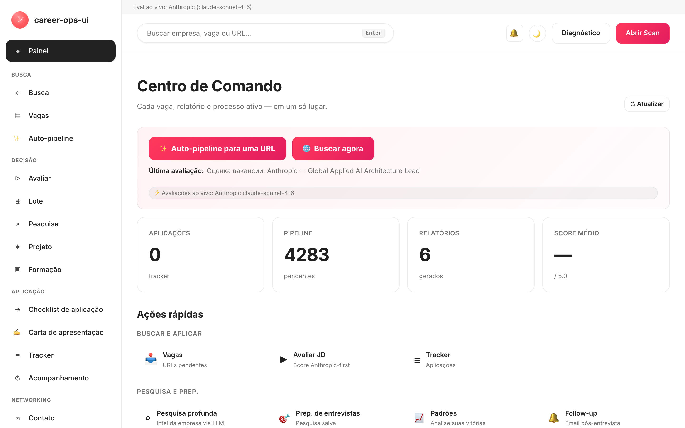

# career-ops-ui

> Interface web limpa, estilo docs, para o pipeline de busca de emprego com IA [career-ops](https://github.com/Fighter90/career-ops).
> Busque, avalie, faça deep-dive, candidate-se e rastreie cada vaga em uma única aba do navegador — em vez de alternar entre Claude Code, terminais e arquivos markdown.

[🇬🇧 English](README.md) | [🇪🇸 Español](README.es.md) | **🇧🇷 Português (Brasil)** | [🇰🇷 한국어](README.ko-KR.md) | [🇯🇵 日本語](README.ja.md) | [🇷🇺 Русский](README.ru.md) | [🇨🇳 简体中文](README.zh-CN.md) | [🇹🇼 繁體中文](README.zh-TW.md) | [🇫🇷 Français](README.fr.md) | [🇵🇱 Polski](README.pl.md) | [🇺🇦 Українська](README.uk.md) | [🇩🇰 Dansk](README.da.md) | [🇸🇦 العربية](README.ar.md) | [🇩🇪 Deutsch](README.de.md) | [🇮🇹 Italiano](README.it.md) | [🇹🇷 Türkçe](README.tr.md) | [🇮🇳 हिन्दी](README.hi.md)

_UI não oficial — sem afiliação ou endosso de career-ops / santifer._

[](#testes)
[](#tests)
[](#testes)
[](#requisitos)
[](LICENSE)
[](https://github.com/Fighter90/career-ops-ui/releases/tag/v1.213.0)

<a href="https://www.producthunt.com/products/career-ops-ui?embed=true&amp;utm_source=badge-featured&amp;utm_medium=badge&amp;utm_campaign=badge-career-ops-ui" target="_blank" rel="noopener noreferrer"></a>

> **🆕 Última versão — v1.213.0** — **MyCareersFuture (Singapura) + correções de qualidade de varredura** — o banco nacional de Singapura agora é escaneável; vagas do Greenhouse podem ser filtradas por conteúdo; e vagas remotas do Ashby não somem mais atrás de uma localização só-cidade. **2724 testes.**
>
> 📜 Histórico completo de versões: **[CHANGELOG.pt-BR.md](CHANGELOG.pt-BR.md)**.

<!-- DO NOT REVERT: locale-specific dashboard screenshot (dashboard-pt-BR.png). Each README uses its own ./images/dashboard-<locale>.png — never replace with dashboard-en.png. Generated by scripts/capture-dashboard-screenshots.mjs. -->
[](https://youtu.be/LcVPUg9IsDk?si=mrx3oOmOpSAwabOz)

**[▶ Ver o preview](https://youtu.be/LcVPUg9IsDk?si=mrx3oOmOpSAwabOz)**

## Sobre o career-ops

O [career-ops](https://career-ops.org) é um sistema open-source de busca de emprego que roda como slash commands dentro de qualquer CLI de IA para código (Claude Code, Cursor, Codex, OpenCode, Antigravity CLI, Grok Build CLI, Qwen Code, Kimi, GitHub Copilot CLI, Gemini CLI (legacy) — outras CLIs compatíveis com Claude também funcionam pela mesma superfície de slash-commands). É agnóstico em relação ao modelo. Avalia cada vaga contra o seu CV usando uma rubrica de cinco dimensões mais uma pontuação global holística na escala 0.0–5.0, gera currículos em PDF personalizados e registra cada candidatura localmente — sem contas em nuvem, sem telemetria, sem envio automático.

**Este repositório (career-ops-ui)** é uma interface web polida sobre essa base. O CLI continua responsável pelo preenchimento de formulários (via Playwright MCP) e pelos modos de slash commands; a SPA oferece uma superfície de navegador no estilo CRM sobre os mesmos arquivos `cv.md` / `data/applications.md` / `reports/`. Os dois compartilham os mesmos dados.

**Limiares de ação por score** (extraídos de [career-ops.org/docs](https://career-ops.org/docs)):

| Score | Próximo passo |
|---|---|
| **≥ 4.5** | `/career-ops apply` — fit alto, candidate-se agora |
| **4.0 – 4.4** | candidate-se, ou `/career-ops contacto` para uma intro quente |
| **3.5 – 3.9** | `/career-ops deep` — pesquise antes |
| **< 3.5** | pule, salvo se tiver um motivo específico |

**Guias canônicos** em [career-ops.org/docs](https://career-ops.org/docs):

- [What is career-ops](https://career-ops.org/docs/introduction/what-is-career-ops)
- [Scan job portals](https://career-ops.org/docs/introduction/guides/scan-job-portals)
- [Apply for a job](https://career-ops.org/docs/introduction/guides/apply-for-a-job)
- [Batch-evaluate offers](https://career-ops.org/docs/introduction/guides/batch-evaluate-offers)
- [Set up Playwright](https://career-ops.org/docs/introduction/guides/set-up-playwright)
- [How career-ops scores job listings — the methodology](https://career-ops.org/methodology)

## O Manifesto CareerOps

O career-ops é a primeira implementação de referência [do Manifesto CareerOps](https://career-ops.org/manifesto) — a prática de conduzir uma busca de emprego com evidências, disciplina e as ferramentas do lado do candidato na mesa. Leia. Se ele disser o que você acredita, assine — sua assinatura se torna um commit. O app tem um link para ele no rodapé da barra lateral.

## Inicie e configure com um único comando

> **Importante — career-ops-ui é um painel *em cima de* [`Fighter90/career-ops`](https://github.com/Fighter90/career-ops).** Ele roda **dentro** de um projeto career-ops como `career-ops/web-ui/` e lê seu `cv.md`, `config/`, `data/` da pasta pai via `../`. **Não funciona de forma independente** — você também precisa do repositório pai `career-ops`. Não o clone sozinho e execute `init`; use uma das duas opções abaixo.

### Opção 1 — um único curl (recomendado: configura tudo)

```bash
curl -fsSL https://raw.githubusercontent.com/Fighter90/career-ops-ui/main/bin/setup.sh | bash
```

Clona **ambos** os repositórios, organiza a estrutura `career-ops/web-ui/`, instala dependências, executa o doctor e sobe o servidor em http://127.0.0.1:4317 — depois abre o painel.

### Opção 2 — adicionar a UI a um projeto career-ops existente

Se você já tem o career-ops configurado e quer apenas o painel, clone a UI **dentro** dele como `web-ui`:

```bash
cd career-ops                                                   # ← seu projeto career-ops existente
git clone https://github.com/Fighter90/career-ops-ui.git web-ui
cd web-ui
npm install
npx career-ops-ui init        # interactive: pick LLM provider + paste its key → parent career-ops/.env
```

A estrutura `web-ui/` aninhada é exatamente o que permite à UI resolver seu `../cv.md`, `../config/`, `../data/`. Execute `npm link` **uma vez** se preferir digitar `career-ops-ui <verb>` em vez de `npx career-ops-ui <verb>`.

### Os verbos CLI

```bash
career-ops-ui setup    # bootstrap: install deps → doctor → run (SKIP_START=1 to stop before run)
career-ops-ui init     # pick LLM provider + paste its key (interactive)
career-ops-ui doctor   # verify Node / project / keys / Playwright (exit 0 ⇔ all required green)
career-ops-ui run      # launch the server at http://127.0.0.1:4317
career-ops-ui open     # open + RAISE the dashboard tab in your browser
career-ops-ui help     # list every verb
```

Prefixe com `npx ` (ex. `npx career-ops-ui run`) se não executou `npm link`. Após `setup`/`run` a aba é aberta **e trazida para a frente** automaticamente; defina `NO_OPEN=1` para desativar a abertura automática (headless / CI).

### Escolha seu provedor LLM

O `init` é o assistente de provedor — escolha **Claude / Claude Code** (`ANTHROPIC_API_KEY`), **Gemini / Gemini CLI** (`GEMINI_API_KEY`), **Codex / OpenCode CLI** (`OPENAI_API_KEY`), ou **Auto** (Anthropic → Gemini como fallback). As chaves são digitadas com o eco suprimido e gravadas no `career-ops/.env` do projeto pai pelo mesmo caminho validado que a aba de chaves de API do `#/config` usa. Forma não interativa para CI:

```bash
career-ops-ui init --provider claude --anthropic-key sk-ant-… --yes
career-ops-ui init --provider gemini --gemini-key …          --yes
career-ops-ui init --provider auto   --openai-key sk-…       --yes
```

Ou defina manualmente: `echo "ANTHROPIC_API_KEY=sk-ant-…" >> career-ops/.env`. O provedor define `LLM_PROVIDER` (`auto` | `claude` | `gemini`); troque-o a qualquer momento em **`#/config` → chaves de API** sem reiniciar.

### Solução de problemas com `init`

Se `career-ops-ui init` falhar ou o comando não for encontrado (comum logo após um `git pull`):

```bash
cd career-ops/web-ui
npm install
npx career-ops-ui init        # npx runs the local bin even without `npm link`
```

Certifique-se de que:

- Você está executando de **dentro de `career-ops/web-ui/`** — não de um clone independente `career-ops-ui/`.
- A **pasta pai `career-ops/` existe** e contém `cv.md` e `config/`. Se você clonou o career-ops-ui separadamente, mova-o (ou re-clone) para que fique em `career-ops/web-ui/` — ou simplesmente execute o curl da opção 1, que organiza a estrutura por você.
- `career-ops-ui doctor` (ou `npx career-ops-ui doctor`) mostra exatamente o que está faltando.

---

## Por quê?

O [career-ops](https://github.com/Fighter90/career-ops) é um sistema poderoso de busca de emprego orientado pelo Claude Code: cole uma JD → receba uma nota de aderência 0–5, um PDF otimizado para ATS e uma entrada no rastreador. Funciona muito bem dentro do Claude Code, mas os dados ficam espalhados entre `cv.md`, `data/applications.md`, `reports/*.md`, `data/pipeline.md`, `portals.yml`, `config/profile.yml` — fácil perder algo, difícil bater o olho e ter visão geral.

O `career-ops-ui` coloca uma UI bem feita por cima:

- **Auto-pipeline** — cole uma URL em `#/auto`, um clique: validar → buscar → avaliar → salvar relatório → adicionar ao tracker, com stepper acessível ao vivo e deep-links dos artefatos.
- **Navegue** pelo tracker, relatórios e pipeline como em um CRM.
- **Dispare** scans (Greenhouse / Ashby / Lever / Workable / SmartRecruiters / Workday **e** hh.ru / Habr Career / Trudvsem / GetMatch / GeekJob) e acompanhe logs SSE ao vivo.
- **Avalie** uma JD em tempo real via Anthropic (preferida) ou Gemini; ou receba um prompt pronto para colar no Claude Code, caso nenhuma chave de API esteja configurada.
- **Pesquise empresas** ao vivo via Anthropic SDK, com cv / profile / arquivos de modo embutidos automaticamente.
- **Edite** o `cv.md` com preview markdown lado a lado e sanitização XSS no servidor.
- **Mantenha** o sistema: doctor, verify, normalize, dedup, merge — um clique cada.
- **Multi-CLI:** dirige de forma idêntica a partir do Claude Code, Cursor, Codex, Cursor, Aider ou Gemini CLI — os shims `CLAUDE.md` / `AGENTS.md` / `GEMINI.md` apontam para uma única fonte da verdade.

É puramente aditivo: nada dentro de `career-ops/` é modificado. Suas customizações permanecem suas.

---

## Início rápido

### 1. Instale o career-ops primeiro

```bash
git clone https://github.com/Fighter90/career-ops.git
cd career-ops
```

Siga o [onboarding do career-ops](https://github.com/Fighter90/career-ops#first-run--onboarding) para garantir que `cv.md`, `config/profile.yml` e `portals.yml` existam.

### 2. Coloque o career-ops-ui dentro dele

```bash
git clone https://github.com/Fighter90/career-ops-ui.git web-ui
```

Sua árvore agora fica assim:

```
career-ops/
├─ cv.md
├─ portals.yml
├─ config/
├─ data/
├─ modes/
├─ reports/
├─ scan.mjs … doctor.mjs … (etc)
└─ web-ui/                 ← este repositório
   ├─ bin/start.sh
   ├─ package.json
   ├─ server/
   ├─ public/
   └─ tests/
```

### 3. Suba o servidor

```bash
bash web-ui/bin/start.sh
```

O script faz o seguinte:

1. Verifica se o Node é ≥ 18.
2. Roda `npm install` (apenas na primeira execução, com duas dependências — Express + js-yaml).
3. Inicia o servidor Express em `127.0.0.1:4317`.
4. Abre http://127.0.0.1:4317/ no seu navegador padrão.

Porta / host personalizados:

```bash
PORT=8080 bash web-ui/bin/start.sh
HOST=0.0.0.0 PORT=4317 bash web-ui/bin/start.sh   # expõe na LAN
```

Se você clonou o repositório em outro lugar (não como `career-ops/web-ui`), aponte para o career-ops via variável de ambiente:

```bash
CAREER_OPS_ROOT=/path/to/career-ops bash bin/start.sh
```

---

## Primeira execução — estado limpo

`career-ops/data/pipeline.md` vem com duas URLs de fixture de QA (`example.com/qa-fixture-*`) para que a suite de testes seja executada de forma hermética. Em um clone novo, você verá Pipeline mostrando `2 pendentes` — não são vagas reais. Limpe-as antes do seu primeiro scan:

```bash
make clean-test-fixtures
npm start
```

Abra http://127.0.0.1:4317. O contador de Pipeline deve mostrar `0 pendentes`.

---

## Requisitos

| | |
| --- | --- |
| **Node.js** | ≥ 18 (usa `fetch` nativo e `node:test`) |
| **career-ops** | Clonado e com onboarding feito — veja acima |
| **Opcional** | `GEMINI_API_KEY` no `.env` do projeto pai (modelo free-tier `gemini-2.0-flash`) para avaliação de JD com um clique. Sem ela, a UI devolve um prompt pronto para colar no Claude. |
| **Opcional** | Use um IP / VPN russo se o hh.ru responder 403. O Habr Career funciona de qualquer IP. |
| **Opcional** | Playwright (já é dependência transitiva do career-ops) para a suíte de testes e2e. |

---

## O que você ganha — página por página

| Página           | O que faz                                                                                                          |
| ---------------- | ------------------------------------------------------------------------------------------------------------------ |
| **Dashboard**    | Contadores agregados (apps / pipeline / relatórios), score médio, breakdown por status, últimas 5 apps + último relatório. |
| **Scan**         | **🌐 Botão único de Scan** — percorre todas as fontes habilitadas em uma única passagem (Greenhouse / Ashby / Lever / Workable / SmartRecruiters / Workday para EN, hh.ru + Habr Career + Trudvsem + GetMatch + GeekJob para RU). Logs SSE ao vivo + tabela de resultados clicável com filtros por location / badge Remote-Hybrid / flag de relocation / salário / source e chips dinâmicos de stack / nível / palavra-chave. O card Active-Companies lista cada board rastreado com o status da sua API. |
| **Pipeline**     | CRUD sobre `data/pipeline.md`. Proxy de preview no servidor (SSRF-safe, validação de redirect por hop, cap de 8 KB no corpo). Pule direto de uma URL para a avaliação. |
| **Evaluate**     | Cole a JD → **Anthropic-first** (preferida quando ambas as chaves estão presentes), depois Gemini, depois fallback manual. O caminho Anthropic embute automaticamente cv / profile / `_shared.md` / `oferta.md` (REVIEW-A1). Salvar a JD em `jds/` é opcional. |
| **Deep research**| Mesmo encadeamento de fallback do Evaluate. O Anthropic ao vivo devolve ~10–30 KB de markdown fundamentado, salvo em `interview-prep/<company>-<role>.md`. |
| **Modes**        | 7 páginas de modo genéricas (`/#/project`, `/#/training`, `/#/followup`, `/#/batch`, `/#/contacto`, `/#/interview-prep`, `/#/patterns`) com o mesmo fallback Anthropic / Gemini / manual. Dicas WCAG 1.4.1 sinalizam estados pelos ícones, não só pela cor. |
| **Apply helper** | Gera um checklist de candidatura; o preenchimento real do formulário com Playwright continua em `/career-ops apply` dentro do Claude Code. |
| **Tracker**      | Tabela filtrável sobre `data/applications.md` (status, score, texto livre). Botões one-click para `normalize-statuses.mjs` / `dedup-tracker.mjs` / `merge-tracker.mjs`. Os escapes de pipe e newline são GFM-compliant — nomes como `"Acme \| Co"` fazem round-trip sem perda. |
| **Reports**      | Navegue e leia cada relatório em `reports/` com cabeçalho parseado (Score / Legitimacy / URL).                     |
| **CV**           | Editor markdown ao vivo de `cv.md` com preview lado a lado + um clique em `cv-sync-check.mjs` + 📁 Upload de CV. Strip de XSS no servidor ao salvar (`<script>`, `javascript:`, handlers `on*=`). |
| **Profile**      | Visão somente leitura de `config/profile.yml` + arquétipos — resumo amigável para a UI.                            |
| **App settings** | Editor in-UI para chaves do `.env` do projeto pai: `ANTHROPIC_API_KEY`, `GEMINI_API_KEY`, overrides de modelo, port / host. Segredos mascarados na leitura. |
| **Health**       | Todos os checks de setup em badges OK / OPTIONAL / FAIL + botões para rodar `doctor.mjs` e `verify-pipeline.mjs`.   |
| **Help**         | Guia do usuário em Markdown dentro do app (`/#/help`), localizado nos 17 idiomas suportados (en / es / fr / pt-BR / ko-KR / ja / ru / zh-CN / zh-TW / pl / uk / da / ar / de / it / tr / hi). |
| **Activity log** | Trilha de auditoria de cada request que altera estado (escritas, runs, scans). Segredos redigidos. |
| **Notificações** 🔔 *(v1.58.34 / v1.58.35)* | Sino na barra superior com badge vermelho de não lidos. Clique → drawer direito com as últimas 50 toasts (por aba, por sessão) — Sucesso / Erro / Info-progresso, cada uma com hora local, mensagem e, se aplicável, postfix `(MÉTODO /caminho · HTTP NNN)` em `<details>`. A ajuda **§18** documenta cada categoria. O drawer abre **somente** ao clicar no sino (ou Enter / Space); fecha via ×, Esc, ou novo clique. |

Atalhos globais de teclado:

- `Ctrl+K` / `Cmd+K` — foca a busca global.
- Colar uma URL na busca global a adiciona automaticamente ao pipeline.
- `Esc` — fecha qualquer modal aberto.

---

## Scan

Scanning de portais com zero tokens que de fato devolve vagas. **Um único botão 🌐 Scan** na UI percorre cada fonte configurada em uma única varredura:

- **Greenhouse / Ashby / Lever / Workable / SmartRecruiters / Workday** — boards-api pública para cada empresa em `portals.yml::tracked_companies` com um padrão de ATS reconhecível. A lista incluída cobre Stripe, GitLab, Vercel, Cloudflare, Datadog, Discord, Elastic, Grafana Labs, CockroachDB, Fastly, Twilio, Coinbase, Reddit, Robinhood, Affirm, Lyft, Linear, Supabase, PostHog, Ramp, Modal Labs, Railway, Browserbase, JetBrains — estenda ou enxugue à vontade.
- **Quadros RSS** — qualquer quadro de vagas que publique um feed RSS/Atom (LaraJobs, WeWorkRemotely, RemoteOK, golangprojects, …). Adicione `provider: rss` e a URL do feed em `portals.yml` — sem necessidade de alterações no código.
- **Quadros agregadores (v1.75.0)** — sete fontes de todo o board / orientadas a configuração além dos ATSes por empresa: **RemoteOK / Remotive / Working Nomads** (feeds remotos de todo o board, selecione com `provider: remoteok|remotive|workingnomads`) e **IBM / Arbeitsagentur / Glints / Jobstreet · SEEK** (orientadas a configuração, cada uma lê um bloco `<provider>:` por entrada). Veja `docs/portals-examples.md` para entradas de `tracked_companies` prontas para copiar e colar. Elas executam o mesmo fluxo `title_filter` / `location_filter` / `content_filter` + dedup + acréscimo ao pipeline que toda outra fonte.
- **hh.ru** — scraping do HTML de `hh.ru/search/vacancy`. Funciona de qualquer IP, sem chave nem proxy. (A API JSON `api.hh.ru` não é mais usada: ela agora retorna 403 a qualquer cliente programático independentemente de IP/User-Agent; o site serve resultados completos a qualquer cliente tipo navegador, igual ao Habr Career.)
- **Habr Career** — scraping HTML de `career.habr.com/vacancies`. Funciona de qualquer IP, sem autenticação.

### Adaptador RSS

Aponte o scanner para qualquer quadro baseado em RSS adicionando uma entrada com `provider: rss` e a chave `rss:` (ou `feed_url:`) no `portals.yml`:

```yaml
tracked_companies:
  - name: LaraJobs
    provider: rss
    rss: https://larajobs.com/feed
    enabled: true
  - name: WeWorkRemotely
    provider: rss
    rss: https://weworkremotely.com/remote-jobs.rss
    enabled: true
```

O adaptador analisa blocos `<item>` com um pequeno parser baseado em expressões regulares (sem biblioteca XML). Extrai `title`, `link` (→ `url`), `pubDate` (→ `date`) e `description` (→ `snippet`, tags HTML removidas). Trabalho remoto é inferido por `/remote|anywhere/i` no título ou descrição; o nome da empresa é extraído de `dc:creator`, do padrão «Empresa — Cargo» no título ou do hostname do feed. O mesmo fluxo de normalização → filtragem → deduplicação → append no pipeline se aplica como nos adaptadores ATS.

Todas as fontes passam pelo mesmo pipeline: normalize → filter (`title_filter.positive` / `title_filter.negative`) → dedup contra `data/scan-history.tsv` + `data/pipeline.md` + `data/applications.md` → append em `data/pipeline.md` → salva o conjunto completo de resultados em `data/last-scan.json` para a tabela filtrável da UI.

Configure via `portals.yml`:

```yaml
title_filter:
  positive: [backend, engineer, senior, tech lead, golang, php]
  negative: [junior, intern, frontend, ios, android]
tracked_companies:
  - { name: Stripe, enabled: true, careers_url: https://job-boards.greenhouse.io/stripe }
  - { name: Linear, enabled: true, careers_url: https://jobs.ashbyhq.com/linear }
  # ...
russian_portals:
  sources: ["hh", "habr"]   # uma ou ambas
  area: 113                  # 1=Moscou, 2=SPb, 113=Rússia, 1001=remoto
  per_page: 50
  only_remote: false
  queries: ["Senior PHP", "Senior Go", "Tech Lead"]
```

Todas as fontes fluem por um único endpoint SSE: `/api/stream/scan?source=ats|regional|both`. O botão **🌐 Scan** na UI chama `source=both` para que cada adapter (Greenhouse / Ashby / Lever / Workable / SmartRecruiters / Workday + hh.ru + Habr Career + Trudvsem + GetMatch + GeekJob) rode em uma única conexão. Respeita `AbortSignal` na desconexão do cliente — sem fetches órfãos.

---

## Arquitetura

```
career-ops-ui/
├─ CLAUDE.md                 # instruções de agente nível projeto (canônico)
├─ AGENTS.md                 # shim para Codex / Aider / CLI genérico → CLAUDE.md
├─ GEMINI.md                 # shim para Gemini CLI → CLAUDE.md
├─ .aiignore                 # lista de exclusão para ferramentas de IA
├─ .claude/                  # config de agentes do Claude Code
│  ├─ agents/                # 3 subagentes específicos do projeto (route, view, test isolation)
│  └─ commands/               # stubs de slash command
├─ bin/start.sh              # launcher one-shot (check Node → npm install → server → abre navegador)
├─ package.json              # 2 deps de runtime: express, js-yaml
├─ server/
│  ├─ index.mjs              # orquestrador de ~130 LOC: middleware + 12 chamadas register<Topic>Routes(app) + SPA catch-all
│  └─ lib/
│     ├─ paths.mjs           # caminhos absolutos para os arquivos do career-ops (com awareness de CAREER_OPS_ROOT)
│     ├─ parsers.mjs         # parsers de markdown / pipeline / report (escapes de pipe GFM-compliant)
│     ├─ runner.mjs          # runNodeScript() + streamNodeScript() com escalada SIGTERM→SIGKILL + cap de 30 min
│     ├─ security.mjs        # isValidJobUrl, stripDangerousMarkdown, sanitizeJobDescription, sanitizePathName, isPubliclyExposed
│     ├─ safe-fetch.mjs      # safeGet com DNS pinning + SNI/Host forçado (defesa anti DNS-rebind / TOCTOU)
│     ├─ file-lock.mjs       # withFileLock — mutex por arquivo para read-modify-write atômico
│     ├─ rate-limit.mjs      # llmRateLimit — janela deslizante por IP (no-op em loopback)
│     ├─ prompts.mjs         # bundleProjectContext, buildEvaluationPrompt, buildDeepPrompt, buildModePrompt
│     ├─ store.mjs           # safeReadApps/Pipeline/Reports, checkProfileCustomized, ensureRussianPortalsDefaults
│     ├─ anthropic.mjs       # adapter mínimo do Anthropic SDK (runAnthropic, hasAnthropicKey, hasGeminiKey)
│     ├─ env-config.mjs      # round-trip de .env com mascaramento de segredos + validação
│     ├─ activity-log.mjs    # middleware da trilha de auditoria JSONL (segredos redigidos)
│     ├─ dotenv.mjs          # loader dotenv minúsculo
│     ├─ en-scanner.mjs      # orquestrador in-process Greenhouse/Ashby/Lever (com awareness de AbortSignal)
│     ├─ ru-scanner.mjs      # orquestrador in-process hh.ru + Habr (com awareness de AbortSignal)
│     ├─ sources/
│     │  ├─ greenhouse.mjs   # cliente boards-api.greenhouse.io
│     │  ├─ ashby.mjs        # cliente api.ashbyhq.com
│     │  ├─ lever.mjs        # cliente api.lever.co
│     │  ├─ hh.mjs           # cliente api.hh.ru (com awareness de UA)
│     │  └─ habr.mjs         # parser HTML de career.habr.com (sem cheerio, só regex)
│     └─ routes/             # 12 módulos de rota — um por tópico (P-2)
│        ├─ activity.mjs     # /api/activity
│        ├─ config.mjs       # /api/config (round-trip do .env do pai)
│        ├─ content.mjs      # /api/cv, /api/profile, /api/portals, /api/modes
│        ├─ health.mjs       # /api/health, /api/dashboard
│        ├─ help.mjs         # /api/help/:lang
│        ├─ jds.mjs          # CRUD de /api/jds
│        ├─ llm.mjs          # /api/evaluate, /api/deep, /api/mode/:slug, /api/apply-helper, /api/interview-prep*
│        ├─ pipeline.mjs     # /api/pipeline + proxy de preview SSRF-safe
│        ├─ reports.mjs      # /api/reports
│        ├─ runners.mjs      # /api/run/* + /api/stream/{scan,liveness,pdf} + /api/output/pdfs
│        ├─ scan.mjs         # /api/stream/scan-{ru,en} + /api/scan-results
│        └─ tracker.mjs      # /api/tracker
├─ public/                   # SPA estática — sem build step
│  ├─ index.html
│  ├─ css/app.css            # design tokens (paleta estilo docs)
│  └─ js/
│     ├─ api.js              # wrapper de fetch + estado do connection-banner + helpers de UI + renderer markdown seguro
│     ├─ router.js           # router baseado em hash com fallback 404 + suporte a alias
│     ├─ app.js              # boot + handlers globais de teclado + drawer mobile da sidebar
│     ├─ lib/{i18n,skills}.js
│     └─ views/              # um arquivo por página (dashboard, scan, pipeline, evaluate, deep, apply, tracker, reports, cv, settings, health, config, help, activity, mode-page)
├─ docs/                     # referência pública: arquitetura, API, fluxos de dados, SDD, convenções, reviews
│  ├─ PROJECT.md             # o quê / por quê / para quem
│  ├─ ROADMAP.md             # milestone atual + histórico concluído
│  ├─ PRODUCTION-READINESS.md # avaliação honesta de deployment-gate
│  ├─ sdd/{SDD-GUIDE,CONVENTIONS}.md
│  ├─ architecture/{OVERVIEW,SERVER,FRONTEND,API,DATA-FLOWS}.md
│  └─ reviews/REVIEW-*.md
└─ tests/                    # 1945 unit/integration + 90 Playwright e2e
   ├─ parsers.test.mjs       # parsers de markdown / pipeline / report (funções puras)
   ├─ api.test.mjs           # cada endpoint, servidor efêmero, sem rede
   ├─ {ru,en}-scanner.test.mjs   # fetch mockado
   ├─ pipeline-preview.test.mjs   # validação de redirect por hop (REVIEW-B1)
   ├─ ssrf-redirect-rebind.test.mjs   # defesa contra DNS rebind via safeGet
   ├─ path-traversal.test.mjs    # cobertura de sanitizePathName
   ├─ concurrent-tracker-write.test.mjs   # mutex contra condição de corrida em tracker
   ├─ rate-limit.test.mjs    # janela do llmRateLimit + Retry-After
   ├─ anthropic.test.mjs     # adapter do SDK + teste de log-guard (REVIEW-B4)
   ├─ url-validation.test.mjs    # varredura de rejeição SSRF (FIX-M3 + M6 + M7)
   ├─ cv-xss.test.mjs        # round-trip de stripDangerousMarkdown (entity-aware)
   ├─ jd-sanitize.test.mjs   # sanitizeJobDescription
   ├─ help.test.mjs / help-ui.test.mjs    # paridade i18n nos 16 locales
   ├─ playwright-smoke.mjs   # 12 fluxos de navegador (CV save, tracker, pipeline, evaluate, config, etc.)
   └─ e2e{,-comprehensive}.mjs   # walkthrough Playwright completo
```

### Por que sem build step?

HTML/CSS/JS vanilla mantém a superfície minúscula: um `npm install` de duas dependências e você está no ar. Sem Webpack, sem Vite, sem `node_modules` infernal. A UI inteira tem menos de 30 KB minificada. Se você quer hot-reload durante o desenvolvimento, `npm run dev` usa o `--watch` nativo do Node.

### Spec-Driven Development

Mudanças não-triviais passam pelo pipeline GSD (skills `gsd-*` do `superpowers@claude-plugins-official`):

```
discuss → spec → plan → execute → verify → review
```

Referência pública: [`docs/sdd/SDD-GUIDE.md`](docs/sdd/SDD-GUIDE.md). Todos os artefatos de planejamento ficam em `.planning/` (gitignored). A árvore `docs/` é o contrato público de longo prazo.

---

## Referência da API

Todos os endpoints estão sob `/api/*`. JSON in / JSON out, salvo indicação em contrário.

### Health & dashboard

| Método | Path                     | Resposta                                                                    |
| ------ | ------------------------ | --------------------------------------------------------------------------- |
| GET    | `/api/health`            | `{ ok, warnings, version, parentVersion, checks: [{name, ok, required, value?}] }` |
| GET    | `/api/dashboard`         | `{ counts, avgScore, byStatus, recent, pipeline, lastReport }`              |
| GET    | `/api/status/providers`  | `{ activeProvider, activeModel, keysConfigured }` — prontidão de LLM para o banner de onboarding + dica de custo ⚡ (v1.55.3) |
| GET    | `/api/activity?limit&type` | tail da trilha de auditoria `data/activity.jsonl`                         |
| GET    | `/api/help/:lang`        | guia do usuário in-app localizado (fallback: `en.md`)                       |

### App settings (round-trip do .env do pai)

| Método | Path             | Propósito                                                              |
| ------ | ---------------- | ---------------------------------------------------------------------- |
| GET    | `/api/config`    | chaves de env conhecidas, com segredos mascarados                      |
| POST   | `/api/config`    | valida + escreve no `.env` do pai; aplica a `process.env` in-place     |

### Arquivos de dados

| Método | Path                                | Propósito                                                              |
| ------ | ----------------------------------- | ---------------------------------------------------------------------- |
| GET    | `/api/tracker`                      | `{ rows: [applications.md parseado] }`                                 |
| POST   | `/api/tracker`                      | body `{ company, role, score?, status?, url?, notes?, date? }` — dedup-aware (case-insensitive em company + role), atômico via `withFileLock` |
| GET    | `/api/pipeline`                     | `{ urls: [...] }`                                                      |
| POST   | `/api/pipeline`                     | body `{ url }` → adiciona em `data/pipeline.md` com dedup + `isValidJobUrl`, atômico via `withFileLock` |
| GET    | `/api/pipeline/preview?url=…`       | proxy de fetch no servidor (DNS pinning, check SSRF por hop, ≤3 redirects, cap de 8 KB) |
| DELETE | `/api/pipeline?url=…`               | remove uma URL                                                         |
| GET    | `/api/reports`                      | lista parseada de `reports/*.md`                                       |
| GET    | `/api/reports/:slug`                | markdown completo + cabeçalho parseado                                 |
| GET    | `/api/jds`                          | lista de arquivos JD salvos                                            |
| GET    | `/api/jds/:name`                    | text/plain — JD bruta                                                  |
| POST   | `/api/jds`                          | body `{ text, slug? }` → salva em `jds/`                               |
| DELETE | `/api/jds/:name`                    | unlink (sufixo `.txt` obrigatório)                                     |
| GET    | `/api/cv`                           | `{ markdown }`                                                         |
| PUT    | `/api/cv`                           | body `{ markdown }` → escreve `cv.md` (XSS-stripped entity-aware, ≤1 MB) |
| GET    | `/api/profile`                      | `{ profile: yaml parseado, raw: text }`                                |
| GET    | `/api/portals`                      | `{ portals: yaml parseado, raw: text }`                                |
| GET    | `/api/modes`                        | lista de arquivos de modo                                              |
| GET    | `/api/modes/:name`                  | text/plain — prompt de modo bruto                                      |
| GET    | `/api/output/pdfs`                  | lista de PDFs gerados                                                  |
| GET    | `/api/output/pdfs/:name`            | download (`Content-Disposition: attachment`)                           |
| GET    | `/api/interview-prep`               | lista de arquivos de deep-research salvos                              |
| GET    | `/api/interview-prep/:name`         | `{ name, markdown }`                                                   |
| DELETE | `/api/interview-prep/:name`         | unlink (sufixo `.md` obrigatório)                                      |

### Runners de script (buffered, one-shot)

| Método | Path                    | Encapsula                   |
| ------ | ----------------------- | --------------------------- |
| POST   | `/api/run/doctor`       | `node doctor.mjs`           |
| POST   | `/api/run/verify`       | `node verify-pipeline.mjs`  |
| POST   | `/api/run/normalize`    | `node normalize-statuses.mjs` |
| POST   | `/api/run/dedup`        | `node dedup-tracker.mjs`    |
| POST   | `/api/run/merge`        | `node merge-tracker.mjs`    |
| POST   | `/api/run/sync-check`   | `node cv-sync-check.mjs`    |

Todos os runs buffered têm cap de 60 s; escalada SIGTERM → SIGKILL após um grace period de 5 s.

### Streams (SSE)

| Método | Path                          | Streams                            |
| ------ | ----------------------------- | ---------------------------------- |
| GET    | `/api/stream/scan`            | `node scan.mjs` legacy (subprocess) |
| GET    | `/api/stream/scan?source=ats\|regional\|both` | SSE consolidada do scanner in-process — query: `dryRun=1`, `company=…` (apenas ATS). |
| GET    | `/api/stream/liveness`        | `node check-liveness.mjs`          |
| GET    | `/api/stream/pdf`             | `node generate-pdf.mjs`            |

Tipos de evento SSE:

```
event: start    data: { script, args?, writeFiles? }
event: log      data: { stream: "stdout"|"stderr", line: string }
event: done     data: { code, counts?, errors? }
event: error    data: { message }
```

### Endpoints LLM (Anthropic-first → Gemini → fallback manual)

| Método | Path                                | Propósito                                                                        |
| ------ | ----------------------------------- | -------------------------------------------------------------------------------- |
| POST   | `/api/evaluate`                     | body `{ jd, save? }` → avaliação de JD (seções A–G conforme `oferta.md`). Sujeita a `llmRateLimit`. |
| POST   | `/api/evaluate/test-gemini`         | smoke check de `GEMINI_API_KEY`                                                  |
| POST   | `/api/evaluate/test-anthropic`      | smoke check de `ANTHROPIC_API_KEY`                                               |
| POST   | `/api/deep`                         | body `{ company, role?, run? }` → prompt de deep-research ou markdown fundamentado ao vivo. Sujeita a `llmRateLimit`. |
| POST   | `/api/mode/:slug`                   | runner genérico de modo; allowlist: `batch`, `contacto`, `followup`, `interview-prep`, `patterns`, `project`, `training`. Sujeita a `llmRateLimit`. |
| POST   | `/api/apply-helper`                 | body `{ url, jd? }` → checklist de candidatura                                   |
| POST   | `/api/auto-pipeline`                | promove URLs do pipeline a evaluations encadeadas, com rate-limit e mutex.        |
| GET    | `/api/scan-results`                 | `{ en: {when, fresh[], filtered[], errors[]}, ru: { ... } }` — último scan       |
| GET    | `/api/scan/regional/config`         | config efetiva do scanner regional (queries, negatives, sources).                |

Quando `run: true` é definido em `/api/deep` ou `/api/mode/:slug`, o servidor prefere Anthropic (quando ambas as chaves estão presentes), embute `cv.md` + `config/profile.yml` + `modes/_shared.md` + o template de modo relevante em um bloco `<project_context>` e retorna o markdown fundamentado do modelo diretamente. Soft cap: 200 KB no prompt montado — overflow devolve 413.

---

## Testes

```bash
npm test                       # 1856 testes unit/integration
npm run test:e2e               # 20 smoke e2e (sobe o próprio server)
npm run test:e2e:full          # 23 e2e comprehensive
npm run test:e2e:browser       # 70 Playwright browser-smoke
npm run test:coverage          # idêntico a `npm test` mais V8 coverage
```

| Suíte                       | Testes  | O que cobre                                                                                                |
| --------------------------- | ------- | ---------------------------------------------------------------------------------------------------------- |
| `node --test tests/*.test.mjs` (unit + integration) | **1856** | Cada endpoint, servidor efêmero, sem rede. Inclui parser, scanner (mockado), runner, anthropic, security headers, XSS entity-aware, JD sanitize, validação de URL, paridade i18n, mutex de tracker, rate-limit, path-traversal e DNS rebind. |
| `tests/e2e.mjs` (smoke)      | 20     | Playwright headless: cada rota renderiza, fluxos básicos.                                                  |
| `tests/e2e-comprehensive.mjs` | 23    | Walkthrough Playwright completo: 11 rotas + 12 fluxos funcionais.                                          |
| `tests/playwright-smoke.mjs` (`npm run test:e2e:browser`) | **32** | Browser-driven smoke: render do dashboard, navegação, troca de idioma, 404, health, round-trip do tracker (BF-1), pipeline add + varredura de URL inválida, reports vazio, evaluate fallback manual, config com chaves mascaradas, CV PUT XSS strip, pipeline preview 400 + cobertura WCAG 1.4.1. |
| **Total**                   | **529+** | **0 falhas, 0 flakes**                                                                                  |

Cobertura: ~93% linha / ~83% branch via `--experimental-test-coverage`.

Parsers são funções puras (sem I/O) — testados contra fragmentos reais de `applications.md`, `pipeline.md` e `reports/*.md`. Os testes de API sobem o app Express em uma porta efêmera e exercem cada endpoint de ponta a ponta. Testes do scanner mockam `fetch` para passarem mesmo se o hh.ru bloquear seu IP. O smoke browser Playwright roda contra o servidor in-process e resolve o Playwright via `node_modules` do projeto pai — nenhuma nova dependência em `web-ui/`.

A CI roda a matriz unit + e2e + Playwright a cada push para `main` contra Node 18 / 20 / 22.

---

## Configuração

Variáveis de ambiente (lidas no start do servidor, todas opcionais, salvo indicação):

| Var                  | Default            | Propósito                                                                          |
| -------------------- | ------------------ | ---------------------------------------------------------------------------------- |
| `PORT`               | `4317`             | Porta de bind do Express                                                           |
| `HOST`               | `127.0.0.1`        | Host de bind do Express. CSP é anexado quando não-loopback; gate de auth planejado para v2.0.0. |
| `CAREER_OPS_ROOT`    | `..` a partir do script | Onde achar `cv.md`, `data/`, `portals.yml`, `modes/`, etc.                    |
| `ANTHROPIC_API_KEY`  | unset              | Habilita o modo live em `/api/evaluate`, `/api/deep`, `/api/mode/:slug` (preferido quando ambas as chaves estão setadas). |
| `ANTHROPIC_MODEL`    | `claude-sonnet-4-6` | Override do modelo Anthropic.                                                     |
| `GEMINI_API_KEY`     | unset              | Encaminhado para `gemini-eval.mjs` e usado como fallback em `/api/evaluate`.       |
| `GEMINI_MODEL`       | `gemini-2.0-flash` | Override do modelo Gemini.                                                         |
| `OPENAI_API_KEY`     | unset              | Eval ao vivo headless (3º na ordem `auto`) + fluxo Codex/OpenAI CLI do pai.        |
| `OPENAI_MODEL`       | `gpt-5-codex`      | Override do modelo OpenAI.                                                         |
| `QWEN_API_KEY`       | unset              | Eval ao vivo headless via DashScope (compatível OpenAI, 4º na ordem `auto`).       |
| `QWEN_MODEL`         | `qwen-max`         | Override do modelo Qwen.                                                           |
| `OPENROUTER_API_KEY` | unset              | Eval ao vivo headless via OpenRouter — uma chave, 300+ modelos (5º / último em `auto`). |
| `OPENROUTER_MODEL`   | `openrouter/auto`  | id `vendor/model`. Catálogo carregado ao vivo de `GET /api/openrouter/models`.     |
| `LLM_RATE_LIMIT`     | `10/60s`           | Limite por IP nos endpoints LLM no formato `N/Ws`. No-op em loopback.              |
| `(servidor usa UA default)` | unset       | Override do User-Agent do hh.ru (ajuda a reduzir 403 de IPs não-RU).               |

Extensão de `portals.yml` reconhecida por esta UI (acrescente ao seu arquivo existente no projeto pai):

```yaml
russian_portals:
  sources: ["hh", "habr"]
  area: 113          # id de área do hh.ru
  per_page: 50
  only_remote: false
  queries: ["Senior PHP", "Тимлид Go", ...]
```

Você também pode estender qualquer entrada de empresa com uma URL `api:` explícita. Veja [`docs/portals-examples.md`](docs/portals-examples.md) (neste repositório) para blocos prontos para colar de 24 empresas verificadas.

---

## Notas de segurança

- O servidor faz bind em `127.0.0.1` por default — nunca exposto à internet sem `HOST=0.0.0.0` explícito.
- **Sanitização de path (v1.21.0)**: todo parâmetro de rota `:name` / `:slug` passa por `sanitizePathName()` em `server/lib/security.mjs` — descarta caracteres fora de `[\w-.]`, remove sequências iniciais de ponto, colapsa sequências internas de ponto, limita a 200 chars e devolve 400 para entrada vazia. Substitui 10 cópias duplicadas de regex que antes deixavam `..pdf` / `....md` passarem.
- **Defesa anti DNS-rebind (v1.21.0)**: `/api/pipeline/preview` e `/api/auto-pipeline` passam por `server/lib/safe-fetch.mjs::safeGet` — um único lookup de DNS, conexão TCP fixada e SNI/Host direcionados ao hostname original. Sem segundo lookup, sem janela de TOCTOU.
- **Mutex de escrita concorrente (v1.21.0)**: `tracker.mjs`, `pipeline.mjs` (POST + DELETE) e a etapa de tracker do `auto-pipeline.mjs` envolvem o read-modify-write em `withFileLock(path, fn)` do `server/lib/file-lock.mjs`. POSTs concorrentes não perdem mais linhas (condição de corrida eliminada).
- **Rate-limit de LLM (v1.21.0)**: `/api/evaluate`, `/api/deep`, `/api/mode/:slug` e `/api/auto-pipeline` ganham `llmRateLimit` de `server/lib/rate-limit.mjs`. **No-op em loopback**; 10 req/min/IP quando `HOST=0.0.0.0`. Configurável via `LLM_RATE_LIMIT="N/Ws"`. Devolve 429 + `Retry-After`.
- **Strip de XSS em CV (hardening v1.22.0)**: o `stripDangerousMarkdown` agora é entity-aware — decodifica `&lt;`, `&gt;`, `&#NN;`, `&#xHH;` antes do strip por regex, de forma que payloads como `&lt;script&gt;` e `java&#115;cript:` não conseguem bypassar.
- **Acessibilidade WCAG 1.4.1 (v1.22.0)**: estados nas páginas de modo carregam ícones e texto além da cor — daltônicos têm sinalização redundante.
- Invocações de subprocess usam `spawn` com arrays de args — **nunca há interpolação de shell**. O runner `bash` usa `--noprofile --norc` para ignorar `~/.bashrc`.
- Endpoints de streaming matam o processo filho na desconexão do cliente (sem scanners órfãos).
- Endpoints de escrita tocam apenas paths conhecidos do career-ops: `data/`, `jds/`, `cv.md`, `config/`, `portals.yml`, `output/`, `reports/`, `interview-prep/`, `modes/_profile.md`. Em nenhum outro lugar.
- O connection banner faz ping em `/api/health` com backoff exponencial (3 s → 6 s → 12 s → 24 s → 60 s) enquanto desconectado e auto-limpa na recuperação (v1.22.0 M-6).

---

## Limitações

Os modos totalmente LLM-driven (`oferta`, `deep`, `contacto`, `apply`, `batch`, `patterns`, `followup`) precisam de um LLM para de fato rodar. A web UI oferece três opções:

1. **Anthropic (preferida)** — defina `ANTHROPIC_API_KEY` no `.env` do projeto pai. O fluxo passa por `runAnthropic` com `cv.md` / `config/profile.yml` / `modes/_shared.md` / template de modo embutidos automaticamente (REVIEW-A1). Verificado ao vivo em v1.8.0+ com `claude-sonnet-4-6` devolvendo 26 KB de markdown fundamentado para uma chamada de deep-research.
2. **`gemini-eval.mjs`** como fallback — funciona out-of-the-box quando apenas `GEMINI_API_KEY` está setada.
3. **Prompt copy-paste** — quando nenhuma chave está setada, a UI gera um prompt pronto, formatado para Claude Code / ChatGPT / Gemini Web.

O fluxo existente `/career-ops apply` com Playwright dentro do Claude Code continua sendo a única forma de preencher formulários de candidatura de fato automaticamente — o *Apply helper* da UI gera um checklist no lugar.

Para a avaliação de production-readiness (deployment gates, registro de riscos, trabalho diferido), veja [`docs/PRODUCTION-READINESS.md`](docs/PRODUCTION-READINESS.md). TL;DR: pronto para single-tenant loopback; exposição em LAN aguarda o gate de auth P-12 em v2.0.

---

## Rode todo o stack na nuvem

O career-ops rende melhor **sempre ligado** — rastreando enquanto você dorme, acessível de qualquer navegador. Para colocar todo o stack num servidor pequeno — o pipeline pai **career-ops**, este visualizador **career-ops-ui**, e o **motor** que roda a IA (sua **assinatura Claude** via CLI do Claude Code, um **Hermes** local, ou chaves de API) — provisione um VPS (Node ≥ 18), instale o pai + este repo, escolha seu motor, e exponha o visualizador atrás de um **proxy reverso HTTPS com autenticação** mantendo intactas as invariantes de segurança (CSP, guard SSRF, limite XSS, sem segredos em logs).

📖 A **Ajuda §31** no app ("Rodar todo o stack na nuvem") mostra o passo a passo nos 17 idiomas; o checklist do operador é [`docs/integrations/HERMES.md`](docs/integrations/HERMES.md), e a [página wiki de deploy na nuvem](https://github.com/Fighter90/career-ops-ui/wiki/Cloud-Deployment) tem as tabelas de referência.

---

## Agente Hermes + Telegram

**O [Hermes](https://hermes-agent.nousresearch.com/docs), da Nous Research,** é um agente autônomo aberto (tool-calling, skills, mais de 20 canais de mensagens). Você pode executar o career-ops-ui em um **servidor na nuvem** e conectar seus eventos — um scan concluído, um novo relatório, um follow-up urgente — ao **Telegram através de um agente Hermes**, para que o pipeline chegue até você onde você já está.

> **Agora conectado (v1.151.0).** O Hermes como *provedor de LLM* está no ar: rode seu API Server compatível com OpenAI (`hermes gateway`) e defina `HERMES_API_KEY` em **Configurações do app** — o career-ops-ui então roda suas avaliações ao vivo pelo seu Hermes local (por último na ordem auto). A **implantação em servidor na nuvem** e a **ponte com o Telegram** abaixo continuam sendo guia para operadores; uma **skill `hermes-bridge`** as percorre (os secrets nunca tocam disco ou logs; os invariantes de SSRF / CSP / no-secrets sobrevivem à mudança para fora de `127.0.0.1`).

📖 **Guia completo:** [`docs/integrations/HERMES.md`](docs/integrations/HERMES.md) — as duas formas de integração, o deployment em servidor na nuvem (proxy reverso + HTTPS + systemd), Telegram-via-Hermes, e a lista do threat model sobre “o que NÃO expor”.

---


## Localização

A interface inclui **17 idiomas** — `en`, `es`, `pt-BR`, `ko`, `ja`, `ru`, `zh-CN`, `zh-TW`, `fr`, `pl`, `uk`, `da`, `ar`, `de`, `it`, `tr`, `hi`. Desde a **v1.60.0 (I18N-SPLIT)** as traduções ficam **um arquivo por idioma** em [`public/js/lib/locales/`](public/js/lib/locales/) — `i18n-dict.<lang>.js`, uma tabela plana `chave → texto` — mais `i18n-dict.aliases.js`. [`i18n-dict.js`](public/js/lib/i18n-dict.js) os monta em `window.__I18N_DICT`; [`i18n.js`](public/js/lib/i18n.js) resolve `t('chave', 'fallback')`. Sem build, sem fetch — o tradutor edita um único arquivo de idioma.

**Adicionar ou alterar um texto:** adicione a mesma chave aos 17 arquivos de idioma (a paridade é garantida por testes), use-a com `data-i18n="scan.newButton"` ou `t('scan.newButton')`, e rode `npm test`.

```js
// public/js/lib/locales/i18n-dict.en.js   →   'scan.newButton': 'Run scan',
// public/js/lib/locales/i18n-dict.es.js   →   'scan.newButton': 'Ejecutar búsqueda',
```

📖 **Guia completo:** [`docs/LOCALIZATION.md`](docs/LOCALIZATION.md) — o layout por idioma, o mecanismo `@alias`, como adicionar um novo idioma e todos os gates de CI.

---

## Contribuir

Issues e PRs são bem-vindos. Regras da casa:

- Rode `npm test` antes do push — **1856 checks verdes** é a barra (mais 90 Playwright se você mexer na UI).
- Mudanças não-triviais passam pelo pipeline GSD. Veja [`docs/sdd/SDD-GUIDE.md`](docs/sdd/SDD-GUIDE.md).
- Não modifique nada no projeto pai `career-ops/` a partir deste repositório. O ponto principal é exatamente que este é um overlay não-invasivo. As hard rules estão em [`CLAUDE.md`](CLAUDE.md).
- Conventional commits: `feat`, `fix`, `refactor`, `docs`, `test`, `chore`, `perf`, `ci`. Escopo opcional: `feat(scan):`. Breaking change: `feat!:`.
- Testes precisam ser CI-isolated — faça bootstrap de fixtures via `mkdtempSync` ou `CAREER_OPS_ROOT=$(mktemp -d)`.

Dirigindo o repositório a partir de um CLI não-Claude (Codex, Aider, Cursor, Gemini)? Leia [`AGENTS.md`](AGENTS.md) ou [`GEMINI.md`](GEMINI.md) — ambos são shims para o `CLAUDE.md` canônico.

---

---

## 🌍 Getting Started — primeiros passos após a instalação

Após o one-command install, você tem dois clones git vazios, com scaffold de
arquivos starter `cv.md`, `config/profile.yml`, `portals.yml`, `data/applications.md`
e `data/pipeline.md` contendo marcadores **EDIT ME**. A página Health
já deve estar toda verde no primeiro launch. Substitua os placeholders
pelos seus dados reais:

### 1. Crie o seu CV (`cv.md`)

Você tem três opções:

- **Opção A — cole um currículo existente:** abra `career-ops/cv.md`, substitua
  os placeholders EDIT-ME pelo seu currículo real em markdown limpo
  (seções: Summary, Experience, Projects, Education, Skills). Quanto mais simples,
  melhor — o `career-ops` lê o arquivo como texto puro.
- **Opção B — faça upload pela UI:** clique em **CV** na sidebar →
  **📁 Upload CV** → escolha o seu arquivo `.md` / `.txt` → revise o preview →
  clique em **💾 Save**.
- **Opção C — passe a sua URL do LinkedIn ao Claude Code:** abra o Claude Code em
  `career-ops/`, rode `/career-ops`, cole a sua URL do LinkedIn e peça
  *"extraia o meu CV disso e escreva em cv.md"*.

Deixe cada métrica específica (ex.: *"reduzi p99 de latência em 38%"*, não
*"melhorei a performance"*). O pipeline de avaliação lê as métricas direto
desse arquivo.

### 2. Edite o seu profile (`config/profile.yml`)

```bash
$EDITOR career-ops/config/profile.yml
```

Substitua os placeholders de nome completo, e-mail, localização, LinkedIn, vagas-alvo,
arquétipos e salário-alvo. Os **arquétipos** são o campo mais importante
— é assim que cada JD é cruzada contra você.

### 3. Afine o scanner (`portals.yml`)

```bash
$EDITOR career-ops/portals.yml
```

Defina `title_filter.positive` (ex.: `"PHP"`, `"Go"`, `"Backend"`, `"Senior"`)
e `title_filter.negative` (ex.: `"Junior"`, `"Java"`, `"iOS"`) conforme a sua
stack e senioridade. A lista bundled de `tracked_companies` já inclui
3 boards Greenhouse / Ashby verificados (GitLab, Vercel, Linear). Para 24+
outros blocos prontos para colar, veja [`docs/portals-examples.md`](docs/portals-examples.md).

Se quiser scanning de hh.ru / Habr Career, edite o bloco `russian_portals:`
que o script de setup criou — acrescente as suas queries de busca (ex.: `"Senior PHP"`,
`"Тимлид Go"`).

### 4. (Opcional) Chaves de API de LLM

A UI prefere Anthropic sobre Gemini quando ambas estão presentes. Qualquer uma das duas
(ou nenhuma) funciona — sem chave, o **Evaluate** retorna um prompt copy-paste
para o Claude Code.

```bash
# Anthropic (preferida)
echo "ANTHROPIC_API_KEY=sk-ant-..." >> career-ops/.env
# Gemini (fallback)
echo "GEMINI_API_KEY=AIza..." >> career-ops/.env
```

Ou configure pela página **App settings** na UI (`/#/config`) — mesmo
arquivo, mascarado na leitura, aplicado a `process.env` imediatamente.

### 5. Verifique e comece a trabalhar

Recarregue a página Health — todo check required deve estar verde. Em seguida:

1. Clique em **🌐 Scan** → espere ~5 segundos → Greenhouse / Ashby / Lever / Workable / SmartRecruiters / Workday +
   hh.ru / Habr Career são escaneados, e as vagas aparecem na tabela abaixo.
2. Clique em qualquer título → a vaga original abre numa nova aba.
3. Filtre pelos chips de stack (PHP / Go / Backend / Senior) até ver
   algo promissor.
4. Copie a URL → cole em **Pipeline** → clique em **Evaluate** para
   dar uma nota 0–5 ao vivo (Anthropic / Gemini) ou pegar um prompt manual.
5. Reports caem em `reports/`, tracker em `data/applications.md`,
   deep-research ao vivo em `interview-prep/`. Tudo visível na UI.

> As traduções deste guia vivem em cada README específico de idioma:
> [🇬🇧 English](README.md) · [🇪🇸 Español](README.es.md) · [🇰🇷 한국어](README.ko-KR.md) · [🇯🇵 日本語](README.ja.md) · [🇷🇺 Русский](README.ru.md) · [🇨🇳 简体中文](README.zh-CN.md) · [🇹🇼 繁體中文](README.zh-TW.md) · [🇫🇷 Français](README.fr.md) · [🇵🇱 Polski](README.pl.md) · [🇺🇦 Українська](README.uk.md) · [🇩🇰 Dansk](README.da.md) · [🇸🇦 العربية](README.ar.md)

---

## Licença

MIT. Veja [LICENSE](LICENSE).

Construído sobre o [career-ops](https://github.com/Fighter90/career-ops) por [santifer](https://santifer.io). Obrigado pelo pipeline brilhante.

## Contribuidores

Obrigado a todas as pessoas que ajudam a construir o career-ops-ui. O projeto é mantido por [Fighter90](https://github.com/Fighter90) e aprimorado pelas contribuições da comunidade — veja a lista completa no [gráfico de contribuidores](https://github.com/Fighter90/career-ops-ui/graphs/contributors).

<p>
  <a href="https://github.com/Fighter90" title="Fighter90"></a>
  <a href="https://github.com/Alien10140" title="Alien10140"></a>
  <a href="https://github.com/vignyl" title="vignyl"></a>
  <a href="https://github.com/bracketouverte" title="bracketouverte"></a>
</p>

**[Todos os contribuidores →](https://github.com/Fighter90/career-ops-ui/graphs/contributors)**

<div align="center">

<div style="font-family: -apple-system, BlinkMacSystemFont, &quot;Segoe UI&quot;, Roboto, &quot;Helvetica Neue&quot;, Arial, sans-serif; border: 1px solid rgb(224, 224, 224); border-radius: 12px; padding: 20px; max-width: 500px; background: rgb(255, 255, 255); box-shadow: rgba(0, 0, 0, 0.05) 0px 2px 8px;"><div style="display: flex; align-items: center; gap: 12px; margin-bottom: 12px;"><div style="flex: 1 1 0%; min-width: 0px;"><h3 style="margin: 0px; font-size: 18px; font-weight: 600; color: rgb(26, 26, 26); line-height: 1.3; overflow: hidden; text-overflow: ellipsis; white-space: nowrap;">career-ops-ui</h3><p style="margin: 4px 0px 0px; font-size: 14px; color: rgb(102, 102, 102); line-height: 1.4; overflow: hidden; text-overflow: ellipsis; display: -webkit-box; -webkit-line-clamp: 2; -webkit-box-orient: vertical;">The open-source job search command center</p></div></div><a href="https://www.producthunt.com/products/career-ops-ui?embed=true&amp;utm_source=embed&amp;utm_medium=post_embed" target="_blank" rel="noopener" style="display: inline-flex; align-items: center; gap: 4px; margin-top: 12px; padding: 8px 16px; background: rgb(255, 97, 84); color: rgb(255, 255, 255); text-decoration: none; border-radius: 8px; font-size: 14px; font-weight: 600;">Check it out on Product Hunt →</a></div>

</div>
