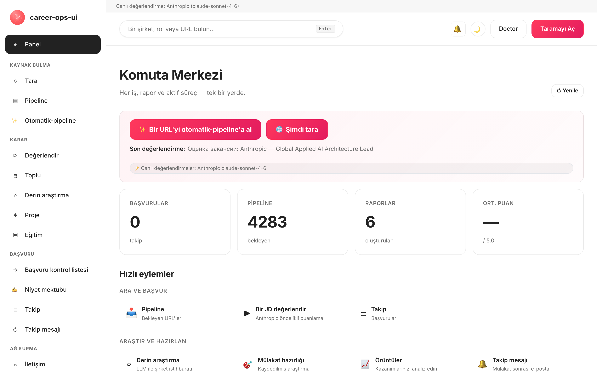

# career-ops-ui

> [career-ops](https://github.com/Fighter90/career-ops) yapay zeka destekli iş arama hattı için temiz, dokümantasyon tarzı bir web arayüzü.
> Claude Code, terminaller ve markdown dosyaları arasında gidip gelmek yerine her teklifi tek bir tarayıcı sekmesinden arayın, değerlendirin, derinlemesine inceleyin, başvurun ve takip edin.

[🇬🇧 English](README.md) | [🇪🇸 Español](README.es.md) | [🇧🇷 Português (Brasil)](README.pt-BR.md) | [🇰🇷 한국어](README.ko-KR.md) | [🇯🇵 日本語](README.ja.md) | [🇷🇺 Русский](README.ru.md) | [🇨🇳 简体中文](README.zh-CN.md) | [🇹🇼 繁體中文](README.zh-TW.md) | [🇫🇷 Français](README.fr.md) | [🇵🇱 Polski](README.pl.md) | [🇺🇦 Українська](README.uk.md) | [🇩🇰 Dansk](README.da.md) | [🇸🇦 العربية](README.ar.md) | [🇩🇪 Deutsch](README.de.md) | [🇮🇹 Italiano](README.it.md) | **🇹🇷 Türkçe** | [🇮🇳 हिन्दी](README.hi.md)

_Resmi olmayan arayüz — career-ops / santifer ile bağlantılı değildir ve onlar tarafından onaylanmamıştır._

[](#tests)
[](#tests)
[](#tests)
[](#requirements)
[](LICENSE)
[](https://github.com/Fighter90/career-ops-ui/releases/tag/v1.213.0)

<a href="https://www.producthunt.com/products/career-ops-ui?embed=true&amp;utm_source=badge-featured&amp;utm_medium=badge&amp;utm_campaign=badge-career-ops-ui" target="_blank" rel="noopener noreferrer"></a>

> **🆕 Son sürüm — v1.213.0** — **MyCareersFuture (Singapur) + tarama kalitesi düzeltmeleri** — Singapur'un ulusal iş bankası artık taranabilir; Greenhouse ilanları içeriğe göre filtrelenebilir; ve uzaktan Ashby rolleri artık yalnızca-şehir bir konumun arkasında kaybolmuyor. **2724 test.**
>
> 📜 Tam sürüm geçmişi: **[CHANGELOG.tr.md](CHANGELOG.tr.md)**.

<!-- DO NOT REVERT: locale-specific dashboard screenshot (dashboard-tr.png). Each README uses its own ./images/dashboard-<locale>.png — never replace with dashboard-en.png. Generated by scripts/capture-dashboard-screenshots.mjs. -->
[](https://youtu.be/LcVPUg9IsDk?si=mrx3oOmOpSAwabOz)

**[▶ Önizlemeyi izle](https://youtu.be/LcVPUg9IsDk?si=mrx3oOmOpSAwabOz)**

## career-ops hakkında

[career-ops](https://career-ops.org), herhangi bir yapay zeka kodlama CLI'sinin (Claude Code, Cursor, Codex, OpenCode, Antigravity CLI, Grok Build CLI, Qwen Code, Kimi, GitHub Copilot CLI, Gemini CLI (legacy) — diğer Claude uyumlu CLI'ler de aynı eğik-çizgi-komut yüzeyi üzerinden çalışır) içinde eğik çizgi komutları olarak çalışan açık kaynaklı bir iş arama sistemidir. Model bağımsızdır. Her ilanı CV'nize göre beş boyut ve bütünsel bir genel puan içeren 0.0–5.0 değerlendirme ölçeğiyle değerlendirir, size özel PDF özgeçmişler üretir ve her başvuruyu yerel olarak takip eder — bulut hesabı yok, telemetri yok, otomatik gönderim yok.

**Bu depo (career-ops-ui)**, bunun üzerine oturan cilalı bir web arayüzüdür. CLI, form doldurma (Playwright MCP aracılığıyla) ve eğik-çizgi-komut modlarına sahip olmaya devam eder; SPA ise aynı `cv.md` / `data/applications.md` / `reports/` dosyaları üzerinde CRM tarzı bir tarayıcı yüzeyi sunar. Her ikisi de aynı veriyi paylaşır.

**Puana göre eylem eşikleri** ([career-ops.org/docs](https://career-ops.org/docs) kaynağından):

| Puan | Sonraki adım |
|---|---|
| **≥ 4.5** | `/career-ops apply` — yüksek uyum, hemen ileri git |
| **4.0 – 4.4** | başvur ya da sıcak bir tanışma için `/career-ops contacto` |
| **3.5 – 3.9** | `/career-ops deep` — önce araştır |
| **< 3.5** | belirli bir nedeniniz yoksa atlayın |

**Kanonik kılavuzlar** — [career-ops.org/docs](https://career-ops.org/docs):

- [career-ops nedir](https://career-ops.org/docs/introduction/what-is-career-ops)
- [İş portallarını tara](https://career-ops.org/docs/introduction/guides/scan-job-portals)
- [Bir işe başvur](https://career-ops.org/docs/introduction/guides/apply-for-a-job)
- [Teklifleri toplu değerlendir](https://career-ops.org/docs/introduction/guides/batch-evaluate-offers)
- [Playwright'ı kur](https://career-ops.org/docs/introduction/guides/set-up-playwright)
- [career-ops iş ilanlarını nasıl puanlar — metodoloji](https://career-ops.org/methodology)

**Mod referansı** (web-ui'nin sayfa/düğme olarak sunduğu üst projenin eğik çizgi komutları) — [career-ops.org/docs/reference/modes](https://career-ops.org/docs/reference/modes):

| Mod | web-ui | Mod | web-ui |
|---|---|---|---|
| [auto-pipeline](https://career-ops.org/docs/reference/modes/auto-pipeline) | `#/auto` | [pipeline](https://career-ops.org/docs/reference/modes/pipeline) | `#/pipeline` |
| [oferta](https://career-ops.org/docs/reference/modes/oferta) | `#/evaluate` | [ofertas](https://career-ops.org/docs/reference/modes/ofertas) | `#/evaluate` |
| [deep](https://career-ops.org/docs/reference/modes/deep) | `#/deep` | [contacto](https://career-ops.org/docs/reference/modes/contacto) | `#/contacto` |
| [interview-prep](https://career-ops.org/docs/reference/modes/interview-prep) | `#/interview-prep` | [pdf](https://career-ops.org/docs/reference/modes/pdf) | PDF Oluştur |
| [training](https://career-ops.org/docs/reference/modes/training) | `#/training` | [project](https://career-ops.org/docs/reference/modes/project) | `#/project` |
| [tracker](https://career-ops.org/docs/reference/modes/tracker) | `#/tracker` | [patterns](https://career-ops.org/docs/reference/modes/patterns) | `#/patterns` |
| [followup](https://career-ops.org/docs/reference/modes/followup) | `#/followup` | [apply](https://career-ops.org/docs/reference/modes/apply) | `#/apply` |
| cover | `#/cover` | — | — |

**Portal adaptörleri** — [career-ops.org/docs/reference/portals](https://career-ops.org/docs/reference/portals): [Greenhouse](https://career-ops.org/docs/reference/portals/greenhouse) · [Ashby](https://career-ops.org/docs/reference/portals/ashby) · [Lever](https://career-ops.org/docs/reference/portals/lever) (ayrıca Workable / SmartRecruiters / Workday + RU kaynakları — bkz. `#/scan`).

**Yapay zeka asistanları** career-ops bunların içinde çalışır (web-ui bağımsız alternatiftir): Claude Code, Cursor, Codex, OpenCode, Antigravity CLI, Grok Build CLI, Qwen Code, Kimi, GitHub Copilot CLI, Gemini CLI (legacy). Web-ui'nin ⚡ canlı özellikleri bunları **`#/config`** içinde API sağlayıcılarıyla eşler: Claude Code→Anthropic, Cursor→any/OpenRouter, Gemini CLI→Gemini, Codex→OpenAI, Qwen Code→Qwen, OpenCode→herhangi biri/OpenRouter, GitHub Copilot CLI→GitHub Models, Antigravity CLI→Gemini, Kimi CLI→any/OpenRouter, Grok Build CLI→any/OpenRouter.

## CareerOps Manifestosu

career-ops, [CareerOps Manifestosu](https://career-ops.org/manifesto)'nun ilk referans uygulamasıdır — bir iş aramasını kanıtla, disiplinle ve masanın aday tarafında yer alan araçlarla yürütme pratiği. Okuyun. Söyledikleri inandığınız şeyse imzalayın — imzanız bir commit'e dönüşür. Uygulama kenar çubuğu altbilgisinden ona bağlantı verir.

## Bir yapay zeka kodlama asistanı kurun (üst career-ops CLI için)

career-ops, bir yapay zeka kodlama asistanının **içinde** eğik çizgi komutları olarak çalışır — devam etmeden önce **birini** kurun ve giriş yapın (üst projenin [Hızlı Başlangıç](https://career-ops.org/docs) sayfası):

| Asistan | Kurulum | web-ui `#/config` sağlayıcısı |
|---|---|---|
| **Claude Code** | [docs.anthropic.com → Claude Code](https://docs.anthropic.com/en/docs/claude-code) | Anthropic (`ANTHROPIC_API_KEY`) |
| **Gemini CLI** | [github.com/google-gemini/gemini-cli](https://github.com/google-gemini/gemini-cli) | Gemini (`GEMINI_API_KEY`) |
| **Codex** | [github.com/openai/codex](https://github.com/openai/codex) | OpenAI (`OPENAI_API_KEY`) |
| **Qwen Code** | [github.com/QwenLM/qwen-code](https://github.com/QwenLM/qwen-code) | Qwen (`QWEN_API_KEY`) |
| **OpenCode** | [opencode.ai](https://opencode.ai) | herhangi biri / OpenRouter (`OPENROUTER_API_KEY`) |
| **GitHub Copilot CLI** | [github.com/github/gh-copilot](https://github.com/github/gh-copilot) | GitHub Models (`GITHUB_MODELS_API_KEY`) |
| **Antigravity CLI** | [antigravity.google](https://antigravity.google) | Gemini (`GEMINI_API_KEY`) |

> **web-ui bağımsız alternatiftir** — kurulu herhangi bir CLI'ye ihtiyaç duymaz. ⚡ Canlı çalıştırma özellikleri, sağlayıcı API'lerini doğrudan çağırır; `#/config` (veya `career-ops-ui init`) içinde **herhangi bir** anahtar ayarlayın, başsız (headless) çalışır. CLI'yi tercih ederseniz, career-ops'u seçtiğiniz asistanın içinde çalıştırın ve web-ui'yi yalnızca aynı dosyalar üzerindeki gösterge paneli olarak kullanın.

## Tek komutla başlatın ve ilklendirin

> **Önemli — career-ops-ui, [`Fighter90/career-ops`](https://github.com/Fighter90/career-ops) *üzerine* oturan bir gösterge panelidir.** Bir career-ops projesinin **içinde** `career-ops/web-ui/` olarak çalışır ve `cv.md`, `config/`, `data/` dosyalarınızı üst klasörden `../` yoluyla okur. **Bağımsız çalışmaz** — üst `career-ops` deposuna da ihtiyacınız vardır. Tek başına klonlayıp `init` çalıştırmayın; aşağıdaki iki seçenekten birini kullanın.

### Seçenek 1 — tek curl (önerilen: her şeyi kurar)

```bash
curl -fsSL https://raw.githubusercontent.com/Fighter90/career-ops-ui/main/bin/setup.sh | bash
```

**Her iki** depoyu klonlar, `career-ops/web-ui/` düzenini oluşturur, bağımlılıkları kurar, doctor'ı çalıştırır ve sunucuyu http://127.0.0.1:4317 adresinde başlatır — ardından gösterge panelini açar.

### Seçenek 2 — mevcut bir career-ops projesine arayüz ekleyin

career-ops zaten yapılandırılmışsa ve yalnızca gösterge panelini istiyorsanız, arayüzü onun **içine** `web-ui` olarak klonlayın:

```bash
cd career-ops                                                   # ← mevcut career-ops projeniz
git clone https://github.com/Fighter90/career-ops-ui.git web-ui
cd web-ui
npm install
npx career-ops-ui init        # etkileşimli: LLM sağlayıcısını seç + anahtarını yapıştır → üst career-ops/.env
```

İç içe `web-ui/` düzeni, arayüzün `../cv.md`, `../config/`, `../data/` yollarını çözmesini sağlayan tam olarak budur. `npx career-ops-ui <verb>` yerine sade `career-ops-ui <verb>` yazmayı tercih ederseniz, **bir kez** `npm link` çalıştırın.

### CLI komutları

```bash
career-ops-ui setup    # önyükleme: bağımlılıkları kur → doctor → çalıştır (çalıştırmadan önce durmak için SKIP_START=1)
career-ops-ui init     # LLM sağlayıcısını seç + anahtarını yapıştır (etkileşimli)
career-ops-ui doctor   # Node / proje / anahtarları / Playwright doğrula (exit 0 ⇔ gerekli olan her şey yeşil)
career-ops-ui run      # sunucuyu http://127.0.0.1:4317 adresinde başlat
career-ops-ui open     # tarayıcınızda gösterge paneli sekmesini aç + ÖNE GETİR
career-ops-ui help     # her komutu listele
```

`npm link` yapmadıysanız `npx ` ön eki ile çalıştırın (örn. `npx career-ops-ui run`). `setup`/`run` sonrası sekme otomatik olarak açılır **ve öne getirilir**; otomatik açmayı devre dışı bırakmak için `NO_OPEN=1` ayarlayın (başsız / CI).

### LLM sağlayıcınızı seçin

`init`, sağlayıcı sihirbazıdır — **Claude / Claude Code** (`ANTHROPIC_API_KEY`), **Gemini / Gemini CLI** (`GEMINI_API_KEY`), **Codex / OpenCode CLI** (`OPENAI_API_KEY`) ya da **Auto** (Anthropic → Gemini yedeği) seçin. Anahtarlar yankı bastırılarak yazılır ve `#/config` API anahtarları sekmesiyle aynı doğrulanmış yol üzerinden üst `career-ops/.env` dosyasına yazılır. CI için etkileşimsiz biçim:

```bash
career-ops-ui init --provider claude --anthropic-key sk-ant-… --yes
career-ops-ui init --provider gemini --gemini-key …          --yes
career-ops-ui init --provider auto   --openai-key sk-…       --yes
```

Ya da elle ayarlayın: `echo "ANTHROPIC_API_KEY=sk-ant-…" >> career-ops/.env`. Sağlayıcı `LLM_PROVIDER` değerini ayarlar (`auto` | `claude` | `gemini`); yeniden başlatmadan **`#/config` → API anahtarları** üzerinden istediğiniz zaman değiştirin.

### `init` sorun giderme

`career-ops-ui init` başarısız olursa veya komut bulunamazsa (`git pull` sonrası sıkça görülür):

```bash
cd career-ops/web-ui
npm install
npx career-ops-ui init        # npx, `npm link` olmadan bile yerel bin'i çalıştırır
```

Şunlardan emin olun:

- Onu **`career-ops/web-ui/` içinden** çalıştırıyorsunuz — bağımsız bir `career-ops-ui/` klonundan değil.
- **Üst `career-ops/` klasörü mevcut** ve `cv.md` ile `config/` içeriyor. career-ops-ui'yi tek başına klonladıysanız, `career-ops/web-ui/` konumuna oturması için taşıyın (veya yeniden klonlayın) — ya da düzeni sizin için oluşturan Seçenek 1'in curl komutunu çalıştırın.
- `career-ops-ui doctor` (veya `npx career-ops-ui doctor`) neyin eksik olduğunu tam olarak yazdırır.

---

## Neden?

[career-ops](https://github.com/Fighter90/career-ops), güçlü, Claude-Code destekli bir iş arama sistemidir: bir iş tanımı (JD) yapıştırın → 0-5 uyum puanı, ATS için optimize edilmiş bir PDF ve bir takip kaydı alın. Claude Code içinde harika çalışır, ancak veriler `cv.md`, `data/applications.md`, `reports/*.md`, `data/pipeline.md`, `portals.yml`, `config/profile.yml` arasında dağılmıştır — kolayca kaybedilir, göz gezdirmesi zordur.

`career-ops-ui`, bunun üzerine cilalı bir arayüz oturtur:

- **Auto-pipeline** — `#/auto` üzerinde tek bir iş URL'si yapıştırın, bir kez tıklayın: doğrula → getir → değerlendir → raporu kaydet → takipçiye ekle, canlı bir erişilebilirlik (a11y) adım göstergesi ve artefakt derin bağlantılarıyla.
- Takipçiyi, raporları ve pipeline'ı bir CRM gibi **inceleyin**.
- Taramaları **tetikleyin** (Greenhouse / Ashby / Lever / Workable / SmartRecruiters / Workday **ve** hh.ru / Habr Career / Trudvsem / GetMatch / GeekJob) ve canlı SSE günlüklerini izleyin.
- Bir iş tanımını Anthropic (tercih edilen) veya Gemini aracılığıyla canlı **değerlendirin** ya da API anahtarı ayarlanmamışsa Claude Code için kopyala-yapıştır bir istem alın.
- Şirketleri Anthropic SDK aracılığıyla, cv / profil / mod dosyaları otomatik olarak satır içine yerleştirilmiş halde canlı **derinlemesine araştırın**.
- `cv.md` dosyasını yan yana markdown önizlemesi ve sunucu tarafı XSS temizlemesiyle **düzenleyin**.
- Sistemi **bakımda tutun**: doctor, verify, normalize, dedup, merge — her biri tek tıkla.
- **Çok CLI'li:** Claude Code, Cursor, Codex, Cursor, Aider veya Gemini CLI'den aynı şekilde çalışır — `CLAUDE.md` / `AGENTS.md` / `GEMINI.md` ara katmanları tek bir doğruluk kaynağına işaret eder.

Tamamen eklemelerden ibarettir: `career-ops/` içinde hiçbir şey değişmez. Tüm özelleştirmeleriniz sizin kalır.

---

## Hızlı başlangıç

### 1. Önce career-ops kurun

```bash
git clone https://github.com/Fighter90/career-ops.git
cd career-ops
```

`cv.md`, `config/profile.yml` ve `portals.yml` dosyalarının var olması için [career-ops başlangıç kurulumunu](https://github.com/Fighter90/career-ops#first-run--onboarding) izleyin.

### 2. career-ops-ui'yi onun içine yerleştirin

```bash
git clone https://github.com/Fighter90/career-ops-ui.git web-ui
```

Ağaç yapınız şimdi şöyle görünüyor:

```
career-ops/
├─ cv.md
├─ portals.yml
├─ config/
├─ data/
├─ modes/
├─ reports/
├─ scan.mjs … doctor.mjs … (vb.)
└─ web-ui/                 ← bu depo
   ├─ bin/start.sh
   ├─ package.json
   ├─ server/
   ├─ public/
   └─ tests/
```

### 3. Başlatın

```bash
bash web-ui/bin/start.sh
```

Betik:

1. Node ≥ 18 olduğunu kontrol eder.
2. `npm install` (yalnızca ilk çalıştırmada, üç bağımlılık — Express + js-yaml + multer).
3. Express sunucusunu `127.0.0.1:4317` üzerinde başlatır.
4. Varsayılan tarayıcınızda http://127.0.0.1:4317/ adresini açar.

Özel port / host:

```bash
PORT=8080 bash web-ui/bin/start.sh
HOST=0.0.0.0 PORT=4317 bash web-ui/bin/start.sh   # LAN üzerinde yayınla
```

Depoyu başka bir yere klonladıysanız (`career-ops/web-ui` olarak değil), career-ops'a ortam değişkeniyle işaret edin:

```bash
CAREER_OPS_ROOT=/path/to/career-ops bash bin/start.sh
```

---

## İlk çalıştırma — temiz durum

`career-ops/data/pipeline.md`, test paketinin izole olarak çalışabilmesi için iki QA fikstür URL'siyle (`example.com/qa-fixture-*`) gelir. Yeni bir klonda Pipeline'ın `2 pending` gösterdiğini görürsünüz — bunlar gerçek işler değildir. İlk taramanızdan önce bunları temizleyin:

```bash
make clean-test-fixtures        # pipeline.md fikstür satırlarını + qa-fixture-* applications.md satırlarını kaldırır
npm start
```

http://127.0.0.1:4317 adresini açın. Pipeline sayacı artık `0 pending` okumalıdır. Makefile idempotenttir — temiz bir ağaçta yeniden çalıştırmak hiçbir şey yapmaz.

---

## Gereksinimler

| | |
| --- | --- |
| **Node.js** | ≥ 18 (yerel `fetch`, `node:test` kullanır) |
| **career-ops** | Klonlanmış ve kurulmuş — yukarıya bakın |
| **İsteğe bağlı** | Tek tıkla iş tanımı değerlendirmesi için üst projenin `.env` dosyasında `GEMINI_API_KEY` (ücretsiz kademe modeli `gemini-2.0-flash`). Aksi halde arayüz Claude için kopyala-yapıştır bir istem döndürür. |
| **İsteğe bağlı** | hh.ru 403 döndürürse bir Rus IP'sinden / VPN'den çalıştırın. Habr Career, IP'den bağımsız olarak her IP'den çalışır. |
| **İsteğe bağlı** | e2e test paketi için Playwright (zaten career-ops'un geçişli bir bağımlılığı). |

---

## Neler elde edersiniz — sayfaya göre

| Sayfa             | Ne yapar                                                                                                       |
| ---------------- | ------------------------------------------------------------------------------------------------------------------ |
| **Dashboard**    | Toplam sayımlar (başvurular / pipeline / raporlar), ortalama puan, durum dökümü, en son 5 başvuru + en son rapor.         |
| **Scan**         | **🌐 Tek Tara düğmesi** — etkin her kaynağı tek seferde çalıştırır (EN için Greenhouse / Ashby / Lever / Workable / SmartRecruiters / Workday, RU için hh.ru + Habr Career + Trudvsem + GetMatch + GeekJob). Canlı SSE günlük akışı + konum / Uzaktan-Hibrit rozeti / taşınma bayrağı / maaş / kaynak filtreleri ve dinamik teknoloji yığını / seviye / anahtar kelime etiketleri içeren tıklanabilir sonuç tablosu. Aktif Şirketler kartı, takip edilen her panoyu API sağlığıyla birlikte listeler. |
| **Pipeline**     | `data/pipeline.md` üzerinde CRUD. Sunucu tarafı önizleme vekili (SSRF güvenli, atlama başına yönlendirme doğrulaması, 8 KB gövde sınırı). Bir URL'den doğrudan değerlendirmeye atlayın.       |
| **Evaluate**     | İş tanımını yapıştırın → **önce Anthropic** (her iki anahtar da varsa tercih edilir), ardından Gemini, ardından manuel istem yedeği. Anthropic yolu cv / profil / `_shared.md` / `oferta.md` dosyalarını otomatik olarak satır içine yerleştirir (REVIEW-A1). İş tanımını `jds/` içine kaydetmek isteğe bağlıdır. |
| **Deep research**| Evaluate ile aynı yedek zinciri. Canlı Anthropic, `interview-prep/<company>-<role>.md` dosyasına kaydedilen ~10-30 KB temellendirilmiş markdown döndürür. |
| **Modes**        | Aynı Anthropic / Gemini / manuel yedeğe sahip 7 genel mod sayfası (`/#/project`, `/#/training`, `/#/followup`, `/#/batch`, `/#/contacto`, `/#/interview-prep`, `/#/patterns`). |
| **Apply helper** | Bir gönderim kontrol listesi oluşturur; asıl Playwright form doldurma işlemi Claude Code içindeki `/career-ops apply` içinde kalır. |
| **Tracker**      | `data/applications.md` üzerinde filtrelenebilir tablo (durum, puan, serbest metin). Tek tıkla `normalize-statuses.mjs` / `dedup-tracker.mjs` / `merge-tracker.mjs`. Dikey çubuk + satır sonu kaçışları GFM uyumludur — `"Acme \| Co"` gibi adlar kayıpsız gidip gelir. |
| **Reports**      | `reports/` altındaki her raporu ayrıştırılmış başlıkla (Puan / Meşruiyet / URL) inceleyin ve okuyun.                       |
| **CV**           | `cv.md` için yan yana önizlemeli canlı markdown düzenleyici + tek tıkla `cv-sync-check.mjs` + 📁 CV Yükle. Kaydederken sunucu tarafı XSS temizleme (`<script>`, `javascript:`, `on*=` işleyicileri). |
| **Profile**      | `config/profile.yml` + arketiplerin salt okunur görünümü — arayüz dostu özet.                                         |
| **App settings** | Üst `.env` anahtarları için arayüz içi düzenleyici: `ANTHROPIC_API_KEY`, `GEMINI_API_KEY`, model geçersiz kılmaları, port / host. Okuma sırasında gizli bilgiler maskelenir. |
| **Health**       | Tüm kurulum kontrolleri OK / OPTIONAL / FAIL rozetleri halinde + `doctor.mjs` ve `verify-pipeline.mjs` çalıştırma düğmeleri.           |
| **Help**         | Desteklenen 17 dilin tamamı için yerelleştirilmiş, uygulama içi Markdown kullanıcı kılavuzu (`/#/help`) (en / es / fr / pt-BR / ko-KR / ja / ru / zh-CN / zh-TW / pl / uk / da / ar / de / it / tr / hi). |
| **Activity log** | Durum değiştiren her isteğin (yazma, çalıştırma, tarama) denetim izi. Gizli bilgiler kaldırılır. |
| **Notifications** 🔔 *(v1.58.34 / v1.58.35)* | Kırmızı okunmamış rozetli üst çubuk zili. Son 50 bildirimi (sekme başına, oturum başına) listeleyen bir çekmeceyi açmak için tıklayın — Başarı / Hata / Bilgi-ilerleme, her biri yerelleştirilmiş bir zaman damgası, insan okunur mesaj ve bir `<details>` içine tucked edilmiş herhangi bir `(METHOD /path · HTTP NNN)` son ekiyle. Yardım **§18** her kategoriyi belgeler. Çekmece **yalnızca** zile tıklandığında (veya klavye Enter / Space ile) açılır; ×, Esc ile ya da zile yeniden tıklayarak kapanır. |

Genel klavye kısayolları:

- `Ctrl+K` / `Cmd+K` — genel aramaya odaklan. Alt bilgi ipucu platforma göre uyarlanır (macOS/iOS'te ⌘K, diğerlerinde Ctrl+K) ve yerelleştirilmiş fiili içerir (v1.58.20).
- Genel aramaya bir URL yapıştırmak, onu pipeline'a otomatik olarak ekler.
- `Esc` — açık herhangi bir kalıcı pencereyi (modal) **veya** bildirim çekmecesini kapatır (v1.58.34).

---

## Scan

Gerçekten iş ilanı döndüren sıfır-token portal taraması. Arayüzdeki **tek 🌐 Tara düğmesi**, yapılandırılan her kaynağı tek bir taramada çalıştırır:

- **Greenhouse / Ashby / Lever / Workable / SmartRecruiters / Workday** — `portals.yml::tracked_companies` içindeki, tanınabilir bir ATS kalıbına sahip her şirket için genel boards-api. Paketlenmiş liste Stripe, GitLab, Vercel, Cloudflare, Datadog, Discord, Elastic, Grafana Labs, CockroachDB, Fastly, Twilio, Coinbase, Reddit, Robinhood, Affirm, Lyft, Linear, Supabase, PostHog, Ramp, Modal Labs, Railway, Browserbase, JetBrains şirketlerini kapsar — serbestçe genişletin veya budayın.
- **RSS panoları** — RSS/Atom akışı sunan herhangi bir iş panosu (LaraJobs, WeWorkRemotely, RemoteOK, golangprojects, …). `portals.yml` dosyasına `provider: rss` + akış URL'si ekleyin — kod değişikliği gerekmez.
- **Toplayıcı panolar (v1.75.0)** — şirket başına ATS'lerin ötesinde pano genelinde / yapılandırma güdümlü yedi kaynak: **RemoteOK / Remotive / Working Nomads** (pano genelinde uzaktan akışlar, `provider: remoteok|remotive|workingnomads` ile seçilir) ve **IBM / Arbeitsagentur / Glints / Jobstreet · SEEK** (yapılandırma güdümlü, her biri girdi başına bir `<provider>:` bloğu okur). Kopyala-yapıştır `tracked_companies` girdileri için `docs/portals-examples.md` dosyasına bakın. Diğer tüm kaynaklarla aynı `title_filter` / `location_filter` / `content_filter` + tekilleştirme + pipeline'a ekleme akışını çalıştırırlar.
- **hh.ru** — `hh.ru/search/vacancy` sayfasının HTML kazıması. Her IP'den, anahtar olmadan, vekil olmadan çalışır. (JSON API `api.hh.ru` kullanılmaz — artık IP/User-Agent'ten bağımsız olarak her programatik istemciye 403 döndürüyor; web sitesi tarayıcı benzeri her istemciye tam sonuç sunuyor, bu yüzden Habr Career'ın kazındığı gibi onu kazıyoruz.)
- **Habr Career** — `career.habr.com/vacancies` sayfasının HTML kazıması. Her IP'den, kimlik doğrulaması olmadan çalışır.

### RSS adaptörü

`portals.yml` dosyasına `provider: rss` ve bir `rss:` (veya `feed_url:`) anahtarı içeren bir girdi ekleyerek tarayıcıyı herhangi bir RSS tabanlı iş panosuna yönlendirin:

```yaml
tracked_companies:
  - name: LaraJobs
    provider: rss
    rss: https://larajobs.com/feed
    enabled: true
  - name: WeWorkRemotely
    provider: rss
    rss: https://weworkremotely.com/remote-jobs.rss
    enabled: true
```

Adaptör, `<item>` bloklarını küçük bir regex tabanlı ayrıştırıcı kullanarak (XML kütüphanesi gerekmez) ayrıştırır. `title`, `link` (→ `url`), `pubDate` (→ `date`) ve `description` (→ `snippet`, HTML temizlenmiş) alanlarını çıkarır. Uzaktan çalışma durumu, başlık veya açıklamadaki `/remote|anywhere/i` kalıbından çıkarılır; şirket adı `dc:creator` alanından, "Company — Role" başlık kalıbından ya da yedek olarak akış ana bilgisayar adından alınır. ATS adaptörleriyle aynı normalleştir → filtrele → tekilleştir → pipeline'a ekle akışı geçerlidir.

Tüm kaynaklar aynı pipeline'dan geçer: normalleştir → filtrele (`title_filter.positive` / `title_filter.negative`) → `data/scan-history.tsv` + `data/pipeline.md` + `data/applications.md` karşısında tekilleştir → `data/pipeline.md` dosyasına ekle → arayüzün filtrelenebilir tablosu için tüm sonuç kümesini `data/last-scan.json` dosyasına kaydet.

`portals.yml` üzerinden yapılandırın:

```yaml
title_filter:
  positive: [backend, engineer, senior, tech lead, golang, php]
  negative: [junior, intern, frontend, ios, android]
tracked_companies:
  - { name: Stripe, enabled: true, careers_url: https://job-boards.greenhouse.io/stripe }
  - { name: Linear, enabled: true, careers_url: https://jobs.ashbyhq.com/linear }
  # ...
russian_portals:
  sources: ["hh", "habr"]   # biri veya her ikisi
  area: 113                  # 1=Moskova, 2=SPb, 113=Rusya, 1001=uzaktan
  per_page: 50
  only_remote: false
  queries: ["Senior PHP", "Senior Go", "Tech Lead"]
```

Tüm kaynaklar tek bir SSE uç noktasından akar: `/api/stream/scan?source=ats|regional|both`. **🌐 Tara** arayüz düğmesi `source=both` çağırır, böylece her adaptör (Greenhouse / Ashby / Lever / Workable / SmartRecruiters / Workday + hh.ru + Habr Career + Trudvsem + GetMatch + GeekJob) tek bir bağlantıda çalışır. İstemci bağlantısı kesildiğinde `AbortSignal` sinyaline uyar — yetim getirmeler olmaz.

---

## Mimari

```
career-ops-ui/
├─ CLAUDE.md                 # proje düzeyinde ajan talimatları (kanonik)
├─ AGENTS.md                 # Codex / Aider / genel CLI ara katmanı → CLAUDE.md
├─ GEMINI.md                 # Gemini CLI ara katmanı → CLAUDE.md
├─ .aiignore                 # yapay zeka araçları için hariç tutma listesi
├─ .claude/                  # Claude Code ajan yapılandırması
│  ├─ agents/                # 3 projeye özgü alt ajan (route, view, test isolation)
│  └─ commands/               # eğik çizgi komut taslakları
├─ bin/start.sh              # tek seferlik başlatıcı (Node kontrolü → npm install → sunucu → tarayıcı aç)
├─ package.json              # 2 çalışma zamanı bağımlılığı: express, js-yaml
├─ server/
│  ├─ index.mjs              # ~130 LOC orkestratör: middleware + 12 register<Topic>Routes(app) çağrısı + SPA catch-all
│  └─ lib/
│     ├─ paths.mjs           # career-ops dosyalarına mutlak yollar (CAREER_OPS_ROOT bilinçli)
│     ├─ parsers.mjs         # markdown / pipeline / rapor ayrıştırıcıları (GFM uyumlu dikey çubuk kaçışları)
│     ├─ runner.mjs          # SIGTERM→SIGKILL yükseltmesi + 30 dk sınırı ile runNodeScript() + streamNodeScript()
│     ├─ security.mjs        # isValidJobUrl, stripDangerousMarkdown, sanitizeJobDescription, isPubliclyExposed
│     ├─ prompts.mjs         # bundleProjectContext, buildEvaluationPrompt, buildDeepPrompt, buildModePrompt
│     ├─ store.mjs           # safeReadApps/Pipeline/Reports, checkProfileCustomized, ensureRussianPortalsDefaults
│     ├─ anthropic.mjs       # minimal Anthropic SDK adaptörü (runAnthropic, hasAnthropicKey, hasGeminiKey)
│     ├─ env-config.mjs      # gizli maskeleme + doğrulama ile .env gidiş-dönüşü
│     ├─ activity-log.mjs    # JSONL denetim izi middleware'i (gizli bilgiler kaldırılmış)
│     ├─ dotenv.mjs          # küçük dotenv yükleyici
│     ├─ en-scanner.mjs      # süreç içi Greenhouse/Ashby/Lever orkestratörü (AbortSignal bilinçli)
│     ├─ ru-scanner.mjs      # süreç içi hh.ru + Habr orkestratörü (AbortSignal bilinçli)
│     ├─ sources/
│     │  ├─ greenhouse.mjs   # boards-api.greenhouse.io istemcisi
│     │  ├─ ashby.mjs        # api.ashbyhq.com istemcisi
│     │  ├─ lever.mjs        # api.lever.co istemcisi
│     │  ├─ hh.mjs           # hh.ru/search/vacancy HTML kazıyıcı (sayfalı, UA bilinçli)
│     │  └─ habr.mjs         # career.habr.com HTML ayrıştırıcı (cheerio yok, yalnızca regex)
│     └─ routes/             # 12 route modülü — konu başına bir tane (P-2)
│        ├─ activity.mjs     # /api/activity
│        ├─ config.mjs       # /api/config (üst .env gidiş-dönüşü)
│        ├─ content.mjs      # /api/cv, /api/profile, /api/portals, /api/modes
│        ├─ health.mjs       # /api/health, /api/dashboard
│        ├─ help.mjs         # /api/help/:lang
│        ├─ jds.mjs          # /api/jds CRUD
│        ├─ llm.mjs          # /api/evaluate, /api/deep, /api/mode/:slug, /api/apply-helper, /api/interview-prep*
│        ├─ pipeline.mjs     # /api/pipeline + SSRF güvenli önizleme vekili
│        ├─ reports.mjs      # /api/reports
│        ├─ runners.mjs      # /api/run/* + /api/stream/{scan,liveness,pdf} + /api/output/pdfs
│        ├─ scan.mjs         # /api/stream/scan-{ru,en} + /api/scan-results
│        └─ tracker.mjs      # /api/tracker
├─ public/                   # statik SPA — derleme adımı yok
│  ├─ index.html
│  ├─ css/app.css            # tasarım belirteçleri (dokümantasyon tarzı palet)
│  └─ js/
│     ├─ api.js              # fetch sarmalayıcısı + bağlantı-banner durumu + arayüz yardımcıları + güvenli markdown oluşturucu
│     ├─ router.js           # 404 yedeği + takma ad desteği ile hash tabanlı yönlendirici
│     ├─ app.js              # önyükleme + genel klavye işleyicileri + mobil kenar çubuğu çekmecesi
│     ├─ lib/{i18n,skills}.js
│     └─ views/              # sayfa başına bir dosya (dashboard, scan, pipeline, evaluate, deep, apply, tracker, reports, cv, settings, health, config, help, activity, mode-page)
├─ docs/                     # genel referans: mimari, API, veri akışları, SDD, konvansiyonlar, incelemeler
│  ├─ PROJECT.md             # ne / neden / kimin için
│  ├─ ROADMAP.md             # mevcut kilometre taşı + tamamlanmış geçmiş
│  ├─ PRODUCTION-READINESS.md # dürüst dağıtım-kapısı değerlendirmesi
│  ├─ sdd/{SDD-GUIDE,CONVENTIONS}.md
│  ├─ architecture/{OVERVIEW,SERVER,FRONTEND,API,DATA-FLOWS}.md
│  └─ reviews/REVIEW-*.md
└─ tests/                    # 1945 birim + 90 Playwright + 23/23 e2e:full + 20 e2e:smoke (baseline @ v1.121.0)
   ├─ parsers.test.mjs       # markdown / pipeline / rapor ayrıştırıcıları (saf fonksiyonlar)
   ├─ api.test.mjs           # her uç nokta, geçici sunucu, ağ yok
   ├─ {ru,en}-scanner.test.mjs   # taklit edilmiş fetch
   ├─ pipeline-preview.test.mjs   # atlama başına yönlendirme doğrulaması (REVIEW-B1)
   ├─ anthropic.test.mjs     # SDK adaptörü + günlük-koruma testi (REVIEW-B4)
   ├─ url-validation.test.mjs    # SSRF reddetme taraması (FIX-M3 + M6 + M7)
   ├─ cv-xss.test.mjs        # stripDangerousMarkdown gidiş-dönüşü
   ├─ jd-sanitize.test.mjs   # sanitizeJobDescription
   ├─ help.test.mjs / help-ui.test.mjs    # 17 yerel dilin tamamında i18n eşitliği
   ├─ playwright-smoke.mjs   # 12 tarayıcı akışı (CV kaydetme, tracker, pipeline, evaluate, config, vb.)
   └─ e2e{,-comprehensive}.mjs   # tam Playwright gezintisi
```

### Neden derleme adımı yok?

Vanilla HTML/CSS/JS, yüzey alanını küçük tutar: iki bağımlılığın tek bir `npm install`'ı ve çalışmaya başlarsınız. Webpack yok, Vite yok, felaket `node_modules` yok. Tüm arayüz küçültülmüş halde < 30 KB. Geliştirme sırasında hot-reload isterseniz, `npm run dev`, Node'un yerleşik `--watch` özelliğini kullanır.

### Spesifikasyon Güdümlü Geliştirme

Önemsiz olmayan değişiklikler GSD pipeline'ından (`superpowers@claude-plugins-official` içindeki `gsd-*` becerileri) geçer:

```
discuss → spec → plan → execute → verify → review
```

Genel referans: [`docs/sdd/SDD-GUIDE.md`](docs/sdd/SDD-GUIDE.md). Tüm planlama artefaktları `.planning/` (gitignore'lu) altında bulunur. `docs/` ağacı, uzun ömürlü genel sözleşmedir.

---

## API referansı

Tüm uç noktalar `/api/*` altındadır. Aksi belirtilmedikçe JSON girer / JSON çıkar.

### Sağlık ve gösterge paneli

| Yöntem | Yol                     | Yanıt                                                                    |
| ------ | ------------------------ | --------------------------------------------------------------------------- |
| GET    | `/api/health`            | `{ ok, warnings, version, parentVersion, checks: [{name, ok, required, value?}] }` |
| GET    | `/api/dashboard`         | `{ counts, avgScore, byStatus, recent, pipeline, lastReport }`              |
| GET    | `/api/status/providers`  | `{ activeProvider, activeModel, keysConfigured }` — başlangıç banner'ı + ⚡ maliyet ipucu için LLM hazırlığı (v1.55.3); `openrouter` içerir (v1.57.0) |
| GET    | `/api/openrouter/models` | `{ models:[{id,name,context_length}], fallback, cached }` — `#/config` model açılır menüsü için OpenRouter kataloğu vekili (v1.57.0) |
| GET    | `/api/activity?limit&type` | `data/activity.jsonl` denetim izinin sonu                                 |
| GET    | `/api/help/:lang`        | yerelleştirilmiş uygulama içi kullanıcı kılavuzu (yedek: `en.md`)                             |

### Uygulama ayarları (üst .env gidiş-dönüşü)

| Yöntem | Yol             | Amaç                                                                |
| ------ | ---------------- | ---------------------------------------------------------------------- |
| GET    | `/api/config`    | gizli bilgileri maskelenmiş bilinen env anahtarları                                     |
| POST   | `/api/config`    | üst `.env` dosyasını doğrula + yaz; `process.env`'e yerinde uygulanır      |

### Veri dosyaları

| Yöntem | Yol                                | Amaç                                                                |
| ------ | ----------------------------------- | ---------------------------------------------------------------------- |
| GET    | `/api/tracker`                      | `{ rows: [ayrıştırılmış applications.md] }`                                   |
| POST   | `/api/tracker`                      | gövde `{ company, role, score?, status?, url?, notes?, date? }` — tekilleştirme bilinçli (company + role üzerinde büyük/küçük harf duyarsız) |
| GET    | `/api/pipeline`                     | `{ urls: [...] }`                                                      |
| POST   | `/api/pipeline`                     | gövde `{ url }` → tekilleştirme + `isValidJobUrl` ile `data/pipeline.md` dosyasına ekler |
| GET    | `/api/pipeline/preview?url=…`       | sunucu tarafı getirme vekili (atlama başına SSRF kontrolü, ≤3 yönlendirme, 8 KB sınırı) |
| DELETE | `/api/pipeline?url=…`               | bir URL'yi kaldırır                                                          |
| GET    | `/api/reports`                      | `reports/*.md` dosyalarının ayrıştırılmış listesi                                          |
| GET    | `/api/reports/:slug`                | tam markdown + ayrıştırılmış başlık                                             |
| GET    | `/api/jds`                          | kaydedilmiş iş tanımı dosyalarının listesi                                                 |
| GET    | `/api/jds/:name`                    | text/plain — ham iş tanımı                                                    |
| POST   | `/api/jds`                          | gövde `{ text, slug? }` → `jds/` dizinine kaydeder                               |
| DELETE | `/api/jds/:name`                    | bağlantıyı kaldırır (`.txt` uzantısı gerekli)                                       |
| GET    | `/api/cv`                           | `{ markdown }`                                                         |
| PUT    | `/api/cv`                           | gövde `{ markdown }` → `cv.md` yazar (XSS temizlenmiş, ≤1 MB)             |
| GET    | `/api/profile`                      | `{ profile: yaml-ayrıştırılmış, raw: metin }`                                  |
| GET    | `/api/portals`                      | `{ portals: yaml-ayrıştırılmış, raw: metin }`                                  |
| GET    | `/api/modes`                        | mod dosyalarının listesi                                                     |
| GET    | `/api/modes/:name`                  | text/plain — ham mod istemi                                           |
| GET    | `/api/output/pdfs`                  | oluşturulmuş PDF'lerin listesi                                                 |
| GET    | `/api/output/pdfs/:name`            | indir (`Content-Disposition: attachment`)                          |
| GET    | `/api/interview-prep`               | kaydedilmiş derinlemesine araştırma dosyalarının listesi                                      |
| GET    | `/api/interview-prep/:name`         | `{ name, markdown }`                                                   |
| DELETE | `/api/interview-prep/:name`         | bağlantıyı kaldırır (`.md` uzantısı gerekli)                                       |

### Betik çalıştırıcıları (arabelleğe alınmış, tek seferlik)

| Yöntem | Yol                    | Sardığı                       |
| ------ | ----------------------- | --------------------------- |
| POST   | `/api/run/doctor`       | `node doctor.mjs`           |
| POST   | `/api/run/verify`       | `node verify-pipeline.mjs`  |
| POST   | `/api/run/normalize`    | `node normalize-statuses.mjs` |
| POST   | `/api/run/dedup`        | `node dedup-tracker.mjs`    |
| POST   | `/api/run/merge`        | `node merge-tracker.mjs`    |
| POST   | `/api/run/sync-check`   | `node cv-sync-check.mjs`    |

Tüm arabelleğe alınmış çalıştırmalar 60 sn'de sınırlanır; 5 sn'lik bir bekleme süresinden sonra SIGTERM → SIGKILL yükseltmesi.

### Akışlar (SSE)

| Yöntem | Yol                          | Akıttığı                            |
| ------ | ----------------------------- | ---------------------------------- |
| GET    | `/api/stream/scan`            | eski `node scan.mjs` (alt süreç)|
| GET    | `/api/stream/scan?source=ats\|regional\|both` | birleştirilmiş süreç içi tarayıcı SSE — sorgu: `dryRun=1`, `company=…` (yalnızca ATS). |
| GET    | `/api/stream/liveness`        | `node check-liveness.mjs`          |
| GET    | `/api/stream/pdf`             | `node generate-pdf.mjs`            |

SSE olay türleri:

```
event: start    data: { script, args?, writeFiles? }
event: log      data: { stream: "stdout"|"stderr", line: string }
event: done     data: { code, counts?, errors? }
event: error    data: { message }
```

### LLM uç noktaları (önce Anthropic → Gemini → manuel yedek)

| Yöntem | Yol                                | Amaç                                                                          |
| ------ | ----------------------------------- | -------------------------------------------------------------------------------- |
| POST   | `/api/evaluate`                     | gövde `{ jd, save? }` → iş tanımı değerlendirmesi (`oferta.md` başına A–G bölümleri)              |
| POST   | `/api/evaluate/test-gemini`         | `GEMINI_API_KEY` hızlı kontrolü                                                     |
| POST   | `/api/evaluate/test-anthropic`      | `ANTHROPIC_API_KEY` hızlı kontrolü                                                  |
| POST   | `/api/deep`                         | gövde `{ company, role?, run? }` → derinlemesine araştırma istemi veya canlı temellendirilmiş markdown |
| POST   | `/api/mode/:slug`                   | genel mod çalıştırıcısı; izin listesi: `batch`, `contacto`, `followup`, `interview-prep`, `patterns`, `project`, `training` |
| POST   | `/api/apply-helper`                 | gövde `{ url, jd? }` → başvuru kontrol listesi                                      |
| GET    | `/api/scan-results`                 | `{ en: {when, fresh[], filtered[], errors[]}, ru: { ... } }` — son tarama         |
| GET    | `/api/scan/regional/config`         | etkin bölgesel tarayıcı yapılandırması (sorgular, olumsuzlar, kaynaklar). |

`/api/deep` veya `/api/mode/:slug` üzerinde `run: true` ayarlandığında, sunucu Anthropic'i tercih eder (her iki anahtar da varsa), `cv.md` + `config/profile.yml` + `modes/_shared.md` + ilgili mod şablonunu bir `<project_context>` bloğuna satır içine yerleştirir ve modelin temellendirilmiş markdown'ını doğrudan döndürür. Yumuşak sınır: birleştirilen istem üzerinde 200 KB — taşma 413 döndürür.

---

## Testler

```bash
npm test                       # 1945 birim/entegrasyon testi
npm run test:e2e               # 20 smoke e2e (kendi sunucusunu başlatır)
npm run test:e2e:full          # 23 kapsamlı e2e
npm run test:e2e:browser       # 70 Playwright tarayıcı (smoke + full-cycle + forms + locale-sweep)
npm run test:coverage          # `npm test` ile aynı, artı V8 kapsamı
```

| Paket                       | Test | Ne                                                                                                       |
| --------------------------- | ----- | ---------------------------------------------------------------------------------------------------------- |
| `node --test tests/*.test.mjs` (birim + entegrasyon) | **1856** | Her uç nokta, geçici sunucu, ağ yok. 218 dosya: ayrıştırıcılar, tarayıcılar (taklit edilmiş), çalıştırıcılar, anthropic/openai, güvenlik başlıkları, XSS, iş tanımı temizleme, URL doğrulama, i18n eşitliği, + v1.55→v1.56 UX-düzeltme paketleri. |
| `tests/e2e.mjs` (smoke)      | 20    | Playwright başsız: her rota render edilir, temel akışlar.                                                     |
| `tests/e2e-comprehensive.mjs` | 23    | Tam Playwright gezintisi: 11 rota + 12 işlevsel akış.                                              |
| `npm run test:e2e:browser` (`playwright-smoke` + `playwright-full-cycle` + `playwright-forms` + `playwright-locale-sweep`) | **90** | Tarayıcı güdümlü: dashboard render, gezinme, dil değiştirme, 404, health, tracker gidiş-dönüşü, pipeline ekleme + geçersiz-URL taraması, raporlar, evaluate manuel yedeği, config anahtarları maskeli, CV PUT XSS temizleme, pipeline preview 400, auto-pipeline SSE. |
| **Toplam**                   | **1955** | **0 başarısızlık, 0 kararsızlık**                                                                                    |

Kapsam: `--experimental-test-coverage` aracılığıyla ~%93 satır / ~%83 dal.

Ayrıştırıcılar saf fonksiyonlardır (G/Ç yok) — `applications.md`, `pipeline.md` ve `reports/*.md` dosyalarından gerçek veri parçalarına karşı test edilir. API testleri, Express uygulamasını geçici bir portta başlatır ve her uç noktayı uçtan uca çalıştırır. Tarayıcı testleri `fetch`'i taklit eder, böylece hh.ru IP'nizi engellese bile geçerler. Playwright tarayıcı smoke'u, süreç içi sunucuya karşı çalışır ve Playwright'ı üst projenin `node_modules`'ı aracılığıyla çözer — `web-ui/` içinde yeni bağımlılık yok.

CI, birim + e2e + Playwright matrisini `main`'e her push'ta Node 18 / 20 / 22'ye karşı çalıştırır.

---

## Yapılandırma

Ortam değişkenleri (sunucu başlangıcında okunur, belirtilenler dışında hepsi isteğe bağlıdır):

| Değişken                  | Varsayılan            | Amaç                                                                            |
| -------------------- | ------------------ | ---------------------------------------------------------------------------------- |
| `PORT`               | `4317`             | Express bağlama portu                                                                  |
| `HOST`               | `127.0.0.1`        | Express bağlama ana bilgisayarı. Loopback olmadığında CSP eklenir; kimlik doğrulama kapısı v2.0.0 için planlanmıştır.   |
| `CAREER_OPS_ROOT`    | betikten `..`   | `cv.md`, `data/`, `portals.yml`, `modes/` vb. dosyaların nerede bulunacağı.                      |
| `ANTHROPIC_API_KEY`  | ayarsız              | `/api/evaluate`, `/api/deep`, `/api/mode/:slug` canlı modunu etkinleştirir (her iki anahtar da ayarlandığında tercih edilir). |
| `ANTHROPIC_MODEL`    | `claude-sonnet-4-6` | Anthropic modelini geçersiz kıl.                                                         |
| `GEMINI_API_KEY`     | ayarsız              | `gemini-eval.mjs`'ye iletilir ve `/api/evaluate` için yedek olarak kullanılır.           |
| `GEMINI_MODEL`       | `gemini-2.0-flash` | Gemini modelini geçersiz kıl.                                                             |
| `OPENAI_API_KEY`     | ayarsız              | Başsız canlı-değerlendirme (`auto` sırasında 3.) + üst Codex/OpenAI CLI akışı.       |
| `OPENAI_MODEL`       | `gpt-5-codex`      | OpenAI modelini geçersiz kıl.                                                             |
| `QWEN_API_KEY`       | ayarsız              | DashScope OpenAI uyumlu üzerinden başsız canlı-değerlendirme (`auto` sırasında 4.).      |
| `QWEN_MODEL`         | `qwen-max`         | Qwen modelini geçersiz kıl.                                                               |
| `OPENROUTER_API_KEY` | ayarsız              | OpenRouter üzerinden başsız canlı-değerlendirme — tek anahtar, 300+ model (`auto` sırasında 5. / son).   |
| `OPENROUTER_MODEL`   | `openrouter/auto`  | `vendor/model` kimliği. Katalog `GET /api/openrouter/models`'tan canlı yüklenir.        |

Bu arayüz tarafından tanınan `portals.yml` uzantısı (üst projedeki mevcut dosyanıza ekleyin):

```yaml
russian_portals:
  sources: ["hh", "habr"]
  area: 113          # hh.ru bölge kimliği
  per_page: 50
  only_remote: false
  queries: ["Senior PHP", "Тимлид Go", ...]
```

Herhangi bir şirket girdisini açık bir `api:` URL'siyle de genişletebilirsiniz. 24 doğrulanmış şirket için kopyala-yapıştır bloklar için [`docs/portals-examples.md`](docs/portals-examples.md) dosyasına (bu depoda) bakın.

---

## Güvenlik notları

- Sunucu varsayılan olarak `127.0.0.1`'e bağlanır — açık `HOST=0.0.0.0` olmadan asla internete açılmaz.
- **Yol temizleme (v1.21.0)**: her `:name` / `:slug` rota parametresi `server/lib/security.mjs` içindeki `sanitizePathName()`'den geçer — `[\w-.]` olmayanı temizler, baştaki nokta dizilerini düşürür, iç nokta dizilerini daraltır, 200 karakterde sınırlar, boş → 400. Daha önce `..pdf` / `....md` geçmesine izin veren 10 yinelenen regex kopyasının yerini alır.
- **DNS yeniden bağlanma savunması (v1.21.0)**: `/api/pipeline/preview` ve `/api/auto-pipeline`, `server/lib/safe-fetch.mjs::safeGet` üzerinden yönlendirir — tek DNS araması, sabitlenmiş TCP bağlantısı, orijinal ana bilgisayar adına hedeflenmiş SNI/Host. İkinci arama yok, TOCTOU penceresi yok.
- **Eşzamanlı yazma muteksi (v1.21.0)**: `tracker.mjs`, `pipeline.mjs` (POST + DELETE) ve `auto-pipeline.mjs`'nin tracker adımı, oku-değiştir-yaz işlemini `server/lib/file-lock.mjs`'den `withFileLock(path, fn)` ile sarar. Eşzamanlı POST'lar artık satır düşürmez.
- **LLM hız sınırı (v1.21.0)**: `/api/evaluate`, `/api/deep`, `/api/mode/:slug`, `/api/auto-pipeline`, `server/lib/rate-limit.mjs`'den `llmRateLimit` taşır. **Loopback'te işlemsizdir**; `HOST=0.0.0.0`'da 10 istek/dk/IP. `LLM_RATE_LIMIT="N/Ws"` aracılığıyla yapılandırılabilir. 429 + `Retry-After`.
- **CV XSS temizleme (v1.22.0 sağlamlaştırması)**: `stripDangerousMarkdown` artık varlık bilinçlidir — regex temizlemeden önce `&lt;`, `&gt;`, `&#NN;`, `&#xHH;`'yi çözer, böylece `&lt;script&gt;` ve `java&#115;cript:` yükleri atlatamaz.
- Alt süreç çağrıları argüman dizileriyle `spawn` kullanır — **asla kabuk enterpolasyonu yok**. `bash` çalıştırıcısı `~/.bashrc`'yi yok saymak için `--noprofile --norc` kullanır.
- Akış uç noktaları, istemci bağlantısı kesildiğinde alt süreci öldürür (yetim tarayıcı yok).
- Yazma uç noktaları yalnızca bilinen career-ops yollarına dokunur: `data/`, `jds/`, `cv.md`, `config/`, `portals.yml`, `output/`, `reports/`, `interview-prep/`, `modes/_profile.md`. Başka hiçbir yere değil.
- Bağlantı banner'ı, bağlantı kesildiğinde üstel geri çekilme (3 sn → 6 sn → 12 sn → 24 sn → 60 sn) ile `/api/health`'i pingler ve kurtarma sırasında otomatik temizlenir (v1.22.0 M-6).

---

## Sınırlamalar

Tamamen LLM güdümlü modların (`oferta`, `deep`, `contacto`, `apply`, `batch`, `patterns`, `followup`) gerçekten çalışması için bir LLM gereklidir. Web arayüzü, bir sağlayıcıyı `auto` sırasından **Anthropic → Gemini → OpenAI → Qwen → OpenRouter → GitHub Models → Hermes** (veya `LLM_PROVIDER` neyi sabitlerse) çözer:

1. **Anthropic (tercih edilen)** — üst projenin `.env` dosyasında `ANTHROPIC_API_KEY` ayarlayın. `cv.md` / `config/profile.yml` / `modes/_shared.md` / mod şablonu otomatik olarak satır içine yerleştirilmiş şekilde `runAnthropic` üzerinden yönlendirir (REVIEW-A1). v1.8.0+'da `claude-sonnet-4-6` ile bir derinlemesine araştırma çağrısı için 26 KB temellendirilmiş markdown döndürerek canlı doğrulandı.
2. **`gemini-eval.mjs`** yedek olarak — yalnızca `GEMINI_API_KEY` ayarlıyken kutudan çıktığı gibi çalışır.
3. **OpenAI / Qwen / OpenRouter** — sıfır bağımlılıklı OpenAI uyumlu istemciler (`_tailProvider()` yolu). **OpenRouter** (v1.57.0) en esnek olanıdır: tek bir `OPENROUTER_API_KEY` her büyük laboratuvardan 300+ modele önlük eder ve `#/config` model açılır menüsü `GET /api/openrouter/models`'tan canlı doldurulur (sunucu tarafı vekil, CSP güvenli, seçilmiş çevrimdışı yedek).
4. **Kopyala-yapıştır istem** — anahtar ayarlanmadığında, arayüz Claude Code / ChatGPT / Gemini Web için biçimlendirilmiş hazır bir istem oluşturur.

Claude Code içindeki mevcut `/career-ops apply` Playwright form doldurma akışı, başvuru formlarını gerçekten otomatik doldurmanın tek yolu olmaya devam eder — arayüzün *Apply helper*'ı bunun yerine bir kontrol listesi oluşturur.

Üretime hazırlık değerlendirmesi için (dağıtım kapıları, risk kaydı, ertelenmiş işler), [`docs/PRODUCTION-READINESS.md`](docs/PRODUCTION-READINESS.md) dosyasına bakın. Özet: tek kiracılı loopback için hazır; LAN'a açılma, v2.0 P-12 kimlik doğrulama kapısını bekler.

---

## Tüm yığını bulutta çalıştır

career-ops **her zaman açık** olduğunda en iyisidir — siz uyurken tarar, herhangi bir tarayıcıdan erişilebilir. Tüm yığını küçük bir sunucuya koymak için — üst **career-ops** hattı, bu **career-ops-ui** görüntüleyici ve yapay zekâyı çalıştıran **motor** (Claude Code CLI üzerinden **Claude aboneliğiniz**, yerel bir **Hermes** ağ geçidi veya sağlayıcı API anahtarları) — bir VPS hazırlayın (Node ≥ 18), üst projeyi + bu depoyu kurun, motorunuzu seçin ve görüntüleyiciyi güvenlik değişmezlerini (CSP, SSRF koruması, XSS sınırı, günlüklerde sır yok) bozmadan **kimlik doğrulamalı HTTPS ters proxy** arkasında yayınlayın.

📖 Uygulama içi **Yardım §31** ("Tüm yığını bulutta çalıştır") tüm 17 dilde adım adım anlatır; operatör kontrol listesi [`docs/integrations/HERMES.md`](docs/integrations/HERMES.md), ve [bulut dağıtımı wiki sayfası](https://github.com/Fighter90/career-ops-ui/wiki/Cloud-Deployment) referans tablolarını içerir.

---

## Hermes ajanı + Telegram

**Nous Research'in [Hermes](https://hermes-agent.nousresearch.com/docs)'i**, açık kaynaklı, otonom bir ajandır (araç çağırma, skill'ler, 20'den fazla mesajlaşma kanalı). career-ops-ui'yi bir **bulut sunucusunda** çalıştırabilir ve olaylarını — tamamlanmış bir tarama, yeni bir rapor, acil bir takip — **bir Hermes ajanı üzerinden Telegram'a** bağlayarak, pipeline'ın sizi zaten olduğunuz yerde bulmasını sağlayabilirsiniz.

> **Artık bağlı (v1.151.0).** *LLM sağlayıcısı* olarak Hermes yayında: OpenAI uyumlu API Server’ını (`hermes gateway`) çalıştırın ve **Uygulama ayarları**’nda `HERMES_API_KEY` değerini ayarlayın — career-ops-ui canlı değerlendirmelerini yerel Hermes’iniz üzerinden çalıştırır (auto sırasında sonuncu). Aşağıdaki **bulut sunucusu dağıtımı** ve **Telegram köprüsü** operatör kılavuzu olmaya devam eder; bir **`hermes-bridge` skill’i** bunları izletir (secret’lar diske veya loglara asla dokunmaz; SSRF / CSP / no-secrets değişmezleri `127.0.0.1`’den taşındıktan sonra da geçerliliğini korur).

📖 **Tam kılavuz:** [`docs/integrations/HERMES.md`](docs/integrations/HERMES.md) — iki entegrasyon şekli, bulut sunucusu dağıtımı (reverse proxy + HTTPS + systemd), Telegram-via-Hermes ve tehdit modelinin “NELER açığa ÇIKARILMAMALI” listesi.

---


## Yerelleştirme

Arayüz **17 yerel dilde** gelir — `en`, `es`, `pt-BR`, `ko`, `ja`, `ru`, `zh-CN`, `zh-TW`, `fr`, `pl`, `uk`, `da`, `ar`, `de`, `it`, `tr`, `hi`. **v1.60.0 (I18N-SPLIT)**'ten bu yana çeviriler [`public/js/lib/locales/`](public/js/lib/locales/) altında **yerel dil başına bir dosyada** bulunur — `i18n-dict.<lang>.js`, her biri düz bir `key → string` tablosu — artı paylaşılan bir `i18n-dict.aliases.js`. [`i18n-dict.js`](public/js/lib/i18n-dict.js) bunları `window.__I18N_DICT`'e birleştirir; [`i18n.js`](public/js/lib/i18n.js), `t('key', 'fallback')`'ı çözer. Derleme adımı yok, çalışma zamanı getirmesi yok — bir çevirmen tek bir dil dosyasını izole olarak düzenler.

**Bir dize ekleyin veya değiştirin:**

```js
// public/js/lib/locales/i18n-dict.en.js   →   'scan.newButton': 'Run scan',
// public/js/lib/locales/i18n-dict.es.js   →   'scan.newButton': 'Ejecutar búsqueda',
// …aynı anahtarı 17 yerel dil dosyasının tamamına ekleyin (eşitlik kapılıdır)
```

Ardından bunu işaretlemede `data-i18n="scan.newButton"` ya da JS'de `t('scan.newButton')` aracılığıyla kullanın ve `npm test` çalıştırın. Yepyeni bir dil eklemek için, onu `i18n.js` (`LANGS` + `detect()`), birleştirici, `index.html` ve yerel dilleri sıralayan araçlara kaydedin.

📖 **Tam kılavuz:** [`docs/LOCALIZATION.md`](docs/LOCALIZATION.md) — yerel dil başına düzen, `@alias` mekanizması, adım adım yeni yerel dil ekleme ve her i18n CI kapısı.

---

## Katkıda bulunma

Issue'lar ve PR'lar memnuniyetle karşılanır. Ev kuralları:

- Push'tan önce `npm test` çalıştırın — **284 kontrol yeşil** çıtadır (arayüze dokunursanız artı 12 Playwright).
- Önemsiz olmayan değişiklikler GSD pipeline'ından geçer. Bkz. [`docs/sdd/SDD-GUIDE.md`](docs/sdd/SDD-GUIDE.md).
- Bu depo içinden üst `career-ops/` projesindeki hiçbir şeyi değiştirmeyin. Bütün mesele, bunun invaziv olmayan bir örtü olmasıdır. Katı kurallar [`CLAUDE.md`](CLAUDE.md) içinde.
- Konvansiyonel commit'ler: `feat`, `fix`, `refactor`, `docs`, `test`, `chore`, `perf`, `ci`. İsteğe bağlı kapsam: `feat(scan):`. Kırıcı değişiklik: `feat!:`.
- Testler CI-izole olmalı — fikstürleri `mkdtempSync` veya `CAREER_OPS_ROOT=$(mktemp -d)` aracılığıyla önyükleyin.

Depoyu Claude olmayan bir CLI'den (Codex, Aider, Cursor, Gemini) mi sürüyorsunuz? [`AGENTS.md`](AGENTS.md) veya [`GEMINI.md`](GEMINI.md) dosyasını okuyun — her ikisi de kanonik `CLAUDE.md`'ye ara katman sağlar.

---

---

## 🌍 Başlarken — kurulumdan sonraki ilk adımlar

Tek komutlu kurulumdan sonra, **EDIT ME** işaretçileri içeren başlangıç
`cv.md`, `config/profile.yml`, `portals.yml`, `data/applications.md` ve
`data/pipeline.md` dosyalarıyla iskeletlendirilmiş iki boş git klonuna
sahipsiniz. Health sayfası ilk başlatmada zaten tamamen yeşil olmalıdır.
Yer tutucuları gerçek verilerinizle değiştirin:

### 1. CV'nizi oluşturun (`cv.md`)

Üç seçeneğiniz var:

- **Seçenek A — mevcut bir özgeçmişi yapıştırın:** `career-ops/cv.md`'yi açın,
  EDIT-ME yer tutucularını temiz markdown'da gerçek özgeçmişinizle değiştirin
  (bölümler: Summary, Experience, Projects, Education, Skills). Ne kadar sade
  o kadar iyi — `career-ops` onu düz metin olarak okur.
- **Seçenek B — arayüzden yükleyin:** kenar çubuğunda **CV**'ye tıklayın →
  **📁 Upload CV** → `.md` / `.txt` dosyanızı seçin → önizlemeyi gözden geçirin →
  **💾 Save**'e tıklayın.
- **Seçenek C — LinkedIn URL'nizi Claude Code'a verin:** `career-ops/` içinde
  Claude Code'u açın, `/career-ops` çalıştırın, LinkedIn URL'nizi yapıştırın ve
  *"extract my CV from this and write it to cv.md"* deyin.

Her metriği belirli yapın (örn. *"reduced p99 latency by 38%"*, *"improved
performance"* değil). Değerlendirme hattı metrikleri doğrudan bu dosyadan okur.

### 2. Profilinizi düzenleyin (`config/profile.yml`)

```bash
$EDITOR career-ops/config/profile.yml
```

Tam ad, e-posta, konum, LinkedIn, hedef roller, arketipler, maaş hedefi için
yer tutucuları değiştirin. **Arketipler** en önemli alandır — her iş tanımının
size karşı nasıl eşleştirildiğidir.

### 3. Tarayıcıyı ayarlayın (`portals.yml`)

```bash
$EDITOR career-ops/portals.yml
```

`title_filter.positive` (örn. `"PHP"`, `"Go"`, `"Backend"`, `"Senior"`) ve
`title_filter.negative` (örn. `"Junior"`, `"Java"`, `"iOS"`) değerlerini
teknoloji yığınınıza ve kıdeminize göre ayarlayın. Paketlenmiş
`tracked_companies` listesi zaten 3 doğrulanmış Greenhouse / Ashby panosu
içerir (GitLab, Vercel, Linear). 24+ kopyala-yapıştır blok için
[`docs/portals-examples.md`](docs/portals-examples.md) dosyasına bakın.

hh.ru / Habr Career taraması istiyorsanız, kurulum betiğinin oluşturduğu
`russian_portals:` bloğunu düzenleyin — arama sorgularınızı ekleyin
(örn. `"Senior PHP"`, `"Тимлид Go"`).

### 4. (İsteğe bağlı) LLM API anahtarları

Her ikisi de varsa arayüz Gemini yerine Anthropic'i tercih eder. Biri, hiçbiri
ya da her ikisi çalışır — anahtar olmadan **Evaluate**, bunun yerine Claude Code
için kopyala-yapıştır bir istem döndürür.

```bash
# Anthropic (tercih edilen)
echo "ANTHROPIC_API_KEY=sk-ant-..." >> career-ops/.env
# Gemini (yedek)
echo "GEMINI_API_KEY=AIza..." >> career-ops/.env
```

Ya da bunları arayüzdeki **App settings** sayfası aracılığıyla ayarlayın
(`/#/config`) — aynı dosya, okumada maskeli, hemen `process.env`'e uygulanır.

### 5. Doğrulayın ve çalışmaya başlayın

Health sayfasını yenileyin — gerekli her kontrol yeşil olmalıdır. Ardından:

1. **🌐 Scan**'e tıklayın → ~5 saniye bekleyin → Greenhouse / Ashby / Lever /
   Workable / SmartRecruiters / Workday + hh.ru / Habr Career taranır, iş
   ilanları aşağıdaki tabloda görünür.
2. Herhangi bir başlığa tıklayın → orijinal ilan yeni bir sekmede açılır.
3. Umut verici bir şey görene kadar teknoloji yığını etiketlerine göre filtreleyin
   (PHP / Go / Backend / Senior).
4. URL'yi kopyalayın → **Pipeline**'a yapıştırın → 0-5 canlı puanlamak için
   (Anthropic / Gemini) **Evaluate**'e tıklayın ya da manuel bir istem alın.
5. Raporlar `reports/` içine, tracker `data/applications.md` içine, canlı
   derinlemesine araştırma `interview-prep/` içine iner. Hepsi arayüzde görünür.

> Bu kılavuzun çevirileri her dile özgü README dosyasında bulunur:
> [🇪🇸 Español](README.es.md) · [🇧🇷 Português (Brasil)](README.pt-BR.md) · [🇰🇷 한국어](README.ko-KR.md) · [🇯🇵 日本語](README.ja.md) · [🇷🇺 Русский](README.ru.md) · [🇨🇳 简体中文](README.zh-CN.md) · [🇹🇼 繁體中文](README.zh-TW.md) · [🇫🇷 Français](README.fr.md) · [🇵🇱 Polski](README.pl.md) · [🇺🇦 Українська](README.uk.md) · [🇩🇰 Dansk](README.da.md) · [🇸🇦 العربية](README.ar.md)

---

## Lisans

MIT. Bkz. [LICENSE](LICENSE).

[santifer](https://santifer.io) tarafından geliştirilen [career-ops](https://github.com/Fighter90/career-ops) üzerine inşa edilmiştir. Muhteşem hat için teşekkürler.

## Katkıda bulunanlar

career-ops-ui'yi inşa etmeye yardım eden herkese teşekkürler. Proje [Fighter90](https://github.com/Fighter90) tarafından sürdürülür ve topluluk katkılarıyla geliştirilir — tam liste için [katkıda bulunanlar grafiğine](https://github.com/Fighter90/career-ops-ui/graphs/contributors) bakın.

<p>
  <a href="https://github.com/Fighter90" title="Fighter90"></a>
  <a href="https://github.com/Alien10140" title="Alien10140"></a>
  <a href="https://github.com/vignyl" title="vignyl"></a>
  <a href="https://github.com/bracketouverte" title="bracketouverte"></a>
</p>

**[Tüm katkıda bulunanlar →](https://github.com/Fighter90/career-ops-ui/graphs/contributors)**

<div align="center">

<div style="font-family: -apple-system, BlinkMacSystemFont, &quot;Segoe UI&quot;, Roboto, &quot;Helvetica Neue&quot;, Arial, sans-serif; border: 1px solid rgb(224, 224, 224); border-radius: 12px; padding: 20px; max-width: 500px; background: rgb(255, 255, 255); box-shadow: rgba(0, 0, 0, 0.05) 0px 2px 8px;"><div style="display: flex; align-items: center; gap: 12px; margin-bottom: 12px;"><div style="flex: 1 1 0%; min-width: 0px;"><h3 style="margin: 0px; font-size: 18px; font-weight: 600; color: rgb(26, 26, 26); line-height: 1.3; overflow: hidden; text-overflow: ellipsis; white-space: nowrap;">career-ops-ui</h3><p style="margin: 4px 0px 0px; font-size: 14px; color: rgb(102, 102, 102); line-height: 1.4; overflow: hidden; text-overflow: ellipsis; display: -webkit-box; -webkit-line-clamp: 2; -webkit-box-orient: vertical;">The open-source job search command center</p></div></div><a href="https://www.producthunt.com/products/career-ops-ui?embed=true&amp;utm_source=embed&amp;utm_medium=post_embed" target="_blank" rel="noopener" style="display: inline-flex; align-items: center; gap: 4px; margin-top: 12px; padding: 8px 16px; background: rgb(255, 97, 84); color: rgb(255, 255, 255); text-decoration: none; border-radius: 8px; font-size: 14px; font-weight: 600;">Check it out on Product Hunt →</a></div>

</div>
